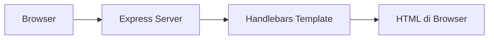

# 1. Dasar Node.js: Menampilkan HTML Sederhana dengan Handlebars

Materi ini cocok untuk pengenalan awal sebelum masuk ke Express, SQLite, dan alur aplikasi web yang lebih lengkap.

## Tujuan Belajar

Setelah materi ini, siswa diharapkan bisa:

1. Memahami fungsi Node.js sebagai server sederhana.
2. Mengenal Handlebars sebagai template engine.
3. Menjalankan aplikasi web sederhana dengan Express.
4. Menampilkan halaman HTML dinamis dari data JavaScript.

## Apa Itu Handlebars?

Handlebars adalah template engine untuk membuat halaman HTML lebih rapi dan dinamis.

Tanpa Handlebars, kita bisa saja menulis HTML langsung di dalam JavaScript, tetapi hasilnya cepat menjadi sulit dibaca. Dengan Handlebars, file HTML dipisahkan dari logika program.

Contoh ide sederhananya:

- JavaScript mengirim data.
- Handlebars menampilkan data itu ke halaman HTML.

## Gambaran Alur



## Persiapan Project

Buka terminal di folder project, lalu jalankan:

```bash
npm init -y
npm install express express-handlebars
```

## Struktur Folder Sederhana

```text
node-web/
|-- server.js
|-- package.json
`-- views/
		`-- home.handlebars
```

## File `server.js`

```js
const express = require('express');
const { engine } = require('express-handlebars');

const app = express();
const PORT = 3000;

app.engine('handlebars', engine());
app.set('view engine', 'handlebars');
app.set('views', './views');

app.get('/', (req, res) => {
	res.render('home', {
		title: 'Belajar Node.js',
		nama: 'Siswa SMA',
		pesan: 'Halo, ini HTML sederhana dari Handlebars.'
	});
});

app.listen(PORT, () => {
	console.log(`Server berjalan di http://localhost:${PORT}`);
});
```

## File `views/home.handlebars`

```html
<!DOCTYPE html>
<html lang="id">
<head>
	<meta charset="UTF-8" />
	<meta name="viewport" content="width=device-width, initial-scale=1.0" />
	<title>{{title}}</title>
</head>
<body>
	<h1>{{title}}</h1>
	<h2>Selamat datang, {{nama}}!</h2>
	<p>{{pesan}}</p>
</body>
</html>
```

## Cara Menjalankan

Jalankan perintah berikut:

```bash
node server.js
```

Lalu buka browser ke alamat berikut:

```text
http://localhost:3000
```

## Hasil yang Akan Tampil

Halaman akan menampilkan isi seperti ini:

```html
Belajar Node.js
Selamat datang, Siswa SMA!
Halo, ini HTML sederhana dari Handlebars.
```

## Penjelasan Kode

`const express = require('express');`

Memanggil library Express untuk membuat server web.

`const { engine } = require('express-handlebars');`

Memanggil Handlebars agar Express bisa merender file template.

`app.engine('handlebars', engine());`

Mendaftarkan Handlebars sebagai mesin template.

`app.set('view engine', 'handlebars');`

Memberi tahu Express bahwa file tampilan menggunakan ekstensi `.handlebars`.

`res.render('home', {...})`

Menampilkan file `home.handlebars` sambil mengirim data ke halaman.

## Hubungan Data dan Tampilan

Data dari `server.js`:

```js
{
	title: 'Belajar Node.js',
	nama: 'Siswa SMA',
	pesan: 'Halo, ini HTML sederhana dari Handlebars.'
}
```

Dipakai di `home.handlebars` dengan format:

```handlebars
{{title}}
{{nama}}
{{pesan}}
```

Artinya, Handlebars akan mengganti `{{...}}` dengan nilai yang dikirim dari server.

## Kenapa Ini Penting?

Ini adalah dasar penting sebelum belajar:

1. Routing di Express.
2. Menampilkan data dari database SQLite.
3. Membuat halaman daftar, detail, tambah, edit, dan hapus data.

## Latihan Untuk Siswa

1. Ganti isi `nama` menjadi nama masing-masing.
2. Ubah `pesan` dengan kalimat buatan sendiri.
3. Tambahkan satu elemen HTML baru, misalnya `<p>Kelas XI IPA</p>`.
4. Ubah judul halaman menjadi `Belajar Web dengan Node.js`.

## Kesimpulan

Node.js dapat digunakan untuk menjalankan server web sederhana. Dengan bantuan Express dan Handlebars, kita bisa membuat halaman HTML yang lebih terstruktur dan dinamis. Ini adalah langkah awal yang sangat baik sebelum masuk ke database dan aplikasi CRUD.
