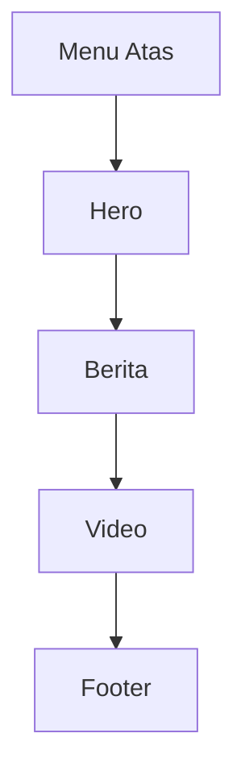

# 2. Tahapan Membuat Layout Website Mirip LPPM UNDIP

Materi ini membahas cara membuat layout halaman utama secara bertahap. Target akhirnya adalah halaman kampus/lembaga dengan susunan seperti situs referensi: menu atas, hero, berita, video, dan footer.

Fokus pada materi ini adalah **struktur layout**. Backend dipakai seperlunya untuk menjalankan tampilan, bukan untuk database.

## Tujuan Belajar

Setelah bagian ini, siswa diharapkan mampu:

1. Memecah tampilan website menjadi beberapa bagian.
2. Menyusun halaman utama secara bertahap.
3. Menggunakan Handlebars untuk memisahkan layout dan partial.
4. Menyiapkan pondasi sebelum data dihubungkan ke database.

## Gambaran Struktur Halaman

Urutan layout yang akan dibuat:

1. Menu atas
2. Hero
3. Berita
4. Video
5. Footer



## Struktur Folder yang Disarankan

```text
node-web/
`-- backend/
		|-- server.js
		|-- package.json
		|-- public/
		|   `-- css/
		|       `-- style.css
		`-- views/
				|-- home.handlebars
				|-- layouts/
				|   `-- main.handlebars
				`-- partials/
						|-- navbar.handlebars
						`-- footer.handlebars
```

## Tahap 1: Membuat Menu Atas

Bagian ini berfungsi sebagai identitas situs dan navigasi utama.

Isi menu atas biasanya:

1. Logo atau nama lembaga.
2. Menu navigasi.
3. Tombol atau link penting.

Contoh `backend/views/partials/navbar.handlebars`:

```html
<header class="topbar">
	<div class="container nav-wrapper">
		<div class="brand">LPPM Kampus</div>

		<nav class="nav-menu">
			<a href="#hero">Beranda</a>
			<a href="#berita">Berita</a>
			<a href="#video">Video</a>
			<a href="#footer">Kontak</a>
		</nav>
	</div>
</header>
```

CSS dasar:

```css
.topbar {
	background: #0b3d91;
	color: white;
	padding: 16px 0;
}

.container {
	width: 90%;
	max-width: 1200px;
	margin: 0 auto;
}

.nav-wrapper {
	display: flex;
	justify-content: space-between;
	align-items: center;
}

.nav-menu a {
	color: white;
	text-decoration: none;
	margin-left: 20px;
}
```

Tujuan tahap ini:

1. Siswa mengenal header.
2. Siswa memahami fungsi navigasi.
3. Siswa melihat bahwa satu tampilan bisa dipisah menjadi partial.

## Tahap 2: Membuat Hero

Hero adalah area paling atas setelah menu. Biasanya berisi gambar besar, judul utama, deskripsi singkat, dan tombol aksi.

Pada situs referensi, bagian ini terasa seperti banner informasi utama.

Contoh di `backend/views/home.handlebars`:

```html
<section class="hero" id="hero">
	<div class="container hero-content">
		<div>
			<p class="eyebrow">Lembaga Penelitian dan Pengabdian</p>
			<h1>Mendorong Riset, Inovasi, dan Pengabdian Masyarakat</h1>
			<p>
				Halaman utama ini menjadi pusat informasi kegiatan, pengumuman,
				publikasi, dan dokumentasi lembaga.
			</p>
			<a href="#berita" class="btn-primary">Lihat Berita</a>
		</div>
	</div>
</section>
```

CSS dasar:

```css
.hero {
	background: linear-gradient(rgba(11, 61, 145, 0.75), rgba(11, 61, 145, 0.75)),
		url('https://images.unsplash.com/photo-1523050854058-8df90110c9f1?auto=format&fit=crop&w=1400&q=80') center/cover;
	color: white;
	padding: 100px 0;
}

.hero-content {
	max-width: 700px;
}

.hero h1 {
	font-size: 48px;
	margin: 12px 0 16px;
}

.btn-primary {
	display: inline-block;
	background: #f4b400;
	color: #1a1a1a;
	padding: 12px 20px;
	text-decoration: none;
	font-weight: bold;
	border-radius: 6px;
}
```

Tujuan tahap ini:

1. Siswa memahami fungsi hero sebagai fokus utama halaman.
2. Siswa belajar memberi hierarki visual pada judul.
3. Siswa mulai memahami perpaduan teks, tombol, dan background.

## Tahap 3: Membuat Section Berita

Bagian berita menampilkan beberapa informasi terbaru dalam bentuk kartu.

Di situs referensi, ini adalah salah satu bagian terpenting karena pengunjung ingin melihat update terbaru.

Contoh:

```html
<section class="news-section" id="berita">
	<div class="container">
		<h2>Berita Terkini</h2>

		<div class="news-grid">
			<article class="news-card">
				
				<div class="news-body">
					<p class="news-date">1 Juli 2026</p>
					<h3>Workshop Penelitian untuk Dosen Muda</h3>
					<p>Kegiatan ini bertujuan meningkatkan kualitas proposal penelitian di lingkungan kampus.</p>
				</div>
			</article>

			<article class="news-card">
				
				<div class="news-body">
					<p class="news-date">30 Juni 2026</p>
					<h3>Pengumuman Hibah Pengabdian Masyarakat</h3>
					<p>Program hibah dibuka untuk mendorong dampak langsung kepada masyarakat sekitar.</p>
				</div>
			</article>

			<article class="news-card">
				
				<div class="news-body">
					<p class="news-date">28 Juni 2026</p>
					<h3>Seminar Luaran Penelitian</h3>
					<p>Seminar ini menjadi wadah publikasi hasil penelitian dan kolaborasi antar dosen.</p>
				</div>
			</article>
		</div>
	</div>
</section>
```

CSS dasar:

```css
.news-section {
	padding: 70px 0;
	background: #f5f7fb;
}

.news-grid {
	display: grid;
	grid-template-columns: repeat(3, 1fr);
	gap: 24px;
}

.news-card {
	background: white;
	border-radius: 10px;
	overflow: hidden;
	box-shadow: 0 8px 20px rgba(0, 0, 0, 0.08);
}

.news-card img {
	width: 100%;
	height: 200px;
	object-fit: cover;
}

.news-body {
	padding: 18px;
}

.news-date {
	color: #666;
	font-size: 14px;
}
```

Tujuan tahap ini:

1. Siswa belajar membuat layout kartu.
2. Siswa mengenal grid.
3. Siswa memahami cara menyusun konten berulang.

## Tahap 4: Membuat Section Video

Bagian video berfungsi untuk menampilkan dokumentasi kegiatan atau profil lembaga.

Bagian ini bisa dibuat sederhana dengan `iframe` YouTube.

Contoh:

```html
<section class="video-section" id="video">
	<div class="container">
		<h2>Video Kegiatan</h2>
		<p>Dokumentasi kegiatan penelitian, pengabdian, dan seminar kampus.</p>

		<div class="video-wrapper">
			<iframe
				src="https://www.youtube.com/embed/dQw4w9WgXcQ"
				title="Video kegiatan"
				frameborder="0"
				allow="accelerometer; autoplay; clipboard-write; encrypted-media; gyroscope; picture-in-picture"
				allowfullscreen>
			</iframe>
		</div>
	</div>
</section>
```

CSS dasar:

```css
.video-section {
	padding: 70px 0;
	background: white;
}

.video-wrapper {
	position: relative;
	padding-bottom: 56.25%;
	height: 0;
	overflow: hidden;
	border-radius: 12px;
}

.video-wrapper iframe {
	position: absolute;
	top: 0;
	left: 0;
	width: 100%;
	height: 100%;
}
```

Tujuan tahap ini:

1. Siswa memahami konten multimedia dalam layout.
2. Siswa belajar membuat video responsif.
3. Siswa melihat variasi jenis konten selain teks dan gambar.

## Tahap 5: Membuat Footer

Footer adalah penutup halaman yang berisi informasi kontak, jam layanan, dan link penting.

Pada situs referensi, footer memuat identitas lembaga, alamat, jam layanan, dan info tambahan.

Contoh `backend/views/partials/footer.handlebars`:

```html
<footer class="site-footer" id="footer">
	<div class="container footer-grid">
		<div>
			<h3>LPPM Kampus</h3>
			<p>Gedung ICT Centre Lantai 4, Tembalang, Semarang</p>
			<p>Email: lppm@kampus.ac.id</p>
			<p>Telp: 024-0000000</p>
		</div>

		<div>
			<h3>Jam Layanan</h3>
			<p>Senin - Kamis: 07.30 - 16.00</p>
			<p>Jumat: 07.30 - 16.30</p>
		</div>

		<div>
			<h3>Link Penting</h3>
			<p><a href="#">Website Kampus</a></p>
			<p><a href="#">Sistem Penelitian</a></p>
			<p><a href="#">E-Journal</a></p>
		</div>
	</div>
</footer>
```

CSS dasar:

```css
.site-footer {
	background: #0f172a;
	color: white;
	padding: 50px 0;
}

.footer-grid {
	display: grid;
	grid-template-columns: repeat(3, 1fr);
	gap: 24px;
}

.site-footer a {
	color: #cbd5e1;
	text-decoration: none;
}
```

Tujuan tahap ini:

1. Siswa memahami fungsi footer.
2. Siswa belajar membagi informasi ke beberapa kolom.
3. Siswa memahami penutup struktur halaman.

## Menggabungkan Semua Bagian

Setelah semua section selesai, halaman `backend/views/home.handlebars` dapat disusun seperti ini:

```html
{{> navbar}}

<section class="hero" id="hero">
	...
</section>

<section class="news-section" id="berita">
	...
</section>

<section class="video-section" id="video">
	...
</section>

{{> footer}}
```

## Layout Utama Handlebars

Contoh `backend/views/layouts/main.handlebars`:

```html
<!DOCTYPE html>
<html lang="id">
<head>
	<meta charset="UTF-8" />
	<meta name="viewport" content="width=device-width, initial-scale=1.0" />
	<title>{{title}}</title>
	<link rel="stylesheet" href="/css/style.css" />
</head>
<body>
	{{{body}}}
</body>
</html>
```

## Urutan Praktik di Kelas

Supaya siswa tidak bingung, kerjakan dalam urutan ini:

1. Buat layout utama `main.handlebars`.
2. Buat menu atas.
3. Buat hero.
4. Buat section berita.
5. Buat section video.
6. Buat footer.
7. Rapikan CSS.
8. Baru setelah itu hubungkan ke data dinamis.

## Eksekusi Tahap 02 (Metode Sama seperti Tahap 01)

Jalankan dari root project:

```bash
cd backend
npm init -y
npm install express express-handlebars
npm install -D nodemon
```

Pastikan script di `backend/package.json`:

```json
"scripts": {
	"dev": "nodemon server.js",
	"start": "node server.js"
}
```

Jalankan server:

```bash
npm run dev
```

Atau mode normal:

```bash
npm start
```

Buka browser:

```text
http://localhost:3000
```

Stop server normal:

```text
Ctrl + C
```

Jika port 3000 terkunci (Windows):

```bash
netstat -ano | findstr :3000
taskkill /PID PID_NYA /F
```

## Catatan Penting Untuk Mengajar

Saat mengajar siswa SMA, lebih baik tekankan bahwa:

1. Website besar bukan dibuat sekaligus, tetapi dibagi menjadi section-section kecil.
2. Setiap section punya fungsi masing-masing.
3. Handlebars membantu menyusun tampilan agar rapi.
4. Data dinamis bisa ditambahkan setelah layout statis selesai.

## Kesimpulan

Untuk membuat halaman seperti situs lembaga kampus, pendekatan terbaik adalah membangunnya secara bertahap. Mulailah dari menu atas, lanjut ke hero, kemudian berita, video, dan footer. Dengan cara ini, siswa lebih mudah memahami struktur web modern sebelum masuk ke data dinamis, database, dan fitur backend lainnya.
