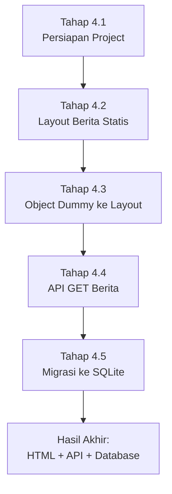

# 4. Dari Layout ke Object Dinamis: Apakah Urutannya Sudah Benar?

Pertanyaan ini sangat bagus untuk tahap belajar siswa.

Di tahap 03, kita membuat alur dari layout statis lalu masuk ke object dinamis sederhana (`beritaList` di `server.js`).
Untuk konteks pembelajaran web dasar, pendekatan ini **sudah benar**.

Kenapa benar?

1. Siswa melihat hasil visual dulu, jadi lebih cepat paham fungsi tiap bagian halaman.
2. Siswa tidak langsung dibebani konsep API, database, dan struktur data yang kompleks.
3. Saat layout sudah jadi, siswa lebih mudah mengerti data itu "masuk ke mana".

Artinya, alur tahap 03 cocok sebagai jembatan:

`layout statis -> object lokal -> route detail -> 404`.

## Lalu, Haruskah Data -> API -> Layout?

Jawaban praktis: tergantung tujuan.

1. Jika tujuan utama adalah **mengajar dasar web untuk siswa SMA**, mulai dari layout dulu itu efektif.
2. Jika tujuan utama adalah **membangun sistem produksi yang rapi**, biasanya mulai dari desain data dan API lebih aman.

Jadi bukan salah atau benar mutlak, tetapi memilih urutan sesuai target belajar.

## Rekomendasi Terbaik: Metode Bertahap (Hybrid)

Untuk kelas, metode paling aman adalah gabungan dua pendekatan:

1. **Layout dulu (UI dasar)**
	Siswa paham bentuk halaman: beranda, detail, tombol kembali.
2. **Object dinamis lokal**
	Data masih hardcoded dalam array agar konsep route dinamis mudah dipahami.
3. **Desain data sederhana**
	Tentukan field minimal: `id/slug`, `judul`, `tanggal`, `ringkasan`, `gambar`, `sumber`.
4. **API lokal/internal**
	Mulai kenalkan endpoint sederhana seperti `/api/berita`.
5. **Database**
	Pindahkan sumber data dari array ke SQLite/MySQL.
6. **Refactor tampilan**
	Layout tetap dipakai, hanya sumber datanya berubah.

Dengan urutan ini, siswa tidak kaget, tetapi tetap bergerak ke praktik industri.

## Narasi Mengajar yang Bisa Dipakai di Kelas

"Di tahap 03 kita sengaja mulai dari layout, lalu data object lokal. Ini bukan langkah yang salah. Ini strategi belajar supaya kalian paham dulu alur halaman: dari list berita, klik ke detail, lalu kembali. Setelah alurnya jelas, baru kita rapikan struktur data, lalu kenalan API, dan terakhir kita simpan data ke database. Jadi kita belajar dari yang terlihat dulu, kemudian naik ke struktur backend yang lebih profesional."

## Kesimpulan

Metode pada tahap 03 sudah tepat untuk pembelajaran bertahap.
Untuk tahap lanjutan, arahkan ke pola:

`layout -> object dinamis -> desain data -> API -> database`.

Ini menjaga siswa tetap paham konsep visual sekaligus siap masuk ke arsitektur backend yang benar.

## Tahapan dinamis

Berikut tahapan yang direkomendasikan agar siswa belajar bertahap dan tidak bingung.

### 1. Persiapan: buat folder, requirement, dan jalankan halaman sederhana

Fokus tahap ini adalah memastikan project jalan dulu.

1. Buat struktur awal project (`backend`, `views`, `public/css`).
2. Install requirement dasar:
	- `express`
	- `express-handlebars`
	- `nodemon` (dev)
3. Siapkan `server.js` minimal dengan route `/`.
4. Tampilkan halaman sederhana dulu (misalnya teks: "Server jalan").
5. Jalankan `npm run dev` dan pastikan halaman bisa dibuka di browser.

Tujuan pembelajaran:

1. Siswa paham setup project dari nol.
2. Siswa tahu cara cek server berjalan dengan benar.

### 2. Layout dulu: berita statis

Setelah server hidup, baru masuk tampilan.

1. Buat `main.handlebars`, `navbar`, `footer`.
2. Buat `home.handlebars` dengan section hero, berita, dan video.
3. Isi berita masih statis (hardcoded langsung di HTML).
4. Rapikan CSS agar layout nyaman dilihat.

Tujuan pembelajaran:

1. Siswa melihat bentuk website utuh lebih cepat.
2. Siswa paham struktur layout sebelum masuk logika data.

### 3. Data object dummy: koneksi ke layout

Di tahap ini, data dipindah dari HTML statis ke object JavaScript.

1. Buat `beritaList` (array object) di `server.js`.
2. Kirim `beritaList` ke `res.render('home', { beritaList })`.
3. Ubah `home.handlebars` jadi dinamis dengan `{{#each beritaList}}`.
4. Tambahkan route detail `/berita/:slug`.

Tujuan pembelajaran:

1. Siswa paham data object bisa dipetakan ke tampilan.
2. Siswa paham konsep route dinamis dengan slug.

### 4. Buat API GET

Setelah siswa paham object lokal, kenalkan API sederhana.

1. Buat endpoint `GET /api/berita` (mengembalikan semua berita).
2. Buat endpoint `GET /api/berita/:slug` (mengembalikan 1 berita).
3. Tambahkan response error `404` jika slug tidak ditemukan.
4. Uji endpoint di browser/Postman.

Tujuan pembelajaran:

1. Siswa paham perbedaan halaman HTML dan endpoint JSON.
2. Siswa siap masuk ke integrasi frontend-backend.

### 5. Koneksikan semuanya: data object, API GET, dan layout

Tahap ini adalah penyatuan konsep.

1. Layout tetap dipakai (tidak diulang dari nol).
2. Sumber data disatukan lewat object/API.
3. Alur lengkap dipahami:
	- Beranda menampilkan daftar berita.
	- Klik berita ke detail.
	- Jika data tidak ada, tampil 404.
4. Refactor bertahap agar nanti mudah dipindah ke SQLite.

Tujuan pembelajaran:

1. Siswa paham arsitektur kecil end-to-end.
2. Siswa siap lanjut ke tahap database SQLite tanpa kehilangan konteks.

## Index Materi Pelajaran 4

Gunakan bagian ini sebagai pintu masuk cepat saat mengajar.

1. Tahap 4.1 - Persiapan project dan halaman sederhana:
[041-dinamis.md](041-dinamis.md)
2. Tahap 4.2 - Layout berita statis:
[042-dinamis.md](042-dinamis.md)
3. Tahap 4.3 - Object dummy ke layout + detail slug + 404:
[043-dinamis.md](043-dinamis.md)
4. Tahap 4.4 - API GET berita:
[044-dinamis.md](044-dinamis.md)
5. Tahap 4.5 - Migrasi data ke SQLite:
[045-dinamis.md](045-dinamis.md)

## Rekomendasi Urutan Mengajar Singkat

1. Pertemuan 1: Tahap 4.1 + 4.2
2. Pertemuan 2: Tahap 4.3
3. Pertemuan 3: Tahap 4.4
4. Pertemuan 4: Tahap 4.5

## Diagram Alur Pelajaran 4 (TD)

Catatan:

1. Alur bergerak dari yang paling mudah dilihat (layout) ke yang lebih teknis (API dan database).
2. Setiap tahap tetap memakai hasil tahap sebelumnya, jadi siswa tidak mulai ulang dari nol.
