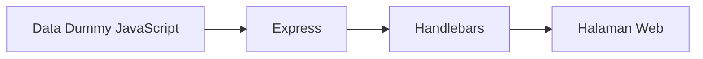

# 4. Mengubah Layout Menjadi Konten Dinamis dengan Object Dummy

Pada pelajaran sebelumnya, kita sudah membuat susunan halaman utama: menu atas, hero, berita, video, dan footer. Kita juga sudah membahas bahwa berita bisa diklik menuju halaman lain.

Sekarang, tahap berikutnya adalah membuat **konten dinamis**. Artinya, isi berita dan video tidak lagi ditulis satu per satu langsung di file HTML, tetapi diambil dari data JavaScript berbentuk object atau array.

Materi ini masih menggunakan **data dummy**, jadi belum memakai database. Tujuannya agar siswa memahami alur data terlebih dahulu.

## Tujuan Belajar

Setelah materi ini, siswa diharapkan bisa:

1. Memahami perbedaan konten statis dan konten dinamis.
2. Menyimpan data berita dan video dalam object JavaScript.
3. Mengirim data dari Express ke Handlebars.
4. Menampilkan banyak data ke halaman dengan `each`.

## Ringkasan Pelajaran Sebelumnya

Pada tahap sebelumnya kita sudah memiliki:

1. Layout halaman utama.
2. Section berita.
3. Section video.
4. Link berita ke halaman lain.

Namun, isi berita dan video masih ditulis manual langsung di `home.handlebars`.

Contoh statis:

```html
<article class="news-card">
	
	<div class="news-body">
		<p class="news-date">1 Juli 2026</p>
		<h3>Judul Berita</h3>
		<p>Isi singkat berita.</p>
	</div>
</article>
```

Cara ini bisa dipakai untuk latihan awal, tetapi jika berita bertambah banyak, penulisan manual akan melelahkan. Karena itu kita ubah menjadi dinamis.

## Apa Itu Konten Dinamis?

Konten dinamis adalah isi halaman yang berasal dari data.

Alurnya seperti ini:

1. Data disimpan di JavaScript.
2. Express mengirim data ke Handlebars.
3. Handlebars menampilkan data ke halaman HTML.



## Bentuk Data Dummy

Kita akan membuat dua data:

1. Data berita.
2. Data video.

### Contoh Object Berita dan Video di `server.js`

```js
const express = require('express');
const { engine } = require('express-handlebars');

const app = express();
const PORT = 3000;

app.engine('handlebars', engine());
app.set('view engine', 'handlebars');
app.set('views', './views');

app.use(express.static('public'));

const berita = [
	{
		id: 1,
		judul: 'Workshop Penelitian untuk Dosen Muda',
		tanggal: '1 Juli 2026',
		gambar: 'https://images.unsplash.com/photo-1516321318423-f06f85e504b3?auto=format&fit=crop&w=800&q=80',
		ringkasan: 'Kegiatan ini bertujuan meningkatkan kualitas proposal penelitian di lingkungan kampus.',
		link: 'https://lppm.undip.ac.id/2026/06/27/lppm-universitas-diponegoro-selenggarakan-kegiatan-article-subsmission-camp-untuk-dorong-peningkatan-publikasi-internasional/'
	},
	{
		id: 2,
		judul: 'Pengumuman Hibah Pengabdian Masyarakat',
		tanggal: '30 Juni 2026',
		gambar: 'https://images.unsplash.com/photo-1498243691581-b145c3f54a5a?auto=format&fit=crop&w=800&q=80',
		ringkasan: 'Program hibah dibuka untuk mendorong dampak langsung kepada masyarakat sekitar.',
		link: 'https://contoh.com/berita-2'
	},
	{
		id: 3,
		judul: 'Seminar Luaran Penelitian',
		tanggal: '28 Juni 2026',
		gambar: 'https://images.unsplash.com/photo-1522202176988-66273c2fd55f?auto=format&fit=crop&w=800&q=80',
		ringkasan: 'Seminar ini menjadi wadah publikasi hasil penelitian dan kolaborasi antar dosen.',
		link: 'https://contoh.com/berita-3'
	}
];

const video = {
	judul: 'Video Kegiatan LPPM',
	deskripsi: 'Dokumentasi kegiatan penelitian, pengabdian, dan seminar kampus.',
	url: 'https://www.youtube.com/embed/dQw4w9WgXcQ'
};

app.get('/', (req, res) => {
	res.render('home', {
		title: 'Beranda',
		berita,
		video
	});
});

app.listen(PORT, () => {
	console.log(`Server berjalan di http://localhost:${PORT}`);
});
```

## Penjelasan Bentuk Data

`berita` berbentuk **array of object**, karena isinya banyak data berita.

Setiap berita memiliki properti:

1. `id`
2. `judul`
3. `tanggal`
4. `gambar`
5. `ringkasan`
6. `link`

Sedangkan `video` cukup berbentuk **satu object**, karena di halaman utama biasanya hanya ada satu video utama.

## Menampilkan Data Berita di Handlebars

Sekarang `home.handlebars` tidak perlu lagi menulis kartu berita satu per satu. Cukup gunakan `each`.

Contoh:

```html
{{> navbar}}

<section class="hero" id="hero">
	<div class="container hero-content">
		<div>
			<p class="eyebrow">Lembaga Penelitian dan Pengabdian</p>
			<h1>Mendorong Riset, Inovasi, dan Pengabdian Masyarakat</h1>
			<p>
				Halaman utama ini menjadi pusat informasi kegiatan, pengumuman,
				publikasi, dan dokumentasi lembaga.
			</p>
			<a href="#berita" class="btn-primary">Lihat Berita</a>
		</div>
	</div>
</section>

<section class="news-section" id="berita">
	<div class="container">
		<h2>Berita Terkini</h2>

		<div class="news-grid">
			{{#each berita}}
				<article class="news-card">
					

					<div class="news-body">
						<p class="news-date">{{this.tanggal}}</p>
						<h3>
							<a href="{{this.link}}" class="news-link" target="_blank" rel="noreferrer">
								{{this.judul}}
							</a>
						</h3>
						<p>{{this.ringkasan}}</p>
					</div>
				</article>
			{{/each}}
		</div>
	</div>
</section>

<section class="video-section" id="video">
	<div class="container">
		<h2>{{video.judul}}</h2>
		<p>{{video.deskripsi}}</p>

		<div class="video-wrapper">
			<iframe
				src="{{video.url}}"
				title="{{video.judul}}"
				frameborder="0"
				allow="accelerometer; autoplay; clipboard-write; encrypted-media; gyroscope; picture-in-picture"
				allowfullscreen>
			</iframe>
		</div>
	</div>
</section>

{{> footer}}
```

## Apa Fungsi `{{#each berita}}`?

Bagian ini berarti:

1. Ambil semua data di dalam array `berita`.
2. Ulangi tampilan kartu untuk setiap item.
3. Tampilkan isi object satu per satu.

Di dalam `each`, `this` berarti item yang sedang dibaca.

Contoh:

```handlebars
{{this.judul}}
{{this.tanggal}}
{{this.gambar}}
```

## Menampilkan Data Video

Karena video hanya satu object, kita tidak perlu `each`.

Kita cukup panggil propertinya langsung:

```handlebars
{{video.judul}}
{{video.deskripsi}}
{{video.url}}
```

## Keuntungan Cara Dinamis

Dengan pendekatan ini, jika ingin menambah berita baru, kita tidak perlu menyalin banyak HTML. Cukup tambahkan object baru ke array `berita`.

Contoh menambah satu berita:

```js
berita.push({
	id: 4,
	judul: 'Pelatihan Penulisan Artikel Ilmiah',
	tanggal: '2 Juli 2026',
	gambar: 'https://images.unsplash.com/photo-1513258496099-48168024aec0?auto=format&fit=crop&w=800&q=80',
	ringkasan: 'Pelatihan ini membantu mahasiswa dan dosen memahami struktur artikel ilmiah.',
	link: 'https://contoh.com/berita-4'
});
```

Setelah data bertambah, tampilan berita ikut bertambah otomatis.

## Hubungan dengan Materi Sebelumnya

Pelajaran ini adalah lanjutan langsung dari materi sebelumnya:

1. Dari [02-layout.md](e:/REACT/node-web/02-layout.md), kita sudah punya bentuk halaman utama.
2. Dari [03-layout-berita.md](e:/REACT/node-web/03-layout-berita.md), kita sudah tahu bahwa judul berita bisa dijadikan link.
3. Sekarang kita menggabungkan keduanya dengan data dummy agar halaman terasa lebih nyata.

## Urutan Mengajar yang Disarankan

Supaya siswa SMA lebih mudah mengikuti, urutan mengajarnya bisa seperti ini:

1. Tunjukkan dulu tampilan statis.
2. Jelaskan bahwa menulis banyak kartu HTML secara manual tidak efisien.
3. Pindahkan isi berita ke object JavaScript.
4. Gunakan `{{#each}}` untuk menampilkan berita.
5. Tampilkan object video ke section video.
6. Ubah satu data dummy dan lihat hasilnya di browser.

## Latihan Untuk Siswa

1. Tambahkan satu berita baru ke array `berita`.
2. Ganti judul video.
3. Ganti link video YouTube.
4. Ubah salah satu link berita menjadi link artikel lain.
5. Ubah gambar berita pertama.

## Kesimpulan

Konten dinamis berarti isi halaman berasal dari data, bukan ditulis manual satu per satu di HTML. Dengan Express dan Handlebars, data dummy berupa object berita dan object video bisa ditampilkan ke halaman utama yang sebelumnya sudah dibuat. Ini adalah langkah penting sebelum masuk ke database seperti SQLite, karena siswa sudah memahami bahwa halaman web sebenarnya hanya menampilkan data yang dikirim dari server.
