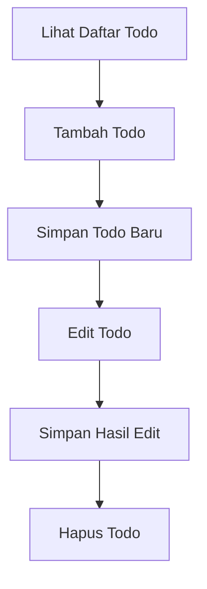

# 5. Latihan CRUD Todo Sederhana dengan Object dan Handlebars

Pada materi sebelumnya, kita sudah belajar menampilkan data dinamis dari object dan array ke halaman web dengan Handlebars. Sekarang kita lanjut ke latihan yang sangat cocok untuk siswa SMA, yaitu membuat **CRUD Todo**.

CRUD berarti:

1. Create = membuat data baru
2. Read = menampilkan data
3. Update = mengubah data
4. Delete = menghapus data

Pada latihan ini, kita belum memakai database. Data Todo masih disimpan di **array object** di `server.js`. Tujuannya agar siswa fokus dulu pada alur CRUD.

## Tujuan Belajar

Setelah materi ini, siswa diharapkan bisa:

1. Memahami alur CRUD sederhana.
2. Menyimpan data Todo baru.
3. Menampilkan daftar Todo di halaman Handlebars.
4. Mengedit Todo lalu menyimpan hasil edit.
5. Menghapus Todo dari daftar.

## Konsep Aplikasi Todo

Todo adalah daftar kegiatan yang ingin dilakukan.

Contoh data Todo:

```js
{
	id: 1,
	aktivitas: 'Belajar Node.js',
	selesai: false
}
```

Artinya:

1. `id` adalah nomor unik.
2. `aktivitas` adalah isi tugas.
3. `selesai` menunjukkan apakah tugas sudah selesai atau belum.

## Gambaran Alur CRUD



## Struktur Folder Sederhana

```text
node-web/
|-- server.js
|-- public/
|   `-- css/
|       `-- style.css
`-- views/
		|-- todo.handlebars
		|-- todo-edit.handlebars
		`-- layouts/
				`-- main.handlebars
```

## Tahap 1: Menyiapkan Data Todo di `server.js`

Pertama, siapkan array object untuk menyimpan data Todo sementara.

```js
const express = require('express');
const { engine } = require('express-handlebars');

const app = express();
const PORT = 3000;

app.engine('handlebars', engine());
app.set('view engine', 'handlebars');
app.set('views', './views');

app.use(express.urlencoded({ extended: true }));
app.use(express.static('public'));

let todos = [
	{ id: 1, aktivitas: 'Belajar Node.js', selesai: false },
	{ id: 2, aktivitas: 'Belajar Express', selesai: false },
	{ id: 3, aktivitas: 'Membuat halaman Handlebars', selesai: true }
];
```

Penjelasan:

1. `let todos` dipakai karena datanya akan berubah.
2. `express.urlencoded()` dipakai agar form HTML bisa dibaca server.
3. Data awal sengaja dibuat sedikit agar mudah dipahami siswa.

## Tahap 2: Read, Menampilkan Daftar Todo

Sekarang buat route untuk menampilkan semua Todo.

```js
app.get('/todo', (req, res) => {
	res.render('todo', {
		title: 'Daftar Todo',
		todos
	});
});
```

Contoh `views/todo.handlebars`:

```html
<section class="todo-page">
	<div class="container">
		<h1>Daftar Todo</h1>

		<form action="/todo/tambah" method="POST" class="todo-form">
			<input type="text" name="aktivitas" placeholder="Masukkan kegiatan" required />
			<button type="submit">Simpan Baru</button>
		</form>

		<div class="todo-list">
			{{#each todos}}
				<div class="todo-item">
					<h3>{{this.aktivitas}}</h3>
					<p>Status: {{#if this.selesai}}Selesai{{else}}Belum selesai{{/if}}</p>

					<a href="/todo/edit/{{this.id}}">Edit</a>

					<form action="/todo/hapus/{{this.id}}" method="POST" style="display:inline;">
						<button type="submit">Hapus</button>
					</form>
				</div>
			{{/each}}
		</div>
	</div>
</section>
```

Pada tahap ini siswa belajar bahwa data dari array `todos` bisa langsung ditampilkan memakai `{{#each}}`.

## Tahap 3: Create, Simpan Todo Baru

Sekarang kita tambahkan fitur untuk menyimpan Todo baru dari form.

```js
app.post('/todo/tambah', (req, res) => {
	const aktivitasBaru = req.body.aktivitas;

	const todoBaru = {
		id: Date.now(),
		aktivitas: aktivitasBaru,
		selesai: false
	};

	todos.push(todoBaru);
	res.redirect('/todo');
});
```

Penjelasan sederhana:

1. Ambil isi input dari form.
2. Buat object baru.
3. Masukkan ke array `todos`.
4. Setelah disimpan, kembali ke halaman daftar.

Inilah proses **simpan baru**.

## Tahap 4: Membuat Halaman Edit

Sebelum mengubah data, kita perlu menampilkan form edit.

```js
app.get('/todo/edit/:id', (req, res) => {
	const id = Number(req.params.id);
	const todo = todos.find((item) => item.id === id);

	res.render('todo-edit', {
		title: 'Edit Todo',
		todo
	});
});
```

Contoh `views/todo-edit.handlebars`:

```html
<section class="todo-page">
	<div class="container">
		<h1>Edit Todo</h1>

		<form action="/todo/edit/{{todo.id}}" method="POST" class="todo-form">
			<input type="text" name="aktivitas" value="{{todo.aktivitas}}" required />

			<select name="selesai">
				<option value="false" {{#unless todo.selesai}}selected{{/unless}}>Belum selesai</option>
				<option value="true" {{#if todo.selesai}}selected{{/if}}>Selesai</option>
			</select>

			<button type="submit">Simpan Edit</button>
		</form>

		<p><a href="/todo">Kembali ke daftar</a></p>
	</div>
</section>
```

Pada tahap ini siswa belajar bahwa saat tombol Edit diklik, aplikasi membuka halaman form yang sudah terisi data lama.

## Tahap 5: Update, Simpan Hasil Edit

Sekarang kita buat proses penyimpanan hasil edit.

```js
app.post('/todo/edit/:id', (req, res) => {
	const id = Number(req.params.id);
	const aktivitasBaru = req.body.aktivitas;
	const statusSelesai = req.body.selesai === 'true';

	todos = todos.map((item) => {
		if (item.id === id) {
			return {
				...item,
				aktivitas: aktivitasBaru,
				selesai: statusSelesai
			};
		}

		return item;
	});

	res.redirect('/todo');
});
```

Penjelasan:

1. Ambil `id` dari URL.
2. Ambil data baru dari form edit.
3. Cari data yang cocok.
4. Ganti isinya.
5. Kembali ke daftar Todo.

Inilah proses **edit lalu simpan**.

## Tahap 6: Delete, Menghapus Todo

Sekarang tambahkan tombol hapus.

```js
app.post('/todo/hapus/:id', (req, res) => {
	const id = Number(req.params.id);
	todos = todos.filter((item) => item.id !== id);
	res.redirect('/todo');
});
```

Penjelasan:

1. Ambil `id` Todo yang ingin dihapus.
2. Sisakan semua data selain id itu.
3. Tampilkan ulang daftar Todo.

## Gabungan Route Lengkap

Supaya mudah dibaca siswa, berikut alur route lengkapnya:

```js
const express = require('express');
const { engine } = require('express-handlebars');

const app = express();
const PORT = 3000;

app.engine('handlebars', engine());
app.set('view engine', 'handlebars');
app.set('views', './views');

app.use(express.urlencoded({ extended: true }));

let todos = [
	{ id: 1, aktivitas: 'Belajar Node.js', selesai: false },
	{ id: 2, aktivitas: 'Belajar Express', selesai: false },
	{ id: 3, aktivitas: 'Membuat halaman Handlebars', selesai: true }
];

app.get('/todo', (req, res) => {
	res.render('todo', {
		title: 'Daftar Todo',
		todos
	});
});

app.post('/todo/tambah', (req, res) => {
	const todoBaru = {
		id: Date.now(),
		aktivitas: req.body.aktivitas,
		selesai: false
	};

	todos.push(todoBaru);
	res.redirect('/todo');
});

app.get('/todo/edit/:id', (req, res) => {
	const id = Number(req.params.id);
	const todo = todos.find((item) => item.id === id);

	res.render('todo-edit', {
		title: 'Edit Todo',
		todo
	});
});

app.post('/todo/edit/:id', (req, res) => {
	const id = Number(req.params.id);

	todos = todos.map((item) => {
		if (item.id === id) {
			return {
				...item,
				aktivitas: req.body.aktivitas,
				selesai: req.body.selesai === 'true'
			};
		}

		return item;
	});

	res.redirect('/todo');
});

app.post('/todo/hapus/:id', (req, res) => {
	const id = Number(req.params.id);
	todos = todos.filter((item) => item.id !== id);
	res.redirect('/todo');
});

app.listen(PORT, () => {
	console.log(`Server berjalan di http://localhost:${PORT}/todo`);
});
```

## CSS Dasar Supaya Lebih Rapi

```css
.todo-page {
	padding: 40px 0;
}

.todo-form {
	display: flex;
	gap: 12px;
	margin-bottom: 24px;
}

.todo-form input,
.todo-form select,
.todo-form button {
	padding: 10px 12px;
}

.todo-list {
	display: grid;
	gap: 16px;
}

.todo-item {
	background: #f8fafc;
	border: 1px solid #dbe3ee;
	border-radius: 8px;
	padding: 16px;
}
```

## Urutan Mengajar yang Disarankan

Supaya siswa SMA tidak bingung, pakai urutan berikut:

1. Tampilkan dulu daftar Todo.
2. Tambahkan form simpan baru.
3. Uji tambah data.
4. Buat tombol Edit.
5. Buka halaman edit.
6. Simpan hasil edit.
7. Tambahkan tombol Hapus.

Dengan cara ini, siswa melihat aplikasi berkembang sedikit demi sedikit.

## Hal Penting yang Perlu Dijelaskan ke Siswa

1. Data ini belum permanen karena belum disimpan ke database.
2. Jika server dimatikan, data akan kembali ke data awal.
3. Form HTML dipakai untuk mengirim data ke server.
4. Handlebars dipakai untuk menampilkan data ke halaman.

## Latihan Untuk Siswa

1. Tambahkan field `mataPelajaran` pada Todo.
2. Buat status Todo menjadi `Penting` atau `Biasa`.
3. Tambahkan tombol untuk menandai Todo selesai tanpa masuk ke halaman edit.
4. Ubah tampilan Todo yang selesai menjadi warna hijau.
5. Urutkan Todo yang belum selesai di bagian atas.

## Kesimpulan

CRUD Todo adalah latihan yang sangat baik untuk siswa SMA karena alurnya sederhana dan mudah dilihat hasilnya. Dengan array object, Express, dan Handlebars, siswa bisa belajar menampilkan data, menyimpan data baru, membuka form edit, menyimpan hasil edit, dan menghapus data. Setelah paham tahap ini, barulah latihan bisa dilanjutkan ke CRUD yang memakai SQLite agar data tersimpan permanen.
