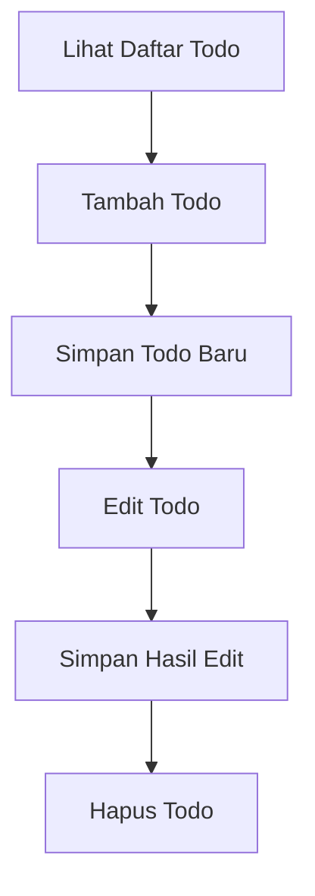

# 5. Latihan CRUD Todo Sederhana dengan Object dan Handlebars

Pada materi sebelumnya, kita sudah belajar menampilkan data dinamis dari object dan array ke halaman web dengan Handlebars. Sekarang kita lanjut ke latihan yang sangat cocok untuk siswa SMA, yaitu membuat **CRUD Todo**.

CRUD berarti:

1. Create = membuat data baru
2. Read = menampilkan data
3. Update = mengubah data
4. Delete = menghapus data

Pada latihan ini, kita belum memakai database. Data Todo masih disimpan di **array object** di `server.js`. Tujuannya agar siswa fokus dulu pada alur CRUD.

## Tujuan Belajar

Setelah materi ini, siswa diharapkan bisa:

1. Memahami alur CRUD sederhana.
2. Menyimpan data Todo baru.
3. Menampilkan daftar Todo di halaman Handlebars.
4. Mengedit Todo lalu menyimpan hasil edit.
5. Menghapus Todo dari daftar.

## Konsep Aplikasi Todo

Todo adalah daftar kegiatan yang ingin dilakukan.

Contoh data Todo:

```js
{
	id: 1,
	aktivitas: 'Belajar Node.js',
	selesai: false
}
```

Artinya:

1. `id` adalah nomor unik.
2. `aktivitas` adalah isi tugas.
3. `selesai` menunjukkan apakah tugas sudah selesai atau belum.

## Gambaran Alur CRUD



## Struktur Folder Sederhana

```text
node-web/
|-- server.js
|-- public/
|   `-- css/
|       `-- style.css
`-- views/
		|-- todo.handlebars
		|-- todo-edit.handlebars
		`-- layouts/
				`-- main.handlebars
```

## Langkah Praktik Versi Siswa SMA

Di bagian ini, langkah dibuat lebih singkat dan langsung praktik.
Gunakan urutan ini saat mengajar agar siswa tidak kewalahan.

### Langkah 1 - Siapkan server dan data awal

Masukkan kode dasar ini ke `server.js`:

```js
const express = require('express');
const { engine } = require('express-handlebars');

const app = express();
const PORT = 3000;

app.engine('handlebars', engine({ defaultLayout: 'main' }));
app.set('view engine', 'handlebars');
app.set('views', './views');

app.use(express.urlencoded({ extended: true }));
app.use(express.static('public'));

let todos = [
	{ id: 1, aktivitas: 'Belajar Node.js', selesai: false },
	{ id: 2, aktivitas: 'Belajar Express', selesai: false },
	{ id: 3, aktivitas: 'Membuat halaman Handlebars', selesai: true }
];
```

Checkpoint:

1. Server bisa dijalankan.
2. Tidak ada error di terminal.

### Langkah 2 - READ (lihat daftar todo)

Tambahkan route daftar todo:

```js
app.get('/todo', (req, res) => {
	res.render('todo', {
		title: 'Daftar Todo',
		todos
	});
});
```

Checkpoint:

1. Buka `http://localhost:3000/todo`.
2. Data awal todo tampil di halaman.

### Langkah 3 - CREATE (tambah todo)

Tambah route simpan todo baru:

```js
app.post('/todo/tambah', (req, res) => {
	const todoBaru = {
		id: Date.now(),
		aktivitas: req.body.aktivitas,
		selesai: false
	};

	todos.push(todoBaru);
	res.redirect('/todo');
});
```

Checkpoint:

1. Isi form tambah todo.
2. Klik Simpan Baru.
3. Data baru muncul di daftar.

### Langkah 4 - Tampilkan form EDIT

Tambah route untuk membuka halaman edit:

```js
app.get('/todo/edit/:id', (req, res) => {
	const id = Number(req.params.id);
	const todo = todos.find((item) => item.id === id);

	res.render('todo-edit', {
		title: 'Edit Todo',
		todo
	});
});
```

Checkpoint:

1. Klik tombol Edit pada salah satu todo.
2. Form edit tampil dan terisi data lama.

### Langkah 5 - UPDATE (simpan edit)

Tambah route simpan hasil edit:

```js
app.post('/todo/edit/:id', (req, res) => {
	const id = Number(req.params.id);

	todos = todos.map((item) => {
		if (item.id === id) {
			return {
				...item,
				aktivitas: req.body.aktivitas,
				selesai: req.body.selesai === 'true'
			};
		}

		return item;
	});

	res.redirect('/todo');
});
```

Checkpoint:

1. Edit teks aktivitas.
2. Ubah status selesai/belum selesai.
3. Data berubah saat kembali ke daftar.

### Langkah 6 - DELETE (hapus todo)

Tambah route hapus:

```js
app.post('/todo/hapus/:id', (req, res) => {
	const id = Number(req.params.id);
	todos = todos.filter((item) => item.id !== id);
	res.redirect('/todo');
});
```

Checkpoint:

1. Klik tombol Hapus.
2. Data hilang dari daftar.

## Kunci Jawaban File Akhir

## Struktur file

```text
node-web/
|-- server.js
|-- public/
|   `-- css/
|       `-- style.css
`-- views/
		|-- todo.handlebars
		|-- todo-edit.handlebars
		`-- layouts/
				`-- main.handlebars
```

## `views/layouts/main.handlebars`

```html
<!DOCTYPE html>
<html lang="id">
<head>
	<meta charset="UTF-8" />
	<meta name="viewport" content="width=device-width, initial-scale=1.0" />
	<title>{{title}}</title>
	<link rel="stylesheet" href="/css/style.css" />
</head>
<body>
	{{{body}}}
</body>
</html>
```

## `views/todo.handlebars`

```html
<section class="todo-page">
	<div class="container">
		<h1>Daftar Todo</h1>

		<form action="/todo/tambah" method="POST" class="todo-form">
			<input type="text" name="aktivitas" placeholder="Masukkan kegiatan" required />
			<button type="submit">Simpan Baru</button>
		</form>

		<div class="todo-list">
			{{#each todos}}
				<div class="todo-item">
					<h3>{{this.aktivitas}}</h3>
					<p>Status: {{#if this.selesai}}Selesai{{else}}Belum selesai{{/if}}</p>

					<a href="/todo/edit/{{this.id}}">Edit</a>
					<form action="/todo/hapus/{{this.id}}" method="POST" style="display:inline;">
						<button type="submit">Hapus</button>
					</form>
				</div>
			{{/each}}
		</div>
	</div>
</section>
```

## `views/todo-edit.handlebars`

```html
<section class="todo-page">
	<div class="container">
		<h1>Edit Todo</h1>

		<form action="/todo/edit/{{todo.id}}" method="POST" class="todo-form">
			<input type="text" name="aktivitas" value="{{todo.aktivitas}}" required />
			<select name="selesai">
				<option value="false" {{#unless todo.selesai}}selected{{/unless}}>Belum selesai</option>
				<option value="true" {{#if todo.selesai}}selected{{/if}}>Selesai</option>
			</select>
			<button type="submit">Simpan Edit</button>
		</form>

		<p><a href="/todo">Kembali ke daftar</a></p>
	</div>
</section>
```

## `public/css/style.css`

```css
.todo-page {
	padding: 40px 0;
}

.container {
	width: 90%;
	max-width: 900px;
	margin: 0 auto;
}

.todo-form {
	display: flex;
	gap: 12px;
	margin-bottom: 24px;
	flex-wrap: wrap;
}

.todo-form input,
.todo-form select,
.todo-form button {
	padding: 10px 12px;
}

.todo-list {
	display: grid;
	gap: 16px;
}

.todo-item {
	background: #f8fafc;
	border: 1px solid #dbe3ee;
	border-radius: 8px;
	padding: 16px;
}
```

## `server.js` lengkap

```js
const express = require('express');
const { engine } = require('express-handlebars');

const app = express();
const PORT = 3000;

app.engine('handlebars', engine({ defaultLayout: 'main' }));
app.set('view engine', 'handlebars');
app.set('views', './views');

app.use(express.urlencoded({ extended: true }));
app.use(express.static('public'));

let todos = [
	{ id: 1, aktivitas: 'Belajar Node.js', selesai: false },
	{ id: 2, aktivitas: 'Belajar Express', selesai: false },
	{ id: 3, aktivitas: 'Membuat halaman Handlebars', selesai: true }
];

app.get('/todo', (req, res) => {
	res.render('todo', {
		title: 'Daftar Todo',
		todos
	});
});

app.post('/todo/tambah', (req, res) => {
	const todoBaru = {
		id: Date.now(),
		aktivitas: req.body.aktivitas,
		selesai: false
	};

	todos.push(todoBaru);
	res.redirect('/todo');
});

app.get('/todo/edit/:id', (req, res) => {
	const id = Number(req.params.id);
	const todo = todos.find((item) => item.id === id);

	res.render('todo-edit', {
		title: 'Edit Todo',
		todo
	});
});

app.post('/todo/edit/:id', (req, res) => {
	const id = Number(req.params.id);

	todos = todos.map((item) => {
		if (item.id === id) {
			return {
				...item,
				aktivitas: req.body.aktivitas,
				selesai: req.body.selesai === 'true'
			};
		}

		return item;
	});

	res.redirect('/todo');
});

app.post('/todo/hapus/:id', (req, res) => {
	const id = Number(req.params.id);
	todos = todos.filter((item) => item.id !== id);
	res.redirect('/todo');
});

app.listen(PORT, () => {
	console.log(`Server berjalan di http://localhost:${PORT}/todo`);
});
```

## Hal Penting untuk Siswa

1. Data belum permanen karena masih array di memory.
2. Saat server restart, data kembali ke awal.
3. Tahap berikutnya adalah menyimpan data ke SQLite agar permanen.
