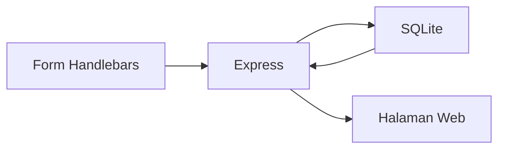

# 6. CRUD Todo dengan SQLite dan Handlebars

Pada materi sebelumnya, data Todo disimpan di array object di `server.js`.

Cara itu bagus untuk latihan awal, tetapi ada masalah:

1. Data hilang saat server dimatikan.
2. Data kembali ke awal saat server dijalankan lagi.

Sekarang kita lanjut ke tahap berikutnya, yaitu menyimpan data Todo ke **SQLite**.

SQLite adalah database sederhana yang cocok untuk belajar karena data bisa disimpan ke file tanpa instalasi yang rumit.

## Tujuan Belajar

Setelah materi ini, siswa diharapkan bisa:

1. Memahami perbedaan array object dan database.
2. Membuat database SQLite sederhana.
3. Menyimpan Todo ke database.
4. Menampilkan data Todo dari database ke Handlebars.
5. Mengedit dan menghapus data yang tersimpan permanen.

## Kenapa Pindah ke SQLite?

Sebelumnya, data Todo hanya ada di dalam program.

Kalau program ditutup:

1. Data hilang.
2. Todo baru tidak tersimpan.

Dengan SQLite:

1. Data disimpan ke file database.
2. Data tetap ada walaupun server dimatikan.
3. Aplikasi menjadi lebih mirip aplikasi sungguhan.

## Gambaran Alur Baru



## Paket yang Digunakan

Untuk materi ini, kita memakai:

1. `express`
2. `express-handlebars`
3. `better-sqlite3`

Kita memakai `better-sqlite3` karena penulisannya lebih sederhana untuk pemula.

## Instalasi

Jalankan perintah berikut:

```bash
npm install express express-handlebars better-sqlite3
```

## Struktur Folder

```text
node-web/
|-- server.js
|-- todo.db
|-- public/
|   `-- css/
|       `-- style.css
`-- views/
		|-- todo.handlebars
		|-- todo-edit.handlebars
		`-- layouts/
				`-- main.handlebars
```

## Tahap 1: Membuka Database SQLite

Pertama, buka database di `server.js`.

```js
const express = require('express');
const { engine } = require('express-handlebars');
const Database = require('better-sqlite3');

const app = express();
const PORT = 3000;

const db = new Database('todo.db');

app.engine('handlebars', engine());
app.set('view engine', 'handlebars');
app.set('views', './views');

app.use(express.urlencoded({ extended: true }));
app.use(express.static('public'));
```

Penjelasan sederhana:

1. `todo.db` adalah file tempat data disimpan.
2. Jika file belum ada, SQLite akan membuat file itu.
3. Semua Todo nanti disimpan di file ini.

## Tahap 2: Membuat Tabel Todo

Setelah database dibuka, kita buat tabel `todos`.

Tabel adalah tempat menyimpan data di dalam database.

Kalau database diibaratkan lemari, maka tabel adalah rak di dalam lemari.

```js
db.prepare(`
	CREATE TABLE IF NOT EXISTS todos (
		id INTEGER PRIMARY KEY AUTOINCREMENT,
		aktivitas TEXT NOT NULL,
		selesai INTEGER NOT NULL DEFAULT 0
	)
`).run();
```

### Kode Ini Ditulis di Mana?

Kode ini ditulis di file `server.js`.

Letaknya:

1. Setelah koneksi database dibuat.
2. Sebelum route seperti `/todo` ditulis.

Contoh urutannya seperti ini:

```js
const express = require('express');
const { engine } = require('express-handlebars');
const Database = require('better-sqlite3');

const app = express();
const PORT = 3000;

const db = new Database('todo.db');

app.engine('handlebars', engine());
app.set('view engine', 'handlebars');
app.set('views', './views');

app.use(express.urlencoded({ extended: true }));
app.use(express.static('public'));

db.prepare(`
	CREATE TABLE IF NOT EXISTS todos (
		id INTEGER PRIMARY KEY AUTOINCREMENT,
		aktivitas TEXT NOT NULL,
		selesai INTEGER NOT NULL DEFAULT 0
	)
`).run();

app.get('/todo', (req, res) => {
	const todos = db.prepare('SELECT * FROM todos ORDER BY id DESC').all();

	res.render('todo', {
		title: 'Daftar Todo',
		todos
	});
});
```

Jadi, urutannya mudah diingat:

1. Buka database.
2. Buat tabel.
3. Baru pakai tabel itu di route.

Kalau ditaruh setelah route, siswa biasanya bingung karena aplikasi mencoba memakai tabel sebelum tabel itu dijelaskan.

Penjelasan kolom:

1. `id` adalah nomor unik otomatis.
2. `aktivitas` berisi teks kegiatan.
3. `selesai` bernilai `0` atau `1`.

Di SQLite, data benar atau salah biasanya disimpan sebagai angka:

1. `0` = belum selesai
2. `1` = selesai

## Tahap 3: Read, Menampilkan Data Todo dari Database

Sekarang route `/todo` tidak lagi membaca array object.

Sekarang data dibaca dari tabel `todos` di SQLite.

```js
app.get('/todo', (req, res) => {
	const todos = db.prepare('SELECT * FROM todos ORDER BY id DESC').all();

	res.render('todo', {
		title: 'Daftar Todo',
		todos
	});
});
```

Contoh `views/todo.handlebars`:

```html
<section class="todo-page">
	<div class="container">
		<h1>Daftar Todo</h1>

		<form action="/todo/tambah" method="POST" class="todo-form">
			<input type="text" name="aktivitas" placeholder="Masukkan kegiatan" required />
			<button type="submit">Simpan Baru</button>
		</form>

		<div class="todo-list">
			{{#each todos}}
				<div class="todo-item">
					<h3>{{this.aktivitas}}</h3>
					<p>Status: {{#if this.selesai}}Selesai{{else}}Belum selesai{{/if}}</p>

					<a href="/todo/edit/{{this.id}}">Edit</a>

					<form action="/todo/hapus/{{this.id}}" method="POST" style="display:inline;">
						<button type="submit">Hapus</button>
					</form>
				</div>
			{{/each}}
		</div>
	</div>
</section>
```

## Tahap 4: Create, Simpan Todo Baru ke SQLite

Sekarang tombol simpan baru akan menyimpan data ke database.

```js
app.post('/todo/tambah', (req, res) => {
	const aktivitasBaru = req.body.aktivitas;

	db.prepare('INSERT INTO todos (aktivitas, selesai) VALUES (?, ?)')
		.run(aktivitasBaru, 0);

	res.redirect('/todo');
});
```

Penjelasan:

1. Ambil input dari form.
2. Jalankan perintah `INSERT`.
3. Simpan ke tabel `todos`.
4. Kembali ke daftar.

Ini adalah proses **simpan baru** dengan SQLite.

## Tahap 5: Menampilkan Form Edit

Saat tombol Edit diklik, aplikasi mengambil satu data Todo berdasarkan `id`.

```js
app.get('/todo/edit/:id', (req, res) => {
	const id = Number(req.params.id);
	const todo = db.prepare('SELECT * FROM todos WHERE id = ?').get(id);

	res.render('todo-edit', {
		title: 'Edit Todo',
		todo
	});
});
```

Contoh `views/todo-edit.handlebars`:

```html
<section class="todo-page">
	<div class="container">
		<h1>Edit Todo</h1>

		<form action="/todo/edit/{{todo.id}}" method="POST" class="todo-form">
			<input type="text" name="aktivitas" value="{{todo.aktivitas}}" required />

			<select name="selesai">
				<option value="0" {{#unless todo.selesai}}selected{{/unless}}>Belum selesai</option>
				<option value="1" {{#if todo.selesai}}selected{{/if}}>Selesai</option>
			</select>

			<button type="submit">Simpan Edit</button>
		</form>

		<p><a href="/todo">Kembali ke daftar</a></p>
	</div>
</section>
```

## Tahap 6: Update, Simpan Hasil Edit ke SQLite

Setelah form edit diisi, hasilnya disimpan ke database.

```js
app.post('/todo/edit/:id', (req, res) => {
	const id = Number(req.params.id);
	const aktivitasBaru = req.body.aktivitas;
	const statusSelesai = Number(req.body.selesai);

	db.prepare('UPDATE todos SET aktivitas = ?, selesai = ? WHERE id = ?')
		.run(aktivitasBaru, statusSelesai, id);

	res.redirect('/todo');
});
```

Penjelasan:

1. Ambil `id` dari URL.
2. Ambil data baru dari form.
3. Jalankan perintah `UPDATE`.
4. Kembali ke halaman daftar.

Ini adalah proses **edit lalu simpan** dengan SQLite.

## Tahap 7: Delete, Menghapus Todo dari SQLite

Sekarang tombol Hapus benar-benar menghapus data dari database.

```js
app.post('/todo/hapus/:id', (req, res) => {
	const id = Number(req.params.id);

	db.prepare('DELETE FROM todos WHERE id = ?').run(id);

	res.redirect('/todo');
});
```

## Kapan Tabel Dibuat?

Bagian membuat tabel dijalankan saat server pertama kali dinyalakan.

Saat kita menjalankan:

```bash
node server.js
```

Node akan membaca file `server.js` dari atas ke bawah.

Urutannya seperti ini:

1. Import package.
2. Buka database.
3. Buat tabel jika belum ada.
4. Jalankan route.
5. Server siap menerima request.

Jadi, tabel harus dibuat lebih dulu sebelum data dibaca atau disimpan.

## Gabungan `server.js` Lengkap

```js
const express = require('express');
const { engine } = require('express-handlebars');
const Database = require('better-sqlite3');

const app = express();
const PORT = 3000;

const db = new Database('todo.db');

app.engine('handlebars', engine());
app.set('view engine', 'handlebars');
app.set('views', './views');

app.use(express.urlencoded({ extended: true }));
app.use(express.static('public'));

db.prepare(`
	CREATE TABLE IF NOT EXISTS todos (
		id INTEGER PRIMARY KEY AUTOINCREMENT,
		aktivitas TEXT NOT NULL,
		selesai INTEGER NOT NULL DEFAULT 0
	)
`).run();

app.get('/todo', (req, res) => {
	const todos = db.prepare('SELECT * FROM todos ORDER BY id DESC').all();

	res.render('todo', {
		title: 'Daftar Todo',
		todos
	});
});

app.post('/todo/tambah', (req, res) => {
	db.prepare('INSERT INTO todos (aktivitas, selesai) VALUES (?, ?)')
		.run(req.body.aktivitas, 0);

	res.redirect('/todo');
});

app.get('/todo/edit/:id', (req, res) => {
	const id = Number(req.params.id);
	const todo = db.prepare('SELECT * FROM todos WHERE id = ?').get(id);

	res.render('todo-edit', {
		title: 'Edit Todo',
		todo
	});
});

app.post('/todo/edit/:id', (req, res) => {
	const id = Number(req.params.id);

	db.prepare('UPDATE todos SET aktivitas = ?, selesai = ? WHERE id = ?')
		.run(req.body.aktivitas, Number(req.body.selesai), id);

	res.redirect('/todo');
});

app.post('/todo/hapus/:id', (req, res) => {
	const id = Number(req.params.id);
	db.prepare('DELETE FROM todos WHERE id = ?').run(id);
	res.redirect('/todo');
});

app.listen(PORT, () => {
	console.log(`Server berjalan di http://localhost:${PORT}/todo`);
});
```

## CSS Dasar

Jika masih memakai CSS dari materi sebelumnya, itu sudah cukup. Contoh sederhananya:

```css
.todo-page {
	padding: 40px 0;
}

.todo-form {
	display: flex;
	gap: 12px;
	margin-bottom: 24px;
}

.todo-form input,
.todo-form select,
.todo-form button {
	padding: 10px 12px;
}

.todo-list {
	display: grid;
	gap: 16px;
}

.todo-item {
	background: #f8fafc;
	border: 1px solid #dbe3ee;
	border-radius: 8px;
	padding: 16px;
}
```

## Perbedaan dengan Materi Sebelumnya

Sebelumnya:

1. Data disimpan di array `todos`.
2. Data hilang saat server mati.

Sekarang:

1. Data disimpan di `todo.db`.
2. Data tetap ada walaupun server dimatikan.
3. Kita memakai SQL untuk membaca dan mengubah data.

## Urutan Mengajar yang Disarankan

Supaya siswa SMA lebih mudah mengikuti, ajarkan dalam urutan ini:

1. Jelaskan dulu kenapa array object belum cukup.
2. Kenalkan SQLite sebagai tempat penyimpanan permanen.
3. Buat tabel `todos`.
4. Tampilkan data dari database.
5. Simpan Todo baru.
6. Edit dan simpan perubahan.
7. Hapus data.

## Hal Penting Untuk Dijelaskan ke Siswa

1. Database adalah tempat menyimpan data.
2. SQLite menyimpan data dalam satu file.
3. SQL adalah perintah untuk membaca dan mengubah data.
4. Handlebars tetap dipakai untuk menampilkan data ke halaman.

## Ringkasan Sangat Sederhana

Kalau ingin dijelaskan dengan sangat singkat ke siswa, gunakan kalimat ini:

1. Form mengirim data ke Express.
2. Express menyimpan data ke SQLite.
3. SQLite menyimpan data di file.
4. Express mengambil data dari SQLite.
5. Handlebars menampilkan data ke browser.

## Latihan Untuk Siswa

1. Tambahkan kolom `kategori` pada tabel Todo.
2. Tampilkan kategori di halaman daftar.
3. Tambahkan filter Todo selesai dan belum selesai.
4. Tambahkan tanggal pembuatan Todo.
5. Buat tampilan warna berbeda untuk status selesai.

## Kesimpulan

Dengan SQLite, aplikasi Todo menjadi lebih nyata karena data tidak lagi hilang saat server dimatikan. Alur CRUD tetap sama seperti sebelumnya, hanya tempat penyimpanannya pindah dari array object ke database. Ini penting agar siswa memahami bahwa aplikasi web tidak hanya menampilkan data, tetapi juga menyimpan data secara permanen.
