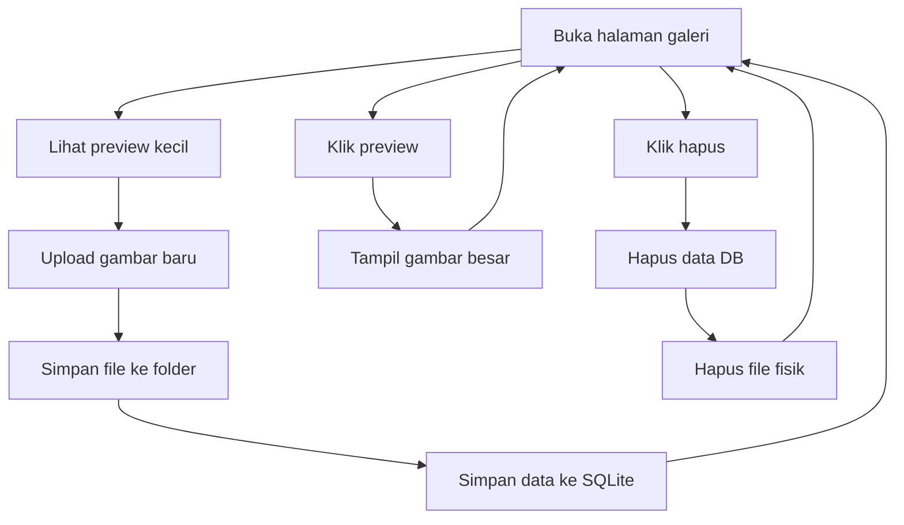

# 7A. Latihan Upload File Gambar: Preview Kecil, Klik Jadi Besar, dan Delete File

Materi ini adalah lanjutan gaya belajar dari pelajaran 6 (SQLite Todo), tetapi fokusnya sekarang pada file gambar.

Di sini siswa belajar alur lengkap:

1. Upload gambar.
2. Simpan data gambar ke SQLite.
3. Tampilkan preview kecil di daftar.
4. Klik preview untuk melihat gambar ukuran besar.
5. Hapus data gambar sekaligus hapus file fisik di folder.

## Tujuan Belajar

Setelah materi ini, siswa diharapkan bisa:

1. Memahami alur upload file di Express.
2. Mengetahui file disimpan di folder mana.
3. Menamai file agar tidak duplikasi.
4. Menampilkan thumbnail (preview kecil) dan versi besar.
5. Menghapus data di database dan file di folder secara aman.

## Konsep Sederhana

Supaya mudah dipahami siswa SMA:

1. Database menyimpan data tentang file (nama file, judul, waktu).
2. Folder menyimpan file gambarnya.
3. Saat upload, server menyimpan file ke folder lalu catat namanya di SQLite.
4. Saat delete, server hapus data di SQLite dan hapus file fisiknya.

Analogi:

1. SQLite = buku daftar arsip.
2. Folder uploads = lemari arsip gambar.
3. Nama file unik = nomor arsip supaya tidak tertukar.

## Alur Fitur



## Paket yang Digunakan

1. express
2. express-handlebars
3. better-sqlite3
4. multer
5. sharp

Instalasi:

```bash
npm install express express-handlebars better-sqlite3 multer sharp
```

## Struktur Folder

```text
node-web/
|-- server.js
|-- gallery.db
|-- public/
|   |-- css/
|   |   `-- style.css
|   `-- uploads/
|       |-- thumb/
|       `-- large/
`-- views/
		|-- gallery.handlebars
		|-- gallery-detail.handlebars
		`-- layouts/
				`-- main.handlebars
```

## File Disimpan di Mana?

Di latihan ini, file gambar disimpan di:

1. public/uploads/thumb untuk preview kecil.
2. public/uploads/large untuk tampilan besar.

Kenapa dipisah?

1. Halaman daftar jadi lebih cepat karena memuat gambar kecil.
2. Halaman detail tetap punya kualitas lebih baik dari gambar besar.

## Cara Menamai File agar Tidak Duplikasi

Masalah umum pemula: dua siswa upload file dengan nama sama, misalnya foto.jpg.

Solusi aman:

1. Buat nama file baru dengan timestamp + random string.
2. Tambahkan ekstensi asli (.jpg, .png, dll).

Contoh hasil nama file:

1. 1720083001000-a8f9c1e2.jpg
2. 1720083001200-b17ed5aa.png

Dengan cara ini, peluang tabrakan nama sangat kecil.

## Tahap 1: Setup Server, Database, dan Folder Upload

```js
const express = require('express');
const { engine } = require('express-handlebars');
const Database = require('better-sqlite3');
const multer = require('multer');
const sharp = require('sharp');
const path = require('path');
const fs = require('fs');
const crypto = require('crypto');

const app = express();
const PORT = 3000;
const db = new Database('gallery.db');

app.engine('handlebars', engine({ defaultLayout: 'main' }));
app.set('view engine', 'handlebars');
app.set('views', './views');

app.use(express.urlencoded({ extended: true }));
app.use(express.static('public'));

const thumbDir = path.join(__dirname, 'public', 'uploads', 'thumb');
const largeDir = path.join(__dirname, 'public', 'uploads', 'large');

fs.mkdirSync(thumbDir, { recursive: true });
fs.mkdirSync(largeDir, { recursive: true });

function createTable() {
	const query = `
		CREATE TABLE IF NOT EXISTS tb_gambar (
			id INTEGER PRIMARY KEY AUTOINCREMENT,
			judul TEXT NOT NULL,
			nama_file TEXT NOT NULL UNIQUE,
			created_at DATETIME DEFAULT CURRENT_TIMESTAMP
		)
	`;

	db.prepare(query).run();
}

createTable();
```

## Tahap 2: Konfigurasi Upload dengan Multer

Kita pakai memoryStorage agar file bisa langsung diproses oleh sharp.

```js
const upload = multer({
	storage: multer.memoryStorage(),
	limits: { fileSize: 2 * 1024 * 1024 },
	fileFilter: (req, file, cb) => {
		if (!file.mimetype.startsWith('image/')) {
			return cb(new Error('Hanya file gambar yang diizinkan'));
		}

		cb(null, true);
	}
});

function buatNamaFileUnik(originalName) {
	const ext = path.extname(originalName).toLowerCase();
	const timestamp = Date.now();
	const random = crypto.randomBytes(4).toString('hex');
	return `${timestamp}-${random}${ext}`;
}
```

## Tahap 3: READ - Tampilkan Daftar Gambar (Preview Kecil)

```js
app.get('/gallery', (req, res) => {
	const items = db
		.prepare('SELECT * FROM tb_gambar ORDER BY id DESC')
		.all();

	res.render('gallery', {
		title: 'Galeri Upload Gambar',
		items
	});
});
```

## Tahap 4: CREATE - Upload, Resize, Simpan ke Folder + SQLite

```js
app.post('/gallery/upload', upload.single('gambar'), async (req, res) => {
	try {
		const judul = (req.body.judul || '').trim();

		if (!judul) {
			return res.status(400).send('Judul wajib diisi');
		}

		if (!req.file) {
			return res.status(400).send('File gambar wajib diupload');
		}

		const namaFile = buatNamaFileUnik(req.file.originalname);

		await sharp(req.file.buffer)
			.resize(320, 220, { fit: 'cover' })
			.toFile(path.join(thumbDir, namaFile));

		await sharp(req.file.buffer)
			.resize(1280, 900, { fit: 'inside' })
			.toFile(path.join(largeDir, namaFile));

		db.prepare('INSERT INTO tb_gambar (judul, nama_file) VALUES (?, ?)')
			.run(judul, namaFile);

		res.redirect('/gallery');
	} catch (error) {
		res.status(500).send(`Upload gagal: ${error.message}`);
	}
});
```

## Tahap 5: Detail Gambar Besar Saat Preview Diklik

Route detail:

```js
app.get('/gallery/:id', (req, res) => {
	const id = Number(req.params.id);
	const item = db.prepare('SELECT * FROM tb_gambar WHERE id = ?').get(id);

	if (!item) {
		return res.status(404).send('Data gambar tidak ditemukan');
	}

	res.render('gallery-detail', {
		title: 'Detail Gambar',
		item
	});
});
```

Di halaman daftar, preview dibuat klikable ke detail:

```html
<a href="/gallery/{{this.id}}">
	
</a>
```

Di halaman detail, tampilkan versi besar:

```html

```

## Tahap 6: DELETE - Hapus Data dan File Fisik

```js
app.post('/gallery/hapus/:id', (req, res) => {
	const id = Number(req.params.id);
	const item = db.prepare('SELECT * FROM tb_gambar WHERE id = ?').get(id);

	if (!item) {
		return res.status(404).send('Data gambar tidak ditemukan');
	}

	db.prepare('DELETE FROM tb_gambar WHERE id = ?').run(id);

	const thumbPath = path.join(thumbDir, item.nama_file);
	const largePath = path.join(largeDir, item.nama_file);

	if (fs.existsSync(thumbPath)) fs.unlinkSync(thumbPath);
	if (fs.existsSync(largePath)) fs.unlinkSync(largePath);

	res.redirect('/gallery');
});
```

Kenapa hapus dua hal sekaligus?

1. Hapus database saja membuat file sampah menumpuk di folder.
2. Hapus file saja membuat data di database jadi rusak.
3. Solusi benar: hapus keduanya.

## Kunci Jawaban Tampilan

## views/layouts/main.handlebars

```html
<!DOCTYPE html>
<html lang="id">
<head>
	<meta charset="UTF-8" />
	<meta name="viewport" content="width=device-width, initial-scale=1.0" />
	<title>{{title}}</title>
	<link rel="stylesheet" href="/css/style.css" />
</head>
<body>
	{{{body}}}
</body>
</html>
```

## views/gallery.handlebars

```html
<section class="gallery-page">
	<div class="container">
		<h1>Galeri Upload Gambar</h1>

		<form action="/gallery/upload" method="POST" enctype="multipart/form-data" class="upload-form">
			<input type="text" name="judul" placeholder="Judul gambar" required />
			<input type="file" name="gambar" accept="image/*" required />
			<button type="submit">Upload</button>
		</form>

		<div class="grid">
			{{#each items}}
				<article class="card">
					<a href="/gallery/{{this.id}}">
						
					</a>
					<h3>{{this.judul}}</h3>
					<form action="/gallery/hapus/{{this.id}}" method="POST">
						<button type="submit">Hapus</button>
					</form>
				</article>
			{{/each}}
		</div>
	</div>
</section>
```

## views/gallery-detail.handlebars

```html
<section class="gallery-page">
	<div class="container">
		<h1>{{item.judul}}</h1>
		
		<p><a href="/gallery">Kembali ke galeri</a></p>
	</div>
</section>
```

## public/css/style.css

```css
.gallery-page {
	padding: 40px 0;
	background: #f8fafc;
	min-height: 100vh;
}

.container {
	width: min(1000px, 92%);
	margin: 0 auto;
}

.upload-form {
	display: flex;
	gap: 10px;
	flex-wrap: wrap;
	margin-bottom: 24px;
}

.upload-form input,
.upload-form button {
	padding: 10px 12px;
	border: 1px solid #cbd5e1;
	border-radius: 8px;
}

.grid {
	display: grid;
	grid-template-columns: repeat(auto-fill, minmax(220px, 1fr));
	gap: 16px;
}

.card {
	background: #fff;
	border: 1px solid #dbe3ee;
	border-radius: 12px;
	padding: 12px;
	box-shadow: 0 8px 20px rgba(15, 23, 42, 0.06);
}

.thumb {
	width: 100%;
	height: 150px;
	object-fit: cover;
	border-radius: 8px;
	display: block;
}

.large {
	width: 100%;
	max-width: 900px;
	border-radius: 12px;
	height: auto;
	display: block;
}
```

## server.js Lengkap

```js
const express = require('express');
const { engine } = require('express-handlebars');
const Database = require('better-sqlite3');
const multer = require('multer');
const sharp = require('sharp');
const path = require('path');
const fs = require('fs');
const crypto = require('crypto');

const app = express();
const PORT = 3000;
const db = new Database('gallery.db');

app.engine('handlebars', engine({ defaultLayout: 'main' }));
app.set('view engine', 'handlebars');
app.set('views', './views');

app.use(express.urlencoded({ extended: true }));
app.use(express.static('public'));

const thumbDir = path.join(__dirname, 'public', 'uploads', 'thumb');
const largeDir = path.join(__dirname, 'public', 'uploads', 'large');

fs.mkdirSync(thumbDir, { recursive: true });
fs.mkdirSync(largeDir, { recursive: true });

function createTable() {
	const query = `
		CREATE TABLE IF NOT EXISTS tb_gambar (
			id INTEGER PRIMARY KEY AUTOINCREMENT,
			judul TEXT NOT NULL,
			nama_file TEXT NOT NULL UNIQUE,
			created_at DATETIME DEFAULT CURRENT_TIMESTAMP
		)
	`;

	db.prepare(query).run();
}

createTable();

const upload = multer({
	storage: multer.memoryStorage(),
	limits: { fileSize: 2 * 1024 * 1024 },
	fileFilter: (req, file, cb) => {
		if (!file.mimetype.startsWith('image/')) {
			return cb(new Error('Hanya file gambar yang diizinkan'));
		}

		cb(null, true);
	}
});

function buatNamaFileUnik(originalName) {
	const ext = path.extname(originalName).toLowerCase();
	const timestamp = Date.now();
	const random = crypto.randomBytes(4).toString('hex');
	return `${timestamp}-${random}${ext}`;
}

app.get('/gallery', (req, res) => {
	const items = db
		.prepare('SELECT * FROM tb_gambar ORDER BY id DESC')
		.all();

	res.render('gallery', {
		title: 'Galeri Upload Gambar',
		items
	});
});

app.post('/gallery/upload', upload.single('gambar'), async (req, res) => {
	try {
		const judul = (req.body.judul || '').trim();

		if (!judul) {
			return res.status(400).send('Judul wajib diisi');
		}

		if (!req.file) {
			return res.status(400).send('File gambar wajib diupload');
		}

		const namaFile = buatNamaFileUnik(req.file.originalname);

		await sharp(req.file.buffer)
			.resize(320, 220, { fit: 'cover' })
			.toFile(path.join(thumbDir, namaFile));

		await sharp(req.file.buffer)
			.resize(1280, 900, { fit: 'inside' })
			.toFile(path.join(largeDir, namaFile));

		db.prepare('INSERT INTO tb_gambar (judul, nama_file) VALUES (?, ?)')
			.run(judul, namaFile);

		res.redirect('/gallery');
	} catch (error) {
		res.status(500).send(`Upload gagal: ${error.message}`);
	}
});

app.get('/gallery/:id', (req, res) => {
	const id = Number(req.params.id);
	const item = db.prepare('SELECT * FROM tb_gambar WHERE id = ?').get(id);

	if (!item) {
		return res.status(404).send('Data gambar tidak ditemukan');
	}

	res.render('gallery-detail', {
		title: 'Detail Gambar',
		item
	});
});

app.post('/gallery/hapus/:id', (req, res) => {
	const id = Number(req.params.id);
	const item = db.prepare('SELECT * FROM tb_gambar WHERE id = ?').get(id);

	if (!item) {
		return res.status(404).send('Data gambar tidak ditemukan');
	}

	db.prepare('DELETE FROM tb_gambar WHERE id = ?').run(id);

	const thumbPath = path.join(thumbDir, item.nama_file);
	const largePath = path.join(largeDir, item.nama_file);

	if (fs.existsSync(thumbPath)) fs.unlinkSync(thumbPath);
	if (fs.existsSync(largePath)) fs.unlinkSync(largePath);

	res.redirect('/gallery');
});

app.listen(PORT, () => {
	console.log(`Server berjalan di http://localhost:${PORT}/gallery`);
});
```

## Hal Penting untuk Siswa

1. Data metadata gambar disimpan di SQLite.
2. File fisik disimpan di folder public/uploads.
3. Nama file harus unik agar tidak bentrok.
4. Delete yang benar harus menghapus data DB dan file fisik.

## Ringkasan Singkat

1. Upload = terima file, simpan thumbnail + large, simpan nama file di DB.
2. Preview kecil = tampilkan dari folder thumb.
3. Klik preview = buka halaman detail dan tampilkan folder large.
4. Delete = hapus data tabel tb_gambar lalu hapus file di folder.

Kalau materi ini dipahami, siswa sudah punya fondasi kuat untuk fitur upload gambar pada project berita atau CMS sederhana.
