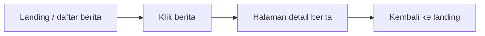

# 7A. Upload Gambar, Resize, dan Tampil di Landing serta Halaman Berita

Materi ini adalah lanjutan dari CRUD artikel berita dengan SQLite. Sekarang kita menambahkan fitur gambar agar berita terlihat lebih menarik.

Target akhirnya:

1. Di halaman landing, berita menampilkan gambar kecil.
2. Di halaman detail berita, gambar tampil lebih besar.
3. Jika berita tidak punya gambar, gambar tidak ditampilkan.
4. Saat berita diedit, gambar bisa diganti.
5. Saat berita dihapus, data berita ikut terhapus.

Alur tampilan yang ingin dibuat:

1. Landing menampilkan daftar berita.
2. Pengguna klik salah satu berita.
3. Masuk ke halaman berita penuh.
4. Dari halaman berita penuh, pengguna bisa kembali ke landing.



## Tujuan Belajar

Setelah materi ini, siswa diharapkan bisa:

1. Mengupload file gambar.
2. Menyimpan nama file gambar ke database.
3. Melakukan resize gambar.
4. Menampilkan gambar kecil dan gambar besar.
5. Menyembunyikan gambar jika tidak ada.

## Paket Tambahan

Selain paket sebelumnya, kita tambahkan:

1. `multer` untuk upload file.
2. `sharp` untuk resize gambar.

Instalasi:

```bash
npm install multer sharp
```

## Struktur Folder yang Disarankan

```text
node-web/
|-- server.js
|-- portal.db
|-- public/
|   |-- css/
|   |   `-- style.css
|   `-- uploads/
|       |-- thumb/
|       `-- large/
`-- views/
		|-- landing.handlebars
		|-- berita-detail.handlebars
		|-- berita-tambah.handlebars
		`-- berita-edit.handlebars
```

Penjelasan folder gambar:

1. `thumb` untuk gambar kecil di landing.
2. `large` untuk gambar besar di halaman detail.

## Tahap 1: Tambahkan Kolom Gambar di Tabel Berita

Kalau sebelumnya tabel `tb_berita` belum punya kolom gambar, tambahkan kolom `gambar`.

Kalau membuat tabel dari awal:

```js
function createTable() {
	const query = `
		CREATE TABLE IF NOT EXISTS tb_berita (
			id INTEGER PRIMARY KEY AUTOINCREMENT,
			judul TEXT NOT NULL,
			konten TEXT NOT NULL,
			penulis TEXT NOT NULL,
			kategori TEXT,
			status TEXT DEFAULT 'draft',
			gambar TEXT,
			created_at DATETIME DEFAULT CURRENT_TIMESTAMP,
			updated_at DATETIME DEFAULT CURRENT_TIMESTAMP
		)
	`;

	db.prepare(query).run();
}
```

Kalau tabel sudah terlanjur ada, jelaskan ke siswa bahwa kolom baru bisa ditambahkan dengan:

```sql
ALTER TABLE tb_berita ADD COLUMN gambar TEXT;
```

Untuk materi SMA, lebih mudah jika dari awal tabel langsung dibuat lengkap.

## Tahap 2: Siapkan Upload dengan `multer`

Tambahkan di `server.js`:

```js
const path = require('path');
const fs = require('fs');
const multer = require('multer');
const sharp = require('sharp');
```

Lalu siapkan folder upload jika belum ada:

```js
const thumbDir = path.join(__dirname, 'public', 'uploads', 'thumb');
const largeDir = path.join(__dirname, 'public', 'uploads', 'large');

fs.mkdirSync(thumbDir, { recursive: true });
fs.mkdirSync(largeDir, { recursive: true });
```

Lalu siapkan konfigurasi `multer`:

```js
const storage = multer.memoryStorage();

const upload = multer({
	storage,
	limits: { fileSize: 2 * 1024 * 1024 }
});
```

Kenapa `memoryStorage()`?

Karena kita ingin menerima file dulu, lalu langsung diproses oleh `sharp` menjadi dua ukuran gambar.

## Tahap 3: Resize Gambar Saat Simpan Berita Baru

Saat form tambah berita dikirim, kita upload satu gambar lalu buat dua versi:

1. Versi kecil untuk landing.
2. Versi besar untuk halaman detail.

Contoh route tambah berita:

```js
app.post('/berita/tambah', upload.single('gambar'), async (req, res) => {
	const { judul, konten, penulis, kategori, status } = req.body;
	let namaFile = null;

	if (req.file) {
		namaFile = `${Date.now()}-${req.file.originalname.replace(/\s+/g, '-')}`;

		await sharp(req.file.buffer)
			.resize(320, 200, { fit: 'cover' })
			.toFile(path.join(thumbDir, namaFile));

		await sharp(req.file.buffer)
			.resize(1200, 700, { fit: 'inside' })
			.toFile(path.join(largeDir, namaFile));
	}

	db.prepare(`
		INSERT INTO tb_berita (judul, konten, penulis, kategori, status, gambar)
		VALUES (?, ?, ?, ?, ?, ?)
	`).run(judul, konten, penulis, kategori, status, namaFile);

	res.redirect('/berita');
});
```

## Tahap 4: Tambahkan Input File di Form Tambah

Pada `berita-tambah.handlebars`, form harus memakai `enctype` untuk upload file.

```html
<form action="/berita/tambah" method="POST" enctype="multipart/form-data" class="berita-form">
	<input type="text" name="judul" placeholder="Judul berita" required />
	<input type="text" name="penulis" placeholder="Nama penulis" required />
	<input type="text" name="kategori" placeholder="Kategori" />

	<select name="status">
		<option value="draft">Draft</option>
		<option value="publish">Publish</option>
	</select>

	<input type="file" name="gambar" accept="image/*" />
	<textarea name="konten" rows="10" placeholder="Isi berita" required></textarea>

	<button type="submit">Simpan Berita</button>
</form>
```

## Tahap 5: Tampilkan Gambar Kecil di Landing

Di halaman landing, tampilkan berita dengan gambar kecil.

Contoh `landing.handlebars`:

```html
<section class="landing-news">
	<div class="container">
		<h2>Berita Terbaru</h2>

		<div class="news-grid">
			{{#each berita}}
				<article class="news-card">
					{{#if this.gambar}}
						
					{{/if}}

					<div class="news-body">
						<h3><a href="/berita/{{this.id}}">{{this.judul}}</a></h3>
						<p>{{this.kategori}}</p>
					</div>
				</article>
			{{/each}}
		</div>
	</div>
</section>
```

Bagian pentingnya ada di sini:

```handlebars
{{#if this.gambar}}
	
{{/if}}
```

Artinya:

1. Kalau ada gambar, tampilkan.
2. Kalau tidak ada gambar, jangan tampilkan apa-apa.

Ini menjawab kebutuhan: **hilangkan tampilan gambar jika tidak ada**.

## Tahap 6: Tampilkan Gambar Besar di Halaman Berita Penuh

Di halaman detail berita, gunakan gambar versi besar.

Contoh `berita-detail.handlebars`:

```html
<section class="berita-detail-page">
	<div class="container">
		<h1>{{berita.judul}}</h1>
		<p>Penulis: {{berita.penulis}}</p>
		<p>Kategori: {{berita.kategori}}</p>

		{{#if berita.gambar}}
			
		{{/if}}

		<article class="berita-konten">
			<p>{{berita.konten}}</p>
		</article>

		<p><a href="/">Kembali ke landing</a></p>
	</div>
</section>
```

Di sini alurnya menjadi:

1. Landing menampilkan daftar berita.
2. Klik judul berita.
3. Masuk ke halaman berita penuh.
4. Klik `Kembali ke landing`.

## Tahap 7: Edit Berita dan Ganti Gambar

Saat edit, gambar lama boleh dipertahankan. Kalau user upload gambar baru, gambar lama diganti.

Contoh route edit:

```js
app.post('/berita/edit/:id', upload.single('gambar'), async (req, res) => {
	const id = Number(req.params.id);
	const { judul, konten, penulis, kategori, status } = req.body;

	const beritaLama = db.prepare('SELECT * FROM tb_berita WHERE id = ?').get(id);
	let namaFile = beritaLama.gambar;

	if (req.file) {
		namaFile = `${Date.now()}-${req.file.originalname.replace(/\s+/g, '-')}`;

		await sharp(req.file.buffer)
			.resize(320, 200, { fit: 'cover' })
			.toFile(path.join(thumbDir, namaFile));

		await sharp(req.file.buffer)
			.resize(1200, 700, { fit: 'inside' })
			.toFile(path.join(largeDir, namaFile));
	}

	db.prepare(`
		UPDATE tb_berita
		SET judul = ?,
				konten = ?,
				penulis = ?,
				kategori = ?,
				status = ?,
				gambar = ?,
				updated_at = CURRENT_TIMESTAMP
		WHERE id = ?
	`).run(judul, konten, penulis, kategori, status, namaFile, id);

	res.redirect('/berita');
});
```

Contoh input file di form edit:

```html
<form action="/berita/edit/{{berita.id}}" method="POST" enctype="multipart/form-data" class="berita-form">
	<input type="text" name="judul" value="{{berita.judul}}" required />
	<input type="file" name="gambar" accept="image/*" />
	<textarea name="konten" rows="10" required>{{berita.konten}}</textarea>
	<button type="submit">Simpan Perubahan</button>
</form>
```

## Tahap 8: Delete Berita

Saat berita dihapus, data di database dihapus. Untuk materi dasar SMA, itu sudah cukup.

```js
app.post('/berita/hapus/:id', (req, res) => {
	const id = Number(req.params.id);
	db.prepare('DELETE FROM tb_berita WHERE id = ?').run(id);
	res.redirect('/berita');
});
```

Kalau ingin lebih rapi, file gambar juga bisa ikut dihapus. Tetapi untuk materi awal, lebih baik fokus dulu ke alur utama CRUD dan upload.

## Tahap 9: Route Landing dan Detail

Contoh route landing:

```js
app.get('/', (req, res) => {
	const berita = db
		.prepare("SELECT * FROM tb_berita WHERE status = 'publish' ORDER BY created_at DESC")
		.all();

	res.render('landing', {
		title: 'Landing Page',
		berita
	});
});
```

Contoh route detail berita:

```js
app.get('/berita/:id', (req, res) => {
	const id = Number(req.params.id);
	const berita = db.prepare('SELECT * FROM tb_berita WHERE id = ?').get(id);

	res.render('berita-detail', {
		title: berita.judul,
		berita
	});
});
```

## CSS Dasar

```css
.news-thumb {
	width: 100%;
	height: 180px;
	object-fit: cover;
	border-radius: 8px;
}

.berita-large {
	width: 100%;
	max-width: 900px;
	height: auto;
	display: block;
	margin: 20px 0;
	border-radius: 10px;
}
```

## Penjelasan Sangat Sederhana untuk Siswa

Kalau ingin dijelaskan singkat:

1. User upload gambar.
2. Server menerima gambar.
3. `sharp` membuat versi kecil dan besar.
4. Nama file disimpan ke database.
5. Landing memakai gambar kecil.
6. Halaman detail memakai gambar besar.
7. Kalau tidak ada gambar, jangan tampilkan gambar.

## Urutan Mengajar yang Disarankan

1. Tambahkan kolom `gambar` di tabel berita.
2. Tambahkan input file di form.
3. Simpan nama gambar ke database.
4. Resize gambar kecil dan besar.
5. Tampilkan gambar kecil di landing.
6. Tampilkan gambar besar di halaman detail.
7. Edit berita dan ganti gambar.
8. Hapus berita.

## Kesimpulan

Dengan tambahan upload gambar dan resize, halaman berita menjadi lebih menarik. Landing bisa menampilkan gambar kecil agar daftar berita rapi, sedangkan halaman detail bisa menampilkan gambar besar agar isi berita lebih jelas. Dengan `{{#if}}`, gambar juga bisa disembunyikan jika tidak ada, sehingga tampilan tetap bersih.


## Contoh Akhir `server.js`

Berikut contoh `server.js` sederhana yang menggabungkan:

1. SQLite
2. Upload gambar
3. Resize gambar kecil dan besar
4. Landing page
5. Detail berita
6. Tambah berita
7. Edit berita
8. Hapus berita

```js
const express = require('express');
const { engine } = require('express-handlebars');
const Database = require('better-sqlite3');
const path = require('path');
const fs = require('fs');
const multer = require('multer');
const sharp = require('sharp');

const app = express();
const PORT = 3000;
const db = new Database('portal.db');

app.engine('handlebars', engine());
app.set('view engine', 'handlebars');
app.set('views', './views');

app.use(express.urlencoded({ extended: true }));
app.use(express.static('public'));

const thumbDir = path.join(__dirname, 'public', 'uploads', 'thumb');
const largeDir = path.join(__dirname, 'public', 'uploads', 'large');

fs.mkdirSync(thumbDir, { recursive: true });
fs.mkdirSync(largeDir, { recursive: true });

const storage = multer.memoryStorage();

const upload = multer({
	storage,
	limits: { fileSize: 2 * 1024 * 1024 }
});

function createTable() {
	const query = `
		CREATE TABLE IF NOT EXISTS tb_berita (
			id INTEGER PRIMARY KEY AUTOINCREMENT,
			judul TEXT NOT NULL,
			konten TEXT NOT NULL,
			penulis TEXT NOT NULL,
			kategori TEXT,
			status TEXT DEFAULT 'draft',
			gambar TEXT,
			created_at DATETIME DEFAULT CURRENT_TIMESTAMP,
			updated_at DATETIME DEFAULT CURRENT_TIMESTAMP
		)
	`;

	db.prepare(query).run();
}

createTable();

app.get('/', (req, res) => {
	const berita = db
		.prepare("SELECT * FROM tb_berita WHERE status = 'publish' ORDER BY created_at DESC")
		.all();

	res.render('landing', {
		title: 'Landing Page',
		berita
	});
});

app.get('/berita', (req, res) => {
	const berita = db
		.prepare('SELECT * FROM tb_berita ORDER BY created_at DESC')
		.all();

	res.render('berita', {
		title: 'Daftar Berita',
		berita
	});
});

app.get('/berita/tambah', (req, res) => {
	res.render('berita-tambah', {
		title: 'Tambah Berita'
	});
});

app.post('/berita/tambah', upload.single('gambar'), async (req, res) => {
	const { judul, konten, penulis, kategori, status } = req.body;
	let namaFile = null;

	if (req.file) {
		namaFile = `${Date.now()}-${req.file.originalname.replace(/\s+/g, '-')}`;

		await sharp(req.file.buffer)
			.resize(320, 200, { fit: 'cover' })
			.toFile(path.join(thumbDir, namaFile));

		await sharp(req.file.buffer)
			.resize(1200, 700, { fit: 'inside' })
			.toFile(path.join(largeDir, namaFile));
	}

	db.prepare(`
		INSERT INTO tb_berita (judul, konten, penulis, kategori, status, gambar)
		VALUES (?, ?, ?, ?, ?, ?)
	`).run(judul, konten, penulis, kategori, status, namaFile);

	res.redirect('/berita');
});

app.get('/berita/edit/:id', (req, res) => {
	const id = Number(req.params.id);
	const berita = db.prepare('SELECT * FROM tb_berita WHERE id = ?').get(id);

	res.render('berita-edit', {
		title: 'Edit Berita',
		berita
	});
});

app.post('/berita/edit/:id', upload.single('gambar'), async (req, res) => {
	const id = Number(req.params.id);
	const { judul, konten, penulis, kategori, status } = req.body;

	const beritaLama = db.prepare('SELECT * FROM tb_berita WHERE id = ?').get(id);
	let namaFile = beritaLama.gambar;

	if (req.file) {
		namaFile = `${Date.now()}-${req.file.originalname.replace(/\s+/g, '-')}`;

		await sharp(req.file.buffer)
			.resize(320, 200, { fit: 'cover' })
			.toFile(path.join(thumbDir, namaFile));

		await sharp(req.file.buffer)
			.resize(1200, 700, { fit: 'inside' })
			.toFile(path.join(largeDir, namaFile));
	}

	db.prepare(`
		UPDATE tb_berita
		SET judul = ?,
				konten = ?,
				penulis = ?,
				kategori = ?,
				status = ?,
				gambar = ?,
				updated_at = CURRENT_TIMESTAMP
		WHERE id = ?
	`).run(judul, konten, penulis, kategori, status, namaFile, id);

	res.redirect('/berita');
});

app.post('/berita/hapus/:id', (req, res) => {
	const id = Number(req.params.id);
	db.prepare('DELETE FROM tb_berita WHERE id = ?').run(id);
	res.redirect('/berita');
});

app.get('/berita/:id', (req, res) => {
	const id = Number(req.params.id);
	const berita = db.prepare('SELECT * FROM tb_berita WHERE id = ?').get(id);

	res.render('berita-detail', {
		title: berita.judul,
		berita
	});
});

app.listen(PORT, () => {
	console.log(`Server berjalan di http://localhost:${PORT}`);
});
```

## Penjelasan Urutan `server.js`

Supaya siswa tidak bingung, jelaskan urutannya seperti ini:

1. Import semua package.
2. Buat aplikasi Express.
3. Hubungkan ke database SQLite.
4. Siapkan folder upload.
5. Siapkan `multer`.
6. Buat tabel jika belum ada.
7. Tulis semua route.
8. Jalankan server.

Kalimat paling singkat untuk siswa:

1. Server siap.
2. Database siap.
3. Gambar siap diupload.
4. Berita bisa ditambah, diedit, ditampilkan, dan dihapus.
