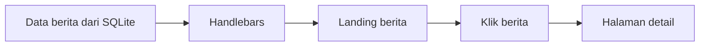

# 7B. CSS untuk Halaman Dinamis Berita

Materi ini adalah lanjutan dari:

1. Layout landing page di [02-layout.md](e:/REACT/node-web/02-layout.md)
2. Klik berita ke halaman detail di [03-layout-berita.md](e:/REACT/node-web/03-layout-berita.md)
3. Data berita dinamis dan upload gambar di materi sebelumnya

Fokus materi ini adalah **CSS**, supaya halaman dinamis yang dibuat dengan Handlebars terlihat rapi, modern, dan mirip pola website berita kampus seperti LPPM UNDIP.

## Tujuan Belajar

Setelah materi ini, siswa diharapkan bisa:

1. Membuat tampilan landing berita lebih rapi.
2. Membuat kartu berita dinamis yang konsisten.
3. Membuat halaman detail berita yang enak dibaca.
4. Menghubungkan CSS dengan data dinamis dari Handlebars.

## Penjelasan Paling Sederhana

Supaya mudah dipahami anak SMA, gunakan gambaran ini:

1. Data berita berasal dari database.
2. Handlebars menampilkan data itu menjadi HTML.
3. CSS membuat HTML tadi menjadi rapi dan enak dilihat.

Kalau diibaratkan:

1. Database adalah isi berita.
2. Handlebars adalah orang yang menyusun isi berita ke halaman.
3. CSS adalah yang mengatur warna, ukuran, jarak, dan bentuk tampilannya.

Jadi, CSS tidak membuat data baru.

CSS hanya mengatur **bagaimana data terlihat di layar**.

## Gambaran Halaman Dinamis

Halaman dinamis yang dimaksud di sini adalah:

1. Landing page menampilkan banyak berita dari database.
2. Setiap berita punya judul, kategori, tanggal, dan gambar.
3. Saat berita diklik, pengguna masuk ke halaman detail.



## Arah Tampilan

Supaya mirip pola situs berita kampus:

1. Landing memakai section berita berbentuk kartu.
2. Kartu berita punya gambar, judul, meta data, dan ringkasan.
3. Halaman detail punya judul besar, info penulis, gambar besar, lalu isi berita.
4. Warna dominan tetap biru dan netral, seperti gaya lembaga kampus.

Penjelasan untuk siswa:

- Landing adalah halaman awal yang menampilkan daftar berita.
- Detail adalah halaman saat satu berita dibuka penuh.
- Jadi CSS harus mengatur dua tampilan: tampilan daftar dan tampilan isi berita.

## Struktur HTML yang Dipakai

Sebelum masuk ke CSS, siswa perlu paham dulu bahwa CSS bekerja pada class di HTML.

Contoh:

```html
<div class="news-grid"></div>
```

Artinya, nanti CSS dengan nama `.news-grid` akan mengatur bagian itu.

Contoh lain:

```html

```

Artinya, CSS `.news-thumb` akan mengatur ukuran dan bentuk gambar.

Jadi hubungan sederhananya seperti ini:

1. HTML memberi nama bagian dengan `class`.
2. CSS mencari nama class itu.
3. Lalu CSS mengatur tampilannya.

Contoh landing dinamis:

```html
<section class="news-section" id="berita">
	<div class="container">
		<div class="section-heading">
			<p class="section-label">Informasi Terbaru</p>
			<h2>Berita Terkini</h2>
			<p class="section-desc">Kumpulan berita, pengumuman, dan kegiatan terbaru lembaga.</p>
		</div>

		<div class="news-grid">
			{{#each berita}}
				<article class="news-card">
					{{#if this.gambar}}
						<a href="/berita/{{this.id}}" class="news-image-link">
							
						</a>
					{{/if}}

					<div class="news-body">
						<p class="news-meta">{{this.kategori}} | {{this.created_at}}</p>
						<h3>
							<a href="/berita/{{this.id}}" class="news-link">{{this.judul}}</a>
						</h3>
						<p class="news-summary">{{this.ringkasan}}</p>
						<a href="/berita/{{this.id}}" class="news-readmore">Baca selengkapnya</a>
					</div>
				</article>
			{{/each}}
		</div>
	</div>
</section>
```

Contoh halaman detail:

```html
<section class="detail-page">
	<div class="container detail-container">
		<p class="detail-breadcrumb"><a href="/">Beranda</a> / Berita</p>
		<h1 class="detail-title">{{berita.judul}}</h1>
		<p class="detail-meta">{{berita.kategori}} | {{berita.penulis}} | {{berita.created_at}}</p>

		{{#if berita.gambar}}
			
		{{/if}}

		<article class="detail-content">
			<p>{{berita.konten}}</p>
		</article>

		<p><a href="/" class="btn-back">Kembali ke Beranda</a></p>
	</div>
</section>
```

## CSS Utama untuk Halaman Dinamis

Masukkan ke `public/css/style.css`:

```css
:root {
	--primary: #0b3d91;
	--primary-dark: #072a63;
	--accent: #f0b429;
	--bg-soft: #f4f7fb;
	--text-main: #1f2937;
	--text-muted: #6b7280;
	--card-bg: #ffffff;
	--line: #d9e2ec;
}

* {
	box-sizing: border-box;
}

body {
	margin: 0;
	font-family: 'Segoe UI', Tahoma, Geneva, Verdana, sans-serif;
	color: var(--text-main);
	background: #ffffff;
	line-height: 1.6;
}

.container {
	width: min(1100px, 92%);
	margin: 0 auto;
}

.news-section {
	padding: 72px 0;
	background: linear-gradient(180deg, #ffffff 0%, var(--bg-soft) 100%);
}

.section-heading {
	max-width: 700px;
	margin-bottom: 32px;
}

.section-label {
	margin: 0 0 8px;
	color: var(--primary);
	font-weight: 700;
	text-transform: uppercase;
	letter-spacing: 0.08em;
	font-size: 13px;
}

.section-heading h2 {
	margin: 0 0 12px;
	font-size: 38px;
	line-height: 1.2;
}

.section-desc {
	margin: 0;
	color: var(--text-muted);
	font-size: 16px;
}

.news-grid {
	display: grid;
	grid-template-columns: repeat(3, 1fr);
	gap: 24px;
}

.news-card {
	display: flex;
	flex-direction: column;
	background: var(--card-bg);
	border: 1px solid var(--line);
	border-radius: 16px;
	overflow: hidden;
	box-shadow: 0 12px 30px rgba(15, 23, 42, 0.08);
	transition: transform 0.2s ease, box-shadow 0.2s ease;
}

.news-card:hover {
	transform: translateY(-4px);
	box-shadow: 0 18px 36px rgba(15, 23, 42, 0.12);
}

.news-image-link {
	display: block;
}

.news-thumb {
	width: 100%;
	height: 220px;
	object-fit: cover;
	display: block;
}

.news-body {
	padding: 20px;
}

.news-meta {
	margin: 0 0 10px;
	color: var(--text-muted);
	font-size: 13px;
}

.news-link {
	color: var(--primary-dark);
	text-decoration: none;
}

.news-link:hover {
	text-decoration: underline;
}

.news-body h3 {
	margin: 0 0 10px;
	font-size: 22px;
	line-height: 1.35;
}

.news-summary {
	margin: 0 0 14px;
	color: var(--text-muted);
	font-size: 15px;
}

.news-readmore {
	display: inline-block;
	color: var(--primary);
	font-weight: 700;
	text-decoration: none;
}

.news-readmore:hover {
	text-decoration: underline;
}

.detail-page {
	padding: 56px 0 80px;
	background: #ffffff;
}

.detail-container {
	max-width: 860px;
}

.detail-breadcrumb {
	margin: 0 0 16px;
	color: var(--text-muted);
	font-size: 14px;
}

.detail-breadcrumb a {
	color: var(--primary);
	text-decoration: none;
}

.detail-title {
	margin: 0 0 12px;
	font-size: 44px;
	line-height: 1.2;
	color: var(--primary-dark);
}

.detail-meta {
	margin: 0 0 24px;
	color: var(--text-muted);
	font-size: 15px;
}

.detail-image {
	width: 100%;
	max-height: 520px;
	object-fit: cover;
	border-radius: 18px;
	margin-bottom: 28px;
	display: block;
}

.detail-content {
	font-size: 18px;
	color: #334155;
}

.detail-content p {
	margin: 0 0 18px;
}

.btn-back {
	display: inline-block;
	margin-top: 20px;
	background: var(--primary);
	color: #ffffff;
	text-decoration: none;
	padding: 12px 18px;
	border-radius: 10px;
	font-weight: 700;
}

.btn-back:hover {
	background: var(--primary-dark);
}

@media (max-width: 900px) {
	.news-grid {
		grid-template-columns: 1fr 1fr;
	}

	.section-heading h2 {
		font-size: 32px;
	}

	.detail-title {
		font-size: 34px;
	}
}

@media (max-width: 640px) {
	.news-grid {
		grid-template-columns: 1fr;
	}

	.news-thumb {
		height: 200px;
	}

	.section-heading h2 {
		font-size: 28px;
	}

	.detail-title {
		font-size: 28px;
	}

	.detail-content {
		font-size: 16px;
	}
}
```

## Cara Membaca CSS dengan Mudah

Supaya siswa tidak takut melihat CSS yang panjang, jelaskan bahwa CSS bisa dibaca sedikit demi sedikit.

Contoh cara membacanya:

`body { ... }`

Artinya: aturan ini berlaku untuk seluruh halaman.

`.news-grid { ... }`

Artinya: aturan ini berlaku untuk wadah kumpulan kartu berita.

`.news-card { ... }`

Artinya: aturan ini berlaku untuk satu kartu berita.

`.detail-title { ... }`

Artinya: aturan ini berlaku untuk judul besar di halaman detail.

Jadi siswa tidak perlu membaca semua CSS sekaligus. Cukup baca bagian per bagian.

## Penjelasan Bagian CSS Satu per Satu

### 1. `:root`

Bagian ini menyimpan warna utama.

```css
:root {
	--primary: #0b3d91;
	--primary-dark: #072a63;
}
```

Penjelasan sederhana:

1. Warna disimpan di satu tempat.
2. Kalau warna ingin diganti, cukup ganti di sini.
3. Ini membuat CSS lebih rapi.

### 2. `.container`

Bagian ini mengatur lebar isi halaman.

```css
.container {
	width: min(1100px, 92%);
	margin: 0 auto;
}
```

Artinya:

1. Isi halaman tidak terlalu lebar.
2. Konten berada di tengah.

### 3. `.news-grid`

Bagian ini mengatur susunan kartu berita.

```css
.news-grid {
	display: grid;
	grid-template-columns: repeat(3, 1fr);
	gap: 24px;
}
```

Artinya:

1. Berita disusun dalam bentuk kotak-kotak.
2. Dalam layar besar, tampil 3 kolom.
3. Jarak antar kartu dibuat rapi.

### 4. `.news-card`

Bagian ini mengatur tampilan satu kartu berita.

```css
.news-card {
	background: white;
	border-radius: 16px;
}
```

Artinya:

1. Kartu punya latar putih.
2. Sudut kartu dibuat agak melengkung.
3. Kartu terlihat lebih modern.

### 5. `.news-thumb`

Bagian ini mengatur gambar kecil di landing.

```css
.news-thumb {
	width: 100%;
	height: 220px;
	object-fit: cover;
}
```

Artinya:

1. Gambar memenuhi lebar kartu.
2. Tinggi gambar dibuat sama.
3. `object-fit: cover` membuat gambar tetap rapi walaupun ukurannya berbeda.

### 6. `.detail-title`

Bagian ini mengatur judul besar di halaman detail.

```css
.detail-title {
	font-size: 44px;
}
```

Artinya:

1. Judul berita dibuat besar.
2. Pengunjung langsung tahu fokus utama halaman.

### 7. `.detail-image`

Bagian ini mengatur gambar besar di halaman detail.

```css
.detail-image {
	width: 100%;
	max-height: 520px;
}
```

Artinya:

1. Gambar tampil lebar.
2. Gambar tidak terlalu tinggi.
3. Halaman tetap nyaman dibaca.

### 8. `@media`

Bagian ini mengatur tampilan di layar kecil.

```css
@media (max-width: 640px) {
	.news-grid {
		grid-template-columns: 1fr;
	}
}
```

Artinya:

1. Kalau dibuka di HP, kartu berita tidak lagi 3 kolom.
2. Kartu akan turun menjadi 1 kolom.
3. Halaman jadi lebih nyaman di layar kecil.

## Hubungan dengan Handlebars

CSS ini cocok dipakai untuk halaman dinamis karena class yang dipakai tidak tergantung jumlah data.

Artinya:

1. Kalau berita ada 3, layout tetap rapi.
2. Kalau berita ada 10, layout tetap rapi.
3. Kalau salah satu berita tidak punya gambar, kartu tetap tampil karena gambar dibungkus `{{#if}}`.

Penjelasan sederhana untuk siswa:

1. Handlebars membuat jumlah kartu sesuai data.
2. CSS tidak peduli jumlah datanya.
3. CSS hanya mengatur bentuk semua kartu agar seragam.

## Jika Tidak Ada Gambar

Bagian ini penting agar tidak muncul kotak gambar kosong.

Contoh di Handlebars:

```handlebars
{{#if this.gambar}}
	
{{/if}}
```

Untuk halaman detail:

```handlebars
{{#if berita.gambar}}
	
{{/if}}
```

Kalau data gambar kosong, elemen `img` tidak dibuat.

Penjelasan singkat:

1. Kalau ada gambar, tampilkan gambar.
2. Kalau tidak ada gambar, lewat saja.
3. Jadi halaman tetap bersih dan tidak aneh.

## Supaya Mirip Pola Situs Berita Kampus

Beberapa ciri visual yang bisa dijelaskan ke siswa:

1. Judul section besar dan jelas.
2. Warna utama biru agar terasa formal.
3. Kartu berita memakai bayangan halus.
4. Jarak antar elemen dibuat longgar supaya enak dibaca.
5. Halaman detail dibuat lebih sempit agar teks tidak terlalu lebar.

## Urutan Mengajar yang Disarankan

1. Buat dulu HTML Handlebars untuk landing dan detail.
2. Tambahkan class CSS yang konsisten.
3. Pasang CSS untuk grid berita.
4. Pasang CSS untuk halaman detail.
5. Uji dengan data yang punya gambar dan tidak punya gambar.
6. Uji di layar kecil.

Tambahan cara menjelaskan di kelas:

1. Tunjukkan dulu HTML tanpa CSS.
2. Setelah itu pasang CSS sedikit demi sedikit.
3. Biarkan siswa melihat perubahan langsung di browser.
4. Jelaskan bahwa CSS bekerja seperti “baju” untuk HTML.

## Ringkasan Sangat Sederhana

Kalimat singkat untuk siswa:

1. Handlebars menampilkan data.
2. CSS membuat tampilannya rapi.
3. Landing memakai kartu berita.
4. Halaman detail memakai gambar besar dan teks nyaman dibaca.
5. Kalau gambar tidak ada, jangan ditampilkan.

Kalimat super singkat untuk siswa:

"HTML menampilkan isi, CSS membuat isi itu terlihat bagus."

## Kesimpulan

Halaman dinamis tidak cukup hanya menampilkan data. Supaya terlihat seperti website berita kampus, data juga harus dibungkus dengan CSS yang rapi dan konsisten. Dengan pola kartu di landing dan pola artikel di halaman detail, tampilan berita akan terasa lebih profesional dan lebih dekat dengan gaya website lembaga seperti LPPM UNDIP.
