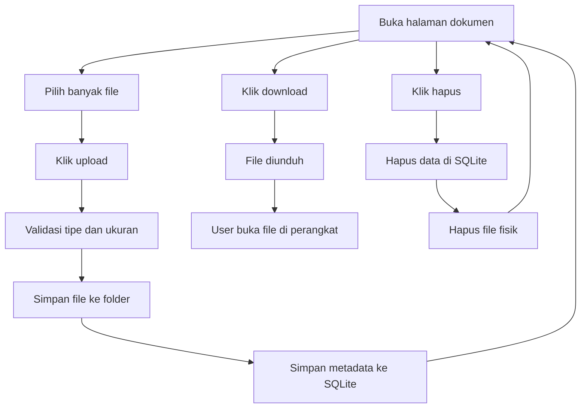

# 7B. Latihan Upload Multiple File Dokumen (PDF, DOCX, PPTX)

Materi ini adalah lanjutan pola belajar dari pelajaran 6 (SQLite Todo), tetapi fokus pada file dokumen.

Target latihan:

1. Upload banyak file sekaligus (multiple upload).
2. Jenis file dibatasi ke PDF, DOCX, PPTX.
3. Data file disimpan di SQLite.
4. File fisik disimpan di folder server.
5. User membuka file dengan cara paling sederhana: download lalu buka di perangkat user.
6. File bisa dihapus dari database dan folder.

## Jawaban Pertanyaan Utama

Untuk versi paling sederhana dan aman:

1. Ya, lebih baik file didownload dulu.
2. Setelah download, user buka sendiri dengan aplikasi/browser di perangkatnya.

Kenapa ini paling sederhana?

1. PDF, DOCX, PPTX punya perilaku buka yang berbeda di tiap browser.
2. DOCX/PPTX sering tidak tampil rapi jika dipaksa preview langsung di browser.
3. Download memberi hasil paling konsisten untuk semua user.

## Tujuan Belajar

Setelah materi ini, siswa diharapkan bisa:

1. Memahami upload multiple file di Express.
2. Memahami validasi tipe file dan batas ukuran file.
3. Menyimpan metadata file ke SQLite.
4. Menamai file agar tidak duplikasi.
5. Membuat tombol download file.
6. Menghapus file fisik dan data database secara bersamaan.

## Konsep Sederhana

Dalam fitur upload dokumen, ada 2 hal yang disimpan:

1. File fisik disimpan di folder server.
2. Data file disimpan di tabel SQLite.

Contoh data file di SQLite:

1. nama asli file
2. nama file hasil rename server
3. tipe mime
4. ukuran
5. waktu upload

## Alur Fitur



## Paket yang Digunakan

1. express
2. express-handlebars
3. better-sqlite3
4. multer

Instalasi:

```bash
npm install express express-handlebars better-sqlite3 multer
```

## Struktur Folder

```text
node-web/
|-- server.js
|-- file.db
|-- storage/
|   `-- docs/
|-- public/
|   `-- css/
|       `-- style.css
`-- views/
		|-- file-list.handlebars
		`-- layouts/
				`-- main.handlebars
```

## File Disimpan di Mana?

Pada materi ini, file disimpan di:

1. storage/docs

Kenapa tidak langsung di public?

1. Lebih aman, karena file tidak bisa diakses langsung via URL bebas.
2. Akses file hanya lewat route download yang kita kontrol.

## Cara Menamai File Agar Tidak Duplikasi

Nama asli user bisa sama, misalnya:

1. tugas.pdf
2. tugas.pdf

Jika disimpan apa adanya, file lama bisa tertimpa.

Solusi:

1. Simpan nama baru: timestamp + random + ekstensi.
2. Simpan nama asli di database untuk ditampilkan ke user.

Contoh:

1. 1720085000111-a9c1f4be.pdf
2. 1720085000189-0ff31a2c.docx

## Tahap 1: Setup Server, Database, dan Folder Dokumen

```js
const express = require('express');
const { engine } = require('express-handlebars');
const Database = require('better-sqlite3');
const multer = require('multer');
const path = require('path');
const fs = require('fs');
const crypto = require('crypto');

const app = express();
const PORT = 3000;
const db = new Database('file.db');

app.engine('handlebars', engine({ defaultLayout: 'main' }));
app.set('view engine', 'handlebars');
app.set('views', './views');

app.use(express.urlencoded({ extended: true }));
app.use(express.static('public'));

const docsDir = path.join(__dirname, 'storage', 'docs');
fs.mkdirSync(docsDir, { recursive: true });

function createTable() {
	const query = `
		CREATE TABLE IF NOT EXISTS tb_file (
			id INTEGER PRIMARY KEY AUTOINCREMENT,
			nama_asli TEXT NOT NULL,
			nama_simpan TEXT NOT NULL UNIQUE,
			mime_type TEXT NOT NULL,
			ukuran INTEGER NOT NULL,
			created_at DATETIME DEFAULT CURRENT_TIMESTAMP
		)
	`;

	db.prepare(query).run();
}

createTable();
```

## Tahap 2: Konfigurasi Multer untuk Multiple Upload

```js
const allowedMime = new Set([
	'application/pdf',
	'application/vnd.openxmlformats-officedocument.wordprocessingml.document',
	'application/vnd.openxmlformats-officedocument.presentationml.presentation'
]);

function buatNamaFileUnik(originalName) {
	const ext = path.extname(originalName).toLowerCase();
	const timestamp = Date.now();
	const random = crypto.randomBytes(4).toString('hex');
	return `${timestamp}-${random}${ext}`;
}

const storage = multer.diskStorage({
	destination: (req, file, cb) => {
		cb(null, docsDir);
	},
	filename: (req, file, cb) => {
		cb(null, buatNamaFileUnik(file.originalname));
	}
});

const uploadDocs = multer({
	storage,
	limits: { fileSize: 5 * 1024 * 1024 },
	fileFilter: (req, file, cb) => {
		if (!allowedMime.has(file.mimetype)) {
			return cb(new Error('Hanya file PDF, DOCX, PPTX yang diizinkan'));
		}

		cb(null, true);
	}
});
```

Keterangan:

1. Maksimal 5MB per file.
2. Tipe file dibatasi ke PDF, DOCX, PPTX.
3. Nama file disimpan pakai nama unik.

## Tahap 3: READ - Tampilkan Daftar File

```js
app.get('/files', (req, res) => {
	const files = db
		.prepare('SELECT * FROM tb_file ORDER BY id DESC')
		.all();

	res.render('file-list', {
		title: 'Daftar Dokumen',
		files
	});
});
```

## Tahap 4: CREATE - Upload Banyak File Sekaligus

```js
app.post('/files/upload', uploadDocs.array('dokumen', 10), (req, res) => {
	try {
		if (!req.files || req.files.length === 0) {
			return res.status(400).send('Minimal pilih 1 file dokumen');
		}

		const insert = db.prepare(`
			INSERT INTO tb_file (nama_asli, nama_simpan, mime_type, ukuran)
			VALUES (?, ?, ?, ?)
		`);

		const tx = db.transaction((rows) => {
			for (const row of rows) {
				insert.run(row.originalname, row.filename, row.mimetype, row.size);
			}
		});

		tx(req.files);
		res.redirect('/files');
	} catch (error) {
		res.status(500).send(`Upload gagal: ${error.message}`);
	}
});
```

Keterangan:

1. field input harus bernama dokumen.
2. .array('dokumen', 10) artinya bisa upload sampai 10 file per request.

## Tahap 5: OPENING Paling Sederhana - Download Dulu

Ini implementasi yang direkomendasikan untuk materi dasar.

```js
app.get('/files/download/:id', (req, res) => {
	const id = Number(req.params.id);
	const item = db.prepare('SELECT * FROM tb_file WHERE id = ?').get(id);

	if (!item) {
		return res.status(404).send('File tidak ditemukan');
	}

	const fullPath = path.join(docsDir, item.nama_simpan);

	if (!fs.existsSync(fullPath)) {
		return res.status(404).send('File fisik tidak ditemukan');
	}

	res.download(fullPath, item.nama_asli);
});
```

Hasilnya:

1. Browser mengunduh file.
2. User membuka file di perangkatnya.

Ini paling cocok untuk kombinasi PDF, DOCX, PPTX sekaligus.

## Opsional: Preview Langsung PDF Saja

Kalau ingin tambahan ringan, PDF bisa dibuka inline di browser.

```js
app.get('/files/open/:id', (req, res) => {
	const id = Number(req.params.id);
	const item = db.prepare('SELECT * FROM tb_file WHERE id = ?').get(id);

	if (!item) return res.status(404).send('File tidak ditemukan');
	if (item.mime_type !== 'application/pdf') {
		return res.status(400).send('Preview langsung hanya untuk PDF');
	}

	const fullPath = path.join(docsDir, item.nama_simpan);
	if (!fs.existsSync(fullPath)) return res.status(404).send('File fisik tidak ditemukan');

	res.setHeader('Content-Type', 'application/pdf');
	res.setHeader('Content-Disposition', 'inline');
	res.sendFile(fullPath);
});
```

Untuk DOCX/PPTX tetap gunakan download.

## Tahap 6: DELETE - Hapus Database dan File Fisik

```js
app.post('/files/hapus/:id', (req, res) => {
	const id = Number(req.params.id);
	const item = db.prepare('SELECT * FROM tb_file WHERE id = ?').get(id);

	if (!item) {
		return res.status(404).send('Data file tidak ditemukan');
	}

	db.prepare('DELETE FROM tb_file WHERE id = ?').run(id);

	const fullPath = path.join(docsDir, item.nama_simpan);
	if (fs.existsSync(fullPath)) {
		fs.unlinkSync(fullPath);
	}

	res.redirect('/files');
});
```

## Kunci Jawaban View

## views/layouts/main.handlebars

```html
<!DOCTYPE html>
<html lang="id">
<head>
	<meta charset="UTF-8" />
	<meta name="viewport" content="width=device-width, initial-scale=1.0" />
	<title>{{title}}</title>
	<link rel="stylesheet" href="/css/style.css" />
</head>
<body>
	{{{body}}}
</body>
</html>
```

## views/file-list.handlebars

```html
<section class="file-page">
	<div class="container">
		<h1>Upload Multiple Dokumen</h1>

		<form action="/files/upload" method="POST" enctype="multipart/form-data" class="upload-form">
			<input type="file" name="dokumen" accept=".pdf,.docx,.pptx" multiple required />
			<button type="submit">Upload</button>
		</form>

		<div class="file-list">
			{{#each files}}
				<div class="file-item">
					<h3>{{this.nama_asli}}</h3>
					<p>Tipe: {{this.mime_type}}</p>
					<p>Ukuran: {{this.ukuran}} byte</p>

					<a href="/files/download/{{this.id}}">Download</a>

					{{#if (eq this.mime_type 'application/pdf')}}
						<a href="/files/open/{{this.id}}" target="_blank" rel="noreferrer">Buka PDF</a>
					{{/if}}

					<form action="/files/hapus/{{this.id}}" method="POST" style="display:inline;">
						<button type="submit">Hapus</button>
					</form>
				</div>
			{{/each}}
		</div>
	</div>
</section>
```

Catatan:

1. Jika belum memakai helper eq di Handlebars, link Buka PDF bisa dihapus dulu.
2. Fokus utama materi ini tetap upload-download-delete.

## CSS Sederhana

```css
.file-page {
	padding: 40px 0;
	background: #f8fafc;
	min-height: 100vh;
}

.container {
	width: min(900px, 92%);
	margin: 0 auto;
}

.upload-form {
	display: flex;
	gap: 12px;
	flex-wrap: wrap;
	margin-bottom: 24px;
}

.upload-form input,
.upload-form button {
	padding: 10px 12px;
	border: 1px solid #cbd5e1;
	border-radius: 8px;
}

.file-list {
	display: grid;
	gap: 12px;
}

.file-item {
	background: #fff;
	border: 1px solid #dbe3ee;
	border-radius: 10px;
	padding: 14px;
	box-shadow: 0 8px 20px rgba(15, 23, 42, 0.06);
}

.file-item h3 {
	margin: 0 0 6px;
}

.file-item a,
.file-item button {
	margin-right: 10px;
}
```

## Hal Penting untuk Siswa

1. Untuk PDF, DOCX, PPTX paling aman pakai download dulu.
2. Nama file di server harus unik agar tidak bentrok.
3. Simpan nama asli file supaya user tetap melihat nama yang familiar.
4. Delete yang benar harus menghapus metadata di SQLite dan file di folder.

## Ringkasan Singkat

1. Multiple upload: uploadDocs.array('dokumen', 10).
2. Simpan file di storage/docs.
3. Simpan metadata file di tabel tb_file.
4. Opening paling sederhana: download lalu buka sendiri.
5. Delete: hapus database + hapus file fisik.

Kalau materi ini dipahami, siswa sudah siap membuat fitur lampiran dokumen di aplikasi berita, tugas sekolah, atau CMS sederhana.
