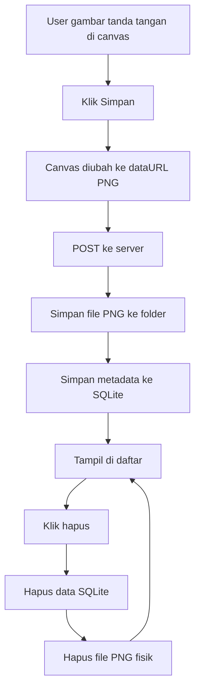

# 7C. Menyimpan Hasil Tanda Tangan dari Canvas ke Server

Pertanyaan inti: "kalau tanda tangan dibuat di canvas, cara menyimpannya bagaimana?"

Jawaban paling sederhana:

1. Gambar tanda tangan di canvas.
2. Ubah canvas jadi data PNG (base64).
3. Kirim ke server (POST).
4. Server simpan sebagai file .png.
5. Nama file dicatat ke SQLite.

Materi ini melanjutkan pola dari pelajaran 6 (SQLite) dan 7A/7B (upload file).

## Tujuan Belajar

Setelah materi ini, siswa diharapkan bisa:

1. Membuat area tanda tangan dengan canvas.
2. Mengirim hasil canvas ke server.
3. Menyimpan hasil tanda tangan sebagai file PNG.
4. Menyimpan metadata file tanda tangan di SQLite.
5. Menampilkan daftar tanda tangan yang sudah tersimpan.
6. Menghapus data database dan file fisik secara bersamaan.

## Konsep Sederhana

Canvas itu hanya gambar di layar browser. Supaya permanen, hasilnya harus disimpan ke server.

Alur simpelnya:

1. Canvas -> PNG base64.
2. Base64 -> dikirim ke Express.
3. Express decode base64 -> buffer.
4. Buffer ditulis ke file .png.
5. Nama file masuk ke SQLite.

## Alur Fitur



## Paket yang Digunakan

1. express
2. express-handlebars
3. better-sqlite3

Instalasi:

```bash
npm install express express-handlebars better-sqlite3
```

## Struktur Folder

```text
node-web/
|-- server.js
|-- sign.db
|-- storage/
|   `-- signatures/
|-- public/
|   `-- css/
|       `-- style.css
`-- views/
		|-- ttd.handlebars
		`-- layouts/
				`-- main.handlebars
```

## File Disimpan di Mana?

Hasil tanda tangan disimpan di:

1. storage/signatures

Catatan:

1. Ini folder file fisik PNG.
2. SQLite hanya menyimpan data tentang file (nama file, judul, waktu).

## Cara Menamai File Biar Tidak Duplikasi

Gunakan pola:

1. timestamp + random + .png

Contoh:

1. 1720090002001-9c1ad2ef.png
2. 1720090002110-3b8ff011.png

Dengan pola ini, kemungkinan nama tabrakan sangat kecil.

## Tahap 1: Setup Server, SQLite, dan Folder Signature

```js
const express = require('express');
const { engine } = require('express-handlebars');
const Database = require('better-sqlite3');
const path = require('path');
const fs = require('fs');
const crypto = require('crypto');

const app = express();
const PORT = 3000;
const db = new Database('sign.db');

app.engine('handlebars', engine({ defaultLayout: 'main' }));
app.set('view engine', 'handlebars');
app.set('views', './views');

app.use(express.urlencoded({ extended: true, limit: '10mb' }));
app.use(express.json({ limit: '10mb' }));
app.use(express.static('public'));

const signDir = path.join(__dirname, 'storage', 'signatures');
fs.mkdirSync(signDir, { recursive: true });

function createTable() {
	const query = `
		CREATE TABLE IF NOT EXISTS tb_ttd (
			id INTEGER PRIMARY KEY AUTOINCREMENT,
			nama TEXT NOT NULL,
			nama_file TEXT NOT NULL UNIQUE,
			created_at DATETIME DEFAULT CURRENT_TIMESTAMP
		)
	`;

	db.prepare(query).run();
}

createTable();

function buatNamaFileTtd() {
	const timestamp = Date.now();
	const random = crypto.randomBytes(4).toString('hex');
	return `${timestamp}-${random}.png`;
}
```

## Tahap 2: Route Halaman dan List Data

```js
app.get('/ttd', (req, res) => {
	const items = db
		.prepare('SELECT * FROM tb_ttd ORDER BY id DESC')
		.all();

	res.render('ttd', {
		title: 'Canvas Tanda Tangan',
		items
	});
});
```

## Tahap 3: Simpan Canvas ke File PNG

Kita kirim dataURL dari browser, format umumnya seperti ini:

1. data:image/png;base64,iVBORw0KGgoAAA...

Di server, bagian base64-nya diambil lalu disimpan ke file.

```js
app.post('/ttd/simpan', (req, res) => {
	try {
		const nama = (req.body.nama || '').trim();
		const signatureData = req.body.signatureData || '';

		if (!nama) {
			return res.status(400).send('Nama wajib diisi');
		}

		if (!signatureData.startsWith('data:image/png;base64,')) {
			return res.status(400).send('Format data tanda tangan tidak valid');
		}

		const base64Data = signatureData.replace('data:image/png;base64,', '');
		const buffer = Buffer.from(base64Data, 'base64');

		if (buffer.length < 100) {
			return res.status(400).send('Tanda tangan kosong atau terlalu kecil');
		}

		const namaFile = buatNamaFileTtd();
		const filePath = path.join(signDir, namaFile);

		fs.writeFileSync(filePath, buffer);

		db.prepare('INSERT INTO tb_ttd (nama, nama_file) VALUES (?, ?)')
			.run(nama, namaFile);

		res.redirect('/ttd');
	} catch (error) {
		res.status(500).send(`Gagal menyimpan tanda tangan: ${error.message}`);
	}
});
```

## Tahap 4: Tampilkan Gambar Tanda Tangan

Karena file ada di folder storage, kita buat route untuk menampilkan file per id.

```js
app.get('/ttd/file/:id', (req, res) => {
	const id = Number(req.params.id);
	const item = db.prepare('SELECT * FROM tb_ttd WHERE id = ?').get(id);

	if (!item) {
		return res.status(404).send('Data tanda tangan tidak ditemukan');
	}

	const fullPath = path.join(signDir, item.nama_file);
	if (!fs.existsSync(fullPath)) {
		return res.status(404).send('File tanda tangan tidak ditemukan');
	}

	res.type('png');
	res.sendFile(fullPath);
});
```

## Tahap 5: Delete Data dan File Fisik

```js
app.post('/ttd/hapus/:id', (req, res) => {
	const id = Number(req.params.id);
	const item = db.prepare('SELECT * FROM tb_ttd WHERE id = ?').get(id);

	if (!item) {
		return res.status(404).send('Data tanda tangan tidak ditemukan');
	}

	db.prepare('DELETE FROM tb_ttd WHERE id = ?').run(id);

	const fullPath = path.join(signDir, item.nama_file);
	if (fs.existsSync(fullPath)) {
		fs.unlinkSync(fullPath);
	}

	res.redirect('/ttd');
});
```

## Tahap 6: View Canvas dan Daftar TTD

## views/layouts/main.handlebars

```html
<!DOCTYPE html>
<html lang="id">
<head>
	<meta charset="UTF-8" />
	<meta name="viewport" content="width=device-width, initial-scale=1.0" />
	<title>{{title}}</title>
	<link rel="stylesheet" href="/css/style.css" />
</head>
<body>
	{{{body}}}
</body>
</html>
```

## views/ttd.handlebars

```html
<section class="ttd-page">
	<div class="container">
		<h1>Canvas Tanda Tangan</h1>

		<form id="ttdForm" action="/ttd/simpan" method="POST" class="ttd-form">
			<input type="text" name="nama" placeholder="Nama penandatangan" required />
			<input type="hidden" name="signatureData" id="signatureData" />

			<canvas id="signatureCanvas" width="700" height="220"></canvas>

			<div class="actions">
				<button type="button" id="btnClear">Clear</button>
				<button type="submit">Simpan Tanda Tangan</button>
			</div>
		</form>

		<hr />

		<div class="ttd-list">
			{{#each items}}
				<article class="ttd-item">
					<h3>{{this.nama}}</h3>
					
					<form action="/ttd/hapus/{{this.id}}" method="POST">
						<button type="submit">Hapus</button>
					</form>
				</article>
			{{/each}}
		</div>
	</div>
</section>

<script>
	const canvas = document.getElementById('signatureCanvas');
	const ctx = canvas.getContext('2d');
	const btnClear = document.getElementById('btnClear');
	const form = document.getElementById('ttdForm');
	const signatureDataInput = document.getElementById('signatureData');

	let isDrawing = false;

	ctx.fillStyle = '#ffffff';
	ctx.fillRect(0, 0, canvas.width, canvas.height);
	ctx.strokeStyle = '#0f172a';
	ctx.lineWidth = 2;
	ctx.lineCap = 'round';

	function getPos(e) {
		const rect = canvas.getBoundingClientRect();
		return {
			x: e.clientX - rect.left,
			y: e.clientY - rect.top
		};
	}

	canvas.addEventListener('mousedown', (e) => {
		isDrawing = true;
		const pos = getPos(e);
		ctx.beginPath();
		ctx.moveTo(pos.x, pos.y);
	});

	canvas.addEventListener('mousemove', (e) => {
		if (!isDrawing) return;
		const pos = getPos(e);
		ctx.lineTo(pos.x, pos.y);
		ctx.stroke();
	});

	canvas.addEventListener('mouseup', () => {
		isDrawing = false;
	});

	canvas.addEventListener('mouseleave', () => {
		isDrawing = false;
	});

	btnClear.addEventListener('click', () => {
		ctx.fillStyle = '#ffffff';
		ctx.fillRect(0, 0, canvas.width, canvas.height);
		ctx.strokeStyle = '#0f172a';
	});

	form.addEventListener('submit', (e) => {
		const dataUrl = canvas.toDataURL('image/png');
		signatureDataInput.value = dataUrl;

		if (!dataUrl || dataUrl.length < 200) {
			e.preventDefault();
			alert('Tanda tangan belum dibuat');
		}
	});
</script>
```

## CSS Sederhana

```css
.ttd-page {
	padding: 40px 0;
	background: #f8fafc;
	min-height: 100vh;
}

.container {
	width: min(980px, 92%);
	margin: 0 auto;
}

.ttd-form {
	display: grid;
	gap: 12px;
	margin-bottom: 24px;
}

.ttd-form input,
.ttd-form button {
	padding: 10px 12px;
	border: 1px solid #cbd5e1;
	border-radius: 8px;
}

#signatureCanvas {
	border: 2px dashed #94a3b8;
	border-radius: 10px;
	background: #ffffff;
	max-width: 100%;
	height: auto;
}

.actions {
	display: flex;
	gap: 10px;
}

.ttd-list {
	display: grid;
	gap: 14px;
}

.ttd-item {
	background: #ffffff;
	border: 1px solid #dbe3ee;
	border-radius: 10px;
	padding: 14px;
	box-shadow: 0 8px 20px rgba(15, 23, 42, 0.06);
}

.ttd-image {
	width: min(420px, 100%);
	border: 1px solid #e2e8f0;
	border-radius: 8px;
	background: #fff;
	display: block;
	margin: 8px 0;
}
```

## server.js Lengkap (Ringkas)

```js
const express = require('express');
const { engine } = require('express-handlebars');
const Database = require('better-sqlite3');
const path = require('path');
const fs = require('fs');
const crypto = require('crypto');

const app = express();
const PORT = 3000;
const db = new Database('sign.db');

app.engine('handlebars', engine({ defaultLayout: 'main' }));
app.set('view engine', 'handlebars');
app.set('views', './views');

app.use(express.urlencoded({ extended: true, limit: '10mb' }));
app.use(express.json({ limit: '10mb' }));
app.use(express.static('public'));

const signDir = path.join(__dirname, 'storage', 'signatures');
fs.mkdirSync(signDir, { recursive: true });

function createTable() {
	const query = `
		CREATE TABLE IF NOT EXISTS tb_ttd (
			id INTEGER PRIMARY KEY AUTOINCREMENT,
			nama TEXT NOT NULL,
			nama_file TEXT NOT NULL UNIQUE,
			created_at DATETIME DEFAULT CURRENT_TIMESTAMP
		)
	`;

	db.prepare(query).run();
}

createTable();

function buatNamaFileTtd() {
	const timestamp = Date.now();
	const random = crypto.randomBytes(4).toString('hex');
	return `${timestamp}-${random}.png`;
}

app.get('/ttd', (req, res) => {
	const items = db.prepare('SELECT * FROM tb_ttd ORDER BY id DESC').all();
	res.render('ttd', { title: 'Canvas Tanda Tangan', items });
});

app.post('/ttd/simpan', (req, res) => {
	try {
		const nama = (req.body.nama || '').trim();
		const signatureData = req.body.signatureData || '';

		if (!nama) return res.status(400).send('Nama wajib diisi');
		if (!signatureData.startsWith('data:image/png;base64,')) {
			return res.status(400).send('Format data tanda tangan tidak valid');
		}

		const base64Data = signatureData.replace('data:image/png;base64,', '');
		const buffer = Buffer.from(base64Data, 'base64');
		if (buffer.length < 100) return res.status(400).send('Tanda tangan kosong');

		const namaFile = buatNamaFileTtd();
		const filePath = path.join(signDir, namaFile);
		fs.writeFileSync(filePath, buffer);

		db.prepare('INSERT INTO tb_ttd (nama, nama_file) VALUES (?, ?)').run(nama, namaFile);
		res.redirect('/ttd');
	} catch (error) {
		res.status(500).send(`Gagal menyimpan tanda tangan: ${error.message}`);
	}
});

app.get('/ttd/file/:id', (req, res) => {
	const id = Number(req.params.id);
	const item = db.prepare('SELECT * FROM tb_ttd WHERE id = ?').get(id);
	if (!item) return res.status(404).send('Data tanda tangan tidak ditemukan');

	const fullPath = path.join(signDir, item.nama_file);
	if (!fs.existsSync(fullPath)) return res.status(404).send('File tanda tangan tidak ditemukan');

	res.type('png');
	res.sendFile(fullPath);
});

app.post('/ttd/hapus/:id', (req, res) => {
	const id = Number(req.params.id);
	const item = db.prepare('SELECT * FROM tb_ttd WHERE id = ?').get(id);
	if (!item) return res.status(404).send('Data tanda tangan tidak ditemukan');

	db.prepare('DELETE FROM tb_ttd WHERE id = ?').run(id);

	const fullPath = path.join(signDir, item.nama_file);
	if (fs.existsSync(fullPath)) fs.unlinkSync(fullPath);

	res.redirect('/ttd');
});

app.listen(PORT, () => {
	console.log(`Server berjalan di http://localhost:${PORT}/ttd`);
});
```

## Hal Penting untuk Siswa

1. Canvas hanya sementara, harus dikirim ke server kalau ingin permanen.
2. Format paling mudah disimpan dari canvas adalah PNG.
3. Nama file wajib unik agar tidak tertimpa file lama.
4. Saat hapus, jangan lupa hapus DB dan file fisik.

## Ringkasan Singkat

1. Gambar tanda tangan di canvas.
2. Klik simpan -> canvas jadi base64 PNG.
3. Server decode dan simpan ke folder storage/signatures.
4. Nama file disimpan di tabel tb_ttd.
5. Data bisa ditampilkan lagi dan dihapus kapan saja.

Dengan pola ini, kamu sudah punya dasar fitur e-signature sederhana untuk aplikasi sekolah, absensi, atau surat persetujuan.
