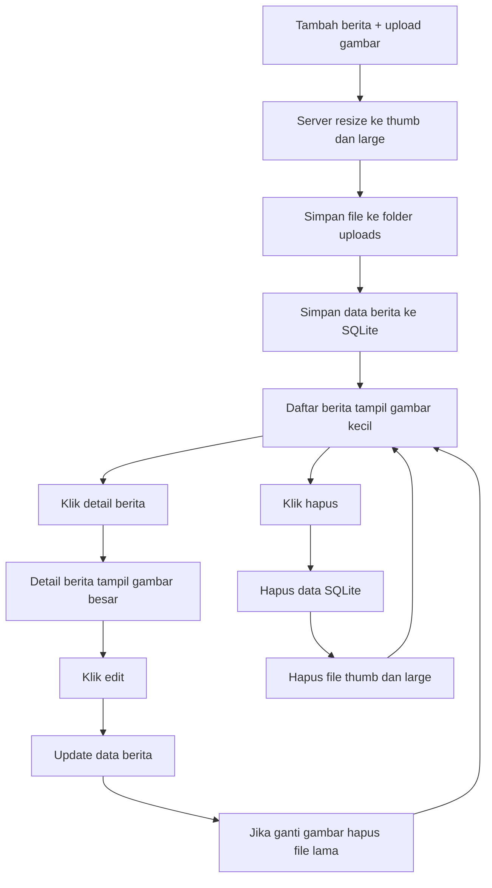

# 7D. Integrasi Dinamis + Berita SQLite + Gambar Preview Kecil dan Besar

Materi ini menggabungkan 2 jalur belajar:

1. Dari 04-dinamis: data berita awalnya dari object dummy.
2. Dari berita SQLite: data dipindahkan ke database agar permanen.

Lalu kita tambahkan fitur gambar:

1. Di daftar berita tampil gambar preview kecil (thumbnail).
2. Saat berita dibuka, tampil gambar ukuran besar.
3. Saat edit berita, gambar bisa diganti.
4. Saat hapus berita, data dan file gambar ikut terhapus.

## Tujuan Belajar

Setelah tahap ini, siswa diharapkan mampu:

1. Memindahkan sumber data berita dari object ke SQLite.
2. Membuat tabel berita dengan kolom gambar.
3. Upload gambar saat tambah berita.
4. Membuat 2 versi gambar: kecil dan besar.
5. Menampilkan gambar kecil di halaman daftar.
6. Menampilkan gambar besar di halaman detail berita.
7. Mengedit berita beserta file gambar.
8. Menghapus berita beserta file gambar.

## Gambaran Konsep

Sebelumnya (object dummy):

1. Data cepat dibuat.
2. Data hilang saat server restart.

Sekarang (SQLite):

1. Data tersimpan permanen di file database.
2. Cocok untuk aplikasi yang terus dipakai.

Untuk gambar:

1. `thumb` dipakai di daftar berita agar loading lebih cepat.
2. `large` dipakai di detail berita agar gambar tetap jelas.

## Alur Fitur



## Paket yang Digunakan

1. express
2. express-handlebars
3. better-sqlite3
4. multer
5. sharp

Instalasi:

```bash
npm install express express-handlebars better-sqlite3 multer sharp
```

## Struktur Folder

```text
node-web/
|-- server.js
|-- berita.db
|-- public/
|   |-- css/
|   |   `-- style.css
|   `-- uploads/
|       |-- thumb/
|       `-- large/
`-- views/
		|-- berita-list.handlebars
		|-- berita-detail.handlebars
		|-- berita-tambah.handlebars
		|-- berita-edit.handlebars
		|-- 404-berita.handlebars
		`-- layouts/
				`-- main.handlebars
```

## Tahap 1: Setup Server, Database, dan Folder Upload

```js
const express = require('express');
const { engine } = require('express-handlebars');
const Database = require('better-sqlite3');
const multer = require('multer');
const sharp = require('sharp');
const path = require('path');
const fs = require('fs');
const crypto = require('crypto');

const app = express();
const PORT = 3000;
const db = new Database('berita.db');

app.engine('handlebars', engine({ defaultLayout: 'main' }));
app.set('view engine', 'handlebars');
app.set('views', './views');

app.use(express.urlencoded({ extended: true }));
app.use(express.static('public'));

const thumbDir = path.join(__dirname, 'public', 'uploads', 'thumb');
const largeDir = path.join(__dirname, 'public', 'uploads', 'large');

fs.mkdirSync(thumbDir, { recursive: true });
fs.mkdirSync(largeDir, { recursive: true });
```

## Tahap 2: Buat Tabel SQLite

Kita gabungkan kebutuhan dari 04-dinamis dan berita SQLite dengan kolom `slug`, `ringkasan`, dan `gambar`.

```js
function createTable() {
	const query = `
		CREATE TABLE IF NOT EXISTS tb_berita (
			id INTEGER PRIMARY KEY AUTOINCREMENT,
			slug TEXT UNIQUE NOT NULL,
			tanggal TEXT NOT NULL,
			judul TEXT NOT NULL,
			ringkasan TEXT NOT NULL,
			konten TEXT NOT NULL,
			gambar TEXT,
			sumber TEXT,
			created_at DATETIME DEFAULT CURRENT_TIMESTAMP,
			updated_at DATETIME DEFAULT CURRENT_TIMESTAMP
		)
	`;

	db.prepare(query).run();
}

createTable();
```

## Tahap 3: Konfigurasi Upload dan Nama File Unik

```js
const upload = multer({
	storage: multer.memoryStorage(),
	limits: { fileSize: 2 * 1024 * 1024 },
	fileFilter: (req, file, cb) => {
		if (!file.mimetype.startsWith('image/')) {
			return cb(new Error('File harus gambar'));
		}

		cb(null, true);
	}
});

function buatSlug(judul) {
	return String(judul)
		.toLowerCase()
		.trim()
		.replace(/[^a-z0-9\s-]/g, '')
		.replace(/\s+/g, '-')
		.replace(/-+/g, '-');
}

function buatNamaFileUnik(originalName) {
	const ext = path.extname(originalName).toLowerCase();
	const timestamp = Date.now();
	const random = crypto.randomBytes(4).toString('hex');
	return `${timestamp}-${random}${ext}`;
}

function hapusFileGambar(namaFile) {
	if (!namaFile) return;

	const thumbPath = path.join(thumbDir, namaFile);
	const largePath = path.join(largeDir, namaFile);

	if (fs.existsSync(thumbPath)) fs.unlinkSync(thumbPath);
	if (fs.existsSync(largePath)) fs.unlinkSync(largePath);
}
```

Kenapa nama file harus unik?

1. Supaya file dengan nama sama tidak saling menimpa.
2. Supaya server aman untuk banyak upload dari user berbeda.

## Tahap 4: Route Daftar Berita (Preview Kecil)

```js
app.get('/berita', (req, res) => {
	const beritaList = db
		.prepare('SELECT * FROM tb_berita ORDER BY id DESC')
		.all();

	res.render('berita-list', {
		title: 'Daftar Berita',
		beritaList
	});
});
```

Pada `berita-list.handlebars`, gambar memakai folder `thumb`.

## Tahap 5: Route Detail Berita (Gambar Besar)

```js
app.get('/berita/:slug', (req, res) => {
	const berita = db
		.prepare('SELECT * FROM tb_berita WHERE slug = ?')
		.get(req.params.slug);

	if (!berita) {
		return res.status(404).render('404-berita', {
			title: '404 - Berita Tidak Ditemukan',
			slug: req.params.slug
		});
	}

	res.render('berita-detail', {
		title: berita.judul,
		berita
	});
});
```

Pada `berita-detail.handlebars`, gambar memakai folder `large`.

## Tahap 6: Form Tambah Berita

```js
app.get('/berita/tambah', (req, res) => {
	res.render('berita-tambah', {
		title: 'Tambah Berita'
	});
});
```

## Tahap 7: Simpan Berita + Simpan Gambar Thumbnail dan Large

```js
app.post('/berita/tambah', upload.single('gambar'), async (req, res) => {
	try {
		const { tanggal, judul, ringkasan, konten, sumber } = req.body;

		if (!tanggal || !judul || !ringkasan || !konten) {
			return res.status(400).send('Field wajib belum lengkap');
		}

		const slug = buatSlug(judul);
		let namaFile = null;

		if (req.file) {
			namaFile = buatNamaFileUnik(req.file.originalname);

			await sharp(req.file.buffer)
				.resize(360, 220, { fit: 'cover' })
				.toFile(path.join(thumbDir, namaFile));

			await sharp(req.file.buffer)
				.resize(1280, 800, { fit: 'inside' })
				.toFile(path.join(largeDir, namaFile));
		}

		db.prepare(`
			INSERT INTO tb_berita (slug, tanggal, judul, ringkasan, konten, gambar, sumber)
			VALUES (?, ?, ?, ?, ?, ?, ?)
		`).run(slug, tanggal, judul, ringkasan, konten, namaFile, sumber || null);

		res.redirect('/berita');
	} catch (error) {
		res.status(500).send(`Gagal simpan berita: ${error.message}`);
	}
});
```

## Tahap 8: Form Edit Berita

```js
app.get('/berita/edit/:id', (req, res) => {
	const id = Number(req.params.id);
	const berita = db.prepare('SELECT * FROM tb_berita WHERE id = ?').get(id);

	if (!berita) {
		return res.status(404).render('404-berita', {
			title: '404 - Berita Tidak Ditemukan',
			slug: `id:${id}`
		});
	}

	res.render('berita-edit', {
		title: 'Edit Berita',
		berita
	});
});
```

## Tahap 9: UPDATE Berita + File Gambar

Jika user upload gambar baru saat edit:

1. Simpan gambar baru ke thumb dan large.
2. Hapus gambar lama dari folder.
3. Update kolom `gambar` di database.

```js
app.post('/berita/edit/:id', upload.single('gambar'), async (req, res) => {
	try {
		const id = Number(req.params.id);
		const lama = db.prepare('SELECT * FROM tb_berita WHERE id = ?').get(id);

		if (!lama) {
			return res.status(404).render('404-berita', {
				title: '404 - Berita Tidak Ditemukan',
				slug: `id:${id}`
			});
		}

		const { tanggal, judul, ringkasan, konten, sumber } = req.body;
		if (!tanggal || !judul || !ringkasan || !konten) {
			return res.status(400).send('Field wajib belum lengkap');
		}

		const slug = buatSlug(judul);
		let namaFile = lama.gambar;

		if (req.file) {
			const fileBaru = buatNamaFileUnik(req.file.originalname);

			await sharp(req.file.buffer)
				.resize(360, 220, { fit: 'cover' })
				.toFile(path.join(thumbDir, fileBaru));

			await sharp(req.file.buffer)
				.resize(1280, 800, { fit: 'inside' })
				.toFile(path.join(largeDir, fileBaru));

			hapusFileGambar(lama.gambar);
			namaFile = fileBaru;
		}

		db.prepare(`
			UPDATE tb_berita
			SET slug = ?,
				tanggal = ?,
				judul = ?,
				ringkasan = ?,
				konten = ?,
				gambar = ?,
				sumber = ?,
				updated_at = CURRENT_TIMESTAMP
			WHERE id = ?
		`).run(slug, tanggal, judul, ringkasan, konten, namaFile, sumber || null, id);

		res.redirect('/berita');
	} catch (error) {
		res.status(500).send(`Gagal update berita: ${error.message}`);
	}
});
```

## Tahap 10: DELETE Berita + File Gambar

Saat hapus berita:

1. Hapus data berita dari SQLite.
2. Hapus file gambar thumb dan large.

```js
app.post('/berita/hapus/:id', (req, res) => {
	const id = Number(req.params.id);
	const berita = db.prepare('SELECT * FROM tb_berita WHERE id = ?').get(id);

	if (!berita) {
		return res.status(404).render('404-berita', {
			title: '404 - Berita Tidak Ditemukan',
			slug: `id:${id}`
		});
	}

	db.prepare('DELETE FROM tb_berita WHERE id = ?').run(id);
	hapusFileGambar(berita.gambar);

	res.redirect('/berita');
});
```

## Semua File View (Kunci Jawaban)

## views/layouts/main.handlebars

```html
<!DOCTYPE html>
<html lang="id">
<head>
	<meta charset="UTF-8" />
	<meta name="viewport" content="width=device-width, initial-scale=1.0" />
	<title>{{title}}</title>
	<link rel="stylesheet" href="/css/style.css" />
</head>
<body>
	{{{body}}}
</body>
</html>
```

## views/berita-tambah.handlebars

```html
<section class="page">
	<div class="container">
		<h1>Tambah Berita</h1>

		<form action="/berita/tambah" method="POST" enctype="multipart/form-data" class="form-grid">
			<input type="text" name="tanggal" placeholder="Tanggal, contoh 04 Juli 2026" required />
			<input type="text" name="judul" placeholder="Judul berita" required />
			<textarea name="ringkasan" rows="3" placeholder="Ringkasan berita" required></textarea>
			<textarea name="konten" rows="8" placeholder="Isi berita" required></textarea>
			<input type="url" name="sumber" placeholder="Link sumber (opsional)" />
			<input type="file" name="gambar" accept="image/*" />
			<button type="submit">Simpan Berita</button>
		</form>

		<p><a href="/berita">Kembali ke daftar</a></p>
	</div>
</section>
```

## views/berita-list.handlebars

```html
<section class="page">
	<div class="container">
		<h1>Berita Terkini</h1>
		<p><a href="/berita/tambah">Tambah Berita</a></p>

		<div class="news-grid">
			{{#each beritaList}}
				<article class="news-card">
					{{#if this.gambar}}
						<a href="/berita/{{this.slug}}">
							
						</a>
					{{/if}}

					<div class="news-body">
						<p class="news-date">{{this.tanggal}}</p>
						<h3><a href="/berita/{{this.slug}}">{{this.judul}}</a></h3>
						<p>{{this.ringkasan}}</p>

						<div class="actions-row">
							<a href="/berita/edit/{{this.id}}">Edit</a>
							<form action="/berita/hapus/{{this.id}}" method="POST" style="display:inline;">
								<button type="submit">Hapus</button>
							</form>
						</div>
					</div>
				</article>
			{{/each}}
		</div>
	</div>
</section>
```

## views/berita-edit.handlebars

```html
<section class="page">
	<div class="container">
		<h1>Edit Berita</h1>

		<form action="/berita/edit/{{berita.id}}" method="POST" enctype="multipart/form-data" class="form-grid">
			<input type="text" name="tanggal" value="{{berita.tanggal}}" required />
			<input type="text" name="judul" value="{{berita.judul}}" required />
			<textarea name="ringkasan" rows="3" required>{{berita.ringkasan}}</textarea>
			<textarea name="konten" rows="8" required>{{berita.konten}}</textarea>
			<input type="url" name="sumber" value="{{berita.sumber}}" placeholder="Link sumber (opsional)" />

			{{#if berita.gambar}}
				<p>Gambar saat ini:</p>
				
			{{/if}}

			<input type="file" name="gambar" accept="image/*" />
			<button type="submit">Simpan Perubahan</button>
		</form>

		<p><a href="/berita">Kembali ke daftar</a></p>
	</div>
</section>
```

## views/berita-detail.handlebars

```html
<section class="page">
	<div class="container detail-wrap">
		<p><a href="/berita">Kembali ke daftar berita</a></p>
		<h1>{{berita.judul}}</h1>
		<p class="news-date">{{berita.tanggal}}</p>

		{{#if berita.gambar}}
			
		{{/if}}

		<p>{{berita.konten}}</p>

		{{#if berita.sumber}}
			<p><a href="{{berita.sumber}}" target="_blank" rel="noreferrer">Baca sumber</a></p>
		{{/if}}

		<div class="actions-row">
			<a href="/berita/edit/{{berita.id}}">Edit Berita</a>
			<form action="/berita/hapus/{{berita.id}}" method="POST" style="display:inline;">
				<button type="submit">Hapus Berita</button>
			</form>
		</div>
	</div>
</section>
```

## views/404-berita.handlebars

```html
<section class="page">
	<div class="container">
		<h1>404 - Berita Tidak Ditemukan</h1>
		<p>Slug <strong>{{slug}}</strong> tidak tersedia.</p>
		<p><a href="/berita">Kembali ke daftar berita</a></p>
	</div>
</section>
```

## CSS Dasar

```css
.page {
	padding: 40px 0;
	background: #f8fafc;
	min-height: 100vh;
}

.container {
	width: min(1050px, 92%);
	margin: 0 auto;
}

.form-grid {
	display: grid;
	gap: 10px;
	margin-bottom: 20px;
}

.form-grid input,
.form-grid textarea,
.form-grid button {
	padding: 10px 12px;
	border: 1px solid #cbd5e1;
	border-radius: 8px;
}

.news-grid {
	display: grid;
	grid-template-columns: repeat(auto-fill, minmax(260px, 1fr));
	gap: 16px;
}

.news-card {
	background: #fff;
	border: 1px solid #dbe3ee;
	border-radius: 12px;
	overflow: hidden;
	box-shadow: 0 8px 20px rgba(15, 23, 42, 0.06);
}

.news-thumb {
	width: 100%;
	height: 160px;
	object-fit: cover;
	display: block;
}

.news-body {
	padding: 14px;
}

.news-date {
	margin: 0 0 8px;
	font-size: 14px;
	color: #64748b;
}

.actions-row {
	display: flex;
	gap: 10px;
	align-items: center;
	margin-top: 12px;
}

.detail-wrap {
	max-width: 860px;
}

.news-large {
	width: 100%;
	max-height: 520px;
	object-fit: cover;
	border-radius: 10px;
	margin: 12px 0 18px;
	display: block;
}
```

## server.js Lengkap (Versi Ringkas)

```js
const express = require('express');
const { engine } = require('express-handlebars');
const Database = require('better-sqlite3');
const multer = require('multer');
const sharp = require('sharp');
const path = require('path');
const fs = require('fs');
const crypto = require('crypto');

const app = express();
const PORT = 3000;
const db = new Database('berita.db');

app.engine('handlebars', engine({ defaultLayout: 'main' }));
app.set('view engine', 'handlebars');
app.set('views', './views');

app.use(express.urlencoded({ extended: true }));
app.use(express.static('public'));

const thumbDir = path.join(__dirname, 'public', 'uploads', 'thumb');
const largeDir = path.join(__dirname, 'public', 'uploads', 'large');

fs.mkdirSync(thumbDir, { recursive: true });
fs.mkdirSync(largeDir, { recursive: true });

function createTable() {
	const query = `
		CREATE TABLE IF NOT EXISTS tb_berita (
			id INTEGER PRIMARY KEY AUTOINCREMENT,
			slug TEXT UNIQUE NOT NULL,
			tanggal TEXT NOT NULL,
			judul TEXT NOT NULL,
			ringkasan TEXT NOT NULL,
			konten TEXT NOT NULL,
			gambar TEXT,
			sumber TEXT,
			created_at DATETIME DEFAULT CURRENT_TIMESTAMP,
			updated_at DATETIME DEFAULT CURRENT_TIMESTAMP
		)
	`;

	db.prepare(query).run();
}

createTable();

const upload = multer({
	storage: multer.memoryStorage(),
	limits: { fileSize: 2 * 1024 * 1024 },
	fileFilter: (req, file, cb) => {
		if (!file.mimetype.startsWith('image/')) {
			return cb(new Error('File harus gambar'));
		}
		cb(null, true);
	}
});

function buatSlug(judul) {
	return String(judul)
		.toLowerCase()
		.trim()
		.replace(/[^a-z0-9\s-]/g, '')
		.replace(/\s+/g, '-')
		.replace(/-+/g, '-');
}

function buatNamaFileUnik(originalName) {
	const ext = path.extname(originalName).toLowerCase();
	const timestamp = Date.now();
	const random = crypto.randomBytes(4).toString('hex');
	return `${timestamp}-${random}${ext}`;
}

function hapusFileGambar(namaFile) {
	if (!namaFile) return;

	const thumbPath = path.join(thumbDir, namaFile);
	const largePath = path.join(largeDir, namaFile);

	if (fs.existsSync(thumbPath)) fs.unlinkSync(thumbPath);
	if (fs.existsSync(largePath)) fs.unlinkSync(largePath);
}

app.get('/berita', (req, res) => {
	const beritaList = db.prepare('SELECT * FROM tb_berita ORDER BY id DESC').all();
	res.render('berita-list', { title: 'Daftar Berita', beritaList });
});

app.get('/berita/tambah', (req, res) => {
	res.render('berita-tambah', { title: 'Tambah Berita' });
});

app.post('/berita/tambah', upload.single('gambar'), async (req, res) => {
	try {
		const { tanggal, judul, ringkasan, konten, sumber } = req.body;
		if (!tanggal || !judul || !ringkasan || !konten) {
			return res.status(400).send('Field wajib belum lengkap');
		}

		const slug = buatSlug(judul);
		let namaFile = null;

		if (req.file) {
			namaFile = buatNamaFileUnik(req.file.originalname);
			await sharp(req.file.buffer)
				.resize(360, 220, { fit: 'cover' })
				.toFile(path.join(thumbDir, namaFile));
			await sharp(req.file.buffer)
				.resize(1280, 800, { fit: 'inside' })
				.toFile(path.join(largeDir, namaFile));
		}

		db.prepare(`
			INSERT INTO tb_berita (slug, tanggal, judul, ringkasan, konten, gambar, sumber)
			VALUES (?, ?, ?, ?, ?, ?, ?)
		`).run(slug, tanggal, judul, ringkasan, konten, namaFile, sumber || null);

		res.redirect('/berita');
	} catch (error) {
		res.status(500).send(`Gagal simpan berita: ${error.message}`);
	}
});

app.get('/berita/edit/:id', (req, res) => {
	const id = Number(req.params.id);
	const berita = db.prepare('SELECT * FROM tb_berita WHERE id = ?').get(id);

	if (!berita) {
		return res.status(404).render('404-berita', {
			title: '404 - Berita Tidak Ditemukan',
			slug: `id:${id}`
		});
	}

	res.render('berita-edit', {
		title: 'Edit Berita',
		berita
	});
});

app.post('/berita/edit/:id', upload.single('gambar'), async (req, res) => {
	try {
		const id = Number(req.params.id);
		const lama = db.prepare('SELECT * FROM tb_berita WHERE id = ?').get(id);

		if (!lama) {
			return res.status(404).render('404-berita', {
				title: '404 - Berita Tidak Ditemukan',
				slug: `id:${id}`
			});
		}

		const { tanggal, judul, ringkasan, konten, sumber } = req.body;
		if (!tanggal || !judul || !ringkasan || !konten) {
			return res.status(400).send('Field wajib belum lengkap');
		}

		const slug = buatSlug(judul);
		let namaFile = lama.gambar;

		if (req.file) {
			const fileBaru = buatNamaFileUnik(req.file.originalname);

			await sharp(req.file.buffer)
				.resize(360, 220, { fit: 'cover' })
				.toFile(path.join(thumbDir, fileBaru));

			await sharp(req.file.buffer)
				.resize(1280, 800, { fit: 'inside' })
				.toFile(path.join(largeDir, fileBaru));

			hapusFileGambar(lama.gambar);
			namaFile = fileBaru;
		}

		db.prepare(`
			UPDATE tb_berita
			SET slug = ?,
				tanggal = ?,
				judul = ?,
				ringkasan = ?,
				konten = ?,
				gambar = ?,
				sumber = ?,
				updated_at = CURRENT_TIMESTAMP
			WHERE id = ?
		`).run(slug, tanggal, judul, ringkasan, konten, namaFile, sumber || null, id);

		res.redirect('/berita');
	} catch (error) {
		res.status(500).send(`Gagal update berita: ${error.message}`);
	}
});

app.get('/berita/:slug', (req, res) => {
	const berita = db.prepare('SELECT * FROM tb_berita WHERE slug = ?').get(req.params.slug);

	if (!berita) {
		return res.status(404).render('404-berita', {
			title: '404 - Berita Tidak Ditemukan',
			slug: req.params.slug
		});
	}

	res.render('berita-detail', { title: berita.judul, berita });
});

app.post('/berita/hapus/:id', (req, res) => {
	const id = Number(req.params.id);
	const berita = db.prepare('SELECT * FROM tb_berita WHERE id = ?').get(id);

	if (!berita) {
		return res.status(404).render('404-berita', {
			title: '404 - Berita Tidak Ditemukan',
			slug: `id:${id}`
		});
	}

	db.prepare('DELETE FROM tb_berita WHERE id = ?').run(id);
	hapusFileGambar(berita.gambar);

	res.redirect('/berita');
});

app.listen(PORT, () => {
	console.log(`Server berjalan di http://localhost:${PORT}/berita`);
});
```

## Checklist Uji

1. Buka /berita, daftar muncul.
2. Tambah berita tanpa gambar, data tetap tersimpan.
3. Tambah berita dengan gambar, thumbnail tampil di daftar.
4. Klik berita, gambar besar tampil di detail.
5. Edit berita tanpa ganti gambar, data berubah dan gambar lama tetap.
6. Edit berita dengan ganti gambar, data berubah dan file lama terhapus.
7. Hapus berita, data hilang dari daftar dan file thumb/large ikut terhapus.
8. Coba akses slug yang salah, tampil 404 berita.

## Ringkasan

1. Dari object dummy, kita pindah ke SQLite agar data permanen.
2. Fitur gambar dibuat 2 ukuran: preview kecil dan detail besar.
3. CRUD berita sudah lengkap: Create, Read, Update, Delete.
4. CRUD file gambar juga ikut lengkap saat update/delete.
5. Ini fondasi kuat sebelum lanjut ke dashboard CMS dan manajemen user.
