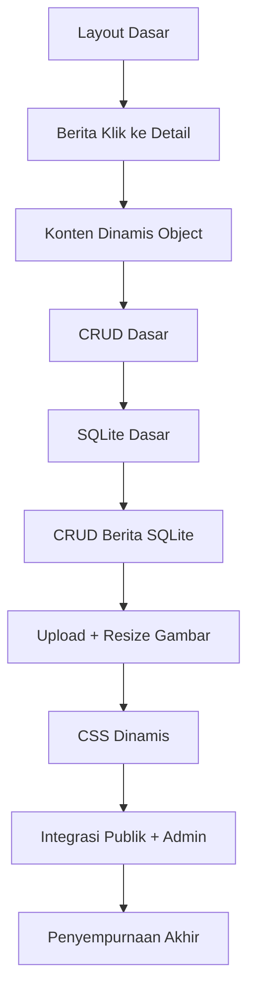

# 8. Tahapan Membangun Web Berita (Detail dan Siap Dilalui)

Dokumen ini adalah panduan detail belajar sambil praktik. Semua tahap disusun agar nyambung dengan materi yang sudah dipelajari sebelumnya.

Target akhir:

1. Website publik: landing, daftar berita, detail berita.
2. Halaman pengelolaan: tambah, edit, hapus berita.
3. Database SQLite aktif.
4. Upload gambar + resize.
5. Tampilan dinamis yang rapi dan responsif.

## Cara Kerja yang Dipakai: Vertikal per Fitur

Kita tidak mengerjakan semua database dulu lalu semua tampilan belakangan.

Kita pakai pola vertikal per fitur:

1. DB kecilnya dibuat.
2. Route untuk fitur itu dibuat.
3. View untuk fitur itu dibuat.
4. CSS untuk fitur itu dirapikan.
5. Fitur diuji sampai jadi.
6. Baru lanjut fitur berikutnya.

Contoh sederhana:

1. Fitur daftar berita landing: query DB -> route / -> landing.handlebars -> CSS card -> test.
2. Fitur detail berita: query by id -> route /berita/:id -> detail.handlebars -> CSS detail -> test.

## Peta Besar Tahapan

## Tahap 1: Fondasi Layout Publik

Referensi:

1. [02-layout.md](e:/REACT/node-web/02-layout.md)

Langkah detail:

1. Buat layout utama `main.handlebars`.
2. Buat section: navbar, hero, berita, video, footer.
3. Pasang CSS dasar untuk container dan grid.

Hasil yang harus terlihat:

1. Halaman utama sudah jadi meski masih statis.

Checklist uji:

1. Link menu ke section berjalan.
2. Tidak ada section yang hilang.

## Tahap 2: Alur Landing ke Detail Berita

Referensi:

1. [03-layout-berita.md](e:/REACT/node-web/03-layout-berita.md)

Langkah detail:

1. Buat route landing.
2. Buat route detail berita.
3. Buat tombol kembali ke landing.

Hasil yang harus terlihat:

1. Alur landing -> detail -> landing berjalan.

Checklist uji:

1. Klik judul membuka detail.
2. Tombol kembali mengarah ke landing.

## Tahap 3: Konten Dinamis dari Object

Referensi:

1. [04-dinamis.md](e:/REACT/node-web/04-dinamis.md)

Langkah detail:

1. Buat array berita dummy di server.
2. Kirim data ke view.
3. Render dengan `{{#each}}`.

Hasil yang harus terlihat:

1. Jumlah kartu mengikuti jumlah data object.

Checklist uji:

1. Tambah 1 object berita -> tampilan bertambah.

## Tahap 4: Latihan CRUD Dasar dengan Todo

Referensi:

1. [05-todo-object.md](e:/REACT/node-web/05-todo-object.md)

Langkah detail:

1. Buat fitur tambah.
2. Buat fitur edit.
3. Buat fitur hapus.

Tujuan tahap ini:

1. Paham pola CRUD pada data sederhana sebelum masuk berita.

Checklist uji:

1. Create, Update, Delete berjalan.

## Tahap 5: Pindah ke SQLite (Todo)

Referensi:

1. [06-todo-sqlite.md](e:/REACT/node-web/06-todo-sqlite.md)

Langkah detail:

1. Buka koneksi SQLite.
2. Buat tabel awal saat server start.
3. Ubah CRUD dari array ke SQL.

Hasil yang harus terlihat:

1. Data tetap ada walau server restart.

Checklist uji:

1. Tambah data -> restart server -> data tetap ada.

## Tahap 6: CRUD Berita dengan SQLite

Referensi:

1. [07-berita-sqlite.md](e:/REACT/node-web/07-berita-sqlite.md)

Langkah detail:

1. Buat tabel `tb_berita`.
2. Buat route daftar berita.
3. Buat route tambah berita.
4. Buat route edit berita.
5. Buat route hapus berita.
6. Buat route detail berita by id.

Hasil yang harus terlihat:

1. Modul berita lengkap berjalan dari DB sampai view.

Checklist uji:

1. Berita baru muncul di daftar.
2. Edit memperbarui data.
3. Detail sesuai id.
4. Hapus menghilangkan data.

## Tahap 7: Upload dan Resize Gambar

Referensi:

1. [07a-uploud.md](e:/REACT/node-web/07a-uploud.md)

Langkah detail:

1. Tambah kolom gambar pada tabel.
2. Setup upload dengan `multer`.
3. Setup resize dengan `sharp`.
4. Simpan `thumb` dan `large`.
5. Simpan nama file ke DB.
6. Tampilkan gambar kecil di landing.
7. Tampilkan gambar besar di detail.
8. Sembunyikan gambar jika kosong dengan `{{#if}}`.

Hasil yang harus terlihat:

1. Landing dan detail menampilkan gambar dengan ukuran yang tepat.

Checklist uji:

1. Upload berhasil tanpa error.
2. File resize terbentuk dua versi.
3. Berita tanpa gambar tidak menampilkan kotak kosong.

## Tahap 8: Rapikan CSS Dinamis

Referensi:

1. [07b-dinamis.md](e:/REACT/node-web/07b-dinamis.md)

Langkah detail:

1. Rapikan grid kartu berita di landing.
2. Rapikan tipografi judul dan meta.
3. Rapikan tampilan detail berita.
4. Buat responsif mobile.

Hasil yang harus terlihat:

1. Tampilan terasa seperti portal berita kampus.

Checklist uji:

1. Desktop rapi.
2. Mobile tetap nyaman dibaca.

## Tahap 9: Integrasi Publik dan Admin

Langkah detail:

1. Landing publik tampilkan status `publish` saja.
2. Halaman admin tampilkan semua status.
3. Tambah indikator status di admin.

Hasil yang harus terlihat:

1. Konten draft aman, tidak tampil di publik.

Checklist uji:

1. Berita draft tidak muncul di landing.
2. Berita publish muncul di landing.

## Tahap 10: Penyempurnaan Akhir

Langkah detail:

1. Tambah validasi input wajib.
2. Tambah pesan sukses dan gagal.
3. Rapikan nama route dan file.
4. Cek ulang alur utama dari awal sampai akhir.

Hasil yang harus terlihat:

1. Project siap jadi demo kelas atau portofolio mini.

Checklist uji:

1. Semua fitur utama berjalan.
2. Tidak ada error di alur normal.

## Pola Satu Sesi Belajar (Praktis)

Gunakan pola ini setiap sesi:

1. Pilih satu tahap kecil.
2. Kerjakan satu fitur sampai selesai vertikal.
3. Jalankan aplikasi.
4. Uji manual.
5. Catat apa yang dipahami dan apa yang belum.

Durasi ideal:

1. 45-90 menit per sesi.

## Pertanyaan Refleksi untuk Siswa

Setelah sesi selesai, jawab:

1. Data datang dari mana?
2. Route mana yang memproses data?
3. View mana yang menampilkan data?
4. CSS class mana yang mengatur tampilan itu?
5. Jika error, error paling mungkin di DB, route, view, atau CSS?

## Peta File yang Paling Sering Dibuka

1. `server.js`
2. `views/landing.handlebars`
3. `views/berita.handlebars`
4. `views/berita-detail.handlebars`
5. `views/berita-tambah.handlebars`
6. `views/berita-edit.handlebars`
7. `public/css/style.css`

## Ringkasan Sangat Sederhana

Kalimat untuk siswa:

1. Buat tampilan dulu.
2. Sambungkan ke data.
3. Jadikan data bisa ditambah, diedit, dihapus.
4. Tambahkan gambar.
5. Rapikan CSS.
6. Uji sampai stabil.

## Kesimpulan

Roadmap ini dibuat supaya proses belajar dan membangun website berjalan searah. Kita tidak hanya mengejar jadi, tapi juga memahami jalur lengkap dari database -> route -> view -> CSS. Dengan pola vertikal per fitur, hasil lebih cepat terlihat dan proses belajar lebih masuk akal untuk siswa.
