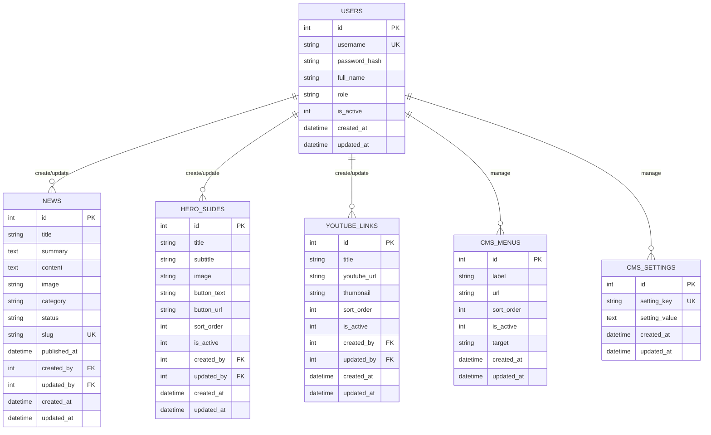

# 8A. Desain Database SQLite untuk Website Lembaga

Dokumen ini melanjutkan roadmap sebelumnya. Fokusnya adalah merancang database SQLite agar website bisa dikelola dari CMS sederhana.

Kebutuhan yang akan dipenuhi:

1. Tabel hero (1-5 gambar carousel).
2. Tabel berita.
3. Tabel link YouTube.
4. Tabel CMS data dasar (logo, menu, footer, map).
5. Tabel user untuk login/auth.

## Prinsip Desain (Bahasa Sederhana)

1. Satu tabel untuk satu jenis data.
2. Data yang bisa banyak (berita, hero, video) dibuat sebagai list.
3. Data yang biasanya cuma satu set (logo, footer, map) bisa disimpan di tabel settings.
4. Password jangan disimpan teks biasa, harus hash.

## Gambaran Relasi



## Penjelasan Tiap Tabel

## 1. Tabel `hero_slides`

Fungsi:

1. Menyimpan data carousel hero.
2. Bisa berisi 1-5 slide (atau lebih).
3. Urutan slide diatur dengan `sort_order`.

Kolom penting:

1. `image`: nama file gambar.
2. `is_active`: hanya tampilkan yang aktif.
3. `sort_order`: urutan slide.

## 2. Tabel `news`

Fungsi:

1. Menyimpan berita/artikel.
2. Bisa draft atau publish.
3. Bisa tampil di landing dan detail.

Kolom penting:

1. `slug`: URL ramah SEO (misalnya `kegiatan-penelitian-2026`).
2. `status`: `draft` atau `publish`.
3. `published_at`: tanggal tampil publik.

## 3. Tabel `youtube_links`

Fungsi:

1. Menyimpan video YouTube lembaga.
2. Tampil sebagai section video di landing.

Kolom penting:

1. `youtube_url`: URL video.
2. `thumbnail`: gambar preview jika ada.
3. `sort_order`: urutan tampil.

## 4. Tabel CMS Dasar

Kita pecah menjadi 2 agar mudah:

1. `cms_menus` untuk menu navigasi.
2. `cms_settings` untuk data tunggal (logo, footer, map, dll).

Contoh `setting_key` di `cms_settings`:

1. `site_logo`
2. `footer_address`
3. `footer_email`
4. `footer_phone`
5. `google_map_embed`

## 5. Tabel `users`

Fungsi:

1. Login admin.
2. Menyimpan role (`admin`, `editor`).
3. Menandai user aktif/tidak aktif.

Catatan keamanan:

1. Simpan password dalam `password_hash`, bukan password asli.
2. Pakai bcrypt saat implementasi login.

## SQL Final (Siap Jalankan)

```sql
PRAGMA foreign_keys = ON;

CREATE TABLE IF NOT EXISTS users (
	id INTEGER PRIMARY KEY AUTOINCREMENT,
	username TEXT NOT NULL UNIQUE,
	password_hash TEXT NOT NULL,
	full_name TEXT,
	role TEXT NOT NULL DEFAULT 'editor',
	is_active INTEGER NOT NULL DEFAULT 1,
	created_at DATETIME NOT NULL DEFAULT CURRENT_TIMESTAMP,
	updated_at DATETIME NOT NULL DEFAULT CURRENT_TIMESTAMP
);

CREATE TABLE IF NOT EXISTS hero_slides (
	id INTEGER PRIMARY KEY AUTOINCREMENT,
	title TEXT,
	subtitle TEXT,
	image TEXT NOT NULL,
	button_text TEXT,
	button_url TEXT,
	sort_order INTEGER NOT NULL DEFAULT 0,
	is_active INTEGER NOT NULL DEFAULT 1,
	created_by INTEGER,
	updated_by INTEGER,
	created_at DATETIME NOT NULL DEFAULT CURRENT_TIMESTAMP,
	updated_at DATETIME NOT NULL DEFAULT CURRENT_TIMESTAMP,
	FOREIGN KEY (created_by) REFERENCES users(id) ON DELETE SET NULL,
	FOREIGN KEY (updated_by) REFERENCES users(id) ON DELETE SET NULL
);

CREATE TABLE IF NOT EXISTS news (
	id INTEGER PRIMARY KEY AUTOINCREMENT,
	title TEXT NOT NULL,
	summary TEXT,
	content TEXT NOT NULL,
	image TEXT,
	category TEXT,
	status TEXT NOT NULL DEFAULT 'draft',
	slug TEXT NOT NULL UNIQUE,
	published_at DATETIME,
	created_by INTEGER,
	updated_by INTEGER,
	created_at DATETIME NOT NULL DEFAULT CURRENT_TIMESTAMP,
	updated_at DATETIME NOT NULL DEFAULT CURRENT_TIMESTAMP,
	FOREIGN KEY (created_by) REFERENCES users(id) ON DELETE SET NULL,
	FOREIGN KEY (updated_by) REFERENCES users(id) ON DELETE SET NULL,
	CHECK (status IN ('draft', 'publish'))
);

CREATE TABLE IF NOT EXISTS youtube_links (
	id INTEGER PRIMARY KEY AUTOINCREMENT,
	title TEXT NOT NULL,
	youtube_url TEXT NOT NULL,
	thumbnail TEXT,
	sort_order INTEGER NOT NULL DEFAULT 0,
	is_active INTEGER NOT NULL DEFAULT 1,
	created_by INTEGER,
	updated_by INTEGER,
	created_at DATETIME NOT NULL DEFAULT CURRENT_TIMESTAMP,
	updated_at DATETIME NOT NULL DEFAULT CURRENT_TIMESTAMP,
	FOREIGN KEY (created_by) REFERENCES users(id) ON DELETE SET NULL,
	FOREIGN KEY (updated_by) REFERENCES users(id) ON DELETE SET NULL
);

CREATE TABLE IF NOT EXISTS cms_menus (
	id INTEGER PRIMARY KEY AUTOINCREMENT,
	label TEXT NOT NULL,
	url TEXT NOT NULL,
	sort_order INTEGER NOT NULL DEFAULT 0,
	is_active INTEGER NOT NULL DEFAULT 1,
	target TEXT NOT NULL DEFAULT '_self',
	created_at DATETIME NOT NULL DEFAULT CURRENT_TIMESTAMP,
	updated_at DATETIME NOT NULL DEFAULT CURRENT_TIMESTAMP
);

CREATE TABLE IF NOT EXISTS cms_settings (
	id INTEGER PRIMARY KEY AUTOINCREMENT,
	setting_key TEXT NOT NULL UNIQUE,
	setting_value TEXT,
	created_at DATETIME NOT NULL DEFAULT CURRENT_TIMESTAMP,
	updated_at DATETIME NOT NULL DEFAULT CURRENT_TIMESTAMP
);

CREATE INDEX IF NOT EXISTS idx_hero_active_order ON hero_slides(is_active, sort_order);
CREATE INDEX IF NOT EXISTS idx_news_status_published ON news(status, published_at);
CREATE INDEX IF NOT EXISTS idx_news_slug ON news(slug);
CREATE INDEX IF NOT EXISTS idx_youtube_active_order ON youtube_links(is_active, sort_order);
CREATE INDEX IF NOT EXISTS idx_menu_active_order ON cms_menus(is_active, sort_order);
```

## Contoh Data Awal (Seed)

```sql
INSERT INTO cms_settings (setting_key, setting_value) VALUES
	('site_logo', '/uploads/site/logo.png'),
	('footer_address', 'Gedung ICT Centre Lantai 4, Tembalang, Semarang'),
	('footer_email', 'lppm@kampus.ac.id'),
	('footer_phone', '024-0000000'),
	('google_map_embed', 'https://www.google.com/maps/embed?...');

INSERT INTO cms_menus (label, url, sort_order) VALUES
	('Beranda', '/', 1),
	('Berita', '/berita', 2),
	('Video', '/#video', 3),
	('Kontak', '/#footer', 4);
```

## Query yang Sering Dipakai

Landing:

```sql
SELECT id, title, summary, image, category, slug, published_at
FROM news
WHERE status = 'publish'
ORDER BY published_at DESC, id DESC
LIMIT 9;
```

Detail berita:

```sql
SELECT *
FROM news
WHERE slug = ? AND status = 'publish';
```

Hero aktif:

```sql
SELECT *
FROM hero_slides
WHERE is_active = 1
ORDER BY sort_order ASC, id ASC
LIMIT 5;
```

Video aktif:

```sql
SELECT *
FROM youtube_links
WHERE is_active = 1
ORDER BY sort_order ASC, id ASC;
```

## Urutan Implementasi Praktis

1. Buat semua tabel dulu (sekali).
2. Isi `cms_settings` dan `cms_menus`.
3. Buat route landing: hero + berita publish + youtube + settings.
4. Buat route detail berita by slug.
5. Buat login admin dari tabel `users`.
6. Buat CMS admin untuk CRUD hero, berita, youtube, menu.
7. Terakhir rapikan CSS.

## Catatan untuk Siswa SMA

Kalimat sederhana:

1. `users` = siapa yang boleh mengelola.
2. `news` = isi artikel.
3. `hero_slides` = gambar carousel atas.
4. `youtube_links` = daftar video.
5. `cms_menus` + `cms_settings` = pengaturan tampilan situs.

## Kesimpulan

Desain ini cukup kuat untuk website lembaga berbasis SQLite, tapi tetap sederhana untuk dipelajari. Struktur tabel sudah siap dipakai untuk alur publik (landing/detail) dan alur admin (CRUD + pengaturan CMS).
