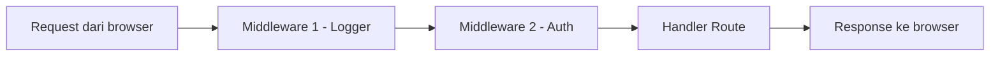
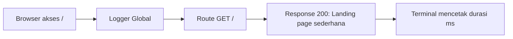
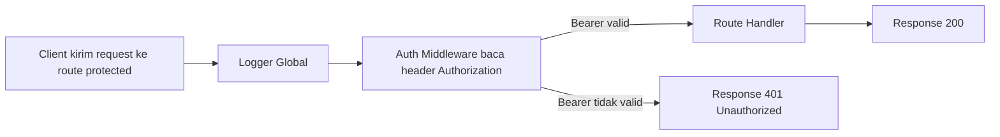
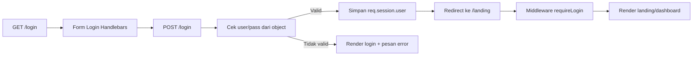
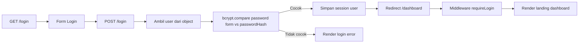

# 08.1 Middleware Dasar di Express (Persiapan Auth dan Logger)

Materi ini adalah lanjutan setelah modul berita pada tahap 07.
Sekarang kita belajar konsep yang sangat penting di backend: middleware.

Kenapa middleware penting?

1. Supaya kode lebih rapi.
2. Supaya logika yang berulang tidak ditulis berkali-kali.
3. Supaya siap untuk fitur keamanan seperti auth.
4. Supaya mudah menambahkan logger dan validasi.

## Tujuan Belajar

Setelah materi ini, siswa diharapkan bisa:

1. Memahami apa itu middleware.
2. Memahami cara kerja request, response, dan next.
3. Membuat middleware logger sederhana.
4. Membuat middleware auth sederhana.
5. Memasang middleware di level global dan level route.
6. Menghubungkan middleware ke modul berita dari tahap 07.

## Apa Itu Middleware?

Middleware adalah fungsi yang berjalan di tengah proses request sebelum masuk ke handler utama route.

Alur sederhananya:

1. User kirim request.
2. Middleware jalan dulu.
3. Kalau lolos, lanjut ke route utama.
4. Kalau ditolak, middleware bisa langsung kirim response error.

## Gambaran Alur Middleware



## Bentuk Dasar Middleware

```js
function namaMiddleware(req, res, next) {
	// logika middleware
	next();
}
```

Penjelasan:

1. req berisi data request.
2. res dipakai untuk kirim response.
3. next dipakai untuk lanjut ke proses berikutnya.

Jika lupa memanggil next dan juga tidak mengirim response, request akan berhenti (hang).

## Posisi Middleware dalam Aplikasi

Middleware bisa dipasang dengan 2 cara:

1. Global: berlaku untuk banyak route.
2. Per-route: berlaku hanya untuk route tertentu.

Contoh global:

```js
app.use(middlewareGlobal);
```

Contoh per-route:

```js
app.get('/berita/tambah', authMiddleware, handlerRoute);
```

## Tahap 1: Logger Global Paling Dasar

Tujuan logger:

1. Mencatat request masuk.
2. Membantu debugging.
3. Mengetahui route mana yang diakses.
4. Melihat durasi respons supaya mudah dipahami.

```js
function logger(req, res, next) {
	const start = Date.now();

	res.on('finish', () => {
		const duration = Date.now() - start;
		console.log(`[${new Date().toISOString()}] ${req.method} ${req.originalUrl} -> ${res.statusCode} (${duration}ms)`);
	});

	next();
}
```

Pasang global:

```js
app.use(logger);
```

Lalu siapkan satu halaman landing paling sederhana:

```js
app.get('/', (req, res) => {
	res.send('Landing page sederhana');
});
```

Sekarang coba akses http://localhost:3000/.

Hasil log di terminal contoh:

1. GET / -> 200 (2ms)

Artinya:

1. Route yang dipanggil adalah /.
2. Status respons adalah 200.
3. Waktu respons tercatat 2ms.

## File kunci jawaban

Bagian ini fokus ke tahap dasar: logger global + request ke landing page sederhana.

### 1) Flowchart Tahap Dasar



### 2) Bentuk Struktur Folder

```text
project-middleware-dasar/
├── package.json
├── server.js
└── middleware/
    └── logger.js
```

### 3) Semua File

#### package.json

```json
{
	"name": "middleware-dasar",
	"version": "1.0.0",
	"description": "Belajar middleware logger global",
	"main": "server.js",
	"scripts": {
		"start": "node server.js",
		"dev": "nodemon server.js"
	},
	"dependencies": {
		"express": "^4.19.2"
	},
	"devDependencies": {
		"nodemon": "^3.1.4"
	}
}
```

#### middleware/logger.js

```js
function logger(req, res, next) {
	const start = Date.now();

	res.on('finish', () => {
		const duration = Date.now() - start;
		console.log(`[${new Date().toISOString()}] ${req.method} ${req.originalUrl} -> ${res.statusCode} (${duration}ms)`);
	});

	next();
}

module.exports = logger;
```

#### server.js

```js
const express = require('express');
const logger = require('./middleware/logger');

const app = express();
const PORT = 3000;

app.use(logger);

app.get('/', (req, res) => {
	res.status(200).send('Landing page sederhana');
});

app.listen(PORT, () => {
	console.log(`Server berjalan di http://localhost:${PORT}`);
});
```

Cara uji cepat:

1. Jalankan npm install.
2. Jalankan npm run dev.
3. Buka http://localhost:3000/.
4. Lihat terminal, harus muncul durasi respons dalam ms.

## Tahap 2: Middleware Auth Dasar

Pada tahap awal, kita pakai auth sederhana dulu untuk latihan konsep.

Pertanyaan penting: token diambil dari mana?

Untuk API, praktik yang umum adalah dari header request.

Contoh paling umum:

1. Header `Authorization: Bearer <token>`.

Contoh paling sederhana:

1. Cek token dari header Authorization.
2. Jika token benar, boleh lanjut.
3. Jika token salah/kosong, tolak dengan 401.

```js
function authSederhana(req, res, next) {
	const authHeader = req.headers.authorization || '';
	const [scheme, token] = authHeader.split(' ');

	if (scheme !== 'Bearer' || token !== 'rahasia123') {
		return res.status(401).send('Unauthorized: akses ditolak');
	}

	next();
}
```

Catatan:

1. Ini hanya untuk belajar middleware.
2. Di tahap selanjutnya sebaiknya pakai session/JWT.

## Uji Token dengan REST Client

Jika pakai ekstensi REST Client di VS Code, buat file misalnya `test-auth.http`, lalu isi:

```http
### Landing publik (tanpa token)
GET http://localhost:3000/

### Route protected tanpa token (harus 401)
GET http://localhost:3000/berita/tambah

### Route protected dengan token salah (harus 401)
GET http://localhost:3000/berita/tambah
Authorization: Bearer token-salah

### Route protected dengan token benar (harus 200)
GET http://localhost:3000/berita/tambah
Authorization: Bearer rahasia123
```

Dari contoh ini terlihat jelas:

1. Token dikirim dari client lewat header.
2. Server membaca token dari `req.headers.authorization`.
3. Middleware memutuskan request lanjut atau ditolak.

## File kunci jawaban

### 1) Flowchart Tahap Dasar



### 2) Bentuk Struktur Folder

```text
project-middleware-auth/
├── package.json
├── server.js
├── test-auth.http
└── middleware/
    ├── logger.js
    └── auth.js
```

### 3) Semua File

#### package.json

```json
{
	"name": "middleware-auth-dasar",
	"version": "1.0.0",
	"description": "Belajar logger global dan auth header",
	"main": "server.js",
	"scripts": {
		"start": "node server.js",
		"dev": "nodemon server.js"
	},
	"dependencies": {
		"express": "^4.19.2"
	},
	"devDependencies": {
		"nodemon": "^3.1.4"
	}
}
```

#### middleware/logger.js

```js
function logger(req, res, next) {
	const start = Date.now();

	res.on('finish', () => {
		const duration = Date.now() - start;
		console.log(`[${new Date().toISOString()}] ${req.method} ${req.originalUrl} -> ${res.statusCode} (${duration}ms)`);
	});

	next();
}

module.exports = logger;
```

#### middleware/auth.js

```js
function authSederhana(req, res, next) {
	const authHeader = req.headers.authorization || '';
	const [scheme, token] = authHeader.split(' ');

	if (scheme !== 'Bearer' || token !== 'rahasia123') {
		return res.status(401).json({
			success: false,
			message: 'Unauthorized: akses ditolak'
		});
	}

	next();
}

module.exports = authSederhana;
```

#### server.js

```js
const express = require('express');
const logger = require('./middleware/logger');
const authSederhana = require('./middleware/auth');

const app = express();
const PORT = 3000;

app.use(express.json());
app.use(logger);

app.get('/', (req, res) => {
	res.status(200).send('Landing page sederhana');
});

app.get('/berita/tambah', authSederhana, (req, res) => {
	res.status(200).send('Form tambah berita (protected)');
});

app.listen(PORT, () => {
	console.log(`Server berjalan di http://localhost:${PORT}`);
});
```

#### test-auth.http

```http
### Landing publik (tanpa token)
GET http://localhost:3000/

### Protected tanpa token (401)
GET http://localhost:3000/berita/tambah

### Protected token salah (401)
GET http://localhost:3000/berita/tambah
Authorization: Bearer token-salah

### Protected token benar (200)
GET http://localhost:3000/berita/tambah
Authorization: Bearer rahasia123
```

Cara uji cepat:

1. Jalankan npm install.
2. Jalankan npm run dev.
3. Jalankan request dari `test-auth.http`.
4. Cek terminal, durasi respons muncul dari logger.


## Tahap 3: Middleware Auth untuk Landing Page (user pass) >> Dashboard

Di tahap ini kita pindah dari contoh token API ke contoh web sederhana dengan Handlebars.

Target:

1. User login dari form.
2. Server mencocokkan username dan password dari object (tanpa hash, khusus latihan).
3. Jika valid, user masuk ke halaman landing (dashboard sederhana).
4. Middleware mengecek session sebelum membuka halaman landing.

Credential latihan:

1. username: admin
2. password: admin

## Alur Sederhana Tahap 3



## Struktur Folder

```text
project-auth-landing/
├── package.json
├── server.js
├── middleware/
│   ├── auth.js
│   └── logger.js
└── views/
    ├── layouts/
    │   └── main.handlebars
    ├── login.handlebars
    └── landing.handlebars
```

## Semua File Kunci Jawaban

#### package.json

```json
{
	"name": "auth-landing-handlebars",
	"version": "1.0.0",
	"description": "Belajar middleware auth landing page dengan handlebars",
	"main": "server.js",
	"scripts": {
		"start": "node server.js",
		"dev": "nodemon server.js"
	},
	"dependencies": {
		"express": "^4.19.2",
		"express-handlebars": "^7.1.2",
		"express-session": "^1.18.0"
	},
	"devDependencies": {
		"nodemon": "^3.1.4"
	}
}
```

#### middleware/logger.js

```js
function logger(req, res, next) {
	const start = Date.now();

	res.on('finish', () => {
		const duration = Date.now() - start;
		console.log(`[${new Date().toISOString()}] ${req.method} ${req.originalUrl} -> ${res.statusCode} (${duration}ms)`);
	});

	next();
}

module.exports = logger;
```

#### middleware/auth.js

```js
function requireLogin(req, res, next) {
	if (!req.session.user) {
		return res.redirect('/login');
	}

	next();
}

module.exports = requireLogin;
```

#### server.js

```js
const express = require('express');
const session = require('express-session');
const { engine } = require('express-handlebars');

const logger = require('./middleware/logger');
const requireLogin = require('./middleware/auth');

const app = express();
const PORT = 3000;

// Khusus latihan: user disimpan sebagai object biasa (tanpa hash)
const USERS = [
	{ username: 'admin', password: 'admin', nama: 'Administrator' }
];

app.engine('handlebars', engine());
app.set('view engine', 'handlebars');
app.set('views', './views');

app.use(express.urlencoded({ extended: true }));
app.use(express.json());
app.use(session({
	secret: 'belajar-middleware',
	resave: false,
	saveUninitialized: false
}));

app.use(logger);

app.get('/', (req, res) => {
	res.redirect('/login');
});

app.get('/login', (req, res) => {
	res.render('login', {
		title: 'Login',
		error: null
	});
});

app.post('/login', (req, res) => {
	const { username, password } = req.body;

	const user = USERS.find(
		(item) => item.username === username && item.password === password
	);

	if (!user) {
		return res.status(401).render('login', {
			title: 'Login',
			error: 'Username atau password salah'
		});
	}

	req.session.user = {
		username: user.username,
		nama: user.nama
	};

	return res.redirect('/landing');
});

app.get('/landing', requireLogin, (req, res) => {
	res.render('landing', {
		title: 'Landing Dashboard',
		user: req.session.user
	});
});

app.get('/dashboard', requireLogin, (req, res) => {
	res.redirect('/landing');
});

app.post('/logout', requireLogin, (req, res) => {
	req.session.destroy(() => {
		res.redirect('/login');
	});
});

app.listen(PORT, () => {
	console.log(`Server berjalan di http://localhost:${PORT}`);
});
```

#### views/layouts/main.handlebars

```handlebars
<!doctype html>
<html lang="id">
<head>
	<meta charset="UTF-8" />
	<meta name="viewport" content="width=device-width, initial-scale=1.0" />
	<title>{{title}}</title>
	<style>
		body {
			font-family: sans-serif;
			max-width: 720px;
			margin: 40px auto;
			padding: 0 16px;
		}
		.card {
			border: 1px solid #ddd;
			border-radius: 10px;
			padding: 16px;
		}
		input {
			display: block;
			width: 100%;
			margin: 8px 0;
			padding: 10px;
		}
		button {
			padding: 10px 14px;
		}
		.error {
			color: #b00020;
		}
	</style>
</head>
<body>
	{{{body}}}
</body>
</html>
```

#### views/login.handlebars

```handlebars
<section class="card">
	<h1>Login</h1>
	<p>Gunakan akun latihan: admin / admin</p>

	{{#if error}}
		<p class="error">{{error}}</p>
	{{/if}}

	<form method="post" action="/login">
		<label>Username</label>
		<input type="text" name="username" required />

		<label>Password</label>
		<input type="password" name="password" required />

		<button type="submit">Masuk</button>
	</form>
</section>
```

#### views/landing.handlebars

```handlebars
<section class="card">
	<h1>Landing Dashboard</h1>
	<p>Selamat datang, {{user.nama}} ({{user.username}})</p>

	<form method="post" action="/logout">
		<button type="submit">Logout</button>
	</form>
</section>
```

## Cara Uji

1. Jalankan `npm install`.
2. Jalankan `npm run dev`.
3. Buka `http://localhost:3000`.
4. Login dengan admin / admin.
5. Jika benar, akan masuk ke `/landing`.
6. Coba akses `/landing` tanpa login (browser baru/incognito), harus diarahkan ke `/login`.

## Catatan Penting

1. Penyimpanan password tanpa hash hanya untuk belajar dasar.
2. Untuk project asli, password harus di-hash (misalnya bcrypt).
3. Session secret harus disimpan di environment variable.

## Tahap 4: Middleware Auth untuk Landing Page (user pass hash bcrypt, session secret di hardcode ) >> Dashboard

Tahap ini adalah upgrade dari Tahap 3.

Perbedaannya:

1. Password tidak disimpan plain text.
2. Password disimpan sebagai hash bcrypt.
3. Saat login, password dari form dicek dengan `bcrypt.compare`.
4. Session secret masih hardcoded (khusus latihan tahap ini).

## Alur Sederhana Tahap 4



## Struktur Folder

```text
project-auth-bcrypt/
├── package.json
├── server.js
├── middleware/
│   ├── auth.js
│   └── logger.js
└── views/
    ├── layouts/
    │   └── main.handlebars
    ├── login.handlebars
    └── dashboard.handlebars
```

## Semua File Kunci Jawaban

#### package.json

```json
{
	"name": "auth-bcrypt-handlebars",
	"version": "1.0.0",
	"description": "Belajar auth middleware dengan bcrypt dan session",
	"main": "server.js",
	"scripts": {
		"start": "node server.js",
		"dev": "nodemon server.js"
	},
	"dependencies": {
		"bcrypt": "^5.1.1",
		"express": "^4.19.2",
		"express-handlebars": "^7.1.2",
		"express-session": "^1.18.0"
	},
	"devDependencies": {
		"nodemon": "^3.1.4"
	}
}
```

#### middleware/logger.js

```js
function logger(req, res, next) {
	const start = Date.now();

	res.on('finish', () => {
		const duration = Date.now() - start;
		console.log(`[${new Date().toISOString()}] ${req.method} ${req.originalUrl} -> ${res.statusCode} (${duration}ms)`);
	});

	next();
}

module.exports = logger;
```

#### middleware/auth.js

```js
function requireLogin(req, res, next) {
	if (!req.session.user) {
		return res.redirect('/login');
	}

	next();
}

module.exports = requireLogin;
```

#### server.js

```js
const express = require('express');
const session = require('express-session');
const bcrypt = require('bcrypt');
const { engine } = require('express-handlebars');

const logger = require('./middleware/logger');
const requireLogin = require('./middleware/auth');

const app = express();
const PORT = 3000;

// Khusus latihan: hash dibuat saat aplikasi start.
// Di project nyata, hash disimpan di database.
const USERS = [
	{
		username: 'admin',
		nama: 'Administrator',
		passwordHash: bcrypt.hashSync('admin', 10)
	}
];

app.engine('handlebars', engine());
app.set('view engine', 'handlebars');
app.set('views', './views');

app.use(express.urlencoded({ extended: true }));
app.use(express.json());
app.use(session({
	secret: 'secret-latihan-middleware',
	resave: false,
	saveUninitialized: false
}));

app.use(logger);

app.get('/', (req, res) => {
	res.redirect('/login');
});

app.get('/login', (req, res) => {
	res.render('login', {
		title: 'Login Bcrypt',
		error: null
	});
});

app.post('/login', async (req, res) => {
	const { username, password } = req.body;
	const user = USERS.find((item) => item.username === username);

	if (!user) {
		return res.status(401).render('login', {
			title: 'Login Bcrypt',
			error: 'Username atau password salah'
		});
	}

	const cocok = await bcrypt.compare(password, user.passwordHash);

	if (!cocok) {
		return res.status(401).render('login', {
			title: 'Login Bcrypt',
			error: 'Username atau password salah'
		});
	}

	req.session.user = {
		username: user.username,
		nama: user.nama
	};

	return res.redirect('/dashboard');
});

app.get('/dashboard', requireLogin, (req, res) => {
	res.render('dashboard', {
		title: 'Dashboard',
		user: req.session.user
	});
});

app.post('/logout', requireLogin, (req, res) => {
	req.session.destroy(() => {
		res.redirect('/login');
	});
});

app.listen(PORT, () => {
	console.log(`Server berjalan di http://localhost:${PORT}`);
});
```

#### views/layouts/main.handlebars

```handlebars
<!doctype html>
<html lang="id">
<head>
	<meta charset="UTF-8" />
	<meta name="viewport" content="width=device-width, initial-scale=1.0" />
	<title>{{title}}</title>
	<style>
		body {
			font-family: sans-serif;
			max-width: 720px;
			margin: 40px auto;
			padding: 0 16px;
		}
		.card {
			border: 1px solid #ddd;
			border-radius: 10px;
			padding: 16px;
		}
		input {
			display: block;
			width: 100%;
			margin: 8px 0;
			padding: 10px;
		}
		button {
			padding: 10px 14px;
		}
		.error {
			color: #b00020;
		}
	</style>
</head>
<body>
	{{{body}}}
</body>
</html>
```

#### views/login.handlebars

```handlebars
<section class="card">
	<h1>Login (bcrypt)</h1>
	<p>Akun latihan: admin / admin</p>

	{{#if error}}
		<p class="error">{{error}}</p>
	{{/if}}

	<form method="post" action="/login">
		<label>Username</label>
		<input type="text" name="username" required />

		<label>Password</label>
		<input type="password" name="password" required />

		<button type="submit">Masuk</button>
	</form>
</section>
```

#### views/dashboard.handlebars

```handlebars
<section class="card">
	<h1>Dashboard</h1>
	<p>Selamat datang, {{user.nama}} ({{user.username}})</p>

	<form method="post" action="/logout">
		<button type="submit">Logout</button>
	</form>
</section>
```

## Cara Uji

1. Jalankan `npm install`.
2. Jalankan `npm run dev`.
3. Buka `http://localhost:3000`.
4. Login dengan `admin / admin`.
5. Jika cocok, masuk ke `/dashboard`.
6. Coba akses `/dashboard` tanpa login, harus diarahkan ke `/login`.

## Catatan Keamanan Tahap 4

1. Password sudah di-hash menggunakan bcrypt.
2. Session secret masih hardcoded karena ini materi latihan.
3. Untuk project asli, session secret wajib dipindah ke environment variable.
