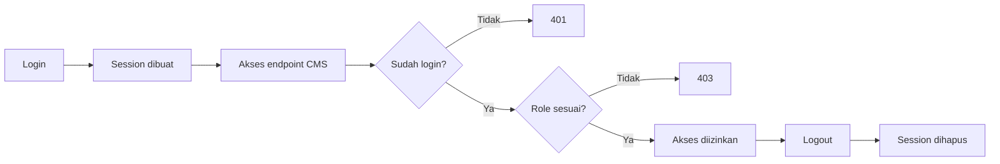
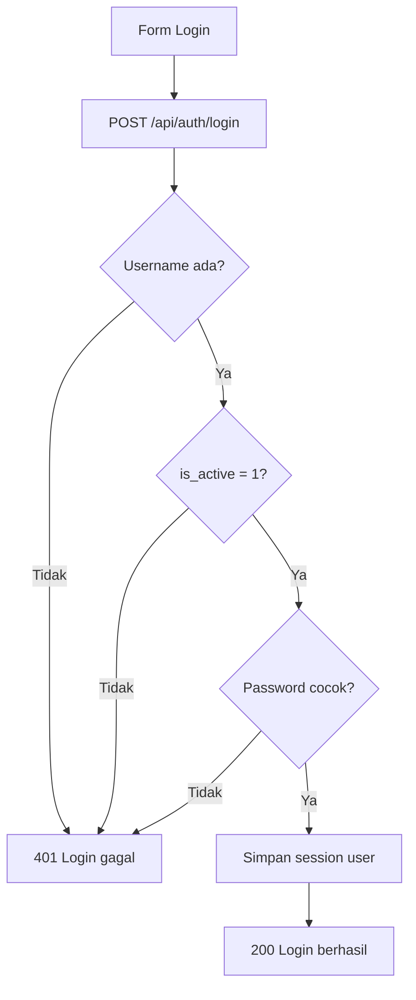
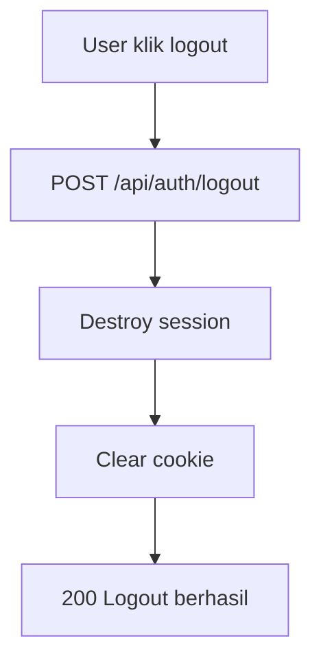

# 8B-Auth Flow: Login/Logout + Middleware Role (Admin/Editor)

Dokumen ini khusus menjelaskan alur autentikasi berbasis tabel `users` pada SQLite.

Mengacu ke struktur di [08a-desain-db.md](08a-desain-db.md) dan API specs di [08b-desain-api.md](08b-desain-api.md).

## Tujuan

1. User bisa login dengan username dan password.
2. Session user tersimpan setelah login.
3. User bisa logout.
4. Endpoint CMS terlindungi middleware auth.
5. Endpoint tertentu terlindungi middleware role (`admin`, `editor`).

## Cara Belajar Bertahap (Versi Siswa SMA)

Agar mudah dipahami, kerjakan auth dalam urutan kecil seperti ini:

1. Pahami dulu data user di database.
2. Buat login sederhana.
3. Cek apakah user sudah login atau belum.
4. Buat logout.
5. Lindungi endpoint dengan middleware login.
6. Batasi hak akses dengan middleware role.

Kalimat sederhana untuk siswa:

"Login itu masuk rumah, middleware itu satpam, role itu kartu akses ruangan."

## Rencana Praktik Per Tahap

### Tahap 1: Siapkan Data User

Target:

1. Ada minimal 1 akun admin di tabel `users`.

Yang dikerjakan:

1. Buat tabel `users` jika belum ada.
2. Buat satu user admin dengan password hash.

Cek berhasil:

1. Data admin terlihat di database.
2. Password tersimpan sebagai hash, bukan teks asli.

### Tahap 2: Setup Session

Target:

1. Server bisa menyimpan status login user.

Yang dikerjakan:

1. Install `express-session`.
2. Tambahkan session middleware ke Express.

Cek berhasil:

1. Setelah login sukses, request berikutnya tetap mengenali user.

### Tahap 3: Buat Endpoint Login

Target:

1. User bisa login dengan username dan password.

Yang dikerjakan:

1. Cari user berdasarkan username.
2. Cek `is_active`.
3. Cek password hash dengan bcrypt.
4. Simpan data user ke session.

Cek berhasil:

1. Login benar -> `200`.
2. Login salah -> `401`.

### Tahap 4: Buat Endpoint `me`

Target:

1. Bisa cek siapa user yang sedang login.

Yang dikerjakan:

1. Buat endpoint `GET /api/auth/me`.
2. Return data user dari session.

Cek berhasil:

1. Sudah login -> tampil data user.
2. Belum login -> `401`.

### Tahap 5: Buat Endpoint Logout

Target:

1. User bisa keluar dari sistem.

Yang dikerjakan:

1. Destroy session.
2. Clear cookie session.

Cek berhasil:

1. Setelah logout, `GET /api/auth/me` kembali `401`.

### Tahap 6: Pasang Middleware `requireAuth`

Target:

1. Endpoint CMS tidak bisa diakses tanpa login.

Yang dikerjakan:

1. Buat fungsi middleware `requireAuth`.
2. Pasang di route CMS.

Cek berhasil:

1. Tanpa login -> `401`.
2. Sudah login -> bisa lanjut.

### Tahap 7: Pasang Middleware `requireRole`

Target:

1. Role admin/editor punya batas hak akses.

Yang dikerjakan:

1. Buat fungsi `requireRole(...roles)`.
2. Pasang di endpoint tertentu.

Cek berhasil:

1. Role tidak sesuai -> `403`.
2. Role sesuai -> boleh akses.

### Tahap 8: Uji Alur End-to-End

Target:

1. Siswa paham alur dari login sampai proteksi endpoint.

Skenario uji:

1. Coba akses endpoint CMS tanpa login (harus gagal `401`).
2. Login sebagai editor.
3. Coba endpoint editor (harus bisa).
4. Coba endpoint admin-only (harus `403`).
5. Logout.
6. Coba akses lagi endpoint CMS (kembali `401`).

## Peta Cepat Alur Auth



## Struktur Data User

Kolom penting dari tabel `users`:

1. `username`
2. `password_hash`
3. `role` (`admin` atau `editor`)
4. `is_active` (1 aktif, 0 nonaktif)

## Gambaran Alur Auth



## Alur Logout



## Middleware yang Dibutuhkan

### 1) `requireAuth`

Fungsi:

1. Cek apakah user sudah login.
2. Jika belum login, return `401`.

Contoh:

```js
function requireAuth(req, res, next) {
  if (!req.session || !req.session.user) {
    return res.status(401).json({
      success: false,
      message: 'Unauthorized'
    });
  }

  next();
}
```

### 2) `requireRole(...roles)`

Fungsi:

1. Cek role user.
2. Jika role tidak sesuai, return `403`.

Contoh:

```js
function requireRole(...allowedRoles) {
  return (req, res, next) => {
    const user = req.session?.user;

    if (!user) {
      return res.status(401).json({
        success: false,
        message: 'Unauthorized'
      });
    }

    if (!allowedRoles.includes(user.role)) {
      return res.status(403).json({
        success: false,
        message: 'Forbidden'
      });
    }

    next();
  };
}
```

## Setup Session (Express)

Pakai `express-session`:

```bash
npm install express-session
```

Contoh setup:

```js
const session = require('express-session');

app.use(
  session({
    secret: process.env.SESSION_SECRET || 'ganti-dengan-secret-kuat',
    resave: false,
    saveUninitialized: false,
    cookie: {
      httpOnly: true,
      maxAge: 1000 * 60 * 60 * 8
    }
  })
);
```

## Login Endpoint

Contoh endpoint login:

```js
const bcrypt = require('bcryptjs');

app.post('/api/auth/login', (req, res) => {
  const { username, password } = req.body;

  const user = db
    .prepare('SELECT * FROM users WHERE username = ? LIMIT 1')
    .get(username);

  if (!user || user.is_active !== 1) {
    return res.status(401).json({
      success: false,
      message: 'Username atau password salah'
    });
  }

  const isMatch = bcrypt.compareSync(password, user.password_hash);

  if (!isMatch) {
    return res.status(401).json({
      success: false,
      message: 'Username atau password salah'
    });
  }

  req.session.user = {
    id: user.id,
    username: user.username,
    role: user.role,
    full_name: user.full_name
  };

  return res.json({
    success: true,
    message: 'Login berhasil',
    data: req.session.user
  });
});
```

## Logout Endpoint

```js
app.post('/api/auth/logout', (req, res) => {
  req.session.destroy((err) => {
    if (err) {
      return res.status(500).json({
        success: false,
        message: 'Gagal logout'
      });
    }

    res.clearCookie('connect.sid');

    return res.json({
      success: true,
      message: 'Logout berhasil'
    });
  });
});
```

## Endpoint `me` (Cek Session)

```js
app.get('/api/auth/me', (req, res) => {
  if (!req.session?.user) {
    return res.status(401).json({
      success: false,
      message: 'Belum login'
    });
  }

  return res.json({
    success: true,
    message: 'OK',
    data: req.session.user
  });
});
```

## Contoh Pemakaian Middleware

Editor atau admin boleh buat berita:

```js
app.post('/api/cms/news', requireAuth, requireRole('admin', 'editor'), (req, res) => {
  // create news
});
```

Hanya admin boleh hapus user:

```js
app.delete('/api/cms/users/:id', requireAuth, requireRole('admin'), (req, res) => {
  // delete user
});
```

## Matrix Hak Akses Sederhana

1. `admin`
1. Login/logout
2. CRUD berita
3. CRUD hero
4. CRUD youtube
5. CRUD menu/settings
6. Kelola user

2. `editor`
1. Login/logout
2. CRUD berita
3. CRUD hero
4. CRUD youtube
5. CRUD menu/settings
6. Tidak boleh kelola user

Versi paling mudah diingat siswa:

1. Admin: boleh semua.
2. Editor: boleh kelola konten, tidak boleh kelola user.

## Seed User Awal

Buat user admin pertama (contoh):

```js
const bcrypt = require('bcryptjs');
const hash = bcrypt.hashSync('admin123', 10);

db.prepare(`
  INSERT INTO users (username, password_hash, full_name, role, is_active)
  VALUES (?, ?, ?, ?, ?)
`).run('admin', hash, 'Administrator', 'admin', 1);
```

## Urutan Implementasi Auth yang Disarankan

1. Tambah paket `express-session` dan `bcryptjs`.
2. Setup session middleware.
3. Buat endpoint `login`.
4. Buat endpoint `logout`.
5. Buat endpoint `me`.
6. Buat middleware `requireAuth`.
7. Buat middleware `requireRole`.
8. Pasang middleware ke endpoint CMS.

## Checklist Uji Auth

1. Login benar -> sukses.
2. Login salah -> `401`.
3. User nonaktif -> `401`.
4. Endpoint CMS tanpa login -> `401`.
5. Endpoint admin oleh editor -> `403`.
6. Logout -> session hilang.

## Tugas Latihan Siswa (Bertahap)

1. Buat akun editor baru dan coba login.
2. Ubah role editor jadi admin, lalu coba endpoint admin lagi.
3. Nonaktifkan user (`is_active = 0`) lalu pastikan login gagal.
4. Tambahkan endpoint test `GET /api/cms/ping` dengan `requireAuth`.
5. Tambahkan endpoint test `DELETE /api/cms/users/:id` dengan `requireRole('admin')`.

## Kesimpulan

Auth flow ini sudah cukup untuk CMS skala belajar dan sekolah: aman dasar, mudah dipahami, dan langsung nyambung ke tabel `users` di SQLite.
