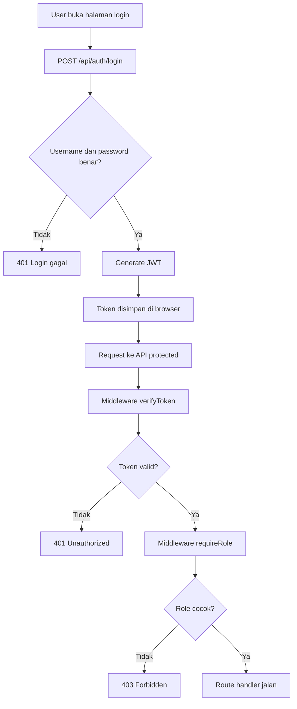

# 08c. CMS dengan JWT (Dari Awal)

Materi ini adalah lanjutan dari auth session di 08b.
Sekarang kita belajar model auth modern untuk API: JWT (JSON Web Token).

Target akhir:

1. Login lewat API.
2. Dapat token JWT.
3. Token dipakai untuk akses endpoint protected.
4. Role `superadmin` bisa CRUD user.
5. Role `user` bisa baca halaman user.
6. Ada unit test.
7. Ada web page sederhana sebagai client.

## Tujuan Belajar

Setelah materi ini, siswa bisa:

1. Memahami konsep JWT secara sederhana.
2. Mendesain database dasar untuk CMS auth.
3. Membuat API login + middleware auth JWT.
4. Membuat middleware role (`superadmin` dan `user`).
5. Menulis unit test API.
6. Menyambungkan web page ke API JWT.

## Konsep JWT untuk Anak SMA

Bayangkan JWT seperti kartu akses digital.

1. Kamu login di gerbang.
2. Server kasih kartu akses (token).
3. Setiap masuk ruangan tertentu, kamu tunjukkan kartu itu.
4. Security (middleware) cek kartunya valid atau tidak.

Jika valid: boleh lanjut.
Jika tidak valid: ditolak (401).

## Arsitektur Singkat

1. Backend API: Express + SQLite + JWT.
2. Frontend web: Handlebars (atau HTML + JS).
3. Auth: bearer token di header `Authorization`.

## Flowchart Aplikasi



## Desain Database

Kita pakai 2 tabel inti:

1. `tb_users`: akun dan role.
2. `tb_posts`: konten CMS sederhana.

### SQL Desain Tabel

```sql
CREATE TABLE IF NOT EXISTS tb_users (
	id INTEGER PRIMARY KEY AUTOINCREMENT,
	username TEXT NOT NULL UNIQUE,
	password_hash TEXT NOT NULL,
	role TEXT NOT NULL CHECK(role IN ('superadmin', 'user')),
	nama TEXT NOT NULL,
	created_at TEXT NOT NULL DEFAULT CURRENT_TIMESTAMP
);

CREATE TABLE IF NOT EXISTS tb_posts (
	id INTEGER PRIMARY KEY AUTOINCREMENT,
	title TEXT NOT NULL,
	content TEXT NOT NULL,
	author_id INTEGER NOT NULL,
	created_at TEXT NOT NULL DEFAULT CURRENT_TIMESTAMP,
	updated_at TEXT,
	FOREIGN KEY(author_id) REFERENCES tb_users(id)
);
```

## Struktur Folder Project

```text
project-cms-jwt/
├── package.json
├── app.js
├── server.js
├── config/
│   └── env.js
├── db/
│   ├── cms-jwt.db
│   └── init.js
├── middleware/
│   ├── logger.js
│   ├── verify-token.js
│   └── require-role.js
├── routes/
│   ├── auth.routes.js
│   ├── users.routes.js
│   └── posts.routes.js
├── views/
│   ├── layouts/main.handlebars
│   ├── login.handlebars
│   ├── dashboard.handlebars
│   └── admin-users.handlebars
├── public/
│   └── app.js
└── tests/
		├── auth.test.js
		└── role.test.js
```

## Langkah 1: Install Dependency

```bash
npm install express express-handlebars better-sqlite3 jsonwebtoken bcryptjs dotenv
npm install -D vitest supertest nodemon
```

## Langkah 2: Konfigurasi package.json

```json
{
	"name": "cms-jwt",
	"version": "1.0.0",
	"main": "server.js",
	"scripts": {
		"dev": "nodemon server.js",
		"start": "node server.js",
		"test": "vitest run"
	}
}
```

## Langkah 3: Inisialisasi DB + Seed Data

Contoh `db/init.js`:

```js
const path = require('path');
const Database = require('better-sqlite3');
const bcrypt = require('bcryptjs');

const db = new Database(path.join(__dirname, 'cms-jwt.db'));

db.exec(`
CREATE TABLE IF NOT EXISTS tb_users (
	id INTEGER PRIMARY KEY AUTOINCREMENT,
	username TEXT NOT NULL UNIQUE,
	password_hash TEXT NOT NULL,
	role TEXT NOT NULL CHECK(role IN ('superadmin', 'user')),
	nama TEXT NOT NULL,
	created_at TEXT NOT NULL DEFAULT CURRENT_TIMESTAMP
);

CREATE TABLE IF NOT EXISTS tb_posts (
	id INTEGER PRIMARY KEY AUTOINCREMENT,
	title TEXT NOT NULL,
	content TEXT NOT NULL,
	author_id INTEGER NOT NULL,
	created_at TEXT NOT NULL DEFAULT CURRENT_TIMESTAMP,
	updated_at TEXT,
	FOREIGN KEY(author_id) REFERENCES tb_users(id)
);
`);

const userCount = db.prepare('SELECT COUNT(*) AS total FROM tb_users').get().total;
if (userCount === 0) {
	const insert = db.prepare(
		'INSERT INTO tb_users (username, password_hash, role, nama) VALUES (?, ?, ?, ?)'
	);

	insert.run('admin', bcrypt.hashSync('admin', 10), 'superadmin', 'Super Admin');
	insert.run('user1', bcrypt.hashSync('user1', 10), 'user', 'User Satu');
}

module.exports = db;
```

## Langkah 4: Middleware

### logger middleware

```js
function logger(req, res, next) {
	const start = Date.now();
	res.on('finish', () => {
		const ms = Date.now() - start;
		console.log(`[${new Date().toISOString()}] ${req.method} ${req.originalUrl} ${res.statusCode} (${ms}ms)`);
	});
	next();
}

module.exports = logger;
```

### verify-token middleware

```js
const jwt = require('jsonwebtoken');

function verifyToken(req, res, next) {
	const authHeader = req.headers.authorization || '';
	const [scheme, token] = authHeader.split(' ');

	if (scheme !== 'Bearer' || !token) {
		return res.status(401).json({ message: 'Token tidak ada' });
	}

	try {
		const payload = jwt.verify(token, process.env.JWT_SECRET || 'jwt-rahasia-latihan');
		req.user = payload;
		return next();
	} catch (err) {
		return res.status(401).json({ message: 'Token tidak valid' });
	}
}

module.exports = verifyToken;
```

### require-role middleware

```js
function requireRole(...allowedRoles) {
	return (req, res, next) => {
		if (!req.user) {
			return res.status(401).json({ message: 'Belum login' });
		}

		if (!allowedRoles.includes(req.user.role)) {
			return res.status(403).json({ message: 'Role tidak diizinkan' });
		}

		return next();
	};
}

module.exports = requireRole;
```

## Langkah 5: Pembuatan API dengan Middleware

### auth.routes.js

```js
const express = require('express');
const bcrypt = require('bcryptjs');
const jwt = require('jsonwebtoken');
const db = require('../db/init');

const router = express.Router();

router.post('/login', (req, res) => {
	const { username, password } = req.body;

	const user = db.prepare(
		'SELECT id, username, role, nama, password_hash FROM tb_users WHERE username = ?'
	).get(username);

	if (!user) {
		return res.status(401).json({ message: 'Username atau password salah' });
	}

	const cocok = bcrypt.compareSync(password, user.password_hash);
	if (!cocok) {
		return res.status(401).json({ message: 'Username atau password salah' });
	}

	const token = jwt.sign(
		{ id: user.id, username: user.username, role: user.role, nama: user.nama },
		process.env.JWT_SECRET || 'jwt-rahasia-latihan',
		{ expiresIn: '2h' }
	);

	return res.json({
		message: 'Login berhasil',
		token,
		user: {
			id: user.id,
			username: user.username,
			role: user.role,
			nama: user.nama
		}
	});
});

module.exports = router;
```

### users.routes.js (hanya superadmin)

```js
const express = require('express');
const bcrypt = require('bcryptjs');
const db = require('../db/init');
const verifyToken = require('../middleware/verify-token');
const requireRole = require('../middleware/require-role');

const router = express.Router();

router.use(verifyToken, requireRole('superadmin'));

router.get('/', (req, res) => {
	const users = db.prepare(
		'SELECT id, username, role, nama, created_at FROM tb_users ORDER BY id DESC'
	).all();
	return res.json(users);
});

router.post('/', (req, res) => {
	const { username, password, role, nama } = req.body;
	const hash = bcrypt.hashSync(password, 10);
	const info = db.prepare(
		'INSERT INTO tb_users (username, password_hash, role, nama) VALUES (?, ?, ?, ?)'
	).run(username, hash, role, nama);
	return res.status(201).json({ id: info.lastInsertRowid, message: 'User dibuat' });
});

module.exports = router;
```

### posts.routes.js (superadmin dan user bisa baca, superadmin create)

```js
const express = require('express');
const db = require('../db/init');
const verifyToken = require('../middleware/verify-token');
const requireRole = require('../middleware/require-role');

const router = express.Router();

router.get('/', verifyToken, requireRole('superadmin', 'user'), (req, res) => {
	const posts = db.prepare(
		'SELECT p.id, p.title, p.content, p.created_at, u.nama AS author FROM tb_posts p JOIN tb_users u ON u.id = p.author_id ORDER BY p.id DESC'
	).all();
	return res.json(posts);
});

router.post('/', verifyToken, requireRole('superadmin'), (req, res) => {
	const { title, content } = req.body;
	const info = db.prepare(
		'INSERT INTO tb_posts (title, content, author_id) VALUES (?, ?, ?)'
	).run(title, content, req.user.id);
	return res.status(201).json({ id: info.lastInsertRowid, message: 'Post dibuat' });
});

module.exports = router;
```

## Langkah 6: app.js dan server.js

### app.js

```js
const path = require('path');
const express = require('express');
const { engine } = require('express-handlebars');

const logger = require('./middleware/logger');
const authRoutes = require('./routes/auth.routes');
const userRoutes = require('./routes/users.routes');
const postRoutes = require('./routes/posts.routes');

const app = express();

app.engine('handlebars', engine());
app.set('view engine', 'handlebars');
app.set('views', path.join(__dirname, 'views'));

app.use(express.json());
app.use(express.urlencoded({ extended: true }));
app.use(express.static(path.join(__dirname, 'public')));
app.use(logger);

app.get('/', (req, res) => res.render('login', { title: 'Login JWT CMS' }));
app.get('/dashboard', (req, res) => res.render('dashboard', { title: 'Dashboard JWT CMS' }));
app.get('/admin/users-page', (req, res) => res.render('admin-users', { title: 'Admin Users' }));

app.use('/api/auth', authRoutes);
app.use('/api/users', userRoutes);
app.use('/api/posts', postRoutes);

module.exports = app;
```

### server.js

```js
require('dotenv').config();
const app = require('./app');

const PORT = process.env.PORT || 3000;
app.listen(PORT, () => {
	console.log(`Server jalan di http://localhost:${PORT}`);
});
```

## Desain API Endpoint

| Method | Endpoint | Auth | Role |
|---|---|---|---|
| POST | /api/auth/login | Tidak | - |
| GET | /api/users | Ya | superadmin |
| POST | /api/users | Ya | superadmin |
| GET | /api/posts | Ya | superadmin, user |
| POST | /api/posts | Ya | superadmin |

## Rest Client Testing (JWT)

File `test-jwt-cms.http`:

```http
@baseUrl = http://localhost:3000

### Login superadmin
POST {{baseUrl}}/api/auth/login
Content-Type: application/json

{
	"username": "admin",
	"password": "admin"
}

### Ambil users (ganti TOKEN_SUPERADMIN)
GET {{baseUrl}}/api/users
Authorization: Bearer TOKEN_SUPERADMIN

### Login user1
POST {{baseUrl}}/api/auth/login
Content-Type: application/json

{
	"username": "user1",
	"password": "user1"
}

### User1 coba akses admin users (harus 403)
GET {{baseUrl}}/api/users
Authorization: Bearer TOKEN_USER1

### User1 baca posts (boleh)
GET {{baseUrl}}/api/posts
Authorization: Bearer TOKEN_USER1
```

## Implementasi Unit Test

Kita pakai `vitest` + `supertest`.

### tests/auth.test.js

```js
const request = require('supertest');
const { describe, it, expect } = require('vitest');
const app = require('../app');

describe('JWT Auth API', () => {
	it('login admin berhasil dan mendapat token', async () => {
		const res = await request(app)
			.post('/api/auth/login')
			.send({ username: 'admin', password: 'admin' });

		expect(res.status).toBe(200);
		expect(res.body.token).toBeTruthy();
		expect(res.body.user.role).toBe('superadmin');
	});

	it('login salah harus 401', async () => {
		const res = await request(app)
			.post('/api/auth/login')
			.send({ username: 'admin', password: 'salah' });

		expect(res.status).toBe(401);
	});
});
```

### tests/role.test.js

```js
const request = require('supertest');
const { describe, it, expect } = require('vitest');
const app = require('../app');

async function login(username, password) {
	const res = await request(app).post('/api/auth/login').send({ username, password });
	return res.body.token;
}

describe('Role Authorization', () => {
	it('user biasa ditolak akses /api/users', async () => {
		const token = await login('user1', 'user1');
		const res = await request(app)
			.get('/api/users')
			.set('Authorization', `Bearer ${token}`);

		expect(res.status).toBe(403);
	});

	it('superadmin boleh akses /api/users', async () => {
		const token = await login('admin', 'admin');
		const res = await request(app)
			.get('/api/users')
			.set('Authorization', `Bearer ${token}`);

		expect(res.status).toBe(200);
	});
});
```

Jalankan test:

```bash
npm test
```

## Web Page Sederhana (Client)

Tujuan halaman web:

1. Login dari form.
2. Simpan token JWT di `localStorage`.
3. Panggil API dengan header `Authorization`.
4. Tampilkan data users/posts.

### views/login.handlebars

```handlebars
<section>
	<h1>Login JWT CMS</h1>
	<form id="loginForm">
		<input name="username" placeholder="username" required />
		<input name="password" placeholder="password" type="password" required />
		<button type="submit">Login</button>
	</form>
	<p id="msg"></p>
</section>
<script src="/app.js"></script>
```

### views/dashboard.handlebars

```handlebars
<section>
	<h1>Dashboard JWT CMS</h1>
	<button id="btnLoadPosts">Load Posts</button>
	<button id="btnLoadUsers">Load Users (Superadmin)</button>
	<button id="btnLogout">Logout</button>
	<pre id="output"></pre>
</section>
<script src="/app.js"></script>
```

### public/app.js

```js
const tokenKey = 'cms_jwt_token';

async function loginHandler(e) {
	e.preventDefault();
	const form = e.target;
	const username = form.username.value;
	const password = form.password.value;

	const res = await fetch('/api/auth/login', {
		method: 'POST',
		headers: { 'Content-Type': 'application/json' },
		body: JSON.stringify({ username, password })
	});

	const data = await res.json();
	if (!res.ok) {
		document.getElementById('msg').textContent = data.message || 'Login gagal';
		return;
	}

	localStorage.setItem(tokenKey, data.token);
	window.location.href = '/dashboard';
}

async function apiGet(path) {
	const token = localStorage.getItem(tokenKey);
	const res = await fetch(path, {
		headers: { Authorization: `Bearer ${token}` }
	});
	const data = await res.json();
	return { ok: res.ok, status: res.status, data };
}

function setupDashboard() {
	const output = document.getElementById('output');
	const btnPosts = document.getElementById('btnLoadPosts');
	const btnUsers = document.getElementById('btnLoadUsers');
	const btnLogout = document.getElementById('btnLogout');
	if (!output) return;

	btnPosts.addEventListener('click', async () => {
		const result = await apiGet('/api/posts');
		output.textContent = JSON.stringify(result, null, 2);
	});

	btnUsers.addEventListener('click', async () => {
		const result = await apiGet('/api/users');
		output.textContent = JSON.stringify(result, null, 2);
	});

	btnLogout.addEventListener('click', () => {
		localStorage.removeItem(tokenKey);
		window.location.href = '/';
	});
}

const form = document.getElementById('loginForm');
if (form) form.addEventListener('submit', loginHandler);
setupDashboard();
```

## Hasil Akhir Web (Yang Diharapkan)

Jika implementasi benar, hasil web seperti ini:

1. Halaman `/` menampilkan form login.
2. Login `admin/admin` masuk dashboard.
3. Tombol `Load Users` berhasil untuk admin.
4. Login `user1/user1` tetap bisa `Load Posts`, tapi gagal `Load Users` (403).
5. Logout menghapus token dan kembali ke login.

## Ringkasan Penting

1. JWT dipakai sebagai kartu akses API.
2. Middleware `verifyToken` mengecek token.
3. Middleware `requireRole` mengecek hak akses.
4. Unit test membantu memastikan login dan role tidak rusak saat kode berubah.
5. Frontend cukup simpan token, lalu kirim di header `Authorization`.

## Catatan Keamanan Lanjutan

1. Simpan `JWT_SECRET` di `.env`, jangan hardcode di production.
2. Password wajib hash (bcrypt), jangan plain text.
3. Gunakan HTTPS untuk melindungi token saat transit.
4. Untuk aplikasi besar, pertimbangkan refresh token.


## Kunci Jawaban:

Bagian ini berisi versi final semua file agar mudah langsung dipraktikkan.

## 1) Struktur Folder Final

```text
project-cms-jwt/
├── package.json
├── .env
├── app.js
├── server.js
├── db/
│   ├── init.js
│   └── cms-jwt.db
├── middleware/
│   ├── logger.js
│   ├── verify-token.js
│   └── require-role.js
├── routes/
│   ├── auth.routes.js
│   ├── users.routes.js
│   └── posts.routes.js
├── views/
│   ├── layouts/
│   │   └── main.handlebars
│   ├── login.handlebars
│   ├── dashboard.handlebars
│   └── admin-users.handlebars
├── public/
│   └── app.js
├── tests/
│   ├── auth.test.js
│   └── role.test.js
└── test-jwt-cms.http
```

## 2) Semua File

### package.json

```json
{
	"name": "cms-jwt",
	"version": "1.0.0",
	"description": "CMS JWT sederhana untuk pembelajaran",
	"main": "server.js",
	"scripts": {
		"dev": "nodemon server.js",
		"start": "node server.js",
		"test": "vitest run"
	},
	"dependencies": {
		"bcryptjs": "^2.4.3",
		"better-sqlite3": "^11.1.2",
		"dotenv": "^16.4.5",
		"express": "^4.19.2",
		"express-handlebars": "^7.1.2",
		"jsonwebtoken": "^9.0.2"
	},
	"devDependencies": {
		"nodemon": "^3.1.4",
		"supertest": "^7.0.0",
		"vitest": "^2.0.5"
	}
}
```

### .env

```env
PORT=3000
JWT_SECRET=jwt-rahasia-latihan
```

### app.js

```js
const path = require('path');
const express = require('express');
const { engine } = require('express-handlebars');

const logger = require('./middleware/logger');
const authRoutes = require('./routes/auth.routes');
const userRoutes = require('./routes/users.routes');
const postRoutes = require('./routes/posts.routes');

const app = express();

app.engine('handlebars', engine());
app.set('view engine', 'handlebars');
app.set('views', path.join(__dirname, 'views'));

app.use(express.json());
app.use(express.urlencoded({ extended: true }));
app.use(express.static(path.join(__dirname, 'public')));
app.use(logger);

app.get('/', (req, res) => {
	res.render('login', { title: 'Login JWT CMS' });
});

app.get('/dashboard', (req, res) => {
	res.render('dashboard', { title: 'Dashboard JWT CMS' });
});

app.get('/admin/users-page', (req, res) => {
	res.render('admin-users', { title: 'Admin Users Page' });
});

app.use('/api/auth', authRoutes);
app.use('/api/users', userRoutes);
app.use('/api/posts', postRoutes);

module.exports = app;
```

### server.js

```js
require('dotenv').config();
const app = require('./app');

const PORT = process.env.PORT || 3000;

app.listen(PORT, () => {
	console.log(`Server jalan di http://localhost:${PORT}`);
});
```

### db/init.js

```js
const path = require('path');
const Database = require('better-sqlite3');
const bcrypt = require('bcryptjs');

const db = new Database(path.join(__dirname, 'cms-jwt.db'));

db.exec(`
CREATE TABLE IF NOT EXISTS tb_users (
	id INTEGER PRIMARY KEY AUTOINCREMENT,
	username TEXT NOT NULL UNIQUE,
	password_hash TEXT NOT NULL,
	role TEXT NOT NULL CHECK(role IN ('superadmin', 'user')),
	nama TEXT NOT NULL,
	created_at TEXT NOT NULL DEFAULT CURRENT_TIMESTAMP
);

CREATE TABLE IF NOT EXISTS tb_posts (
	id INTEGER PRIMARY KEY AUTOINCREMENT,
	title TEXT NOT NULL,
	content TEXT NOT NULL,
	author_id INTEGER NOT NULL,
	created_at TEXT NOT NULL DEFAULT CURRENT_TIMESTAMP,
	updated_at TEXT,
	FOREIGN KEY(author_id) REFERENCES tb_users(id)
);
`);

const totalUsers = db.prepare('SELECT COUNT(*) AS total FROM tb_users').get().total;

if (totalUsers === 0) {
	const insertUser = db.prepare(
		'INSERT INTO tb_users (username, password_hash, role, nama) VALUES (?, ?, ?, ?)'
	);

	insertUser.run('admin', bcrypt.hashSync('admin', 10), 'superadmin', 'Super Admin');
	insertUser.run('user1', bcrypt.hashSync('user1', 10), 'user', 'User Satu');
}

const totalPosts = db.prepare('SELECT COUNT(*) AS total FROM tb_posts').get().total;

if (totalPosts === 0) {
	const admin = db.prepare('SELECT id FROM tb_users WHERE username = ?').get('admin');
	if (admin) {
		db.prepare('INSERT INTO tb_posts (title, content, author_id) VALUES (?, ?, ?)').run(
			'Selamat Datang',
			'Ini post pertama di CMS JWT.',
			admin.id
		);
	}
}

module.exports = db;
```

### middleware/logger.js

```js
function logger(req, res, next) {
	const start = Date.now();

	res.on('finish', () => {
		const ms = Date.now() - start;
		console.log(`[${new Date().toISOString()}] ${req.method} ${req.originalUrl} ${res.statusCode} (${ms}ms)`);
	});

	next();
}

module.exports = logger;
```

### middleware/verify-token.js

```js
const jwt = require('jsonwebtoken');

function verifyToken(req, res, next) {
	const authHeader = req.headers.authorization || '';
	const [scheme, token] = authHeader.split(' ');

	if (scheme !== 'Bearer' || !token) {
		return res.status(401).json({ message: 'Token tidak ada' });
	}

	try {
		const payload = jwt.verify(token, process.env.JWT_SECRET || 'jwt-rahasia-latihan');
		req.user = payload;
		return next();
	} catch (err) {
		return res.status(401).json({ message: 'Token tidak valid' });
	}
}

module.exports = verifyToken;
```

### middleware/require-role.js

```js
function requireRole() {
	const allowedRoles = Array.from(arguments);

	return (req, res, next) => {
		if (!req.user) {
			return res.status(401).json({ message: 'Belum login' });
		}

		if (!allowedRoles.includes(req.user.role)) {
			return res.status(403).json({ message: 'Role tidak diizinkan' });
		}

		return next();
	};
}

module.exports = requireRole;
```

### routes/auth.routes.js

```js
const express = require('express');
const bcrypt = require('bcryptjs');
const jwt = require('jsonwebtoken');
const db = require('../db/init');

const router = express.Router();

router.post('/login', (req, res) => {
	const { username, password } = req.body;

	const user = db
		.prepare('SELECT id, username, role, nama, password_hash FROM tb_users WHERE username = ?')
		.get(username);

	if (!user) {
		return res.status(401).json({ message: 'Username atau password salah' });
	}

	const valid = bcrypt.compareSync(password, user.password_hash);
	if (!valid) {
		return res.status(401).json({ message: 'Username atau password salah' });
	}

	const token = jwt.sign(
		{
			id: user.id,
			username: user.username,
			role: user.role,
			nama: user.nama
		},
		process.env.JWT_SECRET || 'jwt-rahasia-latihan',
		{ expiresIn: '2h' }
	);

	return res.json({
		message: 'Login berhasil',
		token,
		user: {
			id: user.id,
			username: user.username,
			role: user.role,
			nama: user.nama
		}
	});
});

module.exports = router;
```

### routes/users.routes.js

```js
const express = require('express');
const bcrypt = require('bcryptjs');
const db = require('../db/init');
const verifyToken = require('../middleware/verify-token');
const requireRole = require('../middleware/require-role');

const router = express.Router();

router.use(verifyToken, requireRole('superadmin'));

router.get('/', (req, res) => {
	const users = db
		.prepare('SELECT id, username, role, nama, created_at FROM tb_users ORDER BY id DESC')
		.all();

	return res.json(users);
});

router.post('/', (req, res) => {
	const { username, password, role, nama } = req.body;

	if (!username || !password || !role || !nama) {
		return res.status(400).json({ message: 'Data belum lengkap' });
	}

	const hash = bcrypt.hashSync(password, 10);

	const info = db
		.prepare('INSERT INTO tb_users (username, password_hash, role, nama) VALUES (?, ?, ?, ?)')
		.run(username, hash, role, nama);

	return res.status(201).json({
		message: 'User dibuat',
		id: info.lastInsertRowid
	});
});

module.exports = router;
```

### routes/posts.routes.js

```js
const express = require('express');
const db = require('../db/init');
const verifyToken = require('../middleware/verify-token');
const requireRole = require('../middleware/require-role');

const router = express.Router();

router.get('/', verifyToken, requireRole('superadmin', 'user'), (req, res) => {
	const posts = db
		.prepare(
			'SELECT p.id, p.title, p.content, p.created_at, u.nama AS author FROM tb_posts p JOIN tb_users u ON u.id = p.author_id ORDER BY p.id DESC'
		)
		.all();

	return res.json(posts);
});

router.post('/', verifyToken, requireRole('superadmin'), (req, res) => {
	const { title, content } = req.body;

	if (!title || !content) {
		return res.status(400).json({ message: 'Title dan content wajib diisi' });
	}

	const info = db
		.prepare('INSERT INTO tb_posts (title, content, author_id) VALUES (?, ?, ?)')
		.run(title, content, req.user.id);

	return res.status(201).json({
		message: 'Post dibuat',
		id: info.lastInsertRowid
	});
});

module.exports = router;
```

### views/layouts/main.handlebars

```handlebars
<!doctype html>
<html lang="id">
<head>
	<meta charset="UTF-8" />
	<meta name="viewport" content="width=device-width, initial-scale=1.0" />
	<title>{{title}}</title>
	<style>
		body {
			font-family: sans-serif;
			max-width: 900px;
			margin: 24px auto;
			padding: 0 16px;
		}
		.card {
			border: 1px solid #ddd;
			border-radius: 10px;
			padding: 16px;
			margin-bottom: 12px;
		}
		input, button {
			padding: 8px;
			margin: 6px 0;
		}
		pre {
			background: #f5f5f5;
			padding: 10px;
			border-radius: 8px;
			overflow-x: auto;
		}
	</style>
</head>
<body>
	{{{body}}}
</body>
</html>
```

### views/login.handlebars

```handlebars
<section class="card">
	<h1>Login JWT CMS</h1>
	<p>Akun awal: admin/admin dan user1/user1</p>

	<form id="loginForm">
		<div>
			<input type="text" name="username" placeholder="username" required />
		</div>
		<div>
			<input type="password" name="password" placeholder="password" required />
		</div>
		<button type="submit">Login</button>
	</form>

	<p id="msg"></p>
</section>

<script src="/app.js"></script>
```

### views/dashboard.handlebars

```handlebars
<section class="card">
	<h1>Dashboard JWT CMS</h1>
	<button id="btnLoadPosts">Load Posts</button>
	<button id="btnLoadUsers">Load Users (Superadmin)</button>
	<button id="btnLogout">Logout</button>
</section>

<section class="card">
	<pre id="output">Klik tombol untuk load data...</pre>
</section>

<script src="/app.js"></script>
```

### views/admin-users.handlebars

```handlebars
<section class="card">
	<h1>Admin Users Page</h1>
	<p>Halaman ini bisa dipakai untuk integrasi UI CRUD user berikutnya.</p>
	<a href="/dashboard">Kembali ke dashboard</a>
</section>
```

### public/app.js

```js
const tokenKey = 'cms_jwt_token';

async function loginHandler(e) {
	e.preventDefault();

	const form = e.target;
	const username = form.username.value;
	const password = form.password.value;

	const res = await fetch('/api/auth/login', {
		method: 'POST',
		headers: { 'Content-Type': 'application/json' },
		body: JSON.stringify({ username, password })
	});

	const data = await res.json();

	if (!res.ok) {
		document.getElementById('msg').textContent = data.message || 'Login gagal';
		return;
	}

	localStorage.setItem(tokenKey, data.token);
	window.location.href = '/dashboard';
}

async function apiGet(path) {
	const token = localStorage.getItem(tokenKey);
	const res = await fetch(path, {
		headers: {
			Authorization: `Bearer ${token}`
		}
	});
	const data = await res.json();
	return { ok: res.ok, status: res.status, data };
}

function setupDashboard() {
	const output = document.getElementById('output');
	const btnLoadPosts = document.getElementById('btnLoadPosts');
	const btnLoadUsers = document.getElementById('btnLoadUsers');
	const btnLogout = document.getElementById('btnLogout');

	if (!output) return;

	btnLoadPosts.addEventListener('click', async () => {
		const result = await apiGet('/api/posts');
		output.textContent = JSON.stringify(result, null, 2);
	});

	btnLoadUsers.addEventListener('click', async () => {
		const result = await apiGet('/api/users');
		output.textContent = JSON.stringify(result, null, 2);
	});

	btnLogout.addEventListener('click', () => {
		localStorage.removeItem(tokenKey);
		window.location.href = '/';
	});
}

const loginForm = document.getElementById('loginForm');
if (loginForm) {
	loginForm.addEventListener('submit', loginHandler);
}

setupDashboard();
```

### tests/auth.test.js

```js
const request = require('supertest');
const { describe, it, expect } = require('vitest');
const app = require('../app');

describe('JWT Auth API', () => {
	it('login admin berhasil dan mendapat token', async () => {
		const res = await request(app)
			.post('/api/auth/login')
			.send({ username: 'admin', password: 'admin' });

		expect(res.status).toBe(200);
		expect(res.body.token).toBeTruthy();
		expect(res.body.user.role).toBe('superadmin');
	});

	it('login salah harus 401', async () => {
		const res = await request(app)
			.post('/api/auth/login')
			.send({ username: 'admin', password: 'salah' });

		expect(res.status).toBe(401);
	});
});
```

### tests/role.test.js

```js
const request = require('supertest');
const { describe, it, expect } = require('vitest');
const app = require('../app');

async function login(username, password) {
	const res = await request(app)
		.post('/api/auth/login')
		.send({ username, password });

	return res.body.token;
}

describe('Role Authorization', () => {
	it('user biasa ditolak akses /api/users', async () => {
		const token = await login('user1', 'user1');

		const res = await request(app)
			.get('/api/users')
			.set('Authorization', `Bearer ${token}`);

		expect(res.status).toBe(403);
	});

	it('superadmin boleh akses /api/users', async () => {
		const token = await login('admin', 'admin');

		const res = await request(app)
			.get('/api/users')
			.set('Authorization', `Bearer ${token}`);

		expect(res.status).toBe(200);
	});
});
```

### test-jwt-cms.http

```http
@baseUrl = http://localhost:3000

### Login superadmin
POST {{baseUrl}}/api/auth/login
Content-Type: application/json

{
	"username": "admin",
	"password": "admin"
}

### Ambil users (ganti TOKEN_SUPERADMIN)
GET {{baseUrl}}/api/users
Authorization: Bearer TOKEN_SUPERADMIN

### Buat user baru (superadmin)
POST {{baseUrl}}/api/users
Content-Type: application/json
Authorization: Bearer TOKEN_SUPERADMIN

{
	"username": "user2",
	"password": "user2",
	"role": "user",
	"nama": "User Dua"
}

### Login user1
POST {{baseUrl}}/api/auth/login
Content-Type: application/json

{
	"username": "user1",
	"password": "user1"
}

### User1 coba akses admin users (harus 403)
GET {{baseUrl}}/api/users
Authorization: Bearer TOKEN_USER1

### User1 baca posts (boleh)
GET {{baseUrl}}/api/posts
Authorization: Bearer TOKEN_USER1
```

## 3) Urutan Menjalankan Project

1. Jalankan `npm install`.
2. Pastikan `.env` sudah ada.
3. Jalankan `npm run dev`.
4. Buka `http://localhost:3000`.
5. Uji API pakai `test-jwt-cms.http`.
6. Jalankan `npm test` untuk unit test.

