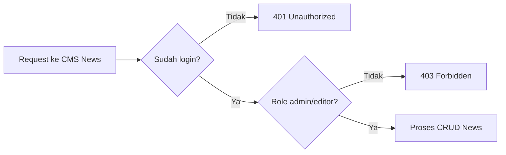

# 8D. Implementasi CMS News Bertahap (CRUD + Proteksi Auth Role)

Dokumen ini lanjutan dari:

1. [08c-implementasi-auth-api.md](08c-implementasi-auth-api.md)
2. [08b-desain-api.md](08b-desain-api.md)

Fokus dokumen:

1. Membuat CRUD berita di endpoint CMS.
2. Semua endpoint langsung dilindungi login (`requireAuth`).
3. Akses role dibatasi (`requireRole('admin', 'editor')`).

## Hasil Akhir yang Ingin Dicapai

Siswa punya endpoint ini:

1. GET `/api/cms/news` (list)
2. GET `/api/cms/news/:id` (detail)
3. POST `/api/cms/news` (create)
4. PUT `/api/cms/news/:id` (update)
5. DELETE `/api/cms/news/:id` (delete)

Semua endpoint di atas hanya bisa dipakai oleh user login role `admin` atau `editor`.

## Alur Sederhana untuk Siswa



## Tahap 1 - Pastikan Auth dari 08C Sudah Ada

Wajib sudah ada di server:

1. Session middleware
2. `requireAuth`
3. `requireRole(...roles)`
4. Endpoint login agar bisa testing

Kalau 4 poin ini belum siap, selesaikan dulu [08c-implementasi-auth-api.md](08c-implementasi-auth-api.md).

## Tahap 2 - Buat Tabel `news`

Tambahkan SQL ini (sekali, saat startup server):

```js
db.exec(`
  CREATE TABLE IF NOT EXISTS news (
    id INTEGER PRIMARY KEY AUTOINCREMENT,
    title TEXT NOT NULL,
    slug TEXT NOT NULL UNIQUE,
    summary TEXT,
    content TEXT NOT NULL,
    image TEXT,
    category TEXT,
    status TEXT NOT NULL DEFAULT 'draft' CHECK(status IN ('draft', 'publish')),
    published_at TEXT,
    author_id INTEGER,
    created_at TEXT NOT NULL DEFAULT (datetime('now','localtime')),
    updated_at TEXT,
    FOREIGN KEY (author_id) REFERENCES users(id)
  )
`);

db.exec(`
  CREATE INDEX IF NOT EXISTS idx_news_status ON news(status);
  CREATE INDEX IF NOT EXISTS idx_news_slug ON news(slug);
  CREATE INDEX IF NOT EXISTS idx_news_published_at ON news(published_at);
`);
```

Cek:

1. Server berjalan tanpa error SQL.
2. Tabel `news` muncul di database.

## Tahap 3 - Helper Validasi dan Slug

Tambahkan helper sederhana:

```js
function slugify(text) {
  return String(text)
    .toLowerCase()
    .trim()
    .replace(/[^a-z0-9\s-]/g, '')
    .replace(/\s+/g, '-')
    .replace(/-+/g, '-');
}

function validateNewsInput(body) {
  const errors = {};

  if (!body.title || !body.title.trim()) {
    errors.title = 'Judul wajib diisi';
  }

  if (!body.content || !body.content.trim()) {
    errors.content = 'Konten wajib diisi';
  }

  if (body.status && !['draft', 'publish'].includes(body.status)) {
    errors.status = 'Status hanya boleh draft atau publish';
  }

  return errors;
}
```

## Tahap 4 - GET List News (Protected)

Tambahkan route:

```js
app.get('/api/cms/news', requireAuth, requireRole('admin', 'editor'), (req, res) => {
  const rows = db
    .prepare(`
      SELECT n.id, n.title, n.slug, n.category, n.status, n.published_at, n.created_at,
             u.username AS author_username
      FROM news n
      LEFT JOIN users u ON u.id = n.author_id
      ORDER BY n.id DESC
    `)
    .all();

  return res.json({
    success: true,
    message: 'OK',
    data: rows
  });
});
```

Cek:

1. Tanpa login -> `401`
2. Login admin/editor -> dapat data list

## Tahap 5 - GET Detail News by ID (Protected)

Tambahkan route:

```js
app.get('/api/cms/news/:id', requireAuth, requireRole('admin', 'editor'), (req, res) => {
  const id = Number(req.params.id);

  if (!Number.isInteger(id) || id <= 0) {
    return res.status(400).json({
      success: false,
      message: 'ID tidak valid'
    });
  }

  const row = db
    .prepare(`
      SELECT n.*, u.username AS author_username
      FROM news n
      LEFT JOIN users u ON u.id = n.author_id
      WHERE n.id = ?
      LIMIT 1
    `)
    .get(id);

  if (!row) {
    return res.status(404).json({
      success: false,
      message: 'Berita tidak ditemukan'
    });
  }

  return res.json({
    success: true,
    message: 'OK',
    data: row
  });
});
```

## Tahap 6 - POST Create News (Protected)

Tambahkan route:

```js
app.post('/api/cms/news', requireAuth, requireRole('admin', 'editor'), (req, res) => {
  const errors = validateNewsInput(req.body);

  if (Object.keys(errors).length > 0) {
    return res.status(400).json({
      success: false,
      message: 'Validation error',
      errors
    });
  }

  const title = req.body.title.trim();
  const summary = req.body.summary ? req.body.summary.trim() : null;
  const content = req.body.content.trim();
  const image = req.body.image ? req.body.image.trim() : null;
  const category = req.body.category ? req.body.category.trim() : null;
  const status = req.body.status || 'draft';
  const slug = req.body.slug && req.body.slug.trim() ? slugify(req.body.slug) : slugify(title);
  const publishedAt = status === 'publish'
    ? (req.body.published_at || new Date().toISOString().slice(0, 19).replace('T', ' '))
    : null;

  const slugExists = db.prepare('SELECT id FROM news WHERE slug = ? LIMIT 1').get(slug);
  if (slugExists) {
    return res.status(400).json({
      success: false,
      message: 'Validation error',
      errors: { slug: 'Slug sudah dipakai' }
    });
  }

  const info = db
    .prepare(`
      INSERT INTO news (title, slug, summary, content, image, category, status, published_at, author_id)
      VALUES (?, ?, ?, ?, ?, ?, ?, ?, ?)
    `)
    .run(
      title,
      slug,
      summary,
      content,
      image,
      category,
      status,
      publishedAt,
      req.session.user.id
    );

  const created = db.prepare('SELECT * FROM news WHERE id = ?').get(info.lastInsertRowid);

  return res.status(201).json({
    success: true,
    message: 'Berita berhasil dibuat',
    data: created
  });
});
```

Body contoh create:

```json
{
  "title": "Judul Berita Pertama",
  "summary": "Ringkasan singkat",
  "content": "Isi lengkap berita",
  "category": "Penelitian",
  "status": "publish"
}
```

## Tahap 7 - PUT Update News (Protected)

Tambahkan route:

```js
app.put('/api/cms/news/:id', requireAuth, requireRole('admin', 'editor'), (req, res) => {
  const id = Number(req.params.id);

  if (!Number.isInteger(id) || id <= 0) {
    return res.status(400).json({
      success: false,
      message: 'ID tidak valid'
    });
  }

  const existing = db.prepare('SELECT * FROM news WHERE id = ? LIMIT 1').get(id);
  if (!existing) {
    return res.status(404).json({
      success: false,
      message: 'Berita tidak ditemukan'
    });
  }

  const errors = validateNewsInput(req.body);
  if (Object.keys(errors).length > 0) {
    return res.status(400).json({
      success: false,
      message: 'Validation error',
      errors
    });
  }

  const title = req.body.title.trim();
  const summary = req.body.summary ? req.body.summary.trim() : null;
  const content = req.body.content.trim();
  const image = req.body.image ? req.body.image.trim() : null;
  const category = req.body.category ? req.body.category.trim() : null;
  const status = req.body.status || 'draft';
  const slug = req.body.slug && req.body.slug.trim() ? slugify(req.body.slug) : slugify(title);

  const slugTaken = db
    .prepare('SELECT id FROM news WHERE slug = ? AND id <> ? LIMIT 1')
    .get(slug, id);

  if (slugTaken) {
    return res.status(400).json({
      success: false,
      message: 'Validation error',
      errors: { slug: 'Slug sudah dipakai berita lain' }
    });
  }

  const publishedAt = status === 'publish'
    ? (req.body.published_at || existing.published_at || new Date().toISOString().slice(0, 19).replace('T', ' '))
    : null;

  db.prepare(`
      UPDATE news
      SET title = ?,
          slug = ?,
          summary = ?,
          content = ?,
          image = ?,
          category = ?,
          status = ?,
          published_at = ?,
          updated_at = datetime('now','localtime')
      WHERE id = ?
    `)
    .run(title, slug, summary, content, image, category, status, publishedAt, id);

  const updated = db.prepare('SELECT * FROM news WHERE id = ?').get(id);

  return res.json({
    success: true,
    message: 'Berita berhasil diupdate',
    data: updated
  });
});
```

## Tahap 8 - DELETE News (Protected)

Tambahkan route:

```js
app.delete('/api/cms/news/:id', requireAuth, requireRole('admin', 'editor'), (req, res) => {
  const id = Number(req.params.id);

  if (!Number.isInteger(id) || id <= 0) {
    return res.status(400).json({
      success: false,
      message: 'ID tidak valid'
    });
  }

  const existing = db.prepare('SELECT id FROM news WHERE id = ? LIMIT 1').get(id);

  if (!existing) {
    return res.status(404).json({
      success: false,
      message: 'Berita tidak ditemukan'
    });
  }

  db.prepare('DELETE FROM news WHERE id = ?').run(id);

  return res.json({
    success: true,
    message: 'Berita berhasil dihapus'
  });
});
```

## Tahap 9 - Uji Endpoint Satu per Satu

Urutan uji kelas yang mudah:

1. Akses GET `/api/cms/news` tanpa login -> `401`
2. Login sebagai editor/admin
3. POST create berita -> `201`
4. GET list berita -> item muncul
5. GET detail by id -> data sesuai
6. PUT update -> data berubah
7. DELETE -> data hilang
8. Ulangi GET detail id yang dihapus -> `404`

## Tahap 10 - Tantangan Siswa (Level Lanjut)

1. Editor hanya boleh update berita miliknya sendiri (`author_id = session user id`).
2. Admin boleh update semua berita.
3. Tambahkan filter list dengan query `status`, `category`, dan `q` keyword judul.
4. Tambahkan pagination (`page`, `limit`).

## Contoh Mini server.js (Auth + CMS News)

Contoh ini fokus ke endpoint inti CMS news dan asumsi auth dari 08C sudah dipasang:

```js
const express = require('express');
const session = require('express-session');
const Database = require('better-sqlite3');

const app = express();
const db = new Database('app.db');
const PORT = 3000;

app.use(express.json());
app.use(express.urlencoded({ extended: true }));
app.use(
  session({
    secret: process.env.SESSION_SECRET || 'ganti-secret-lokal',
    resave: false,
    saveUninitialized: false
  })
);

function requireAuth(req, res, next) {
  if (!req.session || !req.session.user) {
    return res.status(401).json({ success: false, message: 'Unauthorized' });
  }
  next();
}

function requireRole(...allowedRoles) {
  return (req, res, next) => {
    const user = req.session?.user;
    if (!user) {
      return res.status(401).json({ success: false, message: 'Unauthorized' });
    }
    if (!allowedRoles.includes(user.role)) {
      return res.status(403).json({ success: false, message: 'Forbidden' });
    }
    next();
  };
}

db.exec(`
  CREATE TABLE IF NOT EXISTS news (
    id INTEGER PRIMARY KEY AUTOINCREMENT,
    title TEXT NOT NULL,
    slug TEXT NOT NULL UNIQUE,
    summary TEXT,
    content TEXT NOT NULL,
    image TEXT,
    category TEXT,
    status TEXT NOT NULL DEFAULT 'draft' CHECK(status IN ('draft', 'publish')),
    published_at TEXT,
    author_id INTEGER,
    created_at TEXT NOT NULL DEFAULT (datetime('now','localtime')),
    updated_at TEXT
  )
`);

app.get('/api/cms/news', requireAuth, requireRole('admin', 'editor'), (req, res) => {
  const rows = db.prepare('SELECT * FROM news ORDER BY id DESC').all();
  return res.json({ success: true, message: 'OK', data: rows });
});

app.listen(PORT, () => {
  console.log(`Server jalan di http://localhost:${PORT}`);
});
```

## Ringkasan untuk Siswa

1. CRUD itu: create, read, update, delete.
2. CMS route harus ditaruh setelah middleware auth siap.
3. Proteksi dasar selalu dua lapis: `requireAuth` (sudah login) dan `requireRole('admin', 'editor')` (role diizinkan).
4. Biasakan tes dari gagal dulu (`401/403`), baru tes sukses.
