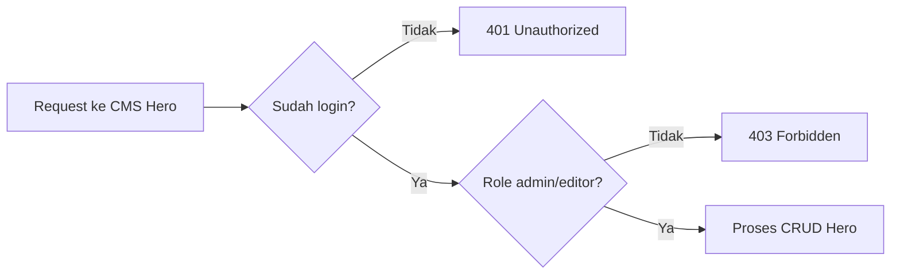

# 8E. Implementasi CMS Hero Bertahap (CRUD + Proteksi Auth Role)

Dokumen ini lanjutan dari:

1. [08c-implementasi-auth-api.md](08c-implementasi-auth-api.md)
2. [08b-desain-api.md](08b-desain-api.md)
3. [08a-desain-db.md](08a-desain-db.md)

Fokus dokumen:

1. Membuat CRUD hero slides di endpoint CMS.
2. Semua endpoint langsung dilindungi login (`requireAuth`).
3. Akses role dibatasi (`requireRole('admin', 'editor')`).

## Hasil Akhir yang Ingin Dicapai

Siswa punya endpoint ini:

1. GET `/api/cms/hero` (list)
2. POST `/api/cms/hero` (create)
3. PUT `/api/cms/hero/:id` (update)
4. DELETE `/api/cms/hero/:id` (delete)

Semua endpoint hanya bisa dipakai user login dengan role `admin` atau `editor`.

## Alur Sederhana untuk Siswa



## Tahap 1 - Pastikan Fondasi Auth Sudah Siap

Wajib sudah ada di server:

1. Session middleware
2. `requireAuth`
3. `requireRole(...roles)`
4. Endpoint login untuk testing

Kalau belum, selesaikan dulu [08c-implementasi-auth-api.md](08c-implementasi-auth-api.md).

## Tahap 2 - Buat Tabel `hero_slides`

Tambahkan SQL ini saat startup server:

```js
db.exec(`
  CREATE TABLE IF NOT EXISTS hero_slides (
    id INTEGER PRIMARY KEY AUTOINCREMENT,
    title TEXT,
    subtitle TEXT,
    image TEXT NOT NULL,
    button_text TEXT,
    button_url TEXT,
    sort_order INTEGER NOT NULL DEFAULT 0,
    is_active INTEGER NOT NULL DEFAULT 1,
    created_by INTEGER,
    updated_by INTEGER,
    created_at TEXT NOT NULL DEFAULT (datetime('now','localtime')),
    updated_at TEXT,
    FOREIGN KEY (created_by) REFERENCES users(id) ON DELETE SET NULL,
    FOREIGN KEY (updated_by) REFERENCES users(id) ON DELETE SET NULL
  )
`);

db.exec(`
  CREATE INDEX IF NOT EXISTS idx_hero_sort_order ON hero_slides(sort_order);
  CREATE INDEX IF NOT EXISTS idx_hero_is_active ON hero_slides(is_active);
`);
```

Cek:

1. Server jalan tanpa error SQL.
2. Tabel `hero_slides` muncul di database.

## Tahap 3 - Buat Helper Validasi Hero

Tambahkan helper sederhana:

```js
function validateHeroInput(body) {
  const errors = {};

  if (!body.image || !String(body.image).trim()) {
    errors.image = 'Gambar hero wajib diisi';
  }

  if (body.sort_order !== undefined) {
    const sortOrder = Number(body.sort_order);
    if (!Number.isInteger(sortOrder) || sortOrder < 0) {
      errors.sort_order = 'sort_order harus angka bulat >= 0';
    }
  }

  if (body.is_active !== undefined) {
    const active = Number(body.is_active);
    if (![0, 1].includes(active)) {
      errors.is_active = 'is_active hanya boleh 0 atau 1';
    }
  }

  return errors;
}
```

## Tahap 4 - GET List Hero (Protected)

Tambahkan route:

```js
app.get('/api/cms/hero', requireAuth, requireRole('admin', 'editor'), (req, res) => {
  const rows = db
    .prepare(`
      SELECT h.id, h.title, h.subtitle, h.image, h.button_text, h.button_url,
             h.sort_order, h.is_active, h.created_at, h.updated_at,
             uc.username AS created_by_username,
             uu.username AS updated_by_username
      FROM hero_slides h
      LEFT JOIN users uc ON uc.id = h.created_by
      LEFT JOIN users uu ON uu.id = h.updated_by
      ORDER BY h.sort_order ASC, h.id DESC
    `)
    .all();

  return res.json({
    success: true,
    message: 'OK',
    data: rows
  });
});
```

Cek:

1. Tanpa login -> `401`
2. Login admin/editor -> data hero tampil

## Tahap 5 - POST Create Hero (Protected)

Tambahkan route:

```js
app.post('/api/cms/hero', requireAuth, requireRole('admin', 'editor'), (req, res) => {
  const errors = validateHeroInput(req.body);

  if (Object.keys(errors).length > 0) {
    return res.status(400).json({
      success: false,
      message: 'Validation error',
      errors
    });
  }

  const title = req.body.title ? String(req.body.title).trim() : null;
  const subtitle = req.body.subtitle ? String(req.body.subtitle).trim() : null;
  const image = String(req.body.image).trim();
  const buttonText = req.body.button_text ? String(req.body.button_text).trim() : null;
  const buttonUrl = req.body.button_url ? String(req.body.button_url).trim() : null;
  const sortOrder = req.body.sort_order !== undefined ? Number(req.body.sort_order) : 0;
  const isActive = req.body.is_active !== undefined ? Number(req.body.is_active) : 1;

  const info = db
    .prepare(`
      INSERT INTO hero_slides (
        title, subtitle, image, button_text, button_url, sort_order, is_active, created_by, updated_by
      )
      VALUES (?, ?, ?, ?, ?, ?, ?, ?, ?)
    `)
    .run(
      title,
      subtitle,
      image,
      buttonText,
      buttonUrl,
      sortOrder,
      isActive,
      req.session.user.id,
      req.session.user.id
    );

  const created = db.prepare('SELECT * FROM hero_slides WHERE id = ?').get(info.lastInsertRowid);

  return res.status(201).json({
    success: true,
    message: 'Hero berhasil dibuat',
    data: created
  });
});
```

Body contoh create:

```json
{
  "title": "Selamat Datang",
  "subtitle": "LPPM Kampus",
  "image": "hero-1.jpg",
  "button_text": "Lihat Berita",
  "button_url": "/berita",
  "sort_order": 1,
  "is_active": 1
}
```

## Tahap 6 - PUT Update Hero (Protected)

Tambahkan route:

```js
app.put('/api/cms/hero/:id', requireAuth, requireRole('admin', 'editor'), (req, res) => {
  const id = Number(req.params.id);

  if (!Number.isInteger(id) || id <= 0) {
    return res.status(400).json({
      success: false,
      message: 'ID tidak valid'
    });
  }

  const existing = db.prepare('SELECT * FROM hero_slides WHERE id = ? LIMIT 1').get(id);
  if (!existing) {
    return res.status(404).json({
      success: false,
      message: 'Hero tidak ditemukan'
    });
  }

  const payload = {
    image: req.body.image ?? existing.image,
    sort_order: req.body.sort_order ?? existing.sort_order,
    is_active: req.body.is_active ?? existing.is_active
  };

  const errors = validateHeroInput(payload);
  if (Object.keys(errors).length > 0) {
    return res.status(400).json({
      success: false,
      message: 'Validation error',
      errors
    });
  }

  const title = req.body.title !== undefined ? String(req.body.title).trim() : existing.title;
  const subtitle = req.body.subtitle !== undefined ? String(req.body.subtitle).trim() : existing.subtitle;
  const image = req.body.image !== undefined ? String(req.body.image).trim() : existing.image;
  const buttonText = req.body.button_text !== undefined ? String(req.body.button_text).trim() : existing.button_text;
  const buttonUrl = req.body.button_url !== undefined ? String(req.body.button_url).trim() : existing.button_url;
  const sortOrder = req.body.sort_order !== undefined ? Number(req.body.sort_order) : existing.sort_order;
  const isActive = req.body.is_active !== undefined ? Number(req.body.is_active) : existing.is_active;

  db.prepare(`
      UPDATE hero_slides
      SET title = ?,
          subtitle = ?,
          image = ?,
          button_text = ?,
          button_url = ?,
          sort_order = ?,
          is_active = ?,
          updated_by = ?,
          updated_at = datetime('now','localtime')
      WHERE id = ?
    `)
    .run(title, subtitle, image, buttonText, buttonUrl, sortOrder, isActive, req.session.user.id, id);

  const updated = db.prepare('SELECT * FROM hero_slides WHERE id = ?').get(id);

  return res.json({
    success: true,
    message: 'Hero berhasil diupdate',
    data: updated
  });
});
```

## Tahap 7 - DELETE Hero (Protected)

Tambahkan route:

```js
app.delete('/api/cms/hero/:id', requireAuth, requireRole('admin', 'editor'), (req, res) => {
  const id = Number(req.params.id);

  if (!Number.isInteger(id) || id <= 0) {
    return res.status(400).json({
      success: false,
      message: 'ID tidak valid'
    });
  }

  const existing = db.prepare('SELECT id FROM hero_slides WHERE id = ? LIMIT 1').get(id);

  if (!existing) {
    return res.status(404).json({
      success: false,
      message: 'Hero tidak ditemukan'
    });
  }

  db.prepare('DELETE FROM hero_slides WHERE id = ?').run(id);

  return res.json({
    success: true,
    message: 'Hero berhasil dihapus'
  });
});
```

## Tahap 8 - Uji Endpoint Satu per Satu

Urutan uji kelas yang mudah:

1. GET `/api/cms/hero` tanpa login -> `401`
2. Login sebagai editor/admin
3. POST create hero -> `201`
4. GET list hero -> data muncul
5. PUT update hero -> data berubah
6. DELETE hero -> data hilang
7. DELETE id yang sama lagi -> `404`

## Tahap 9 - Tantangan Siswa (Level Lanjut)

1. Batasi jumlah hero aktif maksimal 5 slide.
2. Jika `button_text` diisi, `button_url` wajib diisi.
3. Tambahkan endpoint re-order hero: PUT `/api/cms/hero/reorder`.
4. Tambahkan filter list `is_active`.

## Contoh Mini server.js (Auth + CMS Hero)

Contoh ini fokus endpoint inti CMS hero dan asumsi auth dari 08C sudah terpasang:

```js
const express = require('express');
const session = require('express-session');
const Database = require('better-sqlite3');

const app = express();
const db = new Database('app.db');
const PORT = 3000;

app.use(express.json());
app.use(express.urlencoded({ extended: true }));
app.use(
  session({
    secret: process.env.SESSION_SECRET || 'ganti-secret-lokal',
    resave: false,
    saveUninitialized: false
  })
);

function requireAuth(req, res, next) {
  if (!req.session || !req.session.user) {
    return res.status(401).json({ success: false, message: 'Unauthorized' });
  }
  next();
}

function requireRole(...allowedRoles) {
  return (req, res, next) => {
    const user = req.session?.user;
    if (!user) {
      return res.status(401).json({ success: false, message: 'Unauthorized' });
    }
    if (!allowedRoles.includes(user.role)) {
      return res.status(403).json({ success: false, message: 'Forbidden' });
    }
    next();
  };
}

db.exec(`
  CREATE TABLE IF NOT EXISTS hero_slides (
    id INTEGER PRIMARY KEY AUTOINCREMENT,
    title TEXT,
    subtitle TEXT,
    image TEXT NOT NULL,
    button_text TEXT,
    button_url TEXT,
    sort_order INTEGER NOT NULL DEFAULT 0,
    is_active INTEGER NOT NULL DEFAULT 1,
    created_by INTEGER,
    updated_by INTEGER,
    created_at TEXT NOT NULL DEFAULT (datetime('now','localtime')),
    updated_at TEXT
  )
`);

app.get('/api/cms/hero', requireAuth, requireRole('admin', 'editor'), (req, res) => {
  const rows = db.prepare('SELECT * FROM hero_slides ORDER BY sort_order ASC, id DESC').all();
  return res.json({ success: true, message: 'OK', data: rows });
});

app.listen(PORT, () => {
  console.log(`Server jalan di http://localhost:${PORT}`);
});
```

## Ringkasan untuk Siswa

1. Hero juga CRUD, sama seperti berita, hanya beda kolom data.
2. Route CMS harus diproteksi dengan 2 lapis: login dan role.
3. Cek error dulu (`401/403/404`), lalu cek sukses (`200/201`).
4. Setelah hero beres, lanjut modul CMS video, menu, dan settings.
