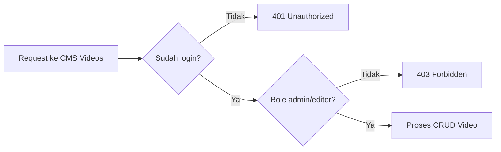

# 8F. Implementasi CMS Video Bertahap (CRUD + Proteksi Auth Role)

Dokumen ini lanjutan dari:

1. [08c-implementasi-auth-api.md](08c-implementasi-auth-api.md)
2. [08b-desain-api.md](08b-desain-api.md)
3. [08a-desain-db.md](08a-desain-db.md)

Fokus dokumen:

1. Membuat CRUD video YouTube di endpoint CMS.
2. Semua endpoint langsung dilindungi login (`requireAuth`).
3. Akses role dibatasi (`requireRole('admin', 'editor')`).

## Hasil Akhir yang Ingin Dicapai

Siswa punya endpoint ini:

1. GET `/api/cms/videos` (list)
2. POST `/api/cms/videos` (create)
3. PUT `/api/cms/videos/:id` (update)
4. DELETE `/api/cms/videos/:id` (delete)

Semua endpoint hanya bisa dipakai user login role `admin` atau `editor`.

## Alur Sederhana untuk Siswa



## Tahap 1 - Pastikan Fondasi Auth Sudah Siap

Wajib sudah ada di server:

1. Session middleware
2. `requireAuth`
3. `requireRole(...roles)`
4. Endpoint login untuk testing

Kalau belum, selesaikan dulu [08c-implementasi-auth-api.md](08c-implementasi-auth-api.md).

## Tahap 2 - Buat Tabel `youtube_links`

Tambahkan SQL ini saat startup server:

```js
db.exec(`
  CREATE TABLE IF NOT EXISTS youtube_links (
    id INTEGER PRIMARY KEY AUTOINCREMENT,
    title TEXT NOT NULL,
    youtube_url TEXT NOT NULL,
    thumbnail TEXT,
    sort_order INTEGER NOT NULL DEFAULT 0,
    is_active INTEGER NOT NULL DEFAULT 1,
    created_by INTEGER,
    updated_by INTEGER,
    created_at TEXT NOT NULL DEFAULT (datetime('now','localtime')),
    updated_at TEXT,
    FOREIGN KEY (created_by) REFERENCES users(id) ON DELETE SET NULL,
    FOREIGN KEY (updated_by) REFERENCES users(id) ON DELETE SET NULL
  )
`);

db.exec(`
  CREATE INDEX IF NOT EXISTS idx_videos_sort_order ON youtube_links(sort_order);
  CREATE INDEX IF NOT EXISTS idx_videos_is_active ON youtube_links(is_active);
`);
```

Cek:

1. Server jalan tanpa error SQL.
2. Tabel `youtube_links` muncul di database.

## Tahap 3 - Helper Validasi Video

Tambahkan helper sederhana:

```js
function isValidYoutubeUrl(url) {
  const value = String(url || '').trim();
  return /^https?:\/\/(www\.)?(youtube\.com|youtu\.be)\//i.test(value);
}

function validateVideoInput(body) {
  const errors = {};

  if (!body.title || !String(body.title).trim()) {
    errors.title = 'Judul video wajib diisi';
  }

  if (!body.youtube_url || !String(body.youtube_url).trim()) {
    errors.youtube_url = 'URL YouTube wajib diisi';
  } else if (!isValidYoutubeUrl(body.youtube_url)) {
    errors.youtube_url = 'Format URL YouTube tidak valid';
  }

  if (body.sort_order !== undefined) {
    const sortOrder = Number(body.sort_order);
    if (!Number.isInteger(sortOrder) || sortOrder < 0) {
      errors.sort_order = 'sort_order harus angka bulat >= 0';
    }
  }

  if (body.is_active !== undefined) {
    const active = Number(body.is_active);
    if (![0, 1].includes(active)) {
      errors.is_active = 'is_active hanya boleh 0 atau 1';
    }
  }

  return errors;
}
```

## Tahap 4 - GET List Videos (Protected)

Tambahkan route:

```js
app.get('/api/cms/videos', requireAuth, requireRole('admin', 'editor'), (req, res) => {
  const rows = db
    .prepare(`
      SELECT v.id, v.title, v.youtube_url, v.thumbnail, v.sort_order, v.is_active, v.created_at, v.updated_at,
             uc.username AS created_by_username,
             uu.username AS updated_by_username
      FROM youtube_links v
      LEFT JOIN users uc ON uc.id = v.created_by
      LEFT JOIN users uu ON uu.id = v.updated_by
      ORDER BY v.sort_order ASC, v.id DESC
    `)
    .all();

  return res.json({
    success: true,
    message: 'OK',
    data: rows
  });
});
```

Cek:

1. Tanpa login -> `401`
2. Login admin/editor -> data video tampil

## Tahap 5 - POST Create Video (Protected)

Tambahkan route:

```js
app.post('/api/cms/videos', requireAuth, requireRole('admin', 'editor'), (req, res) => {
  const errors = validateVideoInput(req.body);

  if (Object.keys(errors).length > 0) {
    return res.status(400).json({
      success: false,
      message: 'Validation error',
      errors
    });
  }

  const title = String(req.body.title).trim();
  const youtubeUrl = String(req.body.youtube_url).trim();
  const thumbnail = req.body.thumbnail ? String(req.body.thumbnail).trim() : null;
  const sortOrder = req.body.sort_order !== undefined ? Number(req.body.sort_order) : 0;
  const isActive = req.body.is_active !== undefined ? Number(req.body.is_active) : 1;

  const info = db
    .prepare(`
      INSERT INTO youtube_links (
        title, youtube_url, thumbnail, sort_order, is_active, created_by, updated_by
      )
      VALUES (?, ?, ?, ?, ?, ?, ?)
    `)
    .run(title, youtubeUrl, thumbnail, sortOrder, isActive, req.session.user.id, req.session.user.id);

  const created = db.prepare('SELECT * FROM youtube_links WHERE id = ?').get(info.lastInsertRowid);

  return res.status(201).json({
    success: true,
    message: 'Video berhasil dibuat',
    data: created
  });
});
```

Body contoh create:

```json
{
  "title": "Profil LPPM",
  "youtube_url": "https://www.youtube.com/watch?v=abc123",
  "thumbnail": "/uploads/video-thumb-1.jpg",
  "sort_order": 1,
  "is_active": 1
}
```

## Tahap 6 - PUT Update Video (Protected)

Tambahkan route:

```js
app.put('/api/cms/videos/:id', requireAuth, requireRole('admin', 'editor'), (req, res) => {
  const id = Number(req.params.id);

  if (!Number.isInteger(id) || id <= 0) {
    return res.status(400).json({
      success: false,
      message: 'ID tidak valid'
    });
  }

  const existing = db.prepare('SELECT * FROM youtube_links WHERE id = ? LIMIT 1').get(id);
  if (!existing) {
    return res.status(404).json({
      success: false,
      message: 'Video tidak ditemukan'
    });
  }

  const payload = {
    title: req.body.title ?? existing.title,
    youtube_url: req.body.youtube_url ?? existing.youtube_url,
    sort_order: req.body.sort_order ?? existing.sort_order,
    is_active: req.body.is_active ?? existing.is_active
  };

  const errors = validateVideoInput(payload);
  if (Object.keys(errors).length > 0) {
    return res.status(400).json({
      success: false,
      message: 'Validation error',
      errors
    });
  }

  const title = req.body.title !== undefined ? String(req.body.title).trim() : existing.title;
  const youtubeUrl = req.body.youtube_url !== undefined ? String(req.body.youtube_url).trim() : existing.youtube_url;
  const thumbnail = req.body.thumbnail !== undefined ? String(req.body.thumbnail).trim() : existing.thumbnail;
  const sortOrder = req.body.sort_order !== undefined ? Number(req.body.sort_order) : existing.sort_order;
  const isActive = req.body.is_active !== undefined ? Number(req.body.is_active) : existing.is_active;

  db.prepare(`
      UPDATE youtube_links
      SET title = ?,
          youtube_url = ?,
          thumbnail = ?,
          sort_order = ?,
          is_active = ?,
          updated_by = ?,
          updated_at = datetime('now','localtime')
      WHERE id = ?
    `)
    .run(title, youtubeUrl, thumbnail, sortOrder, isActive, req.session.user.id, id);

  const updated = db.prepare('SELECT * FROM youtube_links WHERE id = ?').get(id);

  return res.json({
    success: true,
    message: 'Video berhasil diupdate',
    data: updated
  });
});
```

## Tahap 7 - DELETE Video (Protected)

Tambahkan route:

```js
app.delete('/api/cms/videos/:id', requireAuth, requireRole('admin', 'editor'), (req, res) => {
  const id = Number(req.params.id);

  if (!Number.isInteger(id) || id <= 0) {
    return res.status(400).json({
      success: false,
      message: 'ID tidak valid'
    });
  }

  const existing = db.prepare('SELECT id FROM youtube_links WHERE id = ? LIMIT 1').get(id);

  if (!existing) {
    return res.status(404).json({
      success: false,
      message: 'Video tidak ditemukan'
    });
  }

  db.prepare('DELETE FROM youtube_links WHERE id = ?').run(id);

  return res.json({
    success: true,
    message: 'Video berhasil dihapus'
  });
});
```

## Tahap 8 - Uji Endpoint Satu per Satu

Urutan uji kelas yang mudah:

1. GET `/api/cms/videos` tanpa login -> `401`
2. Login sebagai editor/admin
3. POST create video -> `201`
4. GET list video -> data muncul
5. PUT update video -> data berubah
6. DELETE video -> data hilang
7. DELETE id yang sama lagi -> `404`

## Tahap 9 - Tantangan Siswa (Level Lanjut)

1. Tambahkan ekstraksi `video_id` dari URL YouTube.
2. Buat thumbnail otomatis dari `video_id` (contoh `https://img.youtube.com/vi/<id>/hqdefault.jpg`).
3. Tambahkan filter list `is_active`.
4. Tambahkan endpoint reorder video.

## Ringkasan untuk Siswa

1. Modul video strukturnya mirip modul hero dan berita.
2. Perbedaan utama ada di validasi URL YouTube.
3. Selalu tes gagal dulu (`401/403/404`), baru tes sukses (`200/201`).
