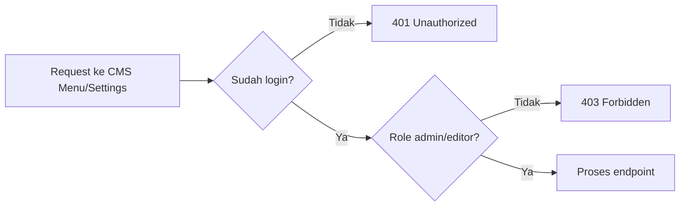

# 8G. Implementasi CMS Menu + Settings Bertahap (Protected)

Dokumen ini lanjutan dari:

1. [08c-implementasi-auth-api.md](08c-implementasi-auth-api.md)
2. [08b-desain-api.md](08b-desain-api.md)
3. [08a-desain-db.md](08a-desain-db.md)

Fokus dokumen:

1. CRUD menu navigasi (`/api/cms/menus`).
2. Read + update settings (`/api/cms/settings`).
3. Semua endpoint langsung dilindungi login + role (`admin`, `editor`).

## Hasil Akhir yang Ingin Dicapai

Siswa punya endpoint ini:

1. GET `/api/cms/menus`
2. POST `/api/cms/menus`
3. PUT `/api/cms/menus/:id`
4. DELETE `/api/cms/menus/:id`
5. GET `/api/cms/settings`
6. PUT `/api/cms/settings`

## Alur Sederhana untuk Siswa



## Tahap 1 - Pastikan Fondasi Auth Sudah Siap

Wajib sudah ada:

1. Session middleware
2. `requireAuth`
3. `requireRole(...roles)`
4. Endpoint login untuk testing

## Tahap 2 - Buat Tabel `cms_menus` dan `cms_settings`

Tambahkan SQL startup:

```js
db.exec(`
  CREATE TABLE IF NOT EXISTS cms_menus (
    id INTEGER PRIMARY KEY AUTOINCREMENT,
    label TEXT NOT NULL,
    url TEXT NOT NULL,
    sort_order INTEGER NOT NULL DEFAULT 0,
    is_active INTEGER NOT NULL DEFAULT 1,
    target TEXT NOT NULL DEFAULT '_self',
    created_at TEXT NOT NULL DEFAULT (datetime('now','localtime')),
    updated_at TEXT
  )
`);

db.exec(`
  CREATE TABLE IF NOT EXISTS cms_settings (
    id INTEGER PRIMARY KEY AUTOINCREMENT,
    setting_key TEXT NOT NULL UNIQUE,
    setting_value TEXT,
    created_at TEXT NOT NULL DEFAULT (datetime('now','localtime')),
    updated_at TEXT
  )
`);

db.exec(`
  CREATE INDEX IF NOT EXISTS idx_menus_sort_order ON cms_menus(sort_order);
  CREATE INDEX IF NOT EXISTS idx_menus_is_active ON cms_menus(is_active);
`);
```

Seed key settings awal (opsional, tapi disarankan):

```js
const defaultSettings = [
  'site_logo',
  'footer_address',
  'footer_email',
  'footer_phone',
  'google_map_embed'
];

for (const key of defaultSettings) {
  db.prepare(
    `INSERT OR IGNORE INTO cms_settings (setting_key, setting_value) VALUES (?, ?)`
  ).run(key, '');
}
```

## Tahap 3 - Helper Validasi

Tambahkan helper:

```js
function validateMenuInput(body) {
  const errors = {};

  if (!body.label || !String(body.label).trim()) {
    errors.label = 'Label menu wajib diisi';
  }

  if (!body.url || !String(body.url).trim()) {
    errors.url = 'URL menu wajib diisi';
  }

  if (body.sort_order !== undefined) {
    const sortOrder = Number(body.sort_order);
    if (!Number.isInteger(sortOrder) || sortOrder < 0) {
      errors.sort_order = 'sort_order harus angka bulat >= 0';
    }
  }

  if (body.is_active !== undefined) {
    const active = Number(body.is_active);
    if (![0, 1].includes(active)) {
      errors.is_active = 'is_active hanya boleh 0 atau 1';
    }
  }

  if (body.target !== undefined && !['_self', '_blank'].includes(String(body.target))) {
    errors.target = 'target hanya boleh _self atau _blank';
  }

  return errors;
}
```

## Tahap 4 - Endpoint CMS Menus (Protected)

### GET list menus

```js
app.get('/api/cms/menus', requireAuth, requireRole('admin', 'editor'), (req, res) => {
  const rows = db
    .prepare(`
      SELECT *
      FROM cms_menus
      ORDER BY sort_order ASC, id ASC
    `)
    .all();

  return res.json({
    success: true,
    message: 'OK',
    data: rows
  });
});
```

### POST create menu

```js
app.post('/api/cms/menus', requireAuth, requireRole('admin', 'editor'), (req, res) => {
  const errors = validateMenuInput(req.body);

  if (Object.keys(errors).length > 0) {
    return res.status(400).json({
      success: false,
      message: 'Validation error',
      errors
    });
  }

  const label = String(req.body.label).trim();
  const url = String(req.body.url).trim();
  const sortOrder = req.body.sort_order !== undefined ? Number(req.body.sort_order) : 0;
  const isActive = req.body.is_active !== undefined ? Number(req.body.is_active) : 1;
  const target = req.body.target !== undefined ? String(req.body.target) : '_self';

  const info = db
    .prepare(`
      INSERT INTO cms_menus (label, url, sort_order, is_active, target)
      VALUES (?, ?, ?, ?, ?)
    `)
    .run(label, url, sortOrder, isActive, target);

  const created = db.prepare('SELECT * FROM cms_menus WHERE id = ?').get(info.lastInsertRowid);

  return res.status(201).json({
    success: true,
    message: 'Menu berhasil dibuat',
    data: created
  });
});
```

### PUT update menu

```js
app.put('/api/cms/menus/:id', requireAuth, requireRole('admin', 'editor'), (req, res) => {
  const id = Number(req.params.id);

  if (!Number.isInteger(id) || id <= 0) {
    return res.status(400).json({
      success: false,
      message: 'ID tidak valid'
    });
  }

  const existing = db.prepare('SELECT * FROM cms_menus WHERE id = ? LIMIT 1').get(id);
  if (!existing) {
    return res.status(404).json({
      success: false,
      message: 'Menu tidak ditemukan'
    });
  }

  const payload = {
    label: req.body.label ?? existing.label,
    url: req.body.url ?? existing.url,
    sort_order: req.body.sort_order ?? existing.sort_order,
    is_active: req.body.is_active ?? existing.is_active,
    target: req.body.target ?? existing.target
  };

  const errors = validateMenuInput(payload);
  if (Object.keys(errors).length > 0) {
    return res.status(400).json({
      success: false,
      message: 'Validation error',
      errors
    });
  }

  const label = req.body.label !== undefined ? String(req.body.label).trim() : existing.label;
  const url = req.body.url !== undefined ? String(req.body.url).trim() : existing.url;
  const sortOrder = req.body.sort_order !== undefined ? Number(req.body.sort_order) : existing.sort_order;
  const isActive = req.body.is_active !== undefined ? Number(req.body.is_active) : existing.is_active;
  const target = req.body.target !== undefined ? String(req.body.target) : existing.target;

  db.prepare(`
      UPDATE cms_menus
      SET label = ?,
          url = ?,
          sort_order = ?,
          is_active = ?,
          target = ?,
          updated_at = datetime('now','localtime')
      WHERE id = ?
    `)
    .run(label, url, sortOrder, isActive, target, id);

  const updated = db.prepare('SELECT * FROM cms_menus WHERE id = ?').get(id);

  return res.json({
    success: true,
    message: 'Menu berhasil diupdate',
    data: updated
  });
});
```

### DELETE menu

```js
app.delete('/api/cms/menus/:id', requireAuth, requireRole('admin', 'editor'), (req, res) => {
  const id = Number(req.params.id);

  if (!Number.isInteger(id) || id <= 0) {
    return res.status(400).json({
      success: false,
      message: 'ID tidak valid'
    });
  }

  const existing = db.prepare('SELECT id FROM cms_menus WHERE id = ? LIMIT 1').get(id);
  if (!existing) {
    return res.status(404).json({
      success: false,
      message: 'Menu tidak ditemukan'
    });
  }

  db.prepare('DELETE FROM cms_menus WHERE id = ?').run(id);

  return res.json({
    success: true,
    message: 'Menu berhasil dihapus'
  });
});
```

## Tahap 5 - Endpoint CMS Settings (Protected)

### GET settings

```js
app.get('/api/cms/settings', requireAuth, requireRole('admin', 'editor'), (req, res) => {
  const rows = db.prepare('SELECT setting_key, setting_value FROM cms_settings ORDER BY setting_key ASC').all();

  const data = {};
  for (const row of rows) {
    data[row.setting_key] = row.setting_value;
  }

  return res.json({
    success: true,
    message: 'OK',
    data
  });
});
```

### PUT settings

```js
app.put('/api/cms/settings', requireAuth, requireRole('admin', 'editor'), (req, res) => {
  const allowedKeys = [
    'site_logo',
    'footer_address',
    'footer_email',
    'footer_phone',
    'google_map_embed'
  ];

  const input = req.body || {};
  const keys = Object.keys(input);

  for (const key of keys) {
    if (!allowedKeys.includes(key)) {
      return res.status(400).json({
        success: false,
        message: `Key settings tidak dikenal: ${key}`
      });
    }
  }

  const updateStmt = db.prepare(`
    INSERT INTO cms_settings (setting_key, setting_value, updated_at)
    VALUES (?, ?, datetime('now','localtime'))
    ON CONFLICT(setting_key) DO UPDATE SET
      setting_value = excluded.setting_value,
      updated_at = datetime('now','localtime')
  `);

  const tx = db.transaction((payload) => {
    for (const [key, value] of Object.entries(payload)) {
      updateStmt.run(key, String(value ?? ''));
    }
  });

  tx(input);

  const rows = db.prepare('SELECT setting_key, setting_value FROM cms_settings ORDER BY setting_key ASC').all();
  const data = {};
  for (const row of rows) {
    data[row.setting_key] = row.setting_value;
  }

  return res.json({
    success: true,
    message: 'Settings berhasil diupdate',
    data
  });
});
```

Body contoh update settings:

```json
{
  "site_logo": "/uploads/site/logo.png",
  "footer_address": "Gedung ICT Centre Lantai 4",
  "footer_email": "lppm@kampus.ac.id",
  "footer_phone": "024-0000000",
  "google_map_embed": "https://www.google.com/maps/embed?..."
}
```

## Tahap 6 - Uji Endpoint Satu per Satu

Urutan uji kelas:

1. GET `/api/cms/menus` tanpa login -> `401`
2. Login sebagai editor/admin
3. POST menu -> `201`
4. PUT menu -> `200`
5. DELETE menu -> `200`
6. GET `/api/cms/settings` -> dapat object settings
7. PUT `/api/cms/settings` -> data berubah

## Tahap 7 - Tantangan Siswa (Level Lanjut)

1. Tambahkan endpoint reorder menu.
2. Tambahkan validasi format email untuk `footer_email`.
3. Tambahkan validasi URL untuk `site_logo`.
4. Batasi endpoint PUT settings hanya role admin.

## Ringkasan untuk Siswa

1. Menu cocok untuk data list (CRUD biasa).
2. Settings cocok untuk data key-value (read + update).
3. Semua route CMS tetap wajib 2 lapis proteksi: login dan role.
