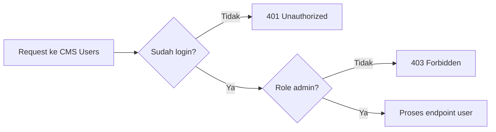

# 8H. Implementasi CMS User Management (Admin Only)

Dokumen ini lanjutan dari:

1. [08c-implementasi-auth-api.md](08c-implementasi-auth-api.md)
2. [08b-auth-flow.md](08b-auth-flow.md)
3. [08b-desain-api.md](08b-desain-api.md)

Fokus dokumen:

1. List user.
2. Create user editor/admin.
3. Aktif/nonaktif user.
4. Reset password user.
5. Delete user.
6. Semua endpoint hanya untuk role admin.

## Hasil Akhir yang Ingin Dicapai

Endpoint berikut aktif dan aman:

1. GET /api/cms/users
2. POST /api/cms/users
3. PUT /api/cms/users/:id/active
4. PUT /api/cms/users/:id/reset-password
5. DELETE /api/cms/users/:id

Semua endpoint wajib login dan role admin.

## Alur Sederhana untuk Siswa



## Tahap 1 - Pastikan Fondasi Auth Sudah Siap

Wajib sudah ada di server:

1. Session middleware.
2. Middleware requireAuth.
3. Middleware requireRole(...roles).
4. Endpoint login untuk testing.

Pemasangan middleware untuk modul users:

```js
app.use('/api/cms/users', requireAuth, requireRole('admin'));
```

Atau bisa dipasang langsung per route.

## Tahap 2 - Pastikan Tabel users Siap

Contoh SQL tabel users (jika belum ada):

```js
db.exec(`
  CREATE TABLE IF NOT EXISTS users (
    id INTEGER PRIMARY KEY AUTOINCREMENT,
    username TEXT NOT NULL UNIQUE,
    password_hash TEXT NOT NULL,
    full_name TEXT,
    role TEXT NOT NULL CHECK(role IN ('admin', 'editor')),
    is_active INTEGER NOT NULL DEFAULT 1,
    created_at TEXT NOT NULL DEFAULT (datetime('now','localtime')),
    updated_at TEXT
  )
`);
```

## Tahap 3 - Seed Admin dan User di Awal (Idempotent)

Pertanyaan penting: bagaimana seed admin dan user awal?

Jawaban paling aman untuk kelas: gunakan INSERT OR IGNORE agar aman dijalankan tiap server start.

```js
const bcrypt = require('bcryptjs');

function seedInitialUsers(db) {
  const users = [
    {
      username: 'admin',
      password: 'admin123',
      full_name: 'Administrator',
      role: 'admin',
      is_active: 1
    },
    {
      username: 'editor1',
      password: 'editor123',
      full_name: 'Editor Satu',
      role: 'editor',
      is_active: 1
    }
  ];

  const stmt = db.prepare(`
    INSERT OR IGNORE INTO users (username, password_hash, full_name, role, is_active)
    VALUES (?, ?, ?, ?, ?)
  `);

  const tx = db.transaction((rows) => {
    for (const row of rows) {
      const hash = bcrypt.hashSync(row.password, 10);
      stmt.run(row.username, hash, row.full_name, row.role, row.is_active);
    }
  });

  tx(users);
}

seedInitialUsers(db);
```

Kenapa ini bagus:

1. Aman dipanggil berulang kali.
2. Username yang sudah ada tidak dibuat ulang.
3. Praktis untuk setup kelas dan komputer lab.

Catatan produksi:

1. Ganti password default sebelum dipakai publik.
2. Bisa pindah ke file seed terpisah jika project membesar.

## Tahap 4 - Helper Validasi User

Tambahkan helper sederhana:

```js
function validateCreateUser(body) {
  const errors = {};

  if (!body.username || !String(body.username).trim()) {
    errors.username = 'Username wajib diisi';
  }

  if (!body.password || String(body.password).length < 6) {
    errors.password = 'Password minimal 6 karakter';
  }

  if (!body.role || !['admin', 'editor'].includes(String(body.role))) {
    errors.role = 'Role hanya boleh admin atau editor';
  }

  return errors;
}

function validateActiveValue(body) {
  const errors = {};
  const value = Number(body.is_active);

  if (![0, 1].includes(value)) {
    errors.is_active = 'is_active hanya boleh 0 atau 1';
  }

  return errors;
}
```

## Tahap 5 - GET List Users (Admin Only)

```js
app.get('/api/cms/users', requireAuth, requireRole('admin'), (req, res) => {
  const rows = db
    .prepare(`
      SELECT id, username, full_name, role, is_active, created_at, updated_at
      FROM users
      ORDER BY id ASC
    `)
    .all();

  return res.json({
    success: true,
    message: 'OK',
    data: rows
  });
});
```

## Tahap 6 - POST Create User (Admin Only)

```js
app.post('/api/cms/users', requireAuth, requireRole('admin'), (req, res) => {
  const errors = validateCreateUser(req.body);

  if (Object.keys(errors).length > 0) {
    return res.status(400).json({
      success: false,
      message: 'Validation error',
      errors
    });
  }

  const username = String(req.body.username).trim();
  const password = String(req.body.password);
  const fullName = req.body.full_name ? String(req.body.full_name).trim() : null;
  const role = String(req.body.role);
  const isActive = req.body.is_active !== undefined ? Number(req.body.is_active) : 1;

  const exists = db.prepare('SELECT id FROM users WHERE username = ? LIMIT 1').get(username);
  if (exists) {
    return res.status(400).json({
      success: false,
      message: 'Validation error',
      errors: { username: 'Username sudah dipakai' }
    });
  }

  const passwordHash = require('bcryptjs').hashSync(password, 10);

  const info = db
    .prepare(`
      INSERT INTO users (username, password_hash, full_name, role, is_active)
      VALUES (?, ?, ?, ?, ?)
    `)
    .run(username, passwordHash, fullName, role, isActive);

  const created = db
    .prepare('SELECT id, username, full_name, role, is_active, created_at, updated_at FROM users WHERE id = ?')
    .get(info.lastInsertRowid);

  return res.status(201).json({
    success: true,
    message: 'User berhasil dibuat',
    data: created
  });
});
```

Body contoh create editor:

```json
{
  "username": "editor2",
  "password": "editor123",
  "full_name": "Editor Dua",
  "role": "editor",
  "is_active": 1
}
```

## Tahap 7 - PUT Aktif/Nonaktif User (Admin Only)

```js
app.put('/api/cms/users/:id/active', requireAuth, requireRole('admin'), (req, res) => {
  const id = Number(req.params.id);

  if (!Number.isInteger(id) || id <= 0) {
    return res.status(400).json({
      success: false,
      message: 'ID tidak valid'
    });
  }

  const errors = validateActiveValue(req.body);
  if (Object.keys(errors).length > 0) {
    return res.status(400).json({
      success: false,
      message: 'Validation error',
      errors
    });
  }

  const existing = db.prepare('SELECT id, username FROM users WHERE id = ? LIMIT 1').get(id);
  if (!existing) {
    return res.status(404).json({
      success: false,
      message: 'User tidak ditemukan'
    });
  }

  if (req.session.user.id === id) {
    return res.status(400).json({
      success: false,
      message: 'Admin tidak boleh menonaktifkan akun sendiri'
    });
  }

  const isActive = Number(req.body.is_active);

  db.prepare(`
      UPDATE users
      SET is_active = ?,
          updated_at = datetime('now','localtime')
      WHERE id = ?
    `)
    .run(isActive, id);

  const updated = db
    .prepare('SELECT id, username, full_name, role, is_active, created_at, updated_at FROM users WHERE id = ?')
    .get(id);

  return res.json({
    success: true,
    message: 'Status user berhasil diubah',
    data: updated
  });
});
```

## Tahap 8 - PUT Reset Password User (Admin Only)

```js
app.put('/api/cms/users/:id/reset-password', requireAuth, requireRole('admin'), (req, res) => {
  const id = Number(req.params.id);
  const newPassword = String(req.body.new_password || '');

  if (!Number.isInteger(id) || id <= 0) {
    return res.status(400).json({ success: false, message: 'ID tidak valid' });
  }

  if (newPassword.length < 6) {
    return res.status(400).json({
      success: false,
      message: 'Validation error',
      errors: { new_password: 'Password baru minimal 6 karakter' }
    });
  }

  const existing = db.prepare('SELECT id FROM users WHERE id = ? LIMIT 1').get(id);
  if (!existing) {
    return res.status(404).json({ success: false, message: 'User tidak ditemukan' });
  }

  const bcrypt = require('bcryptjs');
  const hash = bcrypt.hashSync(newPassword, 10);

  db.prepare(`
      UPDATE users
      SET password_hash = ?,
          updated_at = datetime('now','localtime')
      WHERE id = ?
    `)
    .run(hash, id);

  return res.json({
    success: true,
    message: 'Password user berhasil direset'
  });
});
```

## Tahap 9 - DELETE User (Admin Only)

```js
app.delete('/api/cms/users/:id', requireAuth, requireRole('admin'), (req, res) => {
  const id = Number(req.params.id);

  if (!Number.isInteger(id) || id <= 0) {
    return res.status(400).json({ success: false, message: 'ID tidak valid' });
  }

  const existing = db.prepare('SELECT id, username FROM users WHERE id = ? LIMIT 1').get(id);
  if (!existing) {
    return res.status(404).json({ success: false, message: 'User tidak ditemukan' });
  }

  if (req.session.user.id === id) {
    return res.status(400).json({
      success: false,
      message: 'Admin tidak boleh menghapus akun sendiri'
    });
  }

  db.prepare('DELETE FROM users WHERE id = ?').run(id);

  return res.json({
    success: true,
    message: 'User berhasil dihapus'
  });
});
```

## Tahap 10 - Uji End-to-End di Kelas

Urutan uji yang disarankan:

1. Login sebagai editor, akses GET /api/cms/users -> 403.
2. Login sebagai admin, akses GET /api/cms/users -> 200.
3. Buat user editor baru -> 201.
4. Nonaktifkan user editor -> 200.
5. Coba login pakai user nonaktif -> 401.
6. Reset password user editor -> 200.
7. Aktifkan lagi user editor -> 200.
8. Hapus user editor -> 200.

## Single Tone untuk Kelas (Bahasa Mudah)

Jika maksudnya gaya jelas dan satu tone, pakai pola kalimat ini saat mengajar:

1. Cek login dulu.
2. Cek role dulu.
3. Baru proses data.
4. Kalau gagal, balas error jelas.
5. Kalau sukses, balas data.

## Ringkasan untuk Siswa

1. User management adalah modul sensitif, jadi khusus admin.
2. Seed awal admin/editor sebaiknya idempotent dengan INSERT OR IGNORE.
3. Admin tidak boleh menonaktifkan atau menghapus dirinya sendiri.
4. Setelah modul ini selesai, CMS backend inti sudah lengkap.
