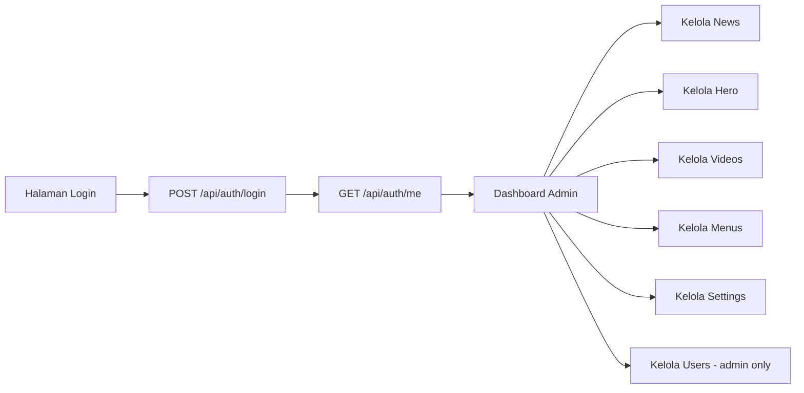

# 8J. Integrasi Frontend Admin CMS ke Backend API (Bertahap)

Dokumen ini menghubungkan backend yang sudah jadi ke tampilan admin sederhana.

Lanjutan dari:

1. [08i-integrasi-router-cms.md](08i-integrasi-router-cms.md)
2. [08h-implementasi-cms-user-management.md](08h-implementasi-cms-user-management.md)
3. [08g-implementasi-cms-menu-settings.md](08g-implementasi-cms-menu-settings.md)
4. [08f-implementasi-cms-video.md](08f-implementasi-cms-video.md)
5. [08e-implementasi-cms-hero.md](08e-implementasi-cms-hero.md)
6. [08d-implementasi-cms-news.md](08d-implementasi-cms-news.md)

Target dokumen ini:

1. Siswa paham alur frontend ke backend.
2. Admin panel bisa login, baca data, tambah, edit, hapus.
3. Proteksi role terlihat jelas di UI.

## Keputusan Arsitektur Kelas: Satu Server Node.js

Di kelas ini kita pakai satu server Node.js saja agar pengembangan lebih cepat, lebih hemat konteks, dan mudah dipahami siswa.

Narasi sederhananya:

1. Server yang sama melayani halaman admin.
2. Server yang sama juga melayani API.
3. Session login dan role dicek di server yang sama.

Kenapa pendekatan ini dipilih:

1. Setup ringan, tidak perlu pecah banyak proyek.
2. Debug lebih mudah karena semua alur ada di satu tempat.
3. Cocok untuk belajar dasar full flow (login -> role -> CRUD -> tampil di UI).

Tetap future-proof:

1. API tetap dipertahankan rapi.
2. Nanti bisa dipakai frontend lain (React/mobile) tanpa ubah logika inti backend.

## Gambaran Alur Frontend



## Tahap 1 - Siapkan Mode Satu Server

Langkah awal yang dipakai:

1. Node.js + Express sebagai server tunggal.
2. Halaman admin dirender dari server (boleh Handlebars atau HTML statis).
3. Data di halaman tetap diambil lewat endpoint API agar pola tetap modern.

Minimal halaman admin:

1. `/admin/login`
2. `/admin/dashboard`
3. `/admin/news`
4. `/admin/hero`
5. `/admin/videos`
6. `/admin/menus`
7. `/admin/settings`
8. `/admin/users`

## Tahap 2 - Login Form ke API

Contoh form login:

```html
<form id="loginForm">
  <input type="text" name="username" placeholder="Username" required>
  <input type="password" name="password" placeholder="Password" required>
  <button type="submit">Login</button>
</form>
<div id="msg"></div>

<script>
  const form = document.getElementById('loginForm');
  const msg = document.getElementById('msg');

  form.addEventListener('submit', async (e) => {
    e.preventDefault();

    const formData = new FormData(form);
    const payload = Object.fromEntries(formData.entries());

    const res = await fetch('/api/auth/login', {
      method: 'POST',
      headers: { 'Content-Type': 'application/json' },
      body: JSON.stringify(payload)
    });

    const data = await res.json();

    if (!res.ok) {
      msg.textContent = data.message || 'Login gagal';
      return;
    }

    window.location.href = '/admin/dashboard';
  });
</script>
```

## Tahap 3 - Cek Session Saat Halaman Dashboard Dibuka

Di dashboard, cek endpoint `GET /api/auth/me`:

```js
async function loadMe() {
  const res = await fetch('/api/auth/me');

  if (res.status === 401) {
    window.location.href = '/admin/login';
    return;
  }

  const json = await res.json();
  const user = json.data;

  document.getElementById('welcome').textContent = `Halo, ${user.full_name || user.username}`;

  // Sembunyikan menu users jika bukan admin
  if (user.role !== 'admin') {
    const usersMenu = document.getElementById('menu-users');
    if (usersMenu) usersMenu.style.display = 'none';
  }
}
```

## Tahap 4 - Tombol Logout

```js
async function doLogout() {
  await fetch('/api/auth/logout', { method: 'POST' });
  window.location.href = '/admin/login';
}

document.getElementById('btnLogout').addEventListener('click', doLogout);
```

## Tahap 5 - Integrasi Halaman News

Alur dasar:

1. Saat halaman dibuka -> GET `/api/cms/news`.
2. Saat submit form tambah -> POST `/api/cms/news`.
3. Saat klik edit -> PUT `/api/cms/news/:id`.
4. Saat klik hapus -> DELETE `/api/cms/news/:id`.

Contoh load list news:

```js
async function loadNews() {
  const res = await fetch('/api/cms/news');

  if (res.status === 401) return (window.location.href = '/admin/login');
  if (res.status === 403) return alert('Tidak punya akses');

  const json = await res.json();
  renderNewsTable(json.data || []);
}
```

## Tahap 6 - Integrasi Halaman Hero

Pola sama seperti news, endpoint:

1. GET `/api/cms/hero`
2. POST `/api/cms/hero`
3. PUT `/api/cms/hero/:id`
4. DELETE `/api/cms/hero/:id`

Tips untuk siswa:

1. Bedanya hanya field form.
2. Alur fetch tetap sama.

## Tahap 7 - Integrasi Halaman Videos

Endpoint:

1. GET `/api/cms/videos`
2. POST `/api/cms/videos`
3. PUT `/api/cms/videos/:id`
4. DELETE `/api/cms/videos/:id`

Tambahan validasi frontend:

1. Pastikan `youtube_url` diawali `https://`.
2. Tampilkan pesan error dari backend jika format salah.

## Tahap 8 - Integrasi Halaman Menus dan Settings

Menus endpoint:

1. GET `/api/cms/menus`
2. POST `/api/cms/menus`
3. PUT `/api/cms/menus/:id`
4. DELETE `/api/cms/menus/:id`

Settings endpoint:

1. GET `/api/cms/settings`
2. PUT `/api/cms/settings`

Tips implementasi settings:

1. Render object settings ke form input.
2. Saat simpan, kirim object JSON utuh.

## Tahap 9 - Integrasi Halaman Users (Admin Only)

Endpoint:

1. GET `/api/cms/users`
2. POST `/api/cms/users`
3. PUT `/api/cms/users/:id/active`
4. PUT `/api/cms/users/:id/reset-password`
5. DELETE `/api/cms/users/:id`

Aturan UI:

1. Jika role bukan admin, sembunyikan menu users.
2. Jika backend balas `403`, tampilkan pesan "khusus admin".

## Tahap 10 - Buat Helper Fetch Supaya Tidak Berulang

Supaya kode rapi, buat helper frontend:

```js
async function apiFetch(url, options = {}) {
  const res = await fetch(url, {
    headers: {
      'Content-Type': 'application/json',
      ...(options.headers || {})
    },
    ...options
  });

  if (res.status === 401) {
    window.location.href = '/admin/login';
    return null;
  }

  const data = await res.json().catch(() => ({}));

  if (!res.ok) {
    const message = data.message || 'Terjadi error';
    throw new Error(message);
  }

  return data;
}
```

Manfaat helper:

1. Semua halaman pakai pola request yang sama.
2. Penanganan 401 konsisten.
3. Kode siswa lebih pendek dan mudah dibaca.

## Tahap 11 - Struktur Folder One-Server yang Disarankan

Contoh struktur (ringkas dan cocok kelas):

```text
project/
  server.js
  db.js
  middleware/
    auth.js
  routes/
    auth.routes.js
    public.routes.js
    cms/
      index.js
      news.routes.js
      hero.routes.js
      videos.routes.js
      menus.routes.js
      settings.routes.js
      users.routes.js
    web/
      admin.pages.routes.js
  views/
    admin/
      login.handlebars
      dashboard.handlebars
      news.handlebars
      hero.handlebars
      videos.handlebars
      menus.handlebars
      settings.handlebars
      users.handlebars
    layouts/
      main.handlebars
  public/
    js/
      api.js
      auth.js
      news.js
      hero.js
      videos.js
      menus.js
      settings.js
      users.js
    css/
      admin.css
```

Catatan praktis:

1. Halaman ada di `views/admin`.
2. Script interaksi ada di `public/js`.
3. API tetap terpisah di `routes/cms` dan `routes/auth`.

## Tahap 12 - Urutan Pengembangan yang Disesuaikan (Hemat Waktu)

Urutan paling efektif untuk kelas:

1. Selesaikan auth backend dulu (`login`, `me`, `logout`).
2. Buat shell halaman admin (login, dashboard, menu).
3. Sambungkan dashboard dengan `GET /api/auth/me`.
4. Integrasikan modul news (modul pertama).
5. Lanjut hero, videos, menus, settings.
6. Terakhir users (admin only).
7. Rapikan helper frontend (`apiFetch`) agar tidak duplikasi.
8. Final test end-to-end semua role.

## Tahap 13 - Checklist Uji Integrasi Frontend

Uji minimal:

1. Login gagal -> pesan tampil.
2. Login sukses -> masuk dashboard.
3. Semua menu CMS (kecuali users) bisa dipakai editor.
4. Menu users hanya muncul untuk admin.
5. Logout -> balik ke login.
6. Refresh halaman admin saat belum login -> auto redirect ke login.

## Tahap 14 - Single Tone UI dan Kode

Agar hasil proyek terasa profesional walau sederhana:

1. Pakai nama tombol konsisten: Simpan, Ubah, Hapus.
2. Pakai pesan konsisten: "Berhasil disimpan", "Gagal memuat data".
3. Pakai layout tabel/form yang sama di semua halaman.
4. Gunakan helper fetch yang sama di semua modul.

## Ringkasan untuk Siswa

1. Frontend tidak perlu rumit, yang penting alurnya jelas.
2. Semua halaman admin cukup ikuti pola: load list, submit form, update, delete.
3. Role dari backend tetap jadi penentu akses utama.
4. Setelah tahap ini, aplikasi siap dipakai sebagai CMS belajar end-to-end.
