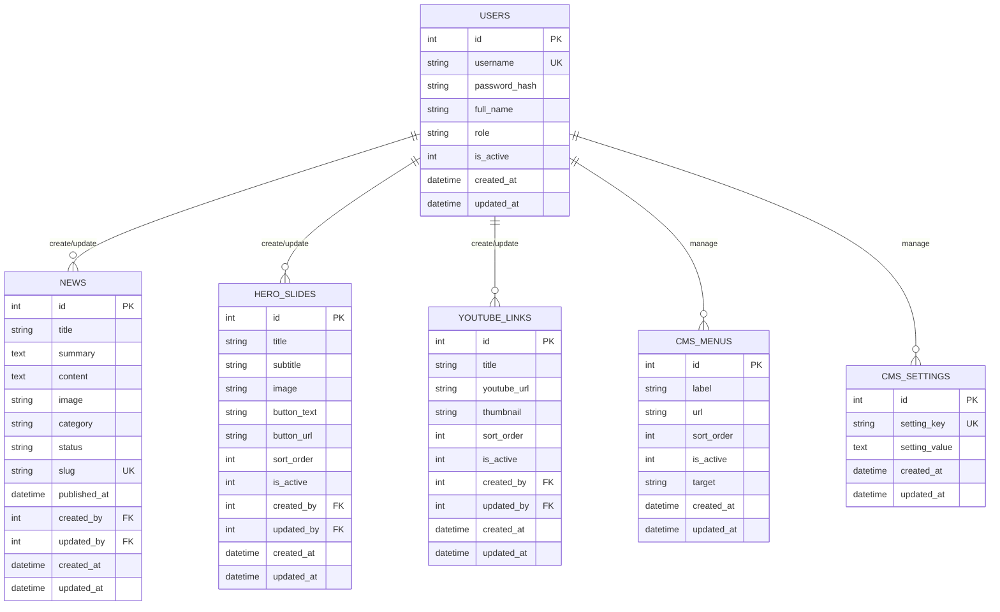

# 8A. Desain Database SQLite untuk Website Lembaga

Dokumen ini melanjutkan roadmap sebelumnya. Fokusnya adalah merancang database SQLite agar website bisa dikelola dari CMS sederhana.

Kebutuhan yang akan dipenuhi:

1. Tabel hero (1-5 gambar carousel).
2. Tabel berita.
3. Tabel link YouTube.
4. Tabel CMS data dasar (logo, menu, footer, map).
5. Tabel user untuk login/auth.

## Prinsip Desain (Bahasa Sederhana)

1. Satu tabel untuk satu jenis data.
2. Data yang bisa banyak (berita, hero, video) dibuat sebagai list.
3. Data yang biasanya cuma satu set (logo, footer, map) bisa disimpan di tabel settings.
4. Password jangan disimpan teks biasa, harus hash.

## Gambaran Relasi



## Penjelasan Tiap Tabel

## 1. Tabel `hero_slides`

Fungsi:

1. Menyimpan data carousel hero.
2. Bisa berisi 1-5 slide (atau lebih).
3. Urutan slide diatur dengan `sort_order`.

Kolom penting:

1. `image`: nama file gambar.
2. `is_active`: hanya tampilkan yang aktif.
3. `sort_order`: urutan slide.

## 2. Tabel `news`

Fungsi:

1. Menyimpan berita/artikel.
2. Bisa draft atau publish.
3. Bisa tampil di landing dan detail.

Kolom penting:

1. `slug`: URL ramah SEO (misalnya `kegiatan-penelitian-2026`).
2. `status`: `draft` atau `publish`.
3. `published_at`: tanggal tampil publik.

## 3. Tabel `youtube_links`

Fungsi:

1. Menyimpan video YouTube lembaga.
2. Tampil sebagai section video di landing.

Kolom penting:

1. `youtube_url`: URL video.
2. `thumbnail`: gambar preview jika ada.
3. `sort_order`: urutan tampil.

## 4. Tabel CMS Dasar

Kita pecah menjadi 2 agar mudah:

1. `cms_menus` untuk menu navigasi.
2. `cms_settings` untuk data tunggal (logo, footer, map, dll).

Contoh `setting_key` di `cms_settings`:

1. `site_logo`
2. `footer_address`
3. `footer_email`
4. `footer_phone`
5. `google_map_embed`

## 5. Tabel `users`

Fungsi:

1. Login admin.
2. Menyimpan role (`admin`, `editor`).
3. Menandai user aktif/tidak aktif.

Catatan keamanan:

1. Simpan password dalam `password_hash`, bukan password asli.
2. Pakai bcrypt saat implementasi login.

## SQL Final (Siap Jalankan)

```sql
PRAGMA foreign_keys = ON;

CREATE TABLE IF NOT EXISTS users (
	id INTEGER PRIMARY KEY AUTOINCREMENT,
	username TEXT NOT NULL UNIQUE,
	password_hash TEXT NOT NULL,
	full_name TEXT,
	role TEXT NOT NULL DEFAULT 'editor',
	is_active INTEGER NOT NULL DEFAULT 1,
	created_at DATETIME NOT NULL DEFAULT CURRENT_TIMESTAMP,
	updated_at DATETIME NOT NULL DEFAULT CURRENT_TIMESTAMP
);

CREATE TABLE IF NOT EXISTS hero_slides (
	id INTEGER PRIMARY KEY AUTOINCREMENT,
	title TEXT,
	subtitle TEXT,
	image TEXT NOT NULL,
	button_text TEXT,
	button_url TEXT,
	sort_order INTEGER NOT NULL DEFAULT 0,
	is_active INTEGER NOT NULL DEFAULT 1,
	created_by INTEGER,
	updated_by INTEGER,
	created_at DATETIME NOT NULL DEFAULT CURRENT_TIMESTAMP,
	updated_at DATETIME NOT NULL DEFAULT CURRENT_TIMESTAMP,
	FOREIGN KEY (created_by) REFERENCES users(id) ON DELETE SET NULL,
	FOREIGN KEY (updated_by) REFERENCES users(id) ON DELETE SET NULL
);

CREATE TABLE IF NOT EXISTS news (
	id INTEGER PRIMARY KEY AUTOINCREMENT,
	title TEXT NOT NULL,
	summary TEXT,
	content TEXT NOT NULL,
	image TEXT,
	category TEXT,
	status TEXT NOT NULL DEFAULT 'draft',
	slug TEXT NOT NULL UNIQUE,
	published_at DATETIME,
	created_by INTEGER,
	updated_by INTEGER,
	created_at DATETIME NOT NULL DEFAULT CURRENT_TIMESTAMP,
	updated_at DATETIME NOT NULL DEFAULT CURRENT_TIMESTAMP,
	FOREIGN KEY (created_by) REFERENCES users(id) ON DELETE SET NULL,
	FOREIGN KEY (updated_by) REFERENCES users(id) ON DELETE SET NULL,
	CHECK (status IN ('draft', 'publish'))
);

CREATE TABLE IF NOT EXISTS youtube_links (
	id INTEGER PRIMARY KEY AUTOINCREMENT,
	title TEXT NOT NULL,
	youtube_url TEXT NOT NULL,
	thumbnail TEXT,
	sort_order INTEGER NOT NULL DEFAULT 0,
	is_active INTEGER NOT NULL DEFAULT 1,
	created_by INTEGER,
	updated_by INTEGER,
	created_at DATETIME NOT NULL DEFAULT CURRENT_TIMESTAMP,
	updated_at DATETIME NOT NULL DEFAULT CURRENT_TIMESTAMP,
	FOREIGN KEY (created_by) REFERENCES users(id) ON DELETE SET NULL,
	FOREIGN KEY (updated_by) REFERENCES users(id) ON DELETE SET NULL
);

CREATE TABLE IF NOT EXISTS cms_menus (
	id INTEGER PRIMARY KEY AUTOINCREMENT,
	label TEXT NOT NULL,
	url TEXT NOT NULL,
	sort_order INTEGER NOT NULL DEFAULT 0,
	is_active INTEGER NOT NULL DEFAULT 1,
	target TEXT NOT NULL DEFAULT '_self',
	created_at DATETIME NOT NULL DEFAULT CURRENT_TIMESTAMP,
	updated_at DATETIME NOT NULL DEFAULT CURRENT_TIMESTAMP
);

CREATE TABLE IF NOT EXISTS cms_settings (
	id INTEGER PRIMARY KEY AUTOINCREMENT,
	setting_key TEXT NOT NULL UNIQUE,
	setting_value TEXT,
	created_at DATETIME NOT NULL DEFAULT CURRENT_TIMESTAMP,
	updated_at DATETIME NOT NULL DEFAULT CURRENT_TIMESTAMP
);

CREATE INDEX IF NOT EXISTS idx_hero_active_order ON hero_slides(is_active, sort_order);
CREATE INDEX IF NOT EXISTS idx_news_status_published ON news(status, published_at);
CREATE INDEX IF NOT EXISTS idx_news_slug ON news(slug);
CREATE INDEX IF NOT EXISTS idx_youtube_active_order ON youtube_links(is_active, sort_order);
CREATE INDEX IF NOT EXISTS idx_menu_active_order ON cms_menus(is_active, sort_order);
```

## Contoh Data Awal (Seed)

```sql
INSERT INTO cms_settings (setting_key, setting_value) VALUES
	('site_logo', '/uploads/site/logo.png'),
	('footer_address', 'Gedung ICT Centre Lantai 4, Tembalang, Semarang'),
	('footer_email', 'lppm@kampus.ac.id'),
	('footer_phone', '024-0000000'),
	('google_map_embed', 'https://www.google.com/maps/embed?...');

INSERT INTO cms_menus (label, url, sort_order) VALUES
	('Beranda', '/', 1),
	('Berita', '/berita', 2),
	('Video', '/#video', 3),
	('Kontak', '/#footer', 4);
```

## Query yang Sering Dipakai

Landing:

```sql
SELECT id, title, summary, image, category, slug, published_at
FROM news
WHERE status = 'publish'
ORDER BY published_at DESC, id DESC
LIMIT 9;
```

Detail berita:

```sql
SELECT *
FROM news
WHERE slug = ? AND status = 'publish';
```

Hero aktif:

```sql
SELECT *
FROM hero_slides
WHERE is_active = 1
ORDER BY sort_order ASC, id ASC
LIMIT 5;
```

Video aktif:

```sql
SELECT *
FROM youtube_links
WHERE is_active = 1
ORDER BY sort_order ASC, id ASC;
```

## Urutan Implementasi Praktis

1. Buat semua tabel dulu (sekali).
2. Isi `cms_settings` dan `cms_menus`.
3. Buat route landing: hero + berita publish + youtube + settings.
4. Buat route detail berita by slug.
5. Buat login admin dari tabel `users`.
6. Buat CMS admin untuk CRUD hero, berita, youtube, menu.
7. Terakhir rapikan CSS.

## Catatan untuk Siswa SMA

Kalimat sederhana:

1. `users` = siapa yang boleh mengelola.
2. `news` = isi artikel.
3. `hero_slides` = gambar carousel atas.
4. `youtube_links` = daftar video.
5. `cms_menus` + `cms_settings` = pengaturan tampilan situs.

## Kesimpulan

Desain ini cukup kuat untuk website lembaga berbasis SQLite, tapi tetap sederhana untuk dipelajari. Struktur tabel sudah siap dipakai untuk alur publik (landing/detail) dan alur admin (CRUD + pengaturan CMS).


## Kunci Jawaban: SQLite Singleton + Seed + API GET (Untuk Pemula)

Bagian ini adalah versi praktik paling dasar agar mudah dipelajari anak SMA.

Tujuan praktik:

1. Install dependency yang dibutuhkan.
2. Membuat koneksi database SQLite dengan pola singleton.
3. Membuat tabel dan isi data awal (seed).
4. Melihat data tabel lewat API `GET`.

## 1) Install Dependency

```bash
npm init -y
npm install express better-sqlite3
npm install -D nodemon
```

Update `package.json`:

```json
"scripts": {
	"dev": "nodemon server.js",
	"start": "node server.js"
}
```

## 2) Struktur Folder

```text
backend/
├── package.json
├── server.js
├── db/
│   ├── sqlite.js
│   ├── init-schema.js
│   └── seed.js
└── routes/
    └── public-api.js
```

## 3) Semua File

### `db/sqlite.js` (Singleton Database)

```js
const path = require('path');
const Database = require('better-sqlite3');

let dbInstance = null;

function getDb() {
	if (!dbInstance) {
		const dbPath = path.join(__dirname, 'lembaga.db');
		dbInstance = new Database(dbPath);
		dbInstance.pragma('foreign_keys = ON');
	}

	return dbInstance;
}

module.exports = { getDb };
```

Penjelasan singkat:

1. Singleton artinya koneksi DB dibuat sekali, dipakai berulang.
2. Ini membuat kode lebih rapi dan konsisten.

### `db/init-schema.js` (Buat Tabel)

```js
const { getDb } = require('./sqlite');

function initSchema() {
	const db = getDb();

	db.exec(`
		CREATE TABLE IF NOT EXISTS users (
			id INTEGER PRIMARY KEY AUTOINCREMENT,
			username TEXT NOT NULL UNIQUE,
			password_hash TEXT NOT NULL,
			full_name TEXT,
			role TEXT NOT NULL DEFAULT 'editor',
			is_active INTEGER NOT NULL DEFAULT 1,
			created_at DATETIME NOT NULL DEFAULT CURRENT_TIMESTAMP,
			updated_at DATETIME NOT NULL DEFAULT CURRENT_TIMESTAMP
		);

		CREATE TABLE IF NOT EXISTS hero_slides (
			id INTEGER PRIMARY KEY AUTOINCREMENT,
			title TEXT,
			subtitle TEXT,
			image TEXT NOT NULL,
			button_text TEXT,
			button_url TEXT,
			sort_order INTEGER NOT NULL DEFAULT 0,
			is_active INTEGER NOT NULL DEFAULT 1,
			created_by INTEGER,
			updated_by INTEGER,
			created_at DATETIME NOT NULL DEFAULT CURRENT_TIMESTAMP,
			updated_at DATETIME NOT NULL DEFAULT CURRENT_TIMESTAMP,
			FOREIGN KEY (created_by) REFERENCES users(id) ON DELETE SET NULL,
			FOREIGN KEY (updated_by) REFERENCES users(id) ON DELETE SET NULL
		);

		CREATE TABLE IF NOT EXISTS news (
			id INTEGER PRIMARY KEY AUTOINCREMENT,
			title TEXT NOT NULL,
			summary TEXT,
			content TEXT NOT NULL,
			image TEXT,
			category TEXT,
			status TEXT NOT NULL DEFAULT 'draft',
			slug TEXT NOT NULL UNIQUE,
			published_at DATETIME,
			created_by INTEGER,
			updated_by INTEGER,
			created_at DATETIME NOT NULL DEFAULT CURRENT_TIMESTAMP,
			updated_at DATETIME NOT NULL DEFAULT CURRENT_TIMESTAMP,
			FOREIGN KEY (created_by) REFERENCES users(id) ON DELETE SET NULL,
			FOREIGN KEY (updated_by) REFERENCES users(id) ON DELETE SET NULL,
			CHECK (status IN ('draft', 'publish'))
		);

		CREATE TABLE IF NOT EXISTS youtube_links (
			id INTEGER PRIMARY KEY AUTOINCREMENT,
			title TEXT NOT NULL,
			youtube_url TEXT NOT NULL,
			thumbnail TEXT,
			sort_order INTEGER NOT NULL DEFAULT 0,
			is_active INTEGER NOT NULL DEFAULT 1,
			created_by INTEGER,
			updated_by INTEGER,
			created_at DATETIME NOT NULL DEFAULT CURRENT_TIMESTAMP,
			updated_at DATETIME NOT NULL DEFAULT CURRENT_TIMESTAMP,
			FOREIGN KEY (created_by) REFERENCES users(id) ON DELETE SET NULL,
			FOREIGN KEY (updated_by) REFERENCES users(id) ON DELETE SET NULL
		);

		CREATE TABLE IF NOT EXISTS cms_menus (
			id INTEGER PRIMARY KEY AUTOINCREMENT,
			label TEXT NOT NULL,
			url TEXT NOT NULL,
			sort_order INTEGER NOT NULL DEFAULT 0,
			is_active INTEGER NOT NULL DEFAULT 1,
			target TEXT NOT NULL DEFAULT '_self',
			created_at DATETIME NOT NULL DEFAULT CURRENT_TIMESTAMP,
			updated_at DATETIME NOT NULL DEFAULT CURRENT_TIMESTAMP
		);

		CREATE TABLE IF NOT EXISTS cms_settings (
			id INTEGER PRIMARY KEY AUTOINCREMENT,
			setting_key TEXT NOT NULL UNIQUE,
			setting_value TEXT,
			created_at DATETIME NOT NULL DEFAULT CURRENT_TIMESTAMP,
			updated_at DATETIME NOT NULL DEFAULT CURRENT_TIMESTAMP
		);
	`);
}

module.exports = { initSchema };
```

### `db/seed.js` (Isi Data Awal)

```js
const { getDb } = require('./sqlite');

function seedData() {
	const db = getDb();

	const userCount = db.prepare('SELECT COUNT(*) AS total FROM users').get().total;
	if (userCount === 0) {
		db.prepare(
			'INSERT INTO users (username, password_hash, full_name, role) VALUES (?, ?, ?, ?)'
		).run('admin', '$2b$10$dummy.hash.untuk.contoh', 'Administrator', 'admin');
	}

	const menuCount = db.prepare('SELECT COUNT(*) AS total FROM cms_menus').get().total;
	if (menuCount === 0) {
		const insertMenu = db.prepare(
			'INSERT INTO cms_menus (label, url, sort_order, is_active) VALUES (?, ?, ?, ?)'
		);
		insertMenu.run('Beranda', '/', 1, 1);
		insertMenu.run('Berita', '/berita', 2, 1);
		insertMenu.run('Video', '/#video', 3, 1);
		insertMenu.run('Kontak', '/#footer', 4, 1);
	}

	const settingCount = db.prepare('SELECT COUNT(*) AS total FROM cms_settings').get().total;
	if (settingCount === 0) {
		const insertSetting = db.prepare(
			'INSERT INTO cms_settings (setting_key, setting_value) VALUES (?, ?)'
		);
		insertSetting.run('site_logo', '/uploads/site/logo.png');
		insertSetting.run('footer_address', 'Gedung ICT Centre Lantai 4, Tembalang, Semarang');
		insertSetting.run('footer_email', 'lppm@kampus.ac.id');
		insertSetting.run('footer_phone', '024-0000000');
	}

	const heroCount = db.prepare('SELECT COUNT(*) AS total FROM hero_slides').get().total;
	if (heroCount === 0) {
		const insertHero = db.prepare(
			'INSERT INTO hero_slides (title, subtitle, image, button_text, button_url, sort_order, is_active) VALUES (?, ?, ?, ?, ?, ?, ?)'
		);
		insertHero.run('Selamat Datang', 'Website Lembaga', '/uploads/hero/hero-1.jpg', 'Lihat Berita', '/berita', 1, 1);
		insertHero.run('Inovasi Riset', 'Kolaborasi dan Pengabdian', '/uploads/hero/hero-2.jpg', 'Profil', '/profil', 2, 1);
	}

	const newsCount = db.prepare('SELECT COUNT(*) AS total FROM news').get().total;
	if (newsCount === 0) {
		const insertNews = db.prepare(
			'INSERT INTO news (title, summary, content, image, category, status, slug, published_at) VALUES (?, ?, ?, ?, ?, ?, ?, ?)'
		);
		insertNews.run(
			'Workshop Penelitian 2026',
			'Kegiatan workshop metode penelitian terbaru.',
			'Detail isi berita workshop penelitian 2026.',
			'/uploads/news/news-1.jpg',
			'Kegiatan',
			'publish',
			'workshop-penelitian-2026',
			'2026-06-01 09:00:00'
		);
	}

	const youtubeCount = db.prepare('SELECT COUNT(*) AS total FROM youtube_links').get().total;
	if (youtubeCount === 0) {
		db.prepare(
			'INSERT INTO youtube_links (title, youtube_url, thumbnail, sort_order, is_active) VALUES (?, ?, ?, ?, ?)'
		).run(
			'Profil Lembaga',
			'https://www.youtube.com/watch?v=dQw4w9WgXcQ',
			'https://img.youtube.com/vi/dQw4w9WgXcQ/hqdefault.jpg',
			1,
			1
		);
	}
}

module.exports = { seedData };
```

### `routes/public-api.js` (SELECT via API GET)

```js
const express = require('express');
const { getDb } = require('../db/sqlite');

const router = express.Router();

router.get('/users', (req, res) => {
	const db = getDb();
	const rows = db.prepare('SELECT id, username, full_name, role, is_active, created_at FROM users ORDER BY id DESC').all();
	res.json(rows);
});

router.get('/hero-slides', (req, res) => {
	const db = getDb();
	const rows = db.prepare('SELECT * FROM hero_slides ORDER BY sort_order ASC, id ASC').all();
	res.json(rows);
});

router.get('/news', (req, res) => {
	const db = getDb();
	const rows = db.prepare('SELECT id, title, summary, image, category, status, slug, published_at FROM news ORDER BY id DESC').all();
	res.json(rows);
});

router.get('/youtube-links', (req, res) => {
	const db = getDb();
	const rows = db.prepare('SELECT * FROM youtube_links ORDER BY sort_order ASC, id ASC').all();
	res.json(rows);
});

router.get('/menus', (req, res) => {
	const db = getDb();
	const rows = db.prepare('SELECT * FROM cms_menus ORDER BY sort_order ASC, id ASC').all();
	res.json(rows);
});

router.get('/settings', (req, res) => {
	const db = getDb();
	const rows = db.prepare('SELECT * FROM cms_settings ORDER BY id ASC').all();
	res.json(rows);
});

module.exports = router;
```

### `server.js`

```js
const express = require('express');
const { initSchema } = require('./db/init-schema');
const { seedData } = require('./db/seed');
const publicApi = require('./routes/public-api');

const app = express();
const PORT = 3000;

initSchema();
seedData();

app.get('/', (req, res) => {
	res.json({
		message: 'API SQLite siap digunakan',
		routes: [
			'/api/users',
			'/api/hero-slides',
			'/api/news',
			'/api/youtube-links',
			'/api/menus',
			'/api/settings'
		]
	});
});

app.use('/api', publicApi);

app.listen(PORT, () => {
	console.log(`Server berjalan di http://localhost:${PORT}`);
});
```

## 4) Cara Menjalankan

```bash
npm run dev
```

Lalu cek di browser/REST Client:

1. `http://localhost:3000/api/users`
2. `http://localhost:3000/api/hero-slides`
3. `http://localhost:3000/api/news`
4. `http://localhost:3000/api/youtube-links`
5. `http://localhost:3000/api/menus`
6. `http://localhost:3000/api/settings`

## 5) Catatan Mudah untuk Anak SMA

1. `sqlite.js` = pintu masuk database (dibuat sekali).
2. `init-schema.js` = bikin tabel kalau belum ada.
3. `seed.js` = isi data awal contoh.
4. `public-api.js` = ambil data dengan `SELECT` lewat API `GET`.
5. `server.js` = jalankan semua jadi satu aplikasi.

## 6) Tambahan Endpoint untuk Cek Tabel Terbentuk

Supaya benar-benar yakin tabel sudah dibuat, tambahkan endpoint berikut di `routes/public-api.js`:

```js
router.get('/tables', (req, res) => {
	const db = getDb();
	const rows = db.prepare(`
		SELECT name
		FROM sqlite_master
		WHERE type = 'table'
		AND name NOT LIKE 'sqlite_%'
		ORDER BY name ASC
	`).all();
	res.json(rows);
});
```

Tambahkan juga route ini di daftar root pada `server.js`:

```js
'/api/tables'
```

Dengan endpoint ini, siswa bisa lihat langsung daftar tabel hasil `CREATE TABLE`.

## 7) File REST Client Siap Pakai

Buat file `test-db.http`:

```http
@baseUrl = http://localhost:3000

### Cek root API
GET {{baseUrl}}/

### Cek daftar tabel dari sqlite_master
GET {{baseUrl}}/api/tables

### Cek users
GET {{baseUrl}}/api/users

### Cek hero slides
GET {{baseUrl}}/api/hero-slides

### Cek news
GET {{baseUrl}}/api/news

### Cek youtube links
GET {{baseUrl}}/api/youtube-links

### Cek menus
GET {{baseUrl}}/api/menus

### Cek settings
GET {{baseUrl}}/api/settings
```

Checklist cepat:

1. `/api/tables` menampilkan `users`, `hero_slides`, `news`, `youtube_links`, `cms_menus`, `cms_settings`.
2. Endpoint lain menampilkan array data hasil seed.

## 8) Mini Unit Test GET API (Opsional, tapi bagus)

Install package test:

```bash
npm install -D vitest supertest
```

Tambahkan script di `package.json`:

```json
"scripts": {
	"dev": "nodemon server.js",
	"start": "node server.js",
	"test": "vitest run"
}
```

### A) Pisah `app` dan `server` (agar mudah di-test)

Contoh sederhana `app.js`:

```js
const express = require('express');
const { initSchema } = require('./db/init-schema');
const { seedData } = require('./db/seed');
const publicApi = require('./routes/public-api');

const app = express();

initSchema();
seedData();

app.get('/', (req, res) => {
	res.json({ message: 'API SQLite siap digunakan' });
});

app.use('/api', publicApi);

module.exports = app;
```

Update `server.js` jadi:

```js
const app = require('./app');

const PORT = 3000;
app.listen(PORT, () => {
	console.log(`Server berjalan di http://localhost:${PORT}`);
});
```

### B) Buat file test `tests/public-api.test.js`

```js
const request = require('supertest');
const { describe, it, expect } = require('vitest');
const app = require('../app');

describe('Public API SQLite', () => {
	it('GET /api/tables harus 200', async () => {
		const res = await request(app).get('/api/tables');
		expect(res.status).toBe(200);
		expect(Array.isArray(res.body)).toBe(true);
	});

	it('GET /api/news harus 200', async () => {
		const res = await request(app).get('/api/news');
		expect(res.status).toBe(200);
		expect(Array.isArray(res.body)).toBe(true);
	});
});
```

Jalankan test:

```bash
npm test
```

Kalau hasilnya `passed`, berarti endpoint GET dasar berjalan baik.

## 9) Endpoint Lanjutan: Detail Berita by Slug + Landing Gabungan

Setelah endpoint dasar berjalan, lanjutkan ke endpoint yang biasanya dipakai frontend.

### A) Tambahkan route detail berita by slug

Tambahkan ke `routes/public-api.js`:

```js
router.get('/news/:slug', (req, res) => {
	const db = getDb();
	const row = db.prepare(`
		SELECT id, title, summary, content, image, category, slug, published_at
		FROM news
		WHERE slug = ? AND status = 'publish'
	`).get(req.params.slug);

	if (!row) {
		return res.status(404).json({ message: 'Berita tidak ditemukan' });
	}

	return res.json(row);
});
```

### B) Tambahkan route landing gabungan

Tambahkan ke `routes/public-api.js`:

```js
router.get('/landing', (req, res) => {
	const db = getDb();

	const hero = db.prepare(`
		SELECT id, title, subtitle, image, button_text, button_url, sort_order
		FROM hero_slides
		WHERE is_active = 1
		ORDER BY sort_order ASC, id ASC
		LIMIT 5
	`).all();

	const news = db.prepare(`
		SELECT id, title, summary, image, category, slug, published_at
		FROM news
		WHERE status = 'publish'
		ORDER BY published_at DESC, id DESC
		LIMIT 9
	`).all();

	const videos = db.prepare(`
		SELECT id, title, youtube_url, thumbnail, sort_order
		FROM youtube_links
		WHERE is_active = 1
		ORDER BY sort_order ASC, id ASC
	`).all();

	const menus = db.prepare(`
		SELECT id, label, url, sort_order, target
		FROM cms_menus
		WHERE is_active = 1
		ORDER BY sort_order ASC, id ASC
	`).all();

	const settingsRows = db.prepare(`
		SELECT setting_key, setting_value
		FROM cms_settings
	`).all();

	const settings = settingsRows.reduce((acc, row) => {
		acc[row.setting_key] = row.setting_value;
		return acc;
	}, {});

	return res.json({
		hero,
		news,
		videos,
		menus,
		settings
	});
});
```

Kenapa endpoint `landing` berguna?

1. Frontend cukup hit 1 endpoint untuk halaman utama.
2. Data hero, berita, video, menu, settings langsung terkumpul.
3. Lebih simpel untuk pemula.

## 10) Update Daftar Route di Root `server.js`

Tambahkan route baru ke array `routes`:

```js
'/api/landing',
'/api/news/:slug'
```

Contoh root response jadi:

```js
app.get('/', (req, res) => {
	res.json({
		message: 'API SQLite siap digunakan',
		routes: [
			'/api/tables',
			'/api/landing',
			'/api/news',
			'/api/news/:slug',
			'/api/hero-slides',
			'/api/youtube-links',
			'/api/menus',
			'/api/settings',
			'/api/users'
		]
	});
});
```

## 11) Tambahkan Uji di `test-db.http`

Tambahkan baris ini:

```http
### Cek landing gabungan
GET {{baseUrl}}/api/landing

### Cek detail berita by slug
GET {{baseUrl}}/api/news/workshop-penelitian-2026

### Cek slug tidak ditemukan (harus 404)
GET {{baseUrl}}/api/news/slug-tidak-ada
```

## 12) Opsional: Tambah Unit Test untuk Endpoint Lanjutan

Tambahkan ke `tests/public-api.test.js`:

```js
it('GET /api/landing harus 200 dan punya field utama', async () => {
	const res = await request(app).get('/api/landing');
	expect(res.status).toBe(200);
	expect(Array.isArray(res.body.hero)).toBe(true);
	expect(Array.isArray(res.body.news)).toBe(true);
	expect(Array.isArray(res.body.videos)).toBe(true);
	expect(Array.isArray(res.body.menus)).toBe(true);
	expect(typeof res.body.settings).toBe('object');
});

it('GET /api/news/:slug valid harus 200', async () => {
	const res = await request(app).get('/api/news/workshop-penelitian-2026');
	expect(res.status).toBe(200);
	expect(res.body.slug).toBe('workshop-penelitian-2026');
});

it('GET /api/news/:slug tidak ada harus 404', async () => {
	const res = await request(app).get('/api/news/slug-tidak-ada');
	expect(res.status).toBe(404);
});
```

## 13) Ringkasan untuk Anak SMA

1. Endpoint `GET` itu seperti "minta data" ke server.
2. `GET /api/news` = lihat daftar berita.
3. `GET /api/news/:slug` = lihat 1 berita spesifik.
4. `GET /api/landing` = ambil semua data halaman depan sekaligus.
5. Dengan test, kamu bisa cek cepat apakah API masih normal setelah perubahan kode.

