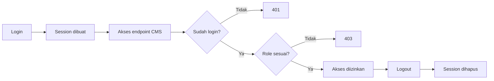
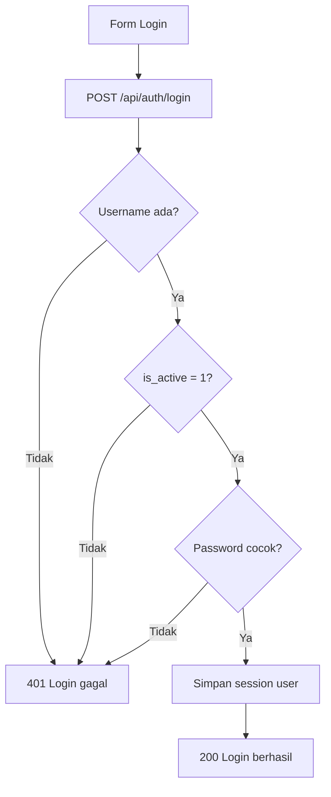
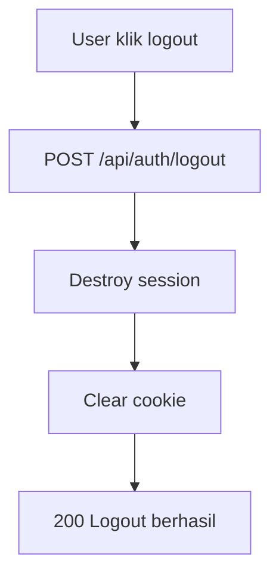
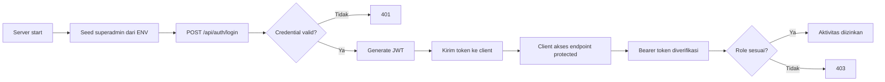

# 8B-Auth Flow: Login/Logout + Middleware Role (Admin/Editor)

Dokumen ini khusus menjelaskan alur autentikasi berbasis tabel `users` pada SQLite.

Mengacu ke struktur di [08a-desain-db.md](08a-desain-db.md) dan API specs di [08b-desain-api.md](08b-desain-api.md).

## Tujuan

1. User bisa login dengan username dan password.
2. Session user tersimpan setelah login.
3. User bisa logout.
4. Endpoint CMS terlindungi middleware auth.
5. Endpoint tertentu terlindungi middleware role (`admin`, `editor`).

## Cara Belajar Bertahap (Versi Siswa SMA)

Agar mudah dipahami, kerjakan auth dalam urutan kecil seperti ini:

1. Pahami dulu data user di database.
2. Buat login sederhana.
3. Cek apakah user sudah login atau belum.
4. Buat logout.
5. Lindungi endpoint dengan middleware login.
6. Batasi hak akses dengan middleware role.

Kalimat sederhana untuk siswa:

"Login itu masuk rumah, middleware itu satpam, role itu kartu akses ruangan."

## Rencana Praktik Per Tahap

### Tahap 1: Siapkan Data User

Target:

1. Ada minimal 1 akun admin di tabel `users`.

Yang dikerjakan:

1. Buat tabel `users` jika belum ada.
2. Buat satu user admin dengan password hash.

Cek berhasil:

1. Data admin terlihat di database.
2. Password tersimpan sebagai hash, bukan teks asli.

### Tahap 2: Setup Session

Target:

1. Server bisa menyimpan status login user.

Yang dikerjakan:

1. Install `express-session`.
2. Tambahkan session middleware ke Express.

Cek berhasil:

1. Setelah login sukses, request berikutnya tetap mengenali user.

### Tahap 3: Buat Endpoint Login

Target:

1. User bisa login dengan username dan password.

Yang dikerjakan:

1. Cari user berdasarkan username.
2. Cek `is_active`.
3. Cek password hash dengan bcrypt.
4. Simpan data user ke session.

Cek berhasil:

1. Login benar -> `200`.
2. Login salah -> `401`.

### Tahap 4: Buat Endpoint `me`

Target:

1. Bisa cek siapa user yang sedang login.

Yang dikerjakan:

1. Buat endpoint `GET /api/auth/me`.
2. Return data user dari session.

Cek berhasil:

1. Sudah login -> tampil data user.
2. Belum login -> `401`.

### Tahap 5: Buat Endpoint Logout

Target:

1. User bisa keluar dari sistem.

Yang dikerjakan:

1. Destroy session.
2. Clear cookie session.

Cek berhasil:

1. Setelah logout, `GET /api/auth/me` kembali `401`.

### Tahap 6: Pasang Middleware `requireAuth`

Target:

1. Endpoint CMS tidak bisa diakses tanpa login.

Yang dikerjakan:

1. Buat fungsi middleware `requireAuth`.
2. Pasang di route CMS.

Cek berhasil:

1. Tanpa login -> `401`.
2. Sudah login -> bisa lanjut.

### Tahap 7: Pasang Middleware `requireRole`

Target:

1. Role admin/editor punya batas hak akses.

Yang dikerjakan:

1. Buat fungsi `requireRole(...roles)`.
2. Pasang di endpoint tertentu.

Cek berhasil:

1. Role tidak sesuai -> `403`.
2. Role sesuai -> boleh akses.

### Tahap 8: Uji Alur End-to-End

Target:

1. Siswa paham alur dari login sampai proteksi endpoint.

Skenario uji:

1. Coba akses endpoint CMS tanpa login (harus gagal `401`).
2. Login sebagai editor.
3. Coba endpoint editor (harus bisa).
4. Coba endpoint admin-only (harus `403`).
5. Logout.
6. Coba akses lagi endpoint CMS (kembali `401`).

## Peta Cepat Alur Auth



## Struktur Data User

Kolom penting dari tabel `users`:

1. `username`
2. `password_hash`
3. `role` (`admin` atau `editor`)
4. `is_active` (1 aktif, 0 nonaktif)

## Gambaran Alur Auth



## Alur Logout



## Middleware yang Dibutuhkan

### 1) `requireAuth`

Fungsi:

1. Cek apakah user sudah login.
2. Jika belum login, return `401`.

Contoh:

```js
function requireAuth(req, res, next) {
  if (!req.session || !req.session.user) {
    return res.status(401).json({
      success: false,
      message: 'Unauthorized'
    });
  }

  next();
}
```

### 2) `requireRole(...roles)`

Fungsi:

1. Cek role user.
2. Jika role tidak sesuai, return `403`.

Contoh:

```js
function requireRole(...allowedRoles) {
  return (req, res, next) => {
    const user = req.session?.user;

    if (!user) {
      return res.status(401).json({
        success: false,
        message: 'Unauthorized'
      });
    }

    if (!allowedRoles.includes(user.role)) {
      return res.status(403).json({
        success: false,
        message: 'Forbidden'
      });
    }

    next();
  };
}
```

## Setup Session (Express)

Pakai `express-session`:

```bash
npm install express-session
```

Contoh setup:

```js
const session = require('express-session');

app.use(
  session({
    secret: process.env.SESSION_SECRET || 'ganti-dengan-secret-kuat',
    resave: false,
    saveUninitialized: false,
    cookie: {
      httpOnly: true,
      maxAge: 1000 * 60 * 60 * 8
    }
  })
);
```

## Login Endpoint

Contoh endpoint login:

```js
const bcrypt = require('bcryptjs');

app.post('/api/auth/login', (req, res) => {
  const { username, password } = req.body;

  const user = db
    .prepare('SELECT * FROM users WHERE username = ? LIMIT 1')
    .get(username);

  if (!user || user.is_active !== 1) {
    return res.status(401).json({
      success: false,
      message: 'Username atau password salah'
    });
  }

  const isMatch = bcrypt.compareSync(password, user.password_hash);

  if (!isMatch) {
    return res.status(401).json({
      success: false,
      message: 'Username atau password salah'
    });
  }

  req.session.user = {
    id: user.id,
    username: user.username,
    role: user.role,
    full_name: user.full_name
  };

  return res.json({
    success: true,
    message: 'Login berhasil',
    data: req.session.user
  });
});
```

## Logout Endpoint

```js
app.post('/api/auth/logout', (req, res) => {
  req.session.destroy((err) => {
    if (err) {
      return res.status(500).json({
        success: false,
        message: 'Gagal logout'
      });
    }

    res.clearCookie('connect.sid');

    return res.json({
      success: true,
      message: 'Logout berhasil'
    });
  });
});
```

## Endpoint `me` (Cek Session)

```js
app.get('/api/auth/me', (req, res) => {
  if (!req.session?.user) {
    return res.status(401).json({
      success: false,
      message: 'Belum login'
    });
  }

  return res.json({
    success: true,
    message: 'OK',
    data: req.session.user
  });
});
```

## Contoh Pemakaian Middleware

Editor atau admin boleh buat berita:

```js
app.post('/api/cms/news', requireAuth, requireRole('admin', 'editor'), (req, res) => {
  // create news
});
```

Hanya admin boleh hapus user:

```js
app.delete('/api/cms/users/:id', requireAuth, requireRole('admin'), (req, res) => {
  // delete user
});
```

## Matrix Hak Akses Sederhana

1. `admin`
1. Login/logout
2. CRUD berita
3. CRUD hero
4. CRUD youtube
5. CRUD menu/settings
6. Kelola user

2. `editor`
1. Login/logout
2. CRUD berita
3. CRUD hero
4. CRUD youtube
5. CRUD menu/settings
6. Tidak boleh kelola user

Versi paling mudah diingat siswa:

1. Admin: boleh semua.
2. Editor: boleh kelola konten, tidak boleh kelola user.

## Seed User Awal

Buat user admin pertama (contoh):

```js
const bcrypt = require('bcryptjs');
const hash = bcrypt.hashSync('admin123', 10);

db.prepare(`
  INSERT INTO users (username, password_hash, full_name, role, is_active)
  VALUES (?, ?, ?, ?, ?)
`).run('admin', hash, 'Administrator', 'admin', 1);
```

## Urutan Implementasi Auth yang Disarankan

1. Tambah paket `express-session` dan `bcryptjs`.
2. Setup session middleware.
3. Buat endpoint `login`.
4. Buat endpoint `logout`.
5. Buat endpoint `me`.
6. Buat middleware `requireAuth`.
7. Buat middleware `requireRole`.
8. Pasang middleware ke endpoint CMS.

## Checklist Uji Auth

1. Login benar -> sukses.
2. Login salah -> `401`.
3. User nonaktif -> `401`.
4. Endpoint CMS tanpa login -> `401`.
5. Endpoint admin oleh editor -> `403`.
6. Logout -> session hilang.

## Tugas Latihan Siswa (Bertahap)

1. Buat akun editor baru dan coba login.
2. Ubah role editor jadi admin, lalu coba endpoint admin lagi.
3. Nonaktifkan user (`is_active = 0`) lalu pastikan login gagal.
4. Tambahkan endpoint test `GET /api/cms/ping` dengan `requireAuth`.
5. Tambahkan endpoint test `DELETE /api/cms/users/:id` dengan `requireRole('admin')`.

## Kesimpulan

Auth flow ini sudah cukup untuk CMS skala belajar dan sekolah: aman dasar, mudah dipahami, dan langsung nyambung ke tabel `users` di SQLite.

---

## Lanjutan dari 09a ke 09b (ENV Superadmin + Token JWT)

Di 09a kita sudah punya:

1. Struktur tabel `users`.
2. Pola singleton SQLite.
3. Data seed dasar.

Di 09b versi lanjutan ini kita tambahkan:

1. Seed akun superadmin dari ENV.
2. Secret token dari ENV.
3. Login mengembalikan token JWT.
4. Token dipakai untuk akses aktivitas CMS berikutnya.

## Kenapa Pakai ENV?

Supaya data sensitif tidak ditulis langsung di kode.

Contoh data sensitif:

1. `JWT_SECRET`
2. username/password superadmin awal

## Flow Token (Versi Sederhana)



## 1) Install Dependency Tambahan

```bash
npm install jsonwebtoken bcryptjs dotenv
```

## 2) File `.env`

```env
PORT=3000

JWT_SECRET=rahasia-jwt-untuk-belajar

SUPERADMIN_USERNAME=superadmin
SUPERADMIN_PASSWORD=superadmin123
SUPERADMIN_FULL_NAME=Super Admin Awal
```

## 3) Seed Superadmin dari ENV

Buat file `db/seed-superadmin.js`:

```js
const bcrypt = require('bcryptjs');
const { getDb } = require('./sqlite');

function seedSuperadminFromEnv() {
  const db = getDb();

  const username = process.env.SUPERADMIN_USERNAME;
  const password = process.env.SUPERADMIN_PASSWORD;
  const fullName = process.env.SUPERADMIN_FULL_NAME || 'Super Admin';

  if (!username || !password) {
    throw new Error('SUPERADMIN_USERNAME dan SUPERADMIN_PASSWORD wajib diisi di .env');
  }

  const existing = db.prepare('SELECT id FROM users WHERE username = ?').get(username);
  if (existing) {
    return;
  }

  const hash = bcrypt.hashSync(password, 10);

  db.prepare(`
    INSERT INTO users (username, password_hash, full_name, role, is_active)
    VALUES (?, ?, ?, ?, ?)
  `).run(username, hash, fullName, 'admin', 1);
}

module.exports = { seedSuperadminFromEnv };
```

## 4) Login Menghasilkan Token JWT

Contoh `routes/auth-api.js`:

```js
const express = require('express');
const bcrypt = require('bcryptjs');
const jwt = require('jsonwebtoken');
const { getDb } = require('../db/sqlite');

const router = express.Router();

router.post('/login', (req, res) => {
  const { username, password } = req.body;
  const db = getDb();

  const user = db.prepare(
    'SELECT id, username, password_hash, full_name, role, is_active FROM users WHERE username = ? LIMIT 1'
  ).get(username);

  if (!user || user.is_active !== 1) {
    return res.status(401).json({ success: false, message: 'Username atau password salah' });
  }

  const match = bcrypt.compareSync(password, user.password_hash);
  if (!match) {
    return res.status(401).json({ success: false, message: 'Username atau password salah' });
  }

  const token = jwt.sign(
    {
      id: user.id,
      username: user.username,
      role: user.role,
      full_name: user.full_name
    },
    process.env.JWT_SECRET,
    { expiresIn: '8h' }
  );

  return res.json({
    success: true,
    message: 'Login berhasil',
    token
  });
});

module.exports = router;
```

## 5) Middleware Verifikasi Token + Role

Buat file `middleware/auth-jwt.js`:

```js
const jwt = require('jsonwebtoken');

function requireAuthToken(req, res, next) {
  const authHeader = req.headers.authorization || '';
  const [scheme, token] = authHeader.split(' ');

  if (scheme !== 'Bearer' || !token) {
    return res.status(401).json({ success: false, message: 'Token tidak ada' });
  }

  try {
    const payload = jwt.verify(token, process.env.JWT_SECRET);
    req.user = payload;
    return next();
  } catch (err) {
    return res.status(401).json({ success: false, message: 'Token tidak valid' });
  }
}

function requireRole() {
  const roles = Array.from(arguments);

  return (req, res, next) => {
    if (!req.user) {
      return res.status(401).json({ success: false, message: 'Unauthorized' });
    }

    if (!roles.includes(req.user.role)) {
      return res.status(403).json({ success: false, message: 'Forbidden' });
    }

    return next();
  };
}

module.exports = { requireAuthToken, requireRole };
```

## 6) Aktivitas Selanjutnya dengan Token

Contoh route `routes/cms-api.js`:

```js
const express = require('express');
const { requireAuthToken, requireRole } = require('../middleware/auth-jwt');

const router = express.Router();

router.get('/ping', requireAuthToken, (req, res) => {
  res.json({ success: true, message: 'Auth OK', user: req.user });
});

router.post('/news', requireAuthToken, requireRole('admin', 'editor'), (req, res) => {
  res.json({ success: true, message: 'Boleh create news' });
});

router.delete('/users/:id', requireAuthToken, requireRole('admin'), (req, res) => {
  res.json({ success: true, message: `Boleh delete user ${req.params.id}` });
});

module.exports = router;
```

## 7) Rangkai di `server.js`

```js
require('dotenv').config();

const express = require('express');
const { initSchema } = require('./db/init-schema');
const { seedData } = require('./db/seed');
const { seedSuperadminFromEnv } = require('./db/seed-superadmin');

const authApi = require('./routes/auth-api');
const cmsApi = require('./routes/cms-api');

const app = express();
const PORT = process.env.PORT || 3000;

app.use(express.json());

initSchema();
seedData();
seedSuperadminFromEnv();

app.get('/', (req, res) => {
  res.json({
    success: true,
    message: 'Server auth flow 09b siap',
    routes: [
      'POST /api/auth/login',
      'GET /api/cms/ping',
      'POST /api/cms/news',
      'DELETE /api/cms/users/:id'
    ]
  });
});

app.use('/api/auth', authApi);
app.use('/api/cms', cmsApi);

app.listen(PORT, () => {
  console.log(`Server berjalan di http://localhost:${PORT}`);
});
```

## 8) Uji dengan REST Client

Buat file `test-auth-token.http`:

```http
@baseUrl = http://localhost:3000

### Login superadmin dari ENV
POST {{baseUrl}}/api/auth/login
Content-Type: application/json

{
  "username": "superadmin",
  "password": "superadmin123"
}

### Ping endpoint protected (ganti TOKEN)
GET {{baseUrl}}/api/cms/ping
Authorization: Bearer TOKEN

### Create news (admin/editor)
POST {{baseUrl}}/api/cms/news
Authorization: Bearer TOKEN
Content-Type: application/json

{
  "title": "Contoh"
}

### Delete user (admin only)
DELETE {{baseUrl}}/api/cms/users/2
Authorization: Bearer TOKEN
```

## 9) Ringkasan Sederhana untuk Siswa

1. Seed superadmin dari ENV = akun awal dibuat otomatis saat server start.
2. Login = tukar username/password menjadi token.
3. Token = kartu akses untuk endpoint berikutnya.
4. Middleware = satpam yang cek token dan role.
5. Jika token atau role salah, server menolak dengan `401/403`.

## 10) Unit Test untuk Auth Token (Sangat Disarankan)

Tujuan unit test:

1. Memastikan login token tetap bekerja setelah kode berubah.
2. Memastikan endpoint protected menolak token invalid.
3. Memastikan role admin/editor berjalan sesuai aturan.

## A) Install Package Test

```bash
npm install -D vitest supertest
```

Tambahkan script di `package.json`:

```json
"scripts": {
  "dev": "nodemon server.js",
  "start": "node server.js",
  "test": "vitest run"
}
```

## B) Pisahkan `app` dan `server`

Kenapa?

1. `app.js` berisi route dan middleware.
2. `server.js` hanya `listen`.
3. Test cukup import `app` tanpa buka port sungguhan.

Contoh `app.js` (ringkas):

```js
require('dotenv').config();

const express = require('express');
const { initSchema } = require('./db/init-schema');
const { seedData } = require('./db/seed');
const { seedSuperadminFromEnv } = require('./db/seed-superadmin');

const authApi = require('./routes/auth-api');
const cmsApi = require('./routes/cms-api');

const app = express();
app.use(express.json());

initSchema();
seedData();
seedSuperadminFromEnv();

app.use('/api/auth', authApi);
app.use('/api/cms', cmsApi);

module.exports = app;
```

Contoh `server.js`:

```js
const app = require('./app');

const PORT = process.env.PORT || 3000;
app.listen(PORT, () => {
  console.log(`Server berjalan di http://localhost:${PORT}`);
});
```

## C) File Test `tests/auth-token.test.js`

```js
const request = require('supertest');
const { describe, it, expect } = require('vitest');
const app = require('../app');

async function login(username, password) {
  const res = await request(app)
    .post('/api/auth/login')
    .send({ username, password });

  return res;
}

describe('Auth Token Flow 09b', () => {
  it('login superadmin dari ENV harus berhasil dan mengembalikan token', async () => {
    const res = await login(
      process.env.SUPERADMIN_USERNAME || 'superadmin',
      process.env.SUPERADMIN_PASSWORD || 'superadmin123'
    );

    expect(res.status).toBe(200);
    expect(res.body.success).toBe(true);
    expect(typeof res.body.token).toBe('string');
    expect(res.body.token.length).toBeGreaterThan(10);
  });

  it('login salah harus 401', async () => {
    const res = await login('superadmin', 'password-salah');
    expect(res.status).toBe(401);
  });

  it('akses endpoint protected tanpa token harus 401', async () => {
    const res = await request(app).get('/api/cms/ping');
    expect(res.status).toBe(401);
  });

  it('akses endpoint protected dengan token invalid harus 401', async () => {
    const res = await request(app)
      .get('/api/cms/ping')
      .set('Authorization', 'Bearer token.invalid.palsu');

    expect(res.status).toBe(401);
  });

  it('superadmin boleh akses endpoint admin-only', async () => {
    const loginRes = await login(
      process.env.SUPERADMIN_USERNAME || 'superadmin',
      process.env.SUPERADMIN_PASSWORD || 'superadmin123'
    );

    const token = loginRes.body.token;
    const res = await request(app)
      .delete('/api/cms/users/999')
      .set('Authorization', `Bearer ${token}`);

    expect(res.status).toBe(200);
  });
});
```

## D) Test Role Editor vs Admin (Opsional Lanjutan)

Jika kamu punya akun editor aktif, tambahkan test ini:

```js
it('editor tidak boleh akses endpoint admin-only (403)', async () => {
  const loginRes = await login('editor1', 'editor123');
  const token = loginRes.body.token;

  const res = await request(app)
    .delete('/api/cms/users/999')
    .set('Authorization', `Bearer ${token}`);

  expect(res.status).toBe(403);
});
```

## E) Jalankan Unit Test

```bash
npm test
```

Jika semua hijau (`passed`), berarti alur token dan proteksi role berjalan stabil.

## 11) Ringkasan Cepat untuk Anak SMA

1. Unit test itu seperti daftar cek otomatis.
2. Kita cek login, token, dan hak akses satu per satu.
3. Kalau ada perubahan kode yang merusak auth, test akan langsung memberi tahu.

---

## Kunci Jawaban Semua File (Versi Final 09b)

Bagian ini berisi paket file final yang bisa langsung dipakai untuk praktik.

## 1) Struktur Folder Final

```text
backend/
├── package.json
├── .env
├── app.js
├── server.js
├── db/
│   ├── sqlite.js
│   ├── init-schema.js
│   ├── seed.js
│   └── seed-superadmin.js
├── middleware/
│   └── auth-jwt.js
├── routes/
│   ├── auth-api.js
│   └── cms-api.js
├── tests/
│   └── auth-token.test.js
└── test-auth-token.http
```

## 2) Install Dependency

```bash
npm init -y
npm install express better-sqlite3 bcryptjs jsonwebtoken dotenv
npm install -D nodemon vitest supertest
```

## 3) `package.json`

```json
{
  "name": "auth-flow-09b",
  "version": "1.0.0",
  "main": "server.js",
  "scripts": {
    "dev": "nodemon server.js",
    "start": "node server.js",
    "test": "vitest run"
  }
}
```

## 4) `.env`

```env
PORT=3000
JWT_SECRET=rahasia-jwt-untuk-belajar

SUPERADMIN_USERNAME=superadmin
SUPERADMIN_PASSWORD=superadmin123
SUPERADMIN_FULL_NAME=Super Admin Awal
```

## 5) File Database

### `db/sqlite.js`

```js
const path = require('path');
const Database = require('better-sqlite3');

let dbInstance = null;

function getDb() {
  if (!dbInstance) {
    dbInstance = new Database(path.join(__dirname, 'lembaga.db'));
    dbInstance.pragma('foreign_keys = ON');
  }
  return dbInstance;
}

module.exports = { getDb };
```

### `db/init-schema.js`

```js
const { getDb } = require('./sqlite');

function initSchema() {
  const db = getDb();

  db.exec(`
    CREATE TABLE IF NOT EXISTS users (
      id INTEGER PRIMARY KEY AUTOINCREMENT,
      username TEXT NOT NULL UNIQUE,
      password_hash TEXT NOT NULL,
      full_name TEXT,
      role TEXT NOT NULL DEFAULT 'editor',
      is_active INTEGER NOT NULL DEFAULT 1,
      created_at DATETIME NOT NULL DEFAULT CURRENT_TIMESTAMP,
      updated_at DATETIME NOT NULL DEFAULT CURRENT_TIMESTAMP
    );

    CREATE TABLE IF NOT EXISTS news (
      id INTEGER PRIMARY KEY AUTOINCREMENT,
      title TEXT NOT NULL,
      content TEXT NOT NULL,
      status TEXT NOT NULL DEFAULT 'draft',
      slug TEXT NOT NULL UNIQUE,
      created_at DATETIME NOT NULL DEFAULT CURRENT_TIMESTAMP
    );
  `);
}

module.exports = { initSchema };
```

### `db/seed.js`

```js
const bcrypt = require('bcryptjs');
const { getDb } = require('./sqlite');

function seedData() {
  const db = getDb();

  const editorCount = db.prepare("SELECT COUNT(*) AS total FROM users WHERE role = 'editor'").get().total;
  if (editorCount === 0) {
    const hash = bcrypt.hashSync('editor123', 10);
    db.prepare(
      'INSERT INTO users (username, password_hash, full_name, role, is_active) VALUES (?, ?, ?, ?, ?)'
    ).run('editor1', hash, 'Editor Satu', 'editor', 1);
  }
}

module.exports = { seedData };
```

### `db/seed-superadmin.js`

```js
const bcrypt = require('bcryptjs');
const { getDb } = require('./sqlite');

function seedSuperadminFromEnv() {
  const db = getDb();

  const username = process.env.SUPERADMIN_USERNAME;
  const password = process.env.SUPERADMIN_PASSWORD;
  const fullName = process.env.SUPERADMIN_FULL_NAME || 'Super Admin';

  if (!username || !password) {
    throw new Error('SUPERADMIN_USERNAME dan SUPERADMIN_PASSWORD wajib diisi di .env');
  }

  const existing = db.prepare('SELECT id FROM users WHERE username = ?').get(username);
  if (existing) return;

  const hash = bcrypt.hashSync(password, 10);

  db.prepare(
    'INSERT INTO users (username, password_hash, full_name, role, is_active) VALUES (?, ?, ?, ?, ?)'
  ).run(username, hash, fullName, 'admin', 1);
}

module.exports = { seedSuperadminFromEnv };
```

## 6) Middleware Token + Role

### `middleware/auth-jwt.js`

```js
const jwt = require('jsonwebtoken');

function requireAuthToken(req, res, next) {
  const authHeader = req.headers.authorization || '';
  const [scheme, token] = authHeader.split(' ');

  if (scheme !== 'Bearer' || !token) {
    return res.status(401).json({ success: false, message: 'Token tidak ada' });
  }

  try {
    const payload = jwt.verify(token, process.env.JWT_SECRET);
    req.user = payload;
    return next();
  } catch (err) {
    return res.status(401).json({ success: false, message: 'Token tidak valid' });
  }
}

function requireRole() {
  const roles = Array.from(arguments);

  return (req, res, next) => {
    if (!req.user) {
      return res.status(401).json({ success: false, message: 'Unauthorized' });
    }

    if (!roles.includes(req.user.role)) {
      return res.status(403).json({ success: false, message: 'Forbidden' });
    }

    return next();
  };
}

module.exports = { requireAuthToken, requireRole };
```

## 7) Routes API

### `routes/auth-api.js`

```js
const express = require('express');
const bcrypt = require('bcryptjs');
const jwt = require('jsonwebtoken');
const { getDb } = require('../db/sqlite');

const router = express.Router();

router.post('/login', (req, res) => {
  const { username, password } = req.body;
  const db = getDb();

  const user = db.prepare(
    'SELECT id, username, password_hash, full_name, role, is_active FROM users WHERE username = ? LIMIT 1'
  ).get(username);

  if (!user || user.is_active !== 1) {
    return res.status(401).json({ success: false, message: 'Username atau password salah' });
  }

  const match = bcrypt.compareSync(password, user.password_hash);
  if (!match) {
    return res.status(401).json({ success: false, message: 'Username atau password salah' });
  }

  const token = jwt.sign(
    {
      id: user.id,
      username: user.username,
      role: user.role,
      full_name: user.full_name
    },
    process.env.JWT_SECRET,
    { expiresIn: '8h' }
  );

  return res.json({
    success: true,
    message: 'Login berhasil',
    token
  });
});

module.exports = router;
```

### `routes/cms-api.js`

```js
const express = require('express');
const { requireAuthToken, requireRole } = require('../middleware/auth-jwt');

const router = express.Router();

router.get('/ping', requireAuthToken, (req, res) => {
  res.json({ success: true, message: 'Auth OK', user: req.user });
});

router.post('/news', requireAuthToken, requireRole('admin', 'editor'), (req, res) => {
  res.json({ success: true, message: 'Boleh create news' });
});

router.delete('/users/:id', requireAuthToken, requireRole('admin'), (req, res) => {
  res.json({ success: true, message: `Boleh delete user ${req.params.id}` });
});

module.exports = router;
```

## 8) App dan Server

### `app.js`

```js
require('dotenv').config();

const express = require('express');
const { initSchema } = require('./db/init-schema');
const { seedData } = require('./db/seed');
const { seedSuperadminFromEnv } = require('./db/seed-superadmin');

const authApi = require('./routes/auth-api');
const cmsApi = require('./routes/cms-api');

const app = express();
app.use(express.json());

initSchema();
seedData();
seedSuperadminFromEnv();

app.get('/', (req, res) => {
  res.json({
    success: true,
    message: 'Server auth flow 09b siap',
    routes: [
      'POST /api/auth/login',
      'GET /api/cms/ping',
      'POST /api/cms/news',
      'DELETE /api/cms/users/:id'
    ]
  });
});

app.use('/api/auth', authApi);
app.use('/api/cms', cmsApi);

module.exports = app;
```

### `server.js`

```js
const app = require('./app');

const PORT = process.env.PORT || 3000;
app.listen(PORT, () => {
  console.log(`Server berjalan di http://localhost:${PORT}`);
});
```

## 9) REST Client Test

### `test-auth-token.http`

```http
@baseUrl = http://localhost:3000

### Login superadmin dari ENV
POST {{baseUrl}}/api/auth/login
Content-Type: application/json

{
  "username": "superadmin",
  "password": "superadmin123"
}

### Ping endpoint protected (ganti TOKEN)
GET {{baseUrl}}/api/cms/ping
Authorization: Bearer TOKEN

### Create news (admin/editor)
POST {{baseUrl}}/api/cms/news
Authorization: Bearer TOKEN
Content-Type: application/json

{
  "title": "Contoh"
}

### Delete user (admin only)
DELETE {{baseUrl}}/api/cms/users/2
Authorization: Bearer TOKEN
```

## 10) Unit Test

### `tests/auth-token.test.js`

```js
const request = require('supertest');
const { describe, it, expect } = require('vitest');
const app = require('../app');

async function login(username, password) {
  const res = await request(app)
    .post('/api/auth/login')
    .send({ username, password });
  return res;
}

describe('Auth Token Flow 09b', () => {
  it('login superadmin berhasil dan mengembalikan token', async () => {
    const res = await login(
      process.env.SUPERADMIN_USERNAME || 'superadmin',
      process.env.SUPERADMIN_PASSWORD || 'superadmin123'
    );

    expect(res.status).toBe(200);
    expect(res.body.success).toBe(true);
    expect(typeof res.body.token).toBe('string');
  });

  it('login salah harus 401', async () => {
    const res = await login('superadmin', 'salah');
    expect(res.status).toBe(401);
  });

  it('tanpa token harus 401', async () => {
    const res = await request(app).get('/api/cms/ping');
    expect(res.status).toBe(401);
  });

  it('token invalid harus 401', async () => {
    const res = await request(app)
      .get('/api/cms/ping')
      .set('Authorization', 'Bearer token.invalid');
    expect(res.status).toBe(401);
  });

  it('superadmin boleh akses admin-only', async () => {
    const loginRes = await login(
      process.env.SUPERADMIN_USERNAME || 'superadmin',
      process.env.SUPERADMIN_PASSWORD || 'superadmin123'
    );
    const token = loginRes.body.token;

    const res = await request(app)
      .delete('/api/cms/users/10')
      .set('Authorization', `Bearer ${token}`);

    expect(res.status).toBe(200);
  });
});
```

Jalankan test:

```bash
npm test
```

## 11) Checklist Akhir

1. Superadmin ter-seed otomatis dari ENV saat server start.
2. Login berhasil mengembalikan token JWT.
3. Token dipakai untuk akses endpoint protected.
4. Role admin/editor dibatasi middleware.
5. Unit test auth-token berjalan `passed`.
