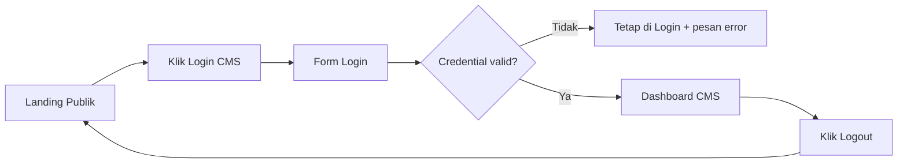

# 09E-AWAL. Landing Sederhana + Login CMS + Dashboard + Logout

Dokumen ini adalah tahap jembatan sebelum masuk CRUD CMS.

Lanjutan dari:

1. [09d-implementasi-auth-api.md](09d-implementasi-auth-api.md)
2. [09c-desain-api.md](09c-desain-api.md)

Tujuan tahap ini:

1. Siswa melihat alur nyata dari halaman publik ke CMS.
2. Siswa paham login dipakai untuk masuk dashboard, bukan sekadar endpoint API.
3. Siswa siap lanjut ke modul CRUD hero, berita, video, menu, dan settings.

## Kenapa Tahap Ini Penting

Kalau langsung masuk CRUD, siswa sering bingung:

1. CRUD ini dipakai dari halaman mana?
2. Kapan user masuk dan keluar dari CMS?
3. Bedanya halaman publik dan halaman CMS apa?

Dengan tahap awal ini, alurnya jadi jelas:

1. User membuka landing publik.
2. User klik Login CMS di navbar atas.
3. User login dan masuk dashboard CMS.
4. User logout dan kembali ke landing publik.

## Hasil Akhir Tahap 09E-Awal

Siswa punya halaman dan route berikut:

1. GET / -> landing sederhana
2. GET /cms/login -> halaman login CMS
3. POST /cms/login -> proses login session
4. GET /cms/dashboard -> dashboard CMS (wajib login)
5. POST /cms/logout -> logout session

Tambahan endpoint yang tetap dipakai untuk cek backend:

1. GET /api -> ringkasan route API

## Peta Alur



## Struktur Folder Minimal

```text
backend/
├── app.js
├── server.js
├── tests/
│   └── cms-page.test.js (opsional)
├── views/
│   ├── landing.hbs
│   ├── cms-login.hbs
│   └── cms-dashboard.hbs
├── routes/
│   └── cms-page.js
├── middleware/
│   └── require-page-auth.js
└── test-09e-awal.http (opsional)
```

Catatan:

1. Ini tahap halaman sederhana dulu, bukan web publik penuh.
2. Data website lengkap nanti dibuka di modul CRUD dan integrasi frontend.

## Rencana Mengajar Singkat (Saran)

Pertemuan 1:

1. Buat landing sederhana + navbar Login CMS.
2. Buat halaman login CMS.
3. Pastikan login gagal/sukses berjalan.

Pertemuan 2:

1. Buat dashboard CMS (protected page).
2. Tambahkan logout CMS.
3. Uji alur penuh dari landing sampai logout.

## Tahap 1 - Setup View Engine

Install paket:

```bash
npm install hbs
```

Contoh setup di app:

```js
const path = require('path');
const express = require('express');

const app = express();

app.set('view engine', 'hbs');
app.set('views', path.join(__dirname, 'views'));

app.use(express.urlencoded({ extended: true }));
app.use(express.json());
```

## Tahap 2 - Middleware Halaman CMS

Buat middleware page auth supaya halaman dashboard tidak bisa diakses tanpa login.

File middleware/require-page-auth.js:

```js
function requireCmsPageAuth(req, res, next) {
	if (!req.session || !req.session.user) {
		return res.redirect('/cms/login');
	}

	next();
}

module.exports = { requireCmsPageAuth };
```

## Tahap 3 - Route Halaman CMS

File routes/cms-page.js:

```js
const express = require('express');
const bcrypt = require('bcryptjs');
const { getDb } = require('../db/sqlite');
const { requireCmsPageAuth } = require('../middleware/require-page-auth');

const router = express.Router();

router.get('/', (req, res) => {
	return res.render('landing', {
		user: req.session?.user || null
	});
});

router.get('/cms/login', (req, res) => {
	if (req.session?.user) {
		return res.redirect('/cms/dashboard');
	}

	return res.render('cms-login', {
		error: null
	});
});

router.post('/cms/login', (req, res) => {
	const { username, password } = req.body;
	const db = getDb();

	const user = db
		.prepare('SELECT * FROM users WHERE username = ? LIMIT 1')
		.get(username);

	if (!user || user.is_active !== 1) {
		return res.status(401).render('cms-login', {
			error: 'Username atau password salah'
		});
	}

	const isMatch = bcrypt.compareSync(password, user.password_hash);
	if (!isMatch) {
		return res.status(401).render('cms-login', {
			error: 'Username atau password salah'
		});
	}

	req.session.user = {
		id: user.id,
		username: user.username,
		role: user.role,
		full_name: user.full_name
	};

	return res.redirect('/cms/dashboard');
});

router.get('/cms/dashboard', requireCmsPageAuth, (req, res) => {
	return res.render('cms-dashboard', {
		user: req.session.user
	});
});

router.post('/cms/logout', requireCmsPageAuth, (req, res) => {
	req.session.destroy(() => {
		res.clearCookie('connect.sid');
		return res.redirect('/');
	});
});

module.exports = router;
```

## Tahap 4 - Sambungkan ke app

Contoh integrasi:

```js
const session = require('express-session');
const cmsPageRoutes = require('./routes/cms-page');

app.use(
	session({
		secret: process.env.SESSION_SECRET,
		resave: false,
		saveUninitialized: false,
		cookie: {
			httpOnly: true,
			maxAge: 1000 * 60 * 60 * 8
		}
	})
);

app.use(cmsPageRoutes);
```

## Tahap 5 - Template Halaman Minimal

views/landing.hbs

```hbs
<!DOCTYPE html>
<html>
	<head>
		<meta charset="UTF-8" />
		<title>Landing Sederhana</title>
	</head>
	<body>
		<nav style="display:flex;justify-content:space-between;align-items:center;">
			<h3>Website Lembaga</h3>
			{{#if user}}
				<a href="/cms/dashboard">Ke Dashboard CMS</a>
			{{else}}
				<a href="/cms/login">Login CMS</a>
			{{/if}}
		</nav>

		<hr />
		<h1>Landing Sederhana</h1>
		<p>Ini halaman publik awal sebelum integrasi data website penuh.</p>
	</body>
</html>
```

views/cms-login.hbs

```hbs
<!DOCTYPE html>
<html>
	<head>
		<meta charset="UTF-8" />
		<title>Login CMS</title>
	</head>
	<body>
		<h1>Login CMS</h1>

		{{#if error}}
			<p style="color:red;">{{error}}</p>
		{{/if}}

		<form method="POST" action="/cms/login">
			<p>
				<label>Username</label><br />
				<input name="username" type="text" required />
			</p>
			<p>
				<label>Password</label><br />
				<input name="password" type="password" required />
			</p>
			<button type="submit">Masuk</button>
		</form>

		<p><a href="/">Kembali ke Landing</a></p>
	</body>
</html>
```

views/cms-dashboard.hbs

```hbs
<!DOCTYPE html>
<html>
	<head>
		<meta charset="UTF-8" />
		<title>Dashboard CMS</title>
	</head>
	<body>
		<h1>Dashboard CMS</h1>
		<p>Halo, {{user.full_name}} ({{user.role}})</p>

		<ul>
			<li><a href="/cms/hero">Kelola Hero (tahap berikutnya)</a></li>
			<li><a href="/cms/news">Kelola Berita (tahap berikutnya)</a></li>
		</ul>

		<form method="POST" action="/cms/logout">
			<button type="submit">Logout CMS</button>
		</form>

		<p><a href="/">Kembali ke Landing</a></p>
	</body>
</html>
```

## Tahap 6 - Uji Manual dengan Browser

Urutan uji cepat:

1. Buka / -> tampil landing + tombol Login CMS.
2. Klik Login CMS -> masuk /cms/login.
3. Isi kredensial salah -> tetap di /cms/login dengan pesan error.
4. Isi kredensial benar -> redirect ke /cms/dashboard.
5. Buka tab baru dan akses /cms/dashboard -> tetap boleh (session aktif).
6. Klik Logout CMS -> kembali ke /.
7. Coba lagi akses /cms/dashboard -> redirect ke /cms/login.

## Tahap 7 - Opsional REST File untuk API Pendukung

Buat test-09e-awal.http jika ingin cek API tetap sehat:

```http
@baseUrl = http://localhost:3000

### Cek landing page
GET {{baseUrl}}/

### Cek ringkasan API
GET {{baseUrl}}/api

### Cek public API masih aktif
GET {{baseUrl}}/api/public/landing
```

Catatan:

1. Endpoint halaman CMS login/dashboard/logout lebih mudah diuji lewat browser.
2. Untuk uji otomatis, gunakan unit test supertest agent seperti contoh di tahap berikut.

## Tahap 8 - Opsional Unit Test Alur Halaman CMS

Install jika belum:

```bash
npm install -D vitest supertest
```

Contoh file tests/cms-page.test.js:

```js
const request = require('supertest');
const app = require('../app');

describe('CMS Page Flow', () => {
	it('GET / harus tampil landing sederhana', async () => {
		const res = await request(app).get('/');
		expect(res.status).toBe(200);
		expect(res.text).toContain('Landing Sederhana');
	});

	it('GET /cms/dashboard tanpa login harus redirect ke /cms/login', async () => {
		const res = await request(app).get('/cms/dashboard');
		expect(res.status).toBe(302);
		expect(res.headers.location).toBe('/cms/login');
	});

	it('login benar lalu dashboard bisa diakses', async () => {
		const agent = request.agent(app);

		const loginRes = await agent.post('/cms/login').type('form').send({
			username: 'superadmin',
			password: 'superadmin123'
		});

		expect(loginRes.status).toBe(302);
		expect(loginRes.headers.location).toBe('/cms/dashboard');

		const dashboardRes = await agent.get('/cms/dashboard');
		expect(dashboardRes.status).toBe(200);
		expect(dashboardRes.text).toContain('Dashboard CMS');
	});
});
```

Kalau project CommonJS pakai Vitest, pastikan script test:

```json
"test": "vitest run --globals"
```

## Tahap 9 - Troubleshooting Cepat

1. Error "Cannot GET /cms/login": cek app sudah memakai route cms-page.
2. Selalu balik ke login meski password benar: cek session middleware dipasang sebelum route cms-page.
3. Login selalu gagal: cek data user di tabel users dan pastikan password_hash memang bcrypt valid.
4. Dashboard kosong atau nama user undefined: cek data user disimpan ke req.session.user saat login.

## Checklist Uji Siswa

1. Buka / -> terlihat tombol Login CMS.
2. Klik Login CMS -> masuk halaman login.
3. Login salah -> muncul pesan error.
4. Login benar -> masuk dashboard.
5. Akses /cms/dashboard tanpa login -> diarahkan ke /cms/login.
6. Klik Logout -> kembali ke landing dan session hilang.

Checklist tambahan (guru):

1. GET /api tetap normal setelah penambahan halaman.
2. GET /api/public/landing tetap normal.
3. Tidak ada konflik route antara halaman dan route API.

## Penutup Tahap 09E-Awal

Jika semua checklist lulus, siswa siap masuk CRUD CMS.

Lanjut ke:

1. [09e-implementasi-cms-hero.md](09e-implementasi-cms-hero.md)
2. [09e-implementasi-cms-news.md](09e-implementasi-cms-news.md)
3. [09f-implementasi-cms-video.md](09f-implementasi-cms-video.md)
