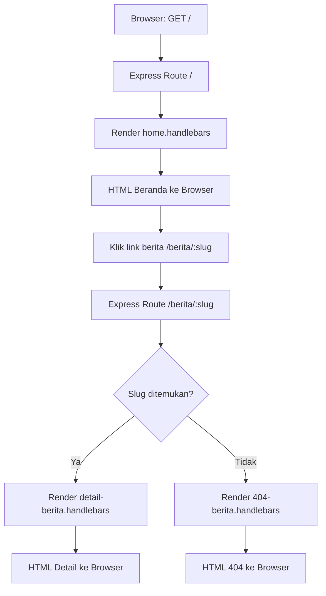

# Node Web Learning - Tahap 03 Layout Berita (Detail + Kembali)

## Resume

Tahap ini melanjutkan layout tahap 02 dengan fitur berita yang bisa diklik ke halaman detail lokal.

Yang sudah dieksekusi di folder `backend`:

1. Halaman beranda (`/`) menampilkan kartu berita dari data array.
2. Judul berita mengarah ke route detail lokal (`/berita/:slug`).
3. Halaman detail berita memiliki tombol `Kembali ke Beranda`.
4. Layout tetap memakai Handlebars (`layout` + `partials`).

Tujuan tahap ini:

1. Memahami alur route list -> detail -> kembali.
2. Membedakan link internal dan link eksternal.
3. Menyiapkan pondasi ke data dinamis tahap berikutnya.

## Struktur yang Sudah Dieksekusi

```text
node-web/
	.gitignore
	backend/
		server.js
		package.json
		public/
			css/
				style.css
		views/
			home.handlebars
			detail-berita.handlebars
			layouts/
				main.handlebars
			partials/
				navbar.handlebars
				footer.handlebars
```

## Cara Setup dan Menjalankan (Dari Nol)

## 1) Masuk ke folder backend

```bash
cd backend
```

## 2) Inisialisasi project

```bash
npm init -y
```

## 3) Install dependency utama

```bash
npm install express express-handlebars
```

## 4) Install dependency development

```bash
npm install -D nodemon
```

## 5) Pastikan scripts di package.json

```json
"scripts": {
	"dev": "nodemon server.js",
	"start": "node server.js"
}
```

## 6) Jalankan server

Mode development:

```bash
npm run dev
```

Mode normal:

```bash
npm start
```

## 7) Buka di browser

```text
http://localhost:3000
```

Contoh URL detail berita:

```text
http://localhost:3000/berita/article-submission-camp
```

## 8) Mematikan server

Cara normal di terminal server:

```text
Ctrl + C
```

## 9) Jika port 3000 masih terkunci (Windows)

Cari PID:

```bash
netstat -ano | findstr :3000
```

Kill proses (ganti `PID_NYA`):

```bash
taskkill /PID PID_NYA /F
```

Alternatif PowerShell:

```powershell
Get-NetTCPConnection -LocalPort 3000 -ErrorAction SilentlyContinue | Select-Object -ExpandProperty OwningProcess | ForEach-Object { Stop-Process -Id $_ -Force }
```

## Catatan Route Tahap 03

Route utama yang dipakai:

1. `/` -> menampilkan `home.handlebars` dengan data `beritaList`.
2. `/berita/:slug` -> menampilkan `detail-berita.handlebars` sesuai slug.

Contoh slug yang sudah disediakan:

1. `article-submission-camp`
2. `hibah-pengabdian`
3. `seminar-luaran-penelitian`


## Pemahaman Route pada handlebars template engine

Jika siswa sudah terbiasa React Router, cara berpikirnya bisa dibuat mirip seperti ini:

1. Di React, route menentukan komponen mana yang dirender di browser.
2. Di Express + Handlebars, route menentukan view mana yang dirender di server.
3. Di React, navigasi biasanya terjadi tanpa reload penuh halaman.
4. Di Handlebars (server-side rendering), klik link akan request ulang ke server lalu server kirim HTML baru.

### Perbandingan Singkat React vs Handlebars

1. React Router
- Route ditulis di sisi frontend.
- Contoh pola: path /berita/:slug menampilkan komponen DetailBerita.
- Data sering diambil dari API setelah komponen aktif.

2. Express + Handlebars
- Route ditulis di server.js.
- Path /berita/:slug diproses oleh Express.
- Server memilih data, lalu render detail-berita.handlebars.

### Analogi Sederhana untuk Siswa

1. React Router seperti petugas di dalam browser yang memilih komponen.
2. Express route seperti petugas di gerbang server yang memilih halaman HTML.

### Mapping Konsep (Supaya Cepat Nyambung)

1. React Router path /berita/:slug setara dengan app.get('/berita/:slug', ...).
2. Komponen React setara dengan file view Handlebars.
3. Link React (Link to) setara dengan tag a href pada Handlebars.

### Contoh Alur pada Project Ini

1. Siswa membuka /.
2. Server render home.handlebars.
3. Siswa klik judul berita ke /berita/article-submission-camp.
4. Server cari slug di beritaList.
5. Jika ada, render detail-berita.handlebars.
6. Jika tidak ada, render halaman 404-berita.handlebars.

### Diagram Alur Request-Response (Sederhana)



Catatan mengajar:

1. Panah ke kanan berarti browser mengirim request ke server.
2. Panah balik ke browser berarti server mengirim response HTML.
3. Percabangan pada "Slug ditemukan?" menjelaskan kenapa bisa muncul detail atau 404.

### Kapan Pakai Pendekatan Ini?

1. Bagus untuk belajar dasar web server, route, template, dan render HTML.
2. Cocok untuk tahap awal sebelum pindah ke arsitektur API + React penuh.
3. Membantu siswa paham bahwa routing bisa terjadi di client maupun di server.

### Inti yang Perlu Ditekankan ke Siswa

1. Konsep URL dan route tetap sama, yang berbeda adalah tempat route dijalankan.
2. React: route di browser.
3. Handlebars: route di server.