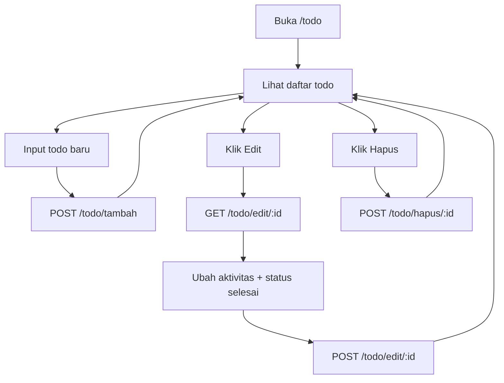

# Node Web Learning - Pelajaran 5 Todo Object

README ini merangkum materi `05-todo-object.md` agar cepat dipakai saat mengajar.

## Fitur yang Sudah Ada

1. Simpan baru todo (`POST /todo/tambah`).
2. Edit todo (buka form edit: `GET /todo/edit/:id`).
3. Simpan edit todo (`POST /todo/edit/:id`).
4. Fitur selesai (`selesai: true/false`) melalui form edit.
5. Hapus todo (`POST /todo/hapus/:id`).

## Alur CRUD Todo

## Catatan Untuk Siswa

1. Data masih disimpan di array object, jadi belum permanen.
2. Kalau server restart, data kembali ke data awal.
3. Tahap berikutnya: pindah ke SQLite agar data tersimpan permanen.

## Link Materi

1. Materi utama: `05-todo-object.md`
