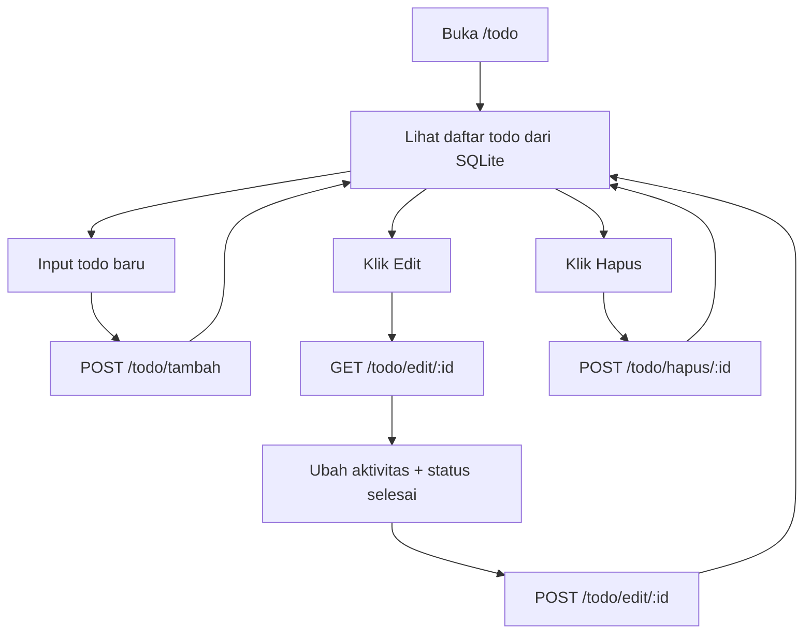

# Node Web Learning - Pelajaran 6 Todo SQLite

README ini merangkum materi [06-todo-sqlite.md](06-todo-sqlite.md) agar cepat dipakai saat mengajar.

## Fitur yang Sudah Ada

1. Simpan todo baru ke SQLite (`POST /todo/tambah`).
2. Tampilkan daftar todo dari database (`GET /todo`).
3. Buka form edit todo (`GET /todo/edit/:id`).
4. Simpan hasil edit todo (`POST /todo/edit/:id`).
5. Ubah status selesai melalui form edit.
6. Hapus todo dari database (`POST /todo/hapus/:id`).

## Alur CRUD Todo

## Catatan Untuk Siswa

1. Data sekarang disimpan di SQLite, jadi lebih permanen.
2. Kalau server restart, data tetap ada di file database.
3. SQLite lebih cocok untuk latihan CRUD yang nyata dan mudah dipahami.
4. Tahap berikutnya bisa lanjut ke materi berita SQLite.

## Link Materi

1. Materi utama: [06-todo-sqlite.md](06-todo-sqlite.md)
2. Materi sebelumnya: [05-todo-object.md](doc-learning/05-todo-object.md)