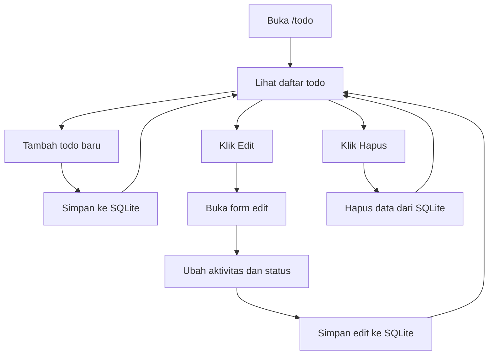

# 6. Latihan CRUD Todo dengan SQLite dan Handlebars

Pada materi sebelumnya, kita sudah membuat CRUD Todo menggunakan object dan array. Sekarang kita lanjut ke tahap yang lebih nyata, yaitu menyimpan data Todo ke **SQLite**.

SQLite cocok untuk latihan pemula karena:

1. Mudah dipakai.
2. Tidak butuh server database terpisah.
3. Datanya tersimpan di file.
4. Sangat pas untuk belajar CRUD pertama kali.

Di materi ini, siswa tetap belajar alur CRUD yang sama, tetapi data tidak lagi disimpan di array. Data akan disimpan ke tabel SQLite bernama `tb_todo`.

## Tujuan Belajar

Setelah materi ini, siswa diharapkan bisa:

1. Memahami perbedaan data di array dan data di database.
2. Membuat tabel Todo di SQLite.
3. Menyimpan Todo baru ke database.
4. Menampilkan daftar Todo dari database.
5. Mengedit Todo lalu menyimpan perubahan.
6. Menghapus Todo dari database.

## Gambaran Sederhana

Kalau di materi sebelumnya todo disimpan di RAM, sekarang todo disimpan ke file database.

Penjelasan paling gampang untuk anak SMA:

1. Array itu seperti catatan sementara di meja.
2. SQLite itu seperti buku catatan yang disimpan rapi di lemari.
3. Kalau server dimatikan, buku catatan tetap ada.
4. Karena itu data tidak hilang saat aplikasi restart.

Jadi, SQLite membuat data lebih aman dan lebih nyata dibanding array biasa.

## Konsep Data Todo

Contoh data todo di SQLite:

```js
{
	id: 1,
	aktivitas: 'Belajar Node.js',
	selesai: 0
}
```

Penjelasan kolom:

1. `id` adalah nomor unik otomatis.
2. `aktivitas` adalah isi kegiatan.
3. `selesai` adalah status todo, biasanya `0` untuk belum selesai dan `1` untuk selesai.

Kenapa memakai angka `0` dan `1`?

Karena di SQLite, nilai seperti itu sangat mudah disimpan dan dicek saat menampilkan data.

## Paket yang Digunakan

Kita tetap memakai paket yang sudah familiar:

1. `express`
2. `express-handlebars`
3. `better-sqlite3`

Instalasi:

```bash
npm install express express-handlebars better-sqlite3
```

## Struktur Folder

```text
node-web/
|-- server.js
|-- todo.db
|-- public/
|   `-- css/
|       `-- style.css
`-- views/
		|-- todo.handlebars
		|-- todo-edit.handlebars
		`-- layouts/
				`-- main.handlebars
```

## Alur CRUD Todo



## Tahap 1: Siapkan Server dan Database

Pertama, kita buka database SQLite lalu membuat tabel `tb_todo`.

Kapan tabel dibuat?

Jawabannya: saat server pertama kali dijalankan.

Ini penting supaya sebelum data dibaca atau disimpan, tempat penyimpanannya sudah siap.

### Contoh Awal `server.js`

```js
const express = require('express');
const { engine } = require('express-handlebars');
const Database = require('better-sqlite3');

const app = express();
const PORT = 3000;
const db = new Database('todo.db');

app.engine('handlebars', engine({ defaultLayout: 'main' }));
app.set('view engine', 'handlebars');
app.set('views', './views');

app.use(express.urlencoded({ extended: true }));
app.use(express.static('public'));

function createTable() {
	const query = `
		CREATE TABLE IF NOT EXISTS tb_todo (
			id INTEGER PRIMARY KEY AUTOINCREMENT,
			aktivitas TEXT NOT NULL,
			selesai INTEGER DEFAULT 0,
			created_at DATETIME DEFAULT CURRENT_TIMESTAMP,
			updated_at DATETIME DEFAULT CURRENT_TIMESTAMP
		)
	`;

	db.prepare(query).run();
}

createTable();
```

### Penjelasan Tabel

1. `id` adalah nomor otomatis.
2. `aktivitas` adalah isi todo.
3. `selesai` menyimpan status selesai atau belum.
4. `created_at` mencatat waktu data dibuat.
5. `updated_at` mencatat waktu data diubah.

### Kenapa Ada `IF NOT EXISTS`?

Karena kita tidak ingin error kalau tabel sudah ada.

Artinya:

1. Kalau tabel belum ada, SQLite membuat tabel.
2. Kalau tabel sudah ada, SQLite tidak membuat ulang.

Ini membuat aplikasi lebih aman untuk pemula.

## Tahap 2: READ - Menampilkan Daftar Todo

Langkah pertama di CRUD biasanya adalah menampilkan data.

Route untuk melihat todo:

```js
app.get('/todo', (req, res) => {
	const todos = db.prepare('SELECT * FROM tb_todo ORDER BY id DESC').all();

	res.render('todo', {
		title: 'Daftar Todo',
		todos
	});
});
```

### Penjelasan untuk Siswa

1. `SELECT *` artinya ambil semua data.
2. `ORDER BY id DESC` artinya data terbaru tampil di atas.
3. `.all()` dipakai karena kita ingin mengambil banyak data.
4. Data hasil query dikirim ke halaman Handlebars.

Checkpoint:

1. Buka `http://localhost:3000/todo`.
2. Data todo tampil di halaman.

## Tahap 3: CREATE - Menambah Todo Baru

Sekarang kita simpan data baru ke SQLite.

```js
app.post('/todo/tambah', (req, res) => {
	const query = `
		INSERT INTO tb_todo (aktivitas, selesai)
		VALUES (?, ?)
	`;

	db.prepare(query).run(req.body.aktivitas, 0);

	res.redirect('/todo');
});
```

### Penjelasan Sederhana

1. Form mengirim `aktivitas`.
2. Kita simpan ke database dengan `INSERT`.
3. Nilai `selesai` diisi `0` karena todo baru pasti belum selesai.
4. Setelah disimpan, halaman diarahkan kembali ke daftar todo.

Checkpoint:

1. Isi form tambah todo.
2. Klik Simpan Baru.
3. Data baru muncul di daftar.

## Tahap 4: Tampilkan Form Edit

Sebelum data diubah, kita perlu membuka data lama dulu.

```js
app.get('/todo/edit/:id', (req, res) => {
	const id = Number(req.params.id);
	const todo = db.prepare('SELECT * FROM tb_todo WHERE id = ?').get(id);

	res.render('todo-edit', {
		title: 'Edit Todo',
		todo
	});
});
```

### Penjelasan Sederhana

1. `:id` artinya kita mengambil id dari URL.
2. `.get()` dipakai karena kita hanya mencari satu data.
3. Data todo lama dikirim ke halaman edit supaya form terisi otomatis.

Checkpoint:

1. Klik tombol Edit pada salah satu todo.
2. Form edit tampil dan sudah terisi data lama.

## Tahap 5: UPDATE - Menyimpan Hasil Edit

Sekarang kita ubah isi todo di database.

```js
app.post('/todo/edit/:id', (req, res) => {
	const id = Number(req.params.id);
	const selesai = req.body.selesai === '1' ? 1 : 0;

	const query = `
		UPDATE tb_todo
		SET aktivitas = ?, selesai = ?, updated_at = CURRENT_TIMESTAMP
		WHERE id = ?
	`;

	db.prepare(query).run(req.body.aktivitas, selesai, id);

	res.redirect('/todo');
});
```

### Penjelasan Sederhana

1. `UPDATE` dipakai untuk mengubah data yang sudah ada.
2. `WHERE id = ?` memastikan hanya todo dengan id itu yang berubah.
3. `updated_at` diisi ulang agar waktu perubahan tercatat.
4. Status selesai diubah menjadi `0` atau `1`.

Checkpoint:

1. Edit teks aktivitas.
2. Ubah status selesai.
3. Data berubah saat kembali ke daftar.

## Tahap 6: DELETE - Menghapus Todo

Kalau todo sudah tidak diperlukan, kita hapus dari database.

```js
app.post('/todo/hapus/:id', (req, res) => {
	const id = Number(req.params.id);
	db.prepare('DELETE FROM tb_todo WHERE id = ?').run(id);
	res.redirect('/todo');
});
```

### Penjelasan Sederhana

1. `DELETE` dipakai untuk menghapus data.
2. `WHERE id = ?` memastikan yang terhapus hanya todo yang dipilih.
3. Setelah dihapus, halaman kembali ke daftar.

Checkpoint:

1. Klik tombol Hapus.
2. Data hilang dari daftar.

## Kunci Jawaban File Akhir

## Struktur file

```text
node-web/
|-- server.js
|-- todo.db
|-- public/
|   `-- css/
|       `-- style.css
`-- views/
		|-- todo.handlebars
		|-- todo-edit.handlebars
		`-- layouts/
				`-- main.handlebars
```

## `views/layouts/main.handlebars`

```html
<!DOCTYPE html>
<html lang="id">
<head>
	<meta charset="UTF-8" />
	<meta name="viewport" content="width=device-width, initial-scale=1.0" />
	<title>{{title}}</title>
	<link rel="stylesheet" href="/css/style.css" />
</head>
<body>
	{{{body}}}
</body>
</html>
```

## `views/todo.handlebars`

```html
<section class="todo-page">
	<div class="container">
		<h1>Daftar Todo</h1>

		<form action="/todo/tambah" method="POST" class="todo-form">
			<input type="text" name="aktivitas" placeholder="Masukkan kegiatan" required />
			<button type="submit">Simpan Baru</button>
		</form>

		<div class="todo-list">
			{{#each todos}}
				<div class="todo-item {{#if this.selesai}}done{{/if}}">
					<h3>{{this.aktivitas}}</h3>
					<p>Status: {{#if this.selesai}}Selesai{{else}}Belum selesai{{/if}}</p>

					<a href="/todo/edit/{{this.id}}">Edit</a>
					<form action="/todo/hapus/{{this.id}}" method="POST" style="display:inline;">
						<button type="submit">Hapus</button>
					</form>
				</div>
			{{/each}}
		</div>
	</div>
</section>
```

## `views/todo-edit.handlebars`

```html
<section class="todo-page">
	<div class="container">
		<h1>Edit Todo</h1>

		<form action="/todo/edit/{{todo.id}}" method="POST" class="todo-form">
			<input type="text" name="aktivitas" value="{{todo.aktivitas}}" required />
			<select name="selesai">
				<option value="0" {{#unless todo.selesai}}selected{{/unless}}>Belum selesai</option>
				<option value="1" {{#if todo.selesai}}selected{{/if}}>Selesai</option>
			</select>
			<button type="submit">Simpan Edit</button>
		</form>

		<p><a href="/todo">Kembali ke daftar</a></p>
	</div>
</section>
```

## `public/css/style.css`

```css
.todo-page {
	padding: 40px 0;
	background: #f8fafc;
	min-height: 100vh;
}

.container {
	width: min(900px, 92%);
	margin: 0 auto;
}

h1 {
	margin-top: 0;
	color: #0f172a;
}

.todo-form {
	display: flex;
	gap: 12px;
	margin-bottom: 24px;
	flex-wrap: wrap;
}

.todo-form input,
.todo-form select,
.todo-form button {
	padding: 10px 12px;
	border: 1px solid #cbd5e1;
	border-radius: 8px;
	font-size: 15px;
}

.todo-form input,
.todo-form select {
	flex: 1;
}

.todo-form button {
	background: #0f766e;
	color: #fff;
	cursor: pointer;
}

.todo-list {
	display: grid;
	gap: 16px;
}

.todo-item {
	background: #ffffff;
	border: 1px solid #dbe3ee;
	border-radius: 12px;
	padding: 16px;
	box-shadow: 0 8px 20px rgba(15, 23, 42, 0.06);
}

.todo-item.done {
	border-color: #86efac;
	background: #f0fdf4;
}

.todo-item h3 {
	margin-top: 0;
	margin-bottom: 8px;
}

.todo-item a,
.todo-item button {
	margin-right: 8px;
}
```

## `server.js` Lengkap

```js
const express = require('express');
const { engine } = require('express-handlebars');
const Database = require('better-sqlite3');

const app = express();
const PORT = 3000;
const db = new Database('todo.db');

app.engine('handlebars', engine({ defaultLayout: 'main' }));
app.set('view engine', 'handlebars');
app.set('views', './views');

app.use(express.urlencoded({ extended: true }));
app.use(express.static('public'));

function createTable() {
	const query = `
		CREATE TABLE IF NOT EXISTS tb_todo (
			id INTEGER PRIMARY KEY AUTOINCREMENT,
			aktivitas TEXT NOT NULL,
			selesai INTEGER DEFAULT 0,
			created_at DATETIME DEFAULT CURRENT_TIMESTAMP,
			updated_at DATETIME DEFAULT CURRENT_TIMESTAMP
		)
	`;

	db.prepare(query).run();
}

createTable();

app.get('/todo', (req, res) => {
	const todos = db.prepare('SELECT * FROM tb_todo ORDER BY id DESC').all();

	res.render('todo', {
		title: 'Daftar Todo',
		todos
	});
});

app.post('/todo/tambah', (req, res) => {
	const query = `
		INSERT INTO tb_todo (aktivitas, selesai)
		VALUES (?, ?)
	`;

	db.prepare(query).run(req.body.aktivitas, 0);

	res.redirect('/todo');
});

app.get('/todo/edit/:id', (req, res) => {
	const id = Number(req.params.id);
	const todo = db.prepare('SELECT * FROM tb_todo WHERE id = ?').get(id);

	res.render('todo-edit', {
		title: 'Edit Todo',
		todo
	});
});

app.post('/todo/edit/:id', (req, res) => {
	const id = Number(req.params.id);
	const selesai = req.body.selesai === '1' ? 1 : 0;

	const query = `
		UPDATE tb_todo
		SET aktivitas = ?, selesai = ?, updated_at = CURRENT_TIMESTAMP
		WHERE id = ?
	`;

	db.prepare(query).run(req.body.aktivitas, selesai, id);

	res.redirect('/todo');
});

app.post('/todo/hapus/:id', (req, res) => {
	const id = Number(req.params.id);
	db.prepare('DELETE FROM tb_todo WHERE id = ?').run(id);
	res.redirect('/todo');
});

app.listen(PORT, () => {
	console.log(`Server berjalan di http://localhost:${PORT}/todo`);
});
```

## Hal Penting untuk Siswa

1. Data sekarang tersimpan permanen di file `todo.db`.
2. Saat server restart, data tetap ada.
3. SQLite lebih cocok untuk aplikasi kecil, latihan, dan project belajar.
4. Setelah ini, siswa bisa lanjut belajar relasi tabel atau fitur berita yang lebih kompleks.

## Ringkasan Singkat

1. `READ` dipakai untuk melihat data.
2. `CREATE` dipakai untuk menambah data.
3. `UPDATE` dipakai untuk mengubah data.
4. `DELETE` dipakai untuk menghapus data.

Kalau siswa sudah paham materi ini, berarti mereka sudah memahami dasar CRUD database dengan sangat baik.